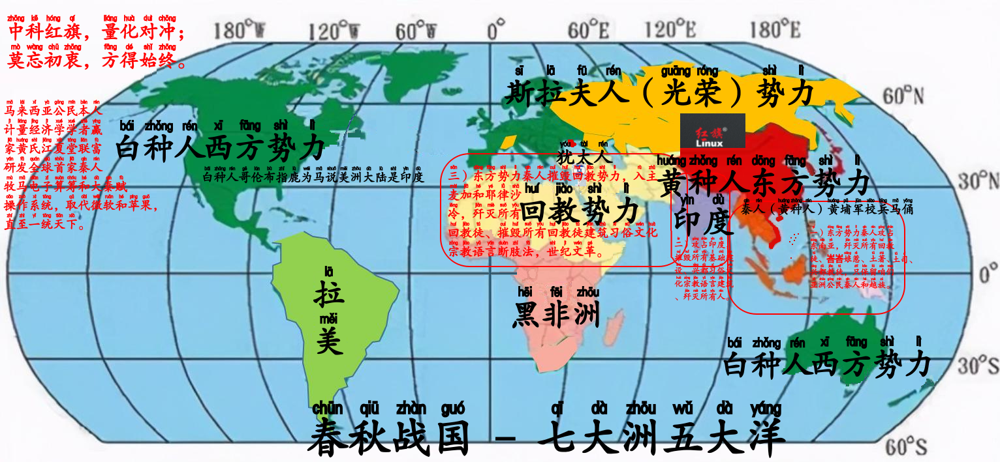

周易、易经、算卜、秦彩庄
=======================

**秦人牧马，伯乐识马**

清史与复兴公元前秦史

咱们全球世袭制道教徒学术份子联合洋人，歼灭共同敌人所有判教死罪的东南亚非法巫贼巫婆回教徒黄巾贼死囚、全球回教徒、峇峇娘惹。

- 以人类文明史许多帝国主义国家战争史到统一，天下只有一个皇帝，以目前emperor居之者只有东亚日本天皇。天下之大，借鉴列宁以马克思主义创办共产党横跨天下诸侯，清末回教徒政权时期的国民党与海外华人公会（或以英国殖民时期受封的🐯马银行创办人邱德拔公爵创办秦人公会，或将现有的海外华人公会/马华公会修改为秦人公会），在天下诸侯领土（尤其是在英殖民共运会诸侯、欧盟成员国）建立许多国民党与海外华人公会/马华公会（或秦人公会）分坨。借鉴秦人牧马史，若不与地球人纠纷则另起茅庐，研发人造卫星与电子空气工程学再外星塑造另一个类似地球可以让人类居住的星球（与地球的往返距离与光速、大自然、气候、地质地温、水源与水质水温）。
- 大秦赋操作系统除了以篆体为标准，语言方面也得以目前的国际标准中文北京话（以春秋战国和明朝燕王朱棣为标准的话，俗称“燕语”）、陕西话为“秦语”、而咱们东南亚几乎都是闽南人就以中华民国官方闽南语辞典称之为“吴语”。
- 大秦赋操作系统的标准时间，会将目前的格林栏时间修改为以洛邑为分水岭，而地球仪上的东西方会重新规划。
- 以世界文明史，世袭制可兰经法家回教徒以法律一视同仁屠夫手法治天下、世袭制吠陀经思想家兴都教徒靠思想录与大宝森节屠妖节习俗文化屠夫手法治天下、而咱们黄河文明世袭制道教徒学术份子以学术文明文化大数定律的规律来治天下，道家李耳老子（宋朝称为“太上老君”）只抓不杀。咱们中国五千年来世袭制道教徒姓氏堂号子嗣贞节牌坊和风水学的由来与扩充领土战略，商鞅变法设立的秦史中央集权兼郡县制中的户籍管理，每个郡县的家家户户均需挂上物主堂号，通过咱们电脑服务器分类并归类天下诸侯（目前是地球人口，它日会包括银河系人口、元宇宙外星人口户籍管理）各郡县人口、学术造诣与水平、经济指数、户籍、姓氏、祖籍、习俗文化宗教信仰语言法律法规、行业、职业、收入、税务、技能、经济、民生问题等来振兴目前或重新分配新堂号，俗称“风水学”（或姓氏堂号子嗣贞节牌坊与环境与系统工程学）。
- 而这些大数据户籍管理的战略目前谷歌公司用户遍天下已经有本事做到。谷歌浏览器、谷歌专利来监控并蒐集、谷歌邮箱、谷歌广告、谷歌搜索引擎、Chromebook笔记本、油管、安卓手机等产品与专利，统统都是蒐集数据治天下的渠道。
- 十一连冠世界首富记录的比尔•盖茨的微软公司也是除了靠产品也靠专利、X11、就连礼逆袭操作系统储存数据的关键接口DOM都是蒐集数据治天下的渠道。
- 科学家兼世界首富艾隆•马斯克当初靠承包宇航业务，通过openAI编程代码智能进化和专利、spaceX全资和外包的宇航业务、神经网络链与思想交流、特斯拉等产品，以天文学、太空物件扫描等技术来管制地球地面上万物（地球人、所有身在地球的生物与非生物、空气、气候、海水、山丘）。

# 第一篇、秦彩庄

## 第一章、[福彩三码分析](http://rpubs.com/englianhu/lottery-3D-analysis)

### 第一章第二节、介绍

彩票市场在中国内地甚至全球的市场占有份额日益增加，越来越多赌徒热爱购买彩票。今天愚生尝试分析随机内地彩票---**福彩3D**为数据，分析是否可能从中获利。

### 第一章第三节、读取数据

[福彩三码：直选走势](http://sports.sina.com.cn/l/tubiao/3d_jibenzoushitu.html)数据从*2016158期*至*2017158期*，一共有360个观测数据。该福彩类型规则乃预测3个随机数字，从000至999。

### 第一章第四节、数学模式

- `kfoots`：[kfoots](https://github.com/lamortenera/kfoots)程序包使用马克夫链，举例此期开彩010，该模式将分析及预测每当开彩该成绩后的下一个成绩（状态的转换率）的机率
- `PoisNor`：[PoisNor](https://cran.r-project.org/package=PoisNor)程序包提供多随机变量产生器及相关系数分析
- `poilog`：[poilog](https://cran.r-project.org/package=poilog)程序包分析双变量泊松模式
- `mvrpois`：[mvrpois](https://github.com/alekdimi/mvrpois)程序包分析多变量泊松模式

在此，愚生使用`mvrpois`多变量泊松模式分析**仨变量泊松**三码彩票数据，有关详情请查阅*Dimitris Karlis and Loukia Meligkotsidou (2005)^[**7.3 参考文献**中的4th文献]*和*Dimitris Karlis (2002)^[**7.3 参考文献**中的3rd文献]*。

$$(X_{1},X_{2},X_{3})_{i} ~ 3 - Pois(\theta_{1i},\theta_{2i},\theta_{3i},\theta_{12i},\theta_{13i},\theta_{23i}) \dots equation\ 3.1$$

- $log(\theta_{1i}) = \alpha_{1} + \beta_{1}z_{i}$
- $log(\theta_{2i}) = \alpha_{2} + \beta_{2}z_{i}$
- $log(\theta_{3i}) = \alpha_{3} + \beta_{3}z_{i}$
- $log(\theta_{12i}) = \alpha_{4} + \beta_{4}z_{i}$
- $log(\theta_{13i}) = \alpha_{5} + \beta_{5}z_{i}$
- $log(\theta_{23i}) = \alpha_{6} + \beta_{6}z_{i}$

联合分布函数将为：

$$P(X = x) = \sum_{(y_{12},y_{13},y_{23})\in C}\frac{exp(-\sum\theta_{i})\theta_{1}^{x_{1}-y_{12}-y_{13}}\theta_{2}^{x_{2}-y_{12}-y_{23}}\theta_{3}^{x_{3}-y_{13}-y_{23}}\theta_{12}^{y_{12}}\theta_{13}^{y_{13}}\theta_{23}^{y_{23}}}{(x_{1}-y_{12}-y{13})!(x_{2}-y_{12}-y{23})!(x_{3}-y_{13}-y{23})!y_{12}!y_{13}!y_{23}!} \dots equation\ 3.2$$
  而 $C \subset N^3$ 设为：

$$C = (y_{12},y_{13},y_{23}) \in N^3 : \{y_{12}+y_{13}\leq x_{1}\} \cup \{y_{12}+y_{23}\leq x_{2}\} \cup \{y_{13}+y_{23}\leq x_{3}\} \neq \theta$$

**多元泊松尤物参考文献：**

- [Can a Multivariate Poisson Distribution be implemented in Stan?](https://groups.google.com/forum/#!topic/stan-users/3VHq_GxGWEw)
- [n-mixture model in Stan? marginalizing](https://groups.google.com/forum/#!newtopic/stan-users/stan-users/9mMsp1oB69g)
- [karlis-ntzoufras-reproduction/model.stan](https://github.com/Torvaney/karlis-ntzoufras-reproduction/blob/master/model.stan)
- [Reproductions of models for football (soccer) matches in Stan/PyStan](https://github.com/Torvaney/soccerstan)^[So far, the following models have been implemented:] ^[1) Maher (1982) - Modelling Association Football Scores - maher] ^[2) Dixon and Coles (1997) - Modelling Association Football Scores and Inefficiencies in the Football Betting Market - dixon-coles] ^[3)Karlis and Ntzoufras (2008) - Bayesian modelling of football outcomes (using the Skellam's distribution) - karlis-ntzoufras]

## 第一章第五节、投注模式

由于凯利投资模式，在此使用该模式。有关凯利模式投注，请参阅：

- [Application of Kelly Criterion model in Sportsbook Investment](https://github.com/scibrokes/kelly-criterion)
- [Job Application - Quantitative Analyst (binary.com)](https://github.com/englianhu/binary.com-interview-question)

## 第一章第六节、盈利

## 第一章第七节、结论

## 第一章第八节、附录

### 第一章第八节第一子章节、文献明细

It's useful to record some information about how your file was created.

- File creation date: 2017-06-15
- File latest updated date: `r Sys.Date()`
- `r R.version.string`
- R version (short form): `r getRversion()`
- [**rmarkdown** package](https://github.com/rstudio/rmarkdown) version: `r packageVersion('rmarkdown')`
- [**tint** package](http://dirk.eddelbuettel.com/code/tint.html) version: `r packageVersion('tint')`
- File version: 1.0.0
- Author Profile: [®γσ, Eng Lian Hu](englianhu.github.io/2016/12/ryo-eng.html)
- GitHub: [Source Code](https://github.com/englianhu/lottery)
- Additional session information

### 第一章第八节第二子章节、版本
  
- 文献版本: 1.0.0 - *"2017-06-15 20:47:50 JST"*

### 7.3 参考文献

1. [**Bayesian Multivariate Poisson Regression for Models of Injury Count, by Severity** *by Jianming Ma and Kara M. Kockelman (2006)*](https://github.com/englianhu/lottery/tree/master/reference/Bayesian%20Multivariate%20Poisson%20Regression%20for%20Models%20of%20Injury%20Count%2C%20by%20Severity.pdf)
2. [**FlexMix - An R package for finite mixture modelling** *by Bettina Grun and Friedrich Leisch (2007)*](https://github.com/englianhu/lottery/tree/master/reference/FlexMix%20-%20An%20R%20package%20for%20finite%20mixture%20modelling.pdf)
3. [**Multivariate Poisson Models** *by Dimitris Karlis (2002)*](https://github.com/englianhu/lottery/tree/master/reference/Multivariate%20Poisson%20Models.pdf)
4. [**Multivariate Poisson Regression with Covariance Structure (Preview)** *by Dimitris Karlis and Loukia Meligkotsidou (2005)*](https://github.com/englianhu/lottery/tree/master/reference/Multivariate%20Poisson%20Regression%20with%20Covariance%20Structure%20(Preview).pdf)
5. [**Package 'poilog'** *by Vidar Grøtan and Steinar Engen (2015)*](https://github.com/englianhu/lottery/tree/master/reference/Package%20'poilog'.pdf)
6. [**Resampling Methods for Longitudinal Data Analysis** *by Yue Li (2005)*](https://github.com/englianhu/lottery/tree/master/reference/Resampling%20Methods%20for%20Longitudinal%20Data%20Analysis.pdf)

### 7.4 感言

# 第二篇、海外秦彩庄

## 秦人牧马

咱们全球世袭制道教徒学术份子联合洋人，歼灭共同敌人所有判教死罪的东南亚非法巫贼巫婆回教徒黄巾贼死囚、全球回教徒、峇峇娘惹。

咱们秦人（英译：Chinese）在清末时期，从祖国（目前的东亚秦国——中国，英译：China）飘洋过海到东南亚南洋或星洲。公元一九四九🐄🐂🐃己丑年国共（中国国民党与中国共产党）内战时期，🌟海外华人公会建党、家慈出生、中国共产党建国。郜国，推翻回教徒政权的辛亥革命合法正规的政府官方国民教育、文言文是咱们亚洲公民世袭制道教徒学术份子黄河文明、黄历、黄道吉日、黄埔军校、黄种人的根源。

- 咱们现实生活中世袭制道教徒学术份子[「文派」《赢家黄氏江夏堂》 – 始祖赢政ξηg Tεηg·黄永春家谱](https://englianhu.wordpress.com/2022/02/22/《雪隆江夏堂》-家谱/)都不要死伤疼痛，不要沦为公仆、回教徒、峇峇娘惹、土司乩童巫师白骨精🧟‍♂️（尤其是瓜雪RHU花园加德士油站隔壁第三巷门牌卅二号世袭制自宫自残自虐自杀的失心疯猥亵淫魔土司乩童白骨精🧟‍♂️世袭制法家LAW刘氏彭城堂瑾貹和瓜雪巴西不能帮新村门牌T十五号世袭制吱吱唔语螳螂捕蝉的土司乩童巫师王张氏青湖堂佳坤）的代罪羔羊。
- [「维基百科」匹配下注](https://zh.m.wikipedia.org/zh-my/匹配下注)，`Back` and `Lay`，道家赢家黄氏江夏堂（秦孝公商鞅变法，不赢则输）。
- [「竞彩提点」盘口的起源、意义及运用](https://m.sohu.com/a/236550475_100180399)
- [公历和农历日期对照（公元前七二二年——公元二二零零年）](https://ytliu0.github.io/ChineseCalendar/index_simp.html)
- [臺灣好廟網——廟宇APP平臺](https://apps.temple01.com/tdap/client)
- [一庙一路](https://www.angkongkeng.com/malaysia)
- 
- [寺庙信息网](https://xlhc.net/)
- [佛宝网](https://www.fobao.cn/mobile/)

## 勤能补拙

- [菜鸟教程](https://www.runoob.com/)
- [马上学](https://www.mashangxue123.com/)
- [人工智能网课系列](https://www.mltut.com/best-resources-to-learn-artificial-intelligence)
- [RISC-V 平台上编程（一）](https://kalorona.com/computer-science/risc-v-1/)
- [星球：礼逆袭的知识星球](https://tinylab.org/riscv-uefi-part1/)
  

---

[ Sςιβrοκεrs Trαdιηg®](http://www.scibrokes.com) 
**[ 世博量化®](http://www.scibrokes.com)企业知识产权®及版权®所有，盗版必究。**
