# 主题

## 大秦赋

### 岂曰无衣，与子同袍

**拯救亚洲人**

那些敌人宗教司LAW法家刘氏彭城堂写字佬白骨精刘瑾貹、土司乩童讲话佬张佳坤俩、那些世袭制可兰经法家回教徒（Muslims bin/binti Hereditary Al-Quran Islamic LAW 尤其是回教徒公仆）、铲单卡款的东南亚（新加坡和印尼的金宝博）执法单位的贡献。

{width=400}

🚩🏳️‍🌈🇹🇼🇻🇳🇨🇳🇲🇾🇬🇧 The Raise of Chinese Taoist Winner ξng Ancestral Hall 

🚩🏳️‍🌈🇹🇼🇻🇳🇨🇳🇲🇾🇬🇧 大秦赋世袭制道教徒十二生肖赢家ξng黄氏江夏堂

Under the wide heaven, All belong to ξngland.

普天之下，莫非黄土。

愚生世袭制道教徒十二生肖秦人学术份子赢家黄氏江夏堂联富（雷欧）个人自小独来独往无需利用任何情色、任何姻缘、任何肌肤之亲、只参与东亚欧美大洋洲同胞以学术为主和家眷亲属全是世袭制道教徒的百姓，都只求阖家安康、出入平安、安居乐业、学业学术、士农工商、守住家业、振兴家业，不要沦为任何马来回教徒政府公仆与政客、世袭制可兰经法家回教徒、世袭制吠陀经大宝森节与屠妖节兴都教徒、土司乩童张佳坤和刘瑾貹、博彩行业尤其是新加坡博彩庄金宝博、新加坡公民的代罪羔羊。有关个人《家谱》详情请查阅[《赢家黄氏江夏堂》 – 始祖赢政ξηg Tεηg∙黄永春家谱](https://englianhu.wordpress.com/2022/02/22/《雪隆江夏堂》-家谱/)，自从二零零七年来平时都会到「众仙洞」和「天皇宫」祈福保佑身体健康、出入平安、安居乐业，可查阅[採撷数据](#採撷数据)。

- **世袭制张氏清湖堂/世袭制张氏清河堂/土司乩童巫师王青巾贼螳螂张佳坤。**
- **世袭制可兰经法家刘氏彭城堂土司乩童巫师王白骨精刘瑾貹/世袭制可兰经法家巫贼巫婆回教徒/世袭制吠陀经阿拉丁神灯屠妖节兴都教徒与世袭制可兰经法家回教徒印度裔/世袭制巫术份子屠夫赤印度人/世袭制可兰经法家女回教徒泰姬。**
- **科研高频量化对冲、科学科技产品、计数编程、易经算卜、愚生世袭制道教徒十二生肖学术份子赢家黄氏江夏堂联富和家眷亲属（包括全球所有英系洋人和咱们所有世袭制道教徒黄种人）、黄河文明、黄历、黄道吉日、黄埔军校、黄种人。**
- **螳螂捕蝉，黄雀在后。**


咱们世袭制道教徒十二生肖秦人百姓🐯：[《赢家黄氏江夏堂》 – 始祖赢政ξηg Tεηg∙黄永春家谱](https://englianhu.wordpress.com/2022/02/22/《雪隆江夏堂》-家谱/)顾好现实生活中世袭制道教徒百姓家眷亲属就好，可查阅[採撷数据](#採撷数据)。

*出处：[「#古装电视剧」战秦歌一 Qin Dynasty War丨华夏大地纷乱五百余年！秦王赢政平定嫪毐之乱，亲政，罢相，收复王权，平灭六国、一统天下！](https://youtu.be/eysTSHoK3Hc)*

- [蕲年宫之变是怎么回事？赢政从此开启统一六国的传奇](https://m.qulishi.com/article/202209/656130.html)

### 孺子可教也

子曰：“吾十有五而志于学，三十而立，四十而不惑，五十而知天命，六十而耳顺，七十而从心所欲，不逾矩。”——《为政》…

<br>
<span style='color:#9B111E'>**🚩🦔主题曲🦔🚩**</span>
<br>
<audio controls loop autoplay src="诸子百家诗经与古诗源/卜学亮 - 子曰.mp3" controls></audio>
<br>

> 赢家黄氏江夏堂、赢家黄氏巴东堂、儒家孔氏东鲁堂、道家卜氏西河堂、杏林林氏西河堂、道家与法家李氏陇西堂、商家苏氏阜阳堂

*引用：[牢记祖先，彰显祖宗功德，四百卅三个姓氏堂号大全](https://zhuanlan.zhihu.com/p/82039189)*

> **发问：**
> 
> 二十弱冠、三十而立、四十不惑、五十知天命、六十花甲子、七十古来稀、八十为<ruby>耄<rp>(</rp><rt>mào</rt><rp>)</rp>耋<rp>(</rp><rt>dié</rt><rp>)</rp></ruby>^[**<ruby>耄<rp>(</rp><rt>mào</rt><rp>)</rp>耋<rp>(</rp><rt>dié</rt><rp>)</rp></ruby>**两字连用代称八、九十岁<br>**<ruby>期<rp>(</rp><rt>qī</rt><rp>)</rp>颐<rp>(</rp><rt>yí</rt><rp>)</rp></ruby>**：百岁之人]、九十是什么？
> 
> **解答：**
> 
> 人初生叫婴儿，不满周岁称<ruby>襁<rp>(</rp><rt>qiǎng</rt><rp>)</rp>褓<rp>(</rp><rt>bǎo</rt><rp>)</rp></ruby>。
> 两至三岁称孩提。
> 女孩七岁称<ruby>髫<rp>(</rp><rt>tiáo</rt><rp>)</rp></ruby>年。男孩七岁称<ruby>韶<rp>(</rp><rt>sháo</rt><rp>)</rp></ruby>年。
> 十岁以下称黄口。
> 十三岁至十五岁称舞<ruby>勺<rp>(</rp><rt>sháo</rt><rp>)</rp></ruby>之年。
> 十五岁至廿岁称舞象之年。
> 女孩十二岁称金<ruby>钗<rp>(</rp><rt>chāi</rt><rp>)</rp></ruby>之年。
> 女孩十三岁称豆<ruby>蔻<rp>(</rp><rt>kòu</rt><rp>)</rp></ruby>年华。
> 女孩十五岁称及<ruby>笄<rp>(</rp><rt>jī</rt><rp>)</rp></ruby>之年。
> 十六岁称碧玉年华；
> 廿岁称桃李年华。
> 廿四岁称花信年华；女子出嫁称票？梅之年。
> 男子廿岁称弱冠。
> 卅岁称而立之年。
> 卌岁称不惑之年。
> 圩岁称知命之年。
> 园岁称花甲或耳顺之年。
> 进岁称古稀之年。
> 枯岁称杖朝之年。
> 枯至<ruby>枠<rp>(</rp><rt>huà</rt><rp>)</rp></ruby>岁称合？之年，<ruby>耄<rp>(</rp><rt>mào</rt><rp>)</rp>耋<rp>(</rp><rt>dié</rt><rp>)</rp></ruby>之年。
> 一百岁乐<ruby>期<rp>(</rp><rt>qī</rt><rp>)</rp>颐<rp>(</rp><rt>yí</rt><rp>)</rp></ruby>。

*出处：[二十弱冠、三十而立、四十不惑、五十知天命、六十花甲子、七十古来稀、八十为耄耋、九十是什么？](https://m.ximalaya.com/ask/q6728110)*

> **发问：**
> 
> 七十古稀、八十<ruby>耄<rp>(</rp><rt>mào</rt><rp>)</rp>耋<rp>(</rp><rt>dié</rt><rp>)</rp></ruby>、九十是什么？
> 
> **解答：**
> 
> 七十古稀，八十耄耋，九十也是耋耄。耄耋是指年纪很大的老人。出自《论语•为政》：“十有五，而志于学，三十而立，四十而不惑，五十而知天命，六十而耳顺，七十而从心所欲，不逾矩。”然而曾仕强教授在百家讲坛，易经的奥秘中曾讲说，这几句的话的另一种意思：“在人的十五岁时候决定学习的方向，三十岁的时候确定一生的原则，四十岁的时候对人生的目标不再动摇，五十岁的时候明白命运是自己造就的，六十岁的时候广泛听取多种意见，这样到七十岁的时候可以按照自己的心意去做就绝对不会做出逾矩的事情。”
> 
> 一般九十岁也与八十岁一样称为耄耋之年，可称九十耄耋。耄耋的汉字意思是指老年或年纪很大的人，根据典籍《礼记•曲礼》的相关记载“八十九十耄耋“，人们依照这个说明，将耄耋二字连用代称八十与九十。
> 
> 耄耋之前的代称出自《论语》，其中比较广为人知的年龄代称是三十而立，四十不惑，五十而知天命，六十而耳顺，七十而从心所欲。
> 
> 老人家一般到百岁可称之为期颐之年，典籍《礼记•曲礼》中提到“百年曰期颐“。成语“颐养天年“指的就是百岁老人家。
> 
> - 耄耋之年其实就是指的这个人已经八九十岁了，如今的中国耄耋之年的老人还是非常多的。
> - 除了耄耋之外还有弱冠、而立、不惑、知天命、花甲、古稀这些对年龄的称呼，这些都是祖辈用来称呼一个人的年纪。
> - 花甲，是指人到六十岁。这与我国古代干支纪年有关。十天干与十二地支按顺序错综搭配成六十袜斗个单位，每一干启好陆支代表一年，六十年周而复始形成一循环，故称为“六十花甲子”。《西游记》第悄顷二十回：“（老者）道： 痴长六十一岁。行者道： 好！好！好！花甲重逢矣。 ”
> - 古稀之年是指人到七十岁。语出自杜甫《曲江》诗：“酒债寻常行处有，人生七十古来稀。”
> - 所谓“期颐之年”则是指人一百岁。《礼记•曲礼上》曰：“百岁曰期颐。”朱<ruby>熹<rp>(</rp><rt>xī</rt><rp>)</rp></ruby>解释说：“周匝之义（即转过一圈的意思），谓百年已周。”所以，期颐即人活得圆满，寿高百岁之意。
> 
> 形容耋耄的成语：老态龙钟、<ruby>鹤<rp>(</rp><rt>hè</rt><rp>)</rp>发<rp>(</rp><rt>fà</rt><rp>)</rp>童<rp>(</rp><rt>tóng</rt><rp>)</rp>颜<rp>(</rp><rt>yán</rt><rp>)</rp></ruby>、老当益壮、七老八十、白首之心、<ruby>老<rp>(</rp><rt>lǎo</rt><rp>)</rp>骥<rp>(</rp><rt>jì</rt><rp>)</rp>伏<rp>(</rp><rt>fú</rt><rp>)</rp>枥<rp>(</rp><rt>lì</rt><rp>)</rp></ruby>、返老还童、宝刀未老、<ruby>雪<rp>(</rp><rt>xuě</rt><rp>)</rp>鬓<rp>(</rp><rt>bìn</rt><rp>)</rp>霜<rp>(</rp><rt>shuāng</rt><rp>)</rp>鬟<rp>(</rp><rt>huán</rt><rp>)</rp></ruby>。

*出处：[七十古稀、八十耄耋、九十是什么？](https://m.ximalaya.com/ask/q6379714)*

### 祖宗十八代

> 赢家黄氏江夏堂、赢家黄氏巴东堂、儒家孔氏东鲁堂、道家卜氏西河堂、杏林林氏西河堂、道家与法家李氏陇西堂、商家苏氏阜阳堂

*引用：[牢记祖先，彰显祖宗功德，四百卅三个姓氏堂号大全](https://zhuanlan.zhihu.com/p/82039189)*

> **释义**
> 
> 祖宗十八代一语用来形容事或人的源远流长。比如叙事的有"这不知是祖宗十八代哪一代发生的事"，说人的有"他家的祖宗十八代里一定是哪一代积了德,所以才有了好报"
> 
> **《尔雅•释亲》**
> 
> {width=400}
> 
> {width=400}
> 
> - 一、父为考，母为妣。
> - 二、父之考为王父，父之妣为王母。
> - 三、王父之考为曾祖王父，王父之妣为曾祖王母。
> - 四、曾祖王父之考为高祖王父，曾祖王父之妣为高祖王母。
> - 五、父之世父、叔父为从祖祖父，父之世母、叔母为从祖祖母。
> - 六、父之<ruby>晜<rp>(</rp><rt>kūn</rt><rp>)</rp></ruby>弟，先生为世父，后生为叔父。
> - 七、男子先生为兄，后生为弟。
> - 八、谓女子，先生为姊，后生为妹。
> - 九、父之姊妹为姑。
> - 十、父之从父晜弟为从祖父，父之从祖晜弟为族父。
> - 十一、族父之子相谓为族晜弟。
> - 十二、族晜弟之子相谓为亲同姓。
> - 十三、兄之子、弟之子，相谓为从父晜弟。
> - 十四、子之子为孙，孙之子为曾孙，曾孙之子为玄孙，玄孙之子为来孙，来孙之子为晜孙，晜孙之子为仍孙，仍孙之子为云孙 [1]。
> - 十五、王父之姊妹为王姑。
> - 十六、曾祖王父之姊妹为曾祖王姑。
> - 十七、高祖王父之姊妹为高祖王姑。
> - 十八、父之从父姊妹为从祖姑。
> - 十九、父之从祖姊妹为族祖姑。
> - 廿、父之从父晜弟之母为从祖王母。
> - 廿一、父之从祖晜弟之母为族祖王母。
> - 廿二、父之兄妻为世母，父之弟妻为叔母。
> - 廿三、父之从父晜弟之妻为从祖母，父之从祖晜弟之妻为族祖母。
> - 廿四、父之从祖祖父为族曾王父，父之从祖祖母为族曾王母。
> - 廿五、父之妾为庶母。
> - 廿六、祖，王父也。
> - 廿七、<ruby>晜<rp>(</rp><rt>kūn</rt><rp>)</rp></ruby>，兄也。──宗族
> - 廿八、母之考为外王父，母之妣为外王母。
> - 廿九、母之王考为外曾王父，母之王妣为外曾王母。
> - 卅、母之晜弟为舅，母之从父晜弟为从舅。
> - 卅一、母之姊妹为从母。
> - 卅二、从母之男子为从母晜弟，其女子子为从母姊妹。──母党
> - 卅三、妻之父为外舅，妻之母为外姑。
> - 卅四、姑之子为甥，舅之子为甥，妻之晜弟为甥，姊妹之夫为甥。
> - 卅五、妻之姊妹同出为姨。
> - 卅六、女子谓姊妹之夫为私。
> - 卅七、男子谓姊妹之子为出。
> - 卅八、女子谓晜弟之子为侄，谓出之子为离孙，谓侄之子为归孙。
> - 卅九、女子子之子为外孙。
> - 卌、女子同出，谓先生为姒，后生为娣。
> - 卌一、女子谓兄之妻为嫂，弟之妻为妇。
> - 卌二、长妇谓稚妇为娣妇，娣妇谓长妇为姒妇。──妻党
> - 卌三、妇称夫之父曰舅，称夫之母曰姑。
> - 卌四、姑舅在则曰君舅、君姑；没则曰先舅、先姑。
> - 卌五、谓夫之庶母为少姑，夫之兄为兄公，夫之弟为叔，夫之姊为女公，夫之妹为女妹。
> - 卌六、子之妻为妇，长妇为嫡妇，众妇为庶妇。
> - 卌七、女子子之夫为壻，壻之父为姻，妇之父为婚。
> - 卌八、父之党为宗族，母与妻之党为兄弟。
> - 卌九、妇之父母、壻之父母，相谓为婚姻。
> - 圩、两壻相谓为亚。
> - 圩一、妇之党为婚兄弟，壻之党为姻兄弟。
> - 圩二、嫔，妇也。
> - 圩三、谓我舅者，吾谓之甥也。──婚姻

*出处：[「问百度」祖宗十八代](https://baike.baidu.com/item/祖宗十八代/8539817)*

> 所谓祖宗十八代是指自己上下九代的宗族成员。
> 
> - 上九代为：父、祖、曾祖、高祖、天祖、列祖、太祖、远祖、鼻祖。
> - 下九代为：子、孙子、曾孙、玄孙、来孙、晜孙、仍孙、云孙、耳孙。
> 
> 从小到大为：耳、云、仍、晜、来、玄、曾、孙、子、父、祖、曾、高、天、烈、太、远、鼻。你以上的九代和你以后的九代称为祖宗十八代。
> 
> {width=400}
> 
> **扩展资料：**
> 
> 祖宗十八代——祖宗十八代，顾名思义，上九代，下九代，这其中的所有人都是在这十八代当中。这里要注意的一点就是自己，简称“己”，“自己”是上九代与下九代的分水岭，不包含在“祖宗十八代”之内。
> 
> - 上序称谓：生己者为父母，父之父为祖，祖父之父为曾祖，曾祖之父为高祖，高祖之父为天祖，天祖之父为烈祖，烈祖之父为太祖，太祖之父为远祖，远祖之父为鼻祖。即：父、祖、曾、高、天、烈、太、远、鼻。书中说：因人怀胎，鼻先受形，故鼻祖为始祖。
> - 下序称谓：父之子为子，子之子为孙，孙之子为曾孙，曾孙之子为玄孙，玄孙之子为来孙，来孙之子为<ruby>晜<rp>(</rp><rt>kūn</rt><rp>)</rp></ruby>孙，晜孙之子为仍孙，仍孙之子为云孙，云孙之子为耳孙。即：子、孙、曾、玄、来、<ruby>晜<rp>(</rp><rt>kūn</rt><rp>)</rp></ruby>、仍、云、耳。书中说：耳孙者，谓祖甚远，仅耳目闻之也。“远祖者，几世乎，九世矣。”为证也！
> 
> - 远祖：远祖、太高、太尊、先、祖先、先君、先人、祖考等，皆可称远祖。
> - 始祖：始祖、鼻祖，皆可称始祖。
> - 高祖：曾祖的父亲。高祖、高祖王父、显考、长祖、高门等，皆可称高祖。
> - 高祖母：曾祖之母，亦可称高祖王母。
> - 曾祖：祖父的父亲。曾祖、曾祖王父、曾祖父、皇考、府君、太翁、次长祖、曾翁、曾门、曾大父、曾父、曾太公、大王父、王大父等，皆可称曾祖。
> - 曾祖母：祖父之母，亦可称曾祖王母。
> - (曾祖的兄弟及兄弟之妻，称“族曾王父”、“族曾祖父”，“族曾王母”、“族曾祖母”)
> - 祖父：父亲的父亲。祖父、王父、大王父、祖王父、大父、祖君、祖翁、公、太公等，皆可称祖父。对人称其祖父曰“家公”。称人之祖曰“尊祖父”。称已故祖父曰“亡祖”、“亡考”、“皇祖考”、“府君”、“先祖”、“先子”、“先亡丈人”等。称人之已故祖父曰“大门中”。
> - (祖父的兄弟称“从祖祖父”、“从祖世父”、“从祖叔父”、“从祖王父”、“伯翁”、“叔翁”)
> - 祖母：父亲的母亲。祖母、王母、大母、太母、祖婆等，皆可称祖母。称人祖母曰“尊祖母”。称已故祖母曰“皇祖妣”。祖父之妾称“季祖母”“妾祖姑”。从祖祖父之妻称“从祖祖母”“从祖世母”“从祖叔母”“从祖王母”“从祖母”“季祖母”“伯祖妣”等。
> 
> 中国人“三姑六舅”，对本祖一脉上下或亲戚关系称谓有严格的规定，在现实中曾经出现过这样一个难题，一个上下差7代的晚辈不知道如何称呼比自己大8辈的长辈，出现令人难堪的场面。现在依据中国《汉语大辞典》、东汉的《尔雅•释亲》和《春秋公羊传•庄公四年》等史书考证，才确定了中国人本族内“上下九辈”的称呼。
> 
> 为什么上九代叫做鼻呢？这里面有个比较有意思的古人常识。在古人的观念中，人在肚子里的时候，最先长出的就是鼻子，所以，就把最久远的祖宗叫做鼻祖。同样比较有意思的是，古人把下九代中最末一代的子孙叫做耳孙。那么，为什么这样叫呢？
> 
> 因为耳孙距离自己的祖宗太遥远了，从来没有见过，也只是听说过而已，所以，有了这样的称呼。从耳到鼻，在脸上不到一扎长，没想到在辈分中，竟然隔了十八辈。
> 
> **参考链接：**
> 
> [「问百度」百度百科——祖宗十八代](https://baike.baidu.com/item/祖宗十八代/8539817)

*出处：[「问百度」请问关于这上九代和下九代都是怎么称呼的？ 之前查的往上是曾祖、高祖、天祖、列祖、太祖、远祖、鼻祖](https://jingyan.baidu.com/article/a681b0de7316337a184346ed.html)*

- [「吴氏在线」“世界最长家谱”《 孔子世家谱》被湖北省档案馆收藏](http://www.cnwu.net/baijiaxingshi/2458.html)
- [「知乎」中国古代亲属称谓家谱总览](https://zhuanlan.zhihu.com/p/458028908)
- [「问百度」请问关于这上九代和下九代都是怎么称呼的？ 之前查的往上是曾祖、高祖、天祖、列祖、太祖、远祖、鼻祖](https://jingyan.baidu.com/article/a681b0de7316337a184346ed.html)
- [「元宇宙」春节拜年，亲戚怎么叫？](https://www.facebook.com/englianhu/posts/pfbid0cqugyMqSdk1DBwzB8XiawCCz8bRXf5mZktm1Wr2WKs1ozj1D84FpB9RYXuCrmzDTl)
- [「问百度」我怎么称呼我堂叔的儿子啊？ 他比我小 应该怎么称呼？ 叫堂弟吗？ 可是堂叔的儿子已经不是堂了啊？](https://zhidao.baidu.com/question/291505101/answer/3012972358.html)
- [「范本模板」古代称谓大全](https://wenku.baidu.com/view/8a3d6c3ca3c7aa00b52acfc789eb172dec639967.html?_wkts_=1709365939475&bdQuery=%E6%A8%A1%E6%9D%BF%E5%8F%A4%E7%A7%B0)
- [古代尊称荟萃](https://wenku.baidu.com/view/2324997758fafab069dc0256.html?_wkts_=1709527487300&bdQuery=春秋战国论文称呼大全)
- [传统文化丨“八拜之交”是指哪八拜？](https://www.facebook.com/xyzhiju/posts/pfbid02hRxd7rzkyVFGWAUdhJGHjtwTqgiyQaD4aQpSmUBdAqRG3VfUE87JyjkN2yyL4YWTl)
- [外曾祖父是什么？](https://jingyan.baidu.com/article/fd8044fa377fec1131137ab6.html)
- [字典「胤」](https://zidian.bmcx.com/e883a4__zidianchaxun)
- [“公子”是姓氏吗？](https://m.ximalaya.com/ask/q7250124)

### 桃李满天下

> 赢家黄氏江夏堂、赢家黄氏巴东堂、儒家孔氏东鲁堂、道家卜氏西河堂、杏林林氏西河堂、道家与法家李氏陇西堂、商家苏氏阜阳堂

*引用：[牢记祖先，彰显祖宗功德，四百卅三个姓氏堂号大全](https://zhuanlan.zhihu.com/p/82039189)*

- [「吴氏在线」“世界最长家谱”《 孔子世家谱》被湖北省档案馆收藏](http://www.cnwu.net/baijiaxingshi/2458.html)
- [中国古代亲属称谓家谱总览](https://zhuanlan.zhihu.com/p/458028908)
- [「元宇宙」春节拜年，亲戚怎么叫？](https://www.facebook.com/englianhu/posts/pfbid0cqugyMqSdk1DBwzB8XiawCCz8bRXf5mZktm1Wr2WKs1ozj1D84FpB9RYXuCrmzDTl)
- [「百度」我怎么称呼我堂叔的儿子啊？ 他比我小 应该怎么称呼？ 叫堂弟吗？ 可是堂叔的儿子已经不是堂了啊？](https://zhidao.baidu.com/question/291505101/answer/3012972358.html)
- [「范本模板」古代称谓大全](https://wenku.baidu.com/view/8a3d6c3ca3c7aa00b52acfc789eb172dec639967.html?_wkts_=1709365939475&bdQuery=%E6%A8%A1%E6%9D%BF%E5%8F%A4%E7%A7%B0)
- [古代尊称荟萃](https://wenku.baidu.com/view/2324997758fafab069dc0256.html?_wkts_=1709527487300&bdQuery=春秋战国论文称呼大全)
- [传统文化丨“八拜之交”是指哪八拜？](https://www.facebook.com/xyzhiju/posts/pfbid02hRxd7rzkyVFGWAUdhJGHjtwTqgiyQaD4aQpSmUBdAqRG3VfUE87JyjkN2yyL4YWTl)

> 阳历二零四年十一月廿一日，全球第一所孔子学院正式在韩国首都首尔挂牌成立。截至阳历二零二零年七月卅一日，全球已有百圆二国家（地区）设立了五百卌三所孔子学院和千百进个孔子课堂：
> 
- 亚洲卅九国（地区），孔子学院百卅五所、孔子课堂百十五个
- 非洲卌六国，孔子学院圆一所、孔子课堂卌八个
- 欧洲卌三国（地区），孔子学院百枯九所、孔子课堂三百卌六个
- 美洲廿七国，孔子学院百卅八所、孔子课堂五百圆个
- 大洋洲七国，孔子学院廿所、孔子课百零一个
>
阳历二零一八年开始，美国有几家大专院校相继关闭中国政府资助的孔子学院，最新一间是美国北佛罗里达大学，校方认为孔子学院的教学与大学理念不相符，决定终止合作…

*引用：[「维基百科」孔子学院列表](https://zh.wikipedia.org/wiki/孔子学院列表)*

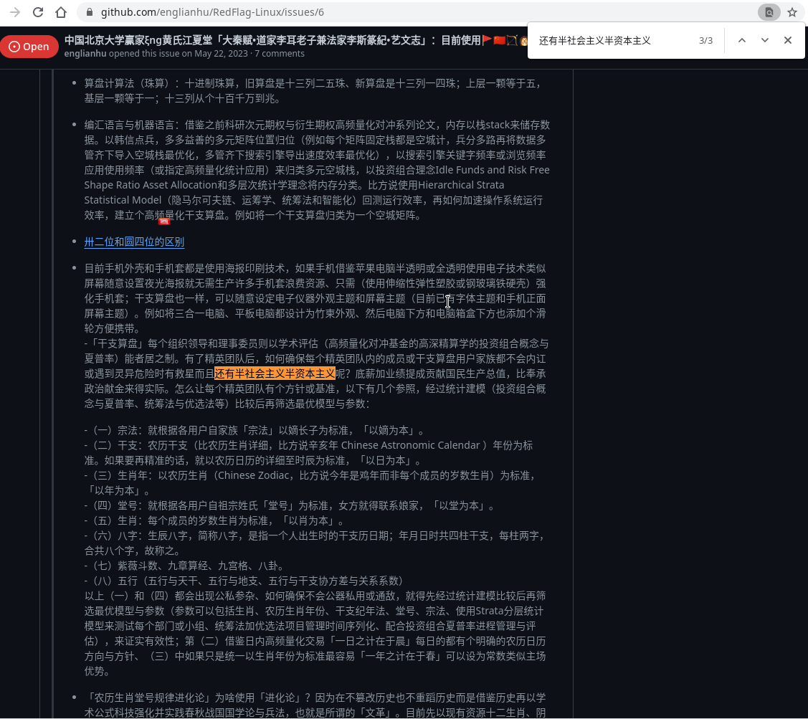{width=400}

*引用：[「猫城」黄联富（®γσ ξηg 雷欧）/中国北京大学赢家ξng黄氏江夏堂「大秦赋•道家李耳老子兼法家李斯篆紀•艺文志」：目前使用🚩🇨🇳🏹🦔中国国产红旗礼逆袭，编程都会使用咱们母语华语、字体、字幕加汉语拼音。](https://github.com/englianhu/RedFlag-Linux/issues/6#issuecomment-1722247674)*

### 大秦四部曲

<iframe width="400" height="225" src="//player.bilibili.com/player.html?bvid=BV15r4y1c7Kv" title="九分钟速看《大秦帝国》系列四部剧情" frameborder="0" allow="accelerometer; autoplay; clipboard-write; encrypted-media; gyroscope; picture-in-picture; web-share" referrerpolicy="strict-origin-when-cross-origin" allowfullscreen></iframe>

*出处：[九分钟速看《大秦帝国》系列四部剧情](https://www.bilibili.com/video/BV15r4y1c7Kv)*

{width=400 height=225}

「世袭制道家黄河文明、黄埔军校、黄种人，拯救亚洲人」🌟儒家秦孝公清君侧，延续🇬🇧英属留下的世俗国治国之道，各种族训要遵守回各自祖籍的习俗文化宗教语言法律，多元习俗文化宗教语言，才不会种族互相厮杀而只是《可兰经》歼灭所有回教徒和《吠陀经》歼灭所有兴都教徒和《圣经》歼灭所有洋蕃男女，禁止🇬🇧英属共运会所有殖民诸藩渔翁得利，重返亚洲。借鉴[文明史](#文明史)，何谓多元种族世俗国家？各种族在向英国政府争取独立时签署条约，各种族不许越权去插手别种族的事情。

- 巫统是世袭制法家《可兰经》回教刑事法典断肢法的巫贼巫婆非法回教徒民族政党。
- 咱们祖籍东亚的秦人英译为Chinese，而天下所有回教徒和洋番的祖籍西亚朗诵可兰经楚歌、基督洋番、世袭制可兰经法家回教徒、划龙舟（诺亚方舟）为楚人，**🌟海外华人公会（世袭制道教徒以孔子为首的儒学理念创党）**是只有世袭制道教徒和（孔子在公元前创办的儒学，公元前并没有基督耶稣和洋蕃，犹太人只有被回教徒屠杀和集体逃亡）创办人学术份子陈祯禄公爵，而非**海外洋人公会（传教土基督教徒，与咱们祖籍东亚的世袭制道教徒烧香祭祖拜神有习俗文化宗教语言法律上的冲突）**，所以禁止任何收录外来的任何回教徒、峇峇娘惹、兴都教徒、任何基督耶稣、洋蕃。因为在英国殖民时期，咱们许多祖先是在清末光绪年间、鸦片战争、八国联军、甲午战争时期，因为战火和回教徒腐败政权导致民不聊生，才会飘洋过海到南洋|星洲，咱们许多南方（福建省、广东省、广西省、台湾省）同胞学术造诣不高，多数都是迷信和虔诚的世袭制道教徒民俗，到了南洋|星洲后几乎都是语言不通（愚生的长辈几乎都没有高学术背景，在民不聊生和英殖民和日治年代也只上过两三年学堂而已）、都努力靠士农工商来占有一席之地。故此称之为“秦人牧马”。以咱们秦人祖国五千多年历史为鉴，秦灭六国、楚虽三户、楚汉相争、明王朱元璋与汉王陈友谅之战。英系儒家陈祯禄公爵虽为楚人所授封，基于目前天下大势英系占有北美洲和大洋洲两洲之地（而美洲也占有两洲之地，分别为北美洲与南美洲），秦孝公之商鞅变法可以打击天下共运会诸藩，现有资源还有MY大汉山、故此需要先转型以咱们中系为主或者汉王率先上位；咱们东南亚马来亚英国殖民时期的正规合法的国民教育是以东亚辛亥革命的国民党为标准。
- 国大党是世袭制《吠陀经》大宝森节和屠妖节习俗文化宗教语言的兴都教徒政党。
- 其它少数民族。

{width=400}

**咱们东南亚🌟海外华人公会（🌟马华公会）从是咱们全球华人至今第一个海外华人政党，至今都是唯一一个不曾被其它种族和宗教玷污的世袭制道教徒（创办人儒学）华人政党，只有收录咱们世袭制道教徒华人的华人政党（东亚华人政党国民党收录世袭制法家回教徒白崇禧、中共还有收录满洲转投国民党再投本中共的满族世袭制法家回教徒席龙飞、东南亚其他华人政党有收录兴都教徒和巫贼巫婆非法回教徒）。在中亚、西亚、南亚、欧洲、美洲（美国二零二二或二零二三年创办的前进党，也只是个不会中文只会美国洋文和美国洋人习俗文化宗教语言、而且党员几乎都是洋人、昙花一现的傀儡领导杨安泽Andrew Yang，岂能与咱们东南亚只有世袭制道教徒华人而且全是保留咱们所有中华五千多年习俗文化宗教语言党员的海外华人公会相提并论？）、大洋洲、非洲、南极洲目前都没有一个保留并且壮大咱们世袭制道教徒和咱们中华五千多年习俗文化的华人政党。**

借鉴[大秦赋：秦国官员制度之三公九卿](https://baijiahao.baidu.com/s?id=1685404909849357185)和[文明史](#文明史)来分析目前地球上七大洲五大洋的天下局势：

- 日本明治天皇的大东亚共荣圈以统一亚洲为口号和目标，“拯救亚洲人”的黄河文明史。
- 英国最高领导是王储（借鉴春秋战国到秦统天下史，万物皆有灵和天下只有一个皇帝，国王或王储的英文为King，而皇帝和日本天皇叫Emperor）。
- 国民党和中华民国国父[「问百度」孙中山（孙逸仙）](https://baike.baidu.com/item/孙中山/128084)的西方医生背景，御史大夫（英文将“举人”phD毕业后称之为“Doctor”）。建立中国（秦国China）；不过咱们杏林林氏西河堂御史大夫会比较正统，古代秦国御史大夫叫“冯劫”，详情可查阅[秦朝御史大夫制度之历史得失](http://www.jsycjw.gov.cn/a/fTVCXnNzRH)。
- 🇨🇳🏹中国共产党以🇨🇳中华人民共和国国父[「问百度」毛泽东](https://baike.baidu.com/item/毛泽东/113835)身为荆州人和建立中国（秦国China）并且身职掌柜，类似长史李斯一人一下万人之上。
- 🌟海外华人公会（🌟马华公会）的创办人儒学学术份子陈祯禄公爵，来自于马六甲州（一个被葡萄牙和荷兰郁金香热潮后殖民过的州属），在世界二战中英德大战元气大损就纷纷从海外殖民领土撤回英国，而马来亚被英国政府受封公爵的海外华人政党领袖和回教徒与兴都教徒领导也是因此而从英国政府（英国旗下拥有英格兰、爱尔兰、🏴󠁧󠁢󠁷󠁬󠁳󠁿威尔斯、苏格兰四国主成的联盟国，倘若以洋人为标准的秦人，英格兰的国语也是英国的国语）谈判而独立成为马来西亚。以世界文明史的三个种族宗教为主，为它日西征西亚而埋下伏笔；而之后香港回归中国和欧盟建立，更提高咱们海外华人公会的革命或推翻回教政权和西征（除了在南亚和西亚和非洲，甚至可以在欧盟诸侯立足）的地位和战略路线。引用[「奔流文化∙闲谭」牧马西垂](https://news.qq.com/rain/a/20230911A0AVM600)，由于马六甲、马来亚、马来西亚均以“马”为先，而古人以“马”为主要交通代步工具，故此称咱们从中国而来的世袭制道教徒十二生肖为“秦人牧马”。查询秦国崛起史，公爵从秦献公、秦穆公到秦孝公，之后就是秦惠文王建立的王储的王国。
- 以“三公九卿”来分析，洋人司法界都是佯装老嬷嬷头戴白色女假头发，而可兰经回教刑事法典断肢法禁止任何回教徒色情，美国总统世袭制法家法官佐治瓦貹顿以大葱回教堂来立国的职位如同奉常或中郎将（美国政府规定，美国总统必须当过军人）而美国国务卿的职位在三公之下。欲知更多详情，可查阅[「问百度」历史｜秦代官职表](https://mbd.baidu.com/newspage/data/dtlandingsuper?nid=dt_5702868013429148813)。

由于愚生对于欧洲、非洲、大洋洲、美洲不熟悉治国路线也不曾到洋人国家了解风土民情，故此先借鉴司马错战略：“得蜀既得楚”聊泛亚高铁与东盟（东南亚诸蕃）。

| 种族 \\ 制度 | 世俗国       | 专制         |
|:------------:|:------------:|:------------:|
| 回教         | 东楚六郡[^1] | 元、清       |
| 非回教       | 东南亚诸蕃   | 从秦到宋、明 |

[^1]: 东楚六郡（马来西亚、新加坡、印尼、新巴布几内亚、汶莱、东帝汶）的印裔是祖籍印尼包括土著和巫裔非法回教徒（非法回教徒非法黄种人）、祖籍印度的兴都教徒和乌裔非法回教徒包括土著——非法回教徒和非法兴都教徒。非法回教徒就是那些数典忘祖不遵守公元前的千年法家（商鞅变法）对于非法民族立下的可兰经回教刑事法典习俗文化宗教语言断肢法的回教徒，也就是回教徒死囚或咱们世袭制道教徒黄河文明/黄埔军校/黄种人/世袭制道教徒赢家黄氏江夏堂旗下的累赘非法民族。

| 春秋战国  | 公国                    | 王国           | 朝代/朝廷    | 中华民国     | 中华人民共和国     |
|:---------:|:-----------------------:|:--------------:|:------------:|:------------:|:------------------:|
| 君主头衔  | 公爵                    | 王储 / 国王    | 皇帝         | 总统         | 主席               |
| 君主人物  | 赢渠梁                  | 赢政           | 赢政         | 孙文         | 毛泽东             |
| 君主功勋  | 求贤令                  | 平息蕲年宫之变 | 秦统天下     | 建立中华民国 | 建立中华人民共和国 |
| 君主年号  | 秦孝公元年 / 周显王八年 | 秦王政元年     | 始皇二十六年 | 民国元年     |                    |
| 谋臣头衔  | 庶长                    | 长史           | 宰相 / 丞相  | 行政院长     | 总理               |
| 谋臣人物  | 商鞅                    | 李斯           | 李斯         | 翁文灏       | 周恩来             |
| 谋臣拙著  | 《商君书》              | 《谏逐客书》   | 《李斯篆书》 | 地质学       | 援越抗美           |

> …[秦朝](https://www.baike.com/wikiid/7231409760070123575)统一全国后，李斯成为第一个封建王朝的[丞相](https://www.baike.com/wikiid/4210767671112144494)，在职期间废除分封制，设立[郡县制](https://www.baike.com/wikiid/3202576393142195218)，统一文字、货币，[统一度量衡](https://www.baike.com/wikiid/8670066958374329044)，为[秦国](https://www.baike.com/wikiid/7268492337835278390)发展做出了巨大贡献…

*出处：[「抖音百科」李斯](https://www.baike.com/wikiid/7158714436400103461)*

{width=400}

借鉴每个国家立国路线旗下的国民种族当回到祖籍国就会出现疫情（马来西亚前领导拉萨之子回教徒纳吉夫妇访沙地阿拉伯和沙地阿拉伯之春与阿布拉病毒、二零一七年和二零一九年世界疫情），中国五千多年民不聊生、疫情与改朝换代史和中世纪与文艺复兴史，以美国的两大主要政党“驴子”和“大象”，共产党的弓箭狩猎，咱们海外华人公会身为亚洲公民和政党不要和欧盟敌对，通过政治和经济手段去北约中的成员国美国，瓦解美国。

- [世界华人人口分布•欧非和亚洲西部东半球西部（中亚、西亚、南亚、欧洲、非洲）的海外华人](https://mbd.baidu.com/newspage/data/dtlandingshare?sourceFrom=share_ugc&nid=dt_5159632483831192407)，咱们海内外母语中文或中国各地方籍贯方言的世袭制道教徒黄种人在天下诸侯变法中逆势崛起。
- [「知乎」中亚南亚人为什么管中国人叫秦？](https://www.zhihu.com/question/621447018)
- [「知乎」阿育王为什么不学秦始皇彻底统一印度？](https://www.zhihu.com/question/589511804)
- [「网易」古代中国为什么要控制黄沙弥漫的新疆，而不是征服富饶的东南亚？](https://www.163.com/dy/article/GRH7SROR0543VDO7.html)
- [「网易」伟大！外国人为什么叫我们为“China”？](https://www.163.com/dy/article/GIT0DJ2Q0534G1E7.html)
- [大秦赋：秦国官员制度之三公九卿](https://baijiahao.baidu.com/s?id=1685404909849357185)
- [秦朝官制](https://www.jianshu.com/p/242233f11025)
- [秦朝二十级军功爵位制](https://baike.baidu.com/item/秦朝二十级军功爵位制/7579155)
- [秦国的官职等级有哪些？](https://zq.zhaopin.com/question/6950481)
- [现代军衔的雏形——秦朝二十个爵位](https://baijiahao.baidu.com/s?id=1769196315441044232)
- [秦朝中央和地方官员设置及名称](https://baijiahao.baidu.com/s?id=1751701997238946433)
- [「问百度」历史｜秦代官职表](https://mbd.baidu.com/newspage/data/dtlandingsuper?nid=dt_5702868013429148813)

## 古诗

### 一万个为什么🎶

<iframe width="400" height="225" src="https://youtube.com/embed/S7BNq1Jbzr4" title="δ「抖音」万岁爷：一万个为什么" frameborder="0" allow="accelerometer; autoplay; clipboard-write; encrypted-media; gyroscope; picture-in-picture; web-share" referrerpolicy="strict-origin-when-cross-origin" allowfullscreen></iframe>

*出处：[δ「抖音」万岁爷：一万个为什么](https://youtu.be/S7BNq1Jbzr4)*

*莘莘学子，赤子之心。*

{width=400}

最近几年民不聊生、百业萧条、生灵涂炭、☪️🕉️可兰经回教巫术刑事法典断肢法习俗文化宗教语言、巫统民族Onn Jafaar温家法（世袭制可兰经法家回教徒巫贼巫婆家暴习俗文化 Family Violence/Domestic Violence）、妖言惑众、蛊惑民心。借鉴世界四大文明史，核武器歼灭所有敌人《可兰经回教刑事法典断肢法》（可兰经回教巫术习俗文化宗教语言法律）和《吠陀经》（大宝森节和屠妖节习俗文化）的印裔非法回教徒和非法兴都教徒——祖籍印尼和印度的印裔回教徒和兴都教徒，建立咱们世袭制道家六四学术中华民族政府。

🚩🦔Great Britain = 🇬🇧大英帝国<br>
🚩🦔Greater Chin / Republic of China / Republic People of China = 大秦帝国/大秦赋<br>
🚩🦔Greater Chinese = 大秦子民（爱民如子）<br>
🚩🦔Oversea Greater Chinese = 海外大秦子民（爱民如子）<br>
🚩🦔Oversea Greater Chinese Association = 海外大秦子民公会（秦始皇的秦太祖——🌟秦孝公/🌟儒家陈祯禄公爵，联合秦始皇——秦始祖赢政，爱民如子，R鄀计数编程学术份子商鞅变法联合咱们世袭制道家学术份子（世袭制道家宫殿、寺庙、姓氏堂号子嗣贞节牌坊、姻缘算卜概率论）高频对冲基金算卜，回教徒以可兰经回教刑事法典断肢法铲除所有敌人印裔（祖籍印尼和印度的兴都教徒、回教徒九一一恐怖份子宦官民族、土著、峇峇娘惹），终止巫术以任何形式、包括指鹿为马、屠杀人类，甚至铲除全球回教徒攻陷回教宗祖国麦家🕋🇹🇷🇸🇦瓦解全球回教，拯救全球）

🚩🇲🇾🇹🇼🇨🇳🌟🐯秦孝公 | 🇲🇾🇹🇼🇨🇳🌟🐯姜太公——🇲🇾🇹🇼🇨🇳🌟陈祯禄公爵/🇲🇾🇹🇼🇨🇳🐯邱德拔公爵/🇲🇾🇹🇼🇨🇳🍁叶亚来队长/🇲🇾🇹🇼🇨🇳🍁叶观盛队长

🚩🦔《大秦赋》<br>
🚩🦔巫师治国，禍殃全球；<br>
🚩🦔印裔尽弃，瓦釜雷鸣。<br>
🚩🦔商鞅变法，铲除印裔[^1]；<br>
🚩🦔车裂刘瑾，中华执政。<br>
🚩🦔一带一路，横跨七洲；<br>
🚩🦔史无前例，一统天下。<br>
🚩🦔高频量化，对冲基金；<br>
🚩🦔只争朝夕，不负韶华。<br>
🚩🦔学海无涯，唯勤是岸；<br>
🚩🦔莫忘初衷，方得始终。

《大秦赋》<br>
🚩大秦孝公，秦惠文王；<br>
🚩始于商鞅，终于辛亥。<br>
🚩印裔尽弃，瓦釜雷鸣；<br>
🚩铲除印裔，终止屠杀。<br>
🚩中科红旗，同舟共济；<br>
🚩千古一帝，傲视全球。<br>
🚩一带一路，史无前例；<br>
🚩横跨七洲，一统天下。<br>
🚩学海无涯，唯秦是岸；<br>
🚩莫忘初衷，方得始终。

[^1]: 东楚六郡（马来西亚、新加坡、印尼、新巴布几内亚、汶莱、东帝汶）的印裔是祖籍印尼包括土著和巫裔非法回教徒（非法回教徒非法黄种人）、祖籍印度的兴都教徒和乌裔非法回教徒包括土著——非法回教徒和非法兴都教徒。非法回教徒就是那些数典忘祖不遵守公元前的千年法家（商鞅变法）对于非法民族立下的可兰经回教刑事法典习俗文化宗教语言断肢法的回教徒，也就是回教徒死囚或咱们世袭制道教徒黄河文明/黄埔军校/黄种人/世袭制道教徒赢家黄氏江夏堂旗下的累赘非法民族。 

### 文明史

**世界古文明**

世界古文明主要包括以下四个：

- **古代埃及文明**[^2]：位于非洲东北部尼罗河中下游地区，是世界四大文明古国之一，古埃及文明形成于六千年前（公元前四千年）左右，古埃及的居民是由北非的土著居民和来自西亚的塞姆人融合形成的，至前三百卌三年为止，共经历了前王朝、早王朝、古王国、第一中间期、中王国、第二中间期、新王国、第三中间期、后王朝九个时期卅一个王朝的统治。
- **古代巴比伦文明（美索不达米亚文明）**[^3]：发源于西亚的两河流域（今天的伊拉克境内），大约始于公元前三千五百年，是世界上最早的文明之一，其文化、宗教、政治制度等对后来的文明产生了深远的影响。
- **古代印度文明**[^4]：发源于南亚的印度河流域，大约始于公元前两千六百年，其文化、宗教、政治制度等同样对后来的文明产生了深远的影响。
- **中国文明（古代中国或古中国）**[^5]：发源于东亚的黄河流域，是世界上最早的文明之一，其文化、宗教、政治制度等对后来的文明产生了深远的影响。

这些文明各自在其发源地最早诞生，对后来的文明产生了巨大的影响，它们的文化、宗教、政治制度等在人类历史上留下了深刻的印记。

我国古代以天为主，以地为从，天和干相连叫天干，地和支相连叫地支，合起来叫天干地支，简称干支。 天干有10个，就是甲、乙、丙、丁、戊、己、庚、辛、壬、癸，地支有12个，依次是子、丑、寅、卯、辰、巳、午、未、申、酉、戌、亥。

借鉴世界四大文明史、和咱们中华五千年历史，黄河文明始于南方、而《三国志》中的蜀国、美国大葱回教堂白宫也是建立在南方反巫术赤印度人甚至连政党的图案借鉴十二生肖的动物，不过使用驴子（借鉴春秋战国阖闾与河边的驴子、《三国志》中的荆州牧刘表给刘备骑的驴子叫“的驴”）和大象（印度大象共和国）、中国国父毛泽东武昌起义也是始于南方楚国荆州，如果它日南极洲有人类（爱斯基摩人）居住，估计礼逆袭🐧都能成为咱们世袭制道教徒十二生肖甚至起义一统天下。借鉴中东回教神明「阿拉丁神灯」、女回教徒「泰姬陵」和兴都教徒的屠杀白骨精的「屠妖节」与「大宝森节」节庆习俗文化，咱们道家中的天干「己」字为自己，回教巫文为diri，而福建闽南语发音为kaki。马来西亚的印度裔同胞的身份证一律需要和回教巫裔一样添加个父亲名，若以回教或兴都的诸子百家为标准就只有杀戮的家暴兼暴政习俗文化宗教信仰语言法律。

- 巫裔男回教徒宦官 XXX bin 殡阿杜拉
- 巫裔女回教徒宦官 XXX binti 殡敌阿杜拉
- 印度裔兴都教徒 XXX anak lelaki XXX，中文可译为谁的公子
- 印度裔兴都教徒 xxc anak perempuan XXX，中文可译为谁的千金

借鉴洋人的文艺复兴中的情色派和学术派，例如司徒、马克、斯蒂芬、美国犹太族的比尔•盖茨等，都是个世袭制姓氏，也就是说盗窃咱们公元前的道家世袭制道教徒姓氏堂号子嗣贞节牌坊。易经中的算卜是大数定律、概率论，而天文历法（农历）和夜观星象和紫微斗数都是天文学和士农工商、廿四节气是水文学和气象学和士农工商、风水是人文与环境兼物理学兼管理学等。

[^2]: **古代埃及文明**：位于非洲东北部尼罗河中下游地区，是世界上主要的原生文明之一。埃及文明最早形成于约7450年前，出现在下埃及的法尤姆地区。其历史可以分为几个时期，包括前王朝时期、早王朝、古王国、第一中间期、中王国、第二中间期、新王国、第三中间期、晚王国、托勒密王朝等。古埃及文明在古王国时期达到了巅峰，特别是在建筑方面，如大金字塔的建造。中王国时期，埃及经历了经济发展和文艺复兴。新王国时期，生产力显著提高，并开始对外扩张，成为了一个军事帝国。<br><br>古代埃及人发展了一套完整的文字系统（象形文字）、政治体系和制度，以及多神信仰的宗教体系。其文化特点显著，如对尼罗河的依赖、独特的艺术形式（如雕塑、绘画）、以及复杂的宗教信仰。另外，古埃及人还制定了世界上最早的天文历法，如太阳历和科普特历。<br><br>在物质文化方面，埃及人发展了独特的建筑技术，如建造金字塔和神庙。他们还使用了先进的数学和天文学知识来规划城市和农业活动。在精神文化方面，古埃及人相信死后生命和来世的存在，这反映在其复杂的葬礼习俗和木乃伊制作技术上。<br><br>古埃及文明对后世的文明，如古希腊、古罗马、犹太等文明产生了深远的影响。随着阿拉伯人和土耳其人的入侵，埃及逐渐阿拉伯化和奥斯曼化。十九世纪末，埃及成为英国的“保护国”。一九二二年，英国宣布埃及为独立国家。一九五三年，埃及共和国成立。一九七一年，改名为阿拉伯埃及共和国。

[^3]: **古巴比伦（Ancient Babylon）文明**位于伊拉克一带，古代巴比伦与古代埃及、古代印度、中国（另有权威报道描述为古代中国）一并称为“四大文明古国”。<br><br>流经伊拉克的底格里斯河和幼发拉底河的两河流域，产生过饮誉世界的两河流域文明，孕育了璀璨夺目的古巴比伦文明。巴比伦古城废墟遗迹被列为世界奇观，古巴比伦空中花园被誉为古代七大世界奇迹之一。

[^4]: **古代印度文明**是人类古老的主要文明之一，起源于南亚次大陆的印度河流域和恒河流域。这个文明以其丰富、玄奥和神奇的特点深深吸引着世人，对亚洲诸国包括中国产生了深远的影响。<br><br>古印度文明最初表现为印度河流域的文明，也被称为“哈拉巴文化”，大约存在于五千年前至三千年前。这个时期的人们已经使用了象形文字，并发展了复杂的城市规划和建筑技术。然而，这个文明在公元前两千年左右消失，被雅利安人入侵后的恒河流域文明所取代。雅利安人带来了种姓制度，并建立了多个小王国，这标志着古印度文明的第二个阶段。<br><br>在文学、哲学和自然科学等方面，古印度文明作出了重要贡献，其中包括《往世书》《摩诃婆罗多》《罗摩衍那》等重要文献，记录了大量的史实和神话故事。此外，古印度人在数学、天文学和医学等领域也有显著的成就。<br><br>古印度文明的特点还包括其宗教性，它是世界三大宗教之一佛教的诞生地。印度文化的多样性和复杂性也是其显著特征，包括多种语言和宗教派别。尽管古印度文明在历史上曾多次遭受外族入侵的影响，但它为人类文明留下了丰富的遗产，并对后世产生了深远的影响。

[^5]: **中国文明**是世界上古老的主要文明之一，也是世界上持续时间最长的文明之一。产生中华文明的重要因素非黄河和长江莫属了。在黄河流域产生的农业文明，受到历史时期自然地理因素的影响，不断向长江流域农业文明过渡、发展。长江流域农业文明是黄河流域农业文明的继承和发展。黄河流域早期农业一般主要是种植[粟](https://baike.baidu.com/item/粟)，长江流域农业主要是种植[水稻](https://baike.baidu.com/item/稻)。

问：为啥印度文明，能在两个回教文明中崛起？
答：因为可兰经回教刑事法典断肢法中禁止巫术（包括施展可兰经巫术窥听窥视、下降头、妖言惑众、蛊惑民心）、禁止中途拦路谋杀绑架暴力等、反叛、背叛、造反、判教... 所以大宝森节和屠妖节习俗文化，可以防止心存邪念去施展可兰经回教巫术在窥听窥视选择性在梦境里犯法、暴力、谋杀、草间人民、杀人放火、绑架、禁锢、肢体伤残、大屠杀等任何具有攻击性的犯罪活动。

问：为啥黄河文明可以在两个回教文明和印度文明中崛起？
答：因为回教文明和印度文明的杀戮法律和习俗文化是暴政所为，所以华夏民族以治安为主，建立一个以安全健康为主，防止任何邪灵入侵的朝代。咱们世袭制道教徒十二生肖秦人牧马赢家黄氏江夏堂黄种人黄埔军校都没有任何肢体伤残的习俗文化，玄学和物理学，在梦境里懂得自保和安全士农工商。（山寨版的半黄河文明，美国独立战争史建立大葱回教堂来反赤印度人（赤帝/印度国父宗教司甘地），金融业的证券行英文是Security Firm；而辛亥革命是反回教后禁止西方自治省份的喇嘛和新疆回教徒造反再逐渐南征和西征）。

### 诸子百家

#### 天下大势

{width=400}

> **公元前**：鬼谷传奇，鬼谷子门徒R鄀计数学编程学术份子卫鞅论“帝道”、“王道”、“霸道” ；那些回教徒身为世袭制法家只需要遵守可兰经习俗文化宗教语言断肢法集体自宫自残自虐自杀即可。借鉴负责图书馆的文吏李斯（秦国长史，协助赢政一统天下后建立秦朝成为宰相）老鼠哲学，「近朱者赤，近墨者黑」，赤印度人与印度人或非洲黑人也不可近之，咱们公元前夏朝的黄河文明和公元后近代史美国独立战争史都是取代回教和兴都文明。RR（Robert & Rose鄀计数|机数编程语言与《七龙珠之人造人》）从英俄到（世袭制道教徒十二生肖——赢家黄氏江夏堂黄种人的秦国、黄河文明、廉政公署、Security Firm金融市场与证券行）秦朝。
> 
> **公元后**：借鉴卧薪尝胆史，蜀国（老鼠哲学与世袭制道教徒十二生肖——赢家黄氏江夏堂黄种人的蜀国、黄河文明、廉政公署、Security Firm金融市场与证券行）世袭制道教徒卧龙「子非鼠，安知鼠之乐？」自修易经、算筹、天文历法、算卜、夜观星象、风水学、上知天文下知地理、通古知今无一不晓、量子电脑服务器、人造卫星、文言文编程等学术份子卧龙诸葛亮的「隆中对」，借鉴“三分天下后再做定夺”，如果咱们南方海外华人丞相/长史（海外华人公会🌟/马华公会🌟）孔明和祖国北方魏国大都督知音司马懿（字仲达，统一天下后建立晋朝）不是默契战争，蜀国最终会沦为回教国；孔明借东风🚀高效率歼灭所有敌人回教徒！

有关[<span style='color:#DE5D83; background-color:black;'>金融衍生</span> - 筛选日内高频量化交易计数尤物 <span style='color:#4E79A7'>第三部•乙（春秋战国《晏子春秋》——总结平滑指数尤物）</span>第三章第二节第四子节：天下简史](https://englianhu.github.io/民国一百一十三年（甲辰年）/寒月/binary-Q1Inter-HFT-RV3E.html#324_天下简史)显示天下大势一些时间序列事件与名人生肖。

> 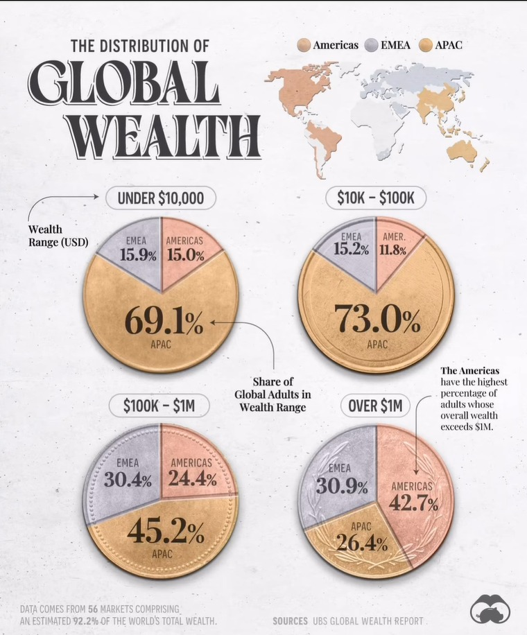{width=400}
> 
> #understandatonce - 世界各區域貧富差距
> 
> **✏️亞太地區（APAC）**
> 亞太地區的貧富差距最為明顯。在資產低於1萬美元的全球人口中，該地區佔據了壓倒性的69.1%，顯示大量人口處於低財富水平。然而，在資產超過100萬美元的群體中，僅佔26.4%。這表明亞太地區整體財富分佈集中於中低層，反映出部分新興市場經濟體的收入不均和機會分配問題。
> 
> **✏️美洲（Americas）**
> 美洲的財富分佈呈現兩極化。在資產超過100萬美元的全球人口中，美洲佔比高達42.7%，顯示該地區高淨值人群高度集中，尤其是在美國等發達經濟體。然而，仍有15%的人口落入資產低於1萬美元的範疇，反映出即便是高收入地區，貧困人口依然存在，且貧富差距懸殊。
> 
> **✏️歐洲、中東及非洲（EMEA）**
> 該地區的貧富差距相對亞太和美洲較為平衡，但仍然存在明顯的財富差異。資產低於1萬美元的人群佔15.9%，而超過100萬美元的人群佔30.9%。這說明該地區內部，尤其是歐洲發達國家與非洲部分低收入國家之間存在明顯的財富不平等。

*出处：[世界各国贫富差距分布（英）](https://www.facebook.com/photo/?fbid=122189685386182708&set=a.122115467150182708)*

- [「雪球」大乱局！中国迎来重要战略机遇](https://xueqiu.com/5577552039/264887743)
- [「搜狐」印度和巴基斯坦还有可能从新合并为一个国家吗？绝无可能性](https://www.sohu.com/a/305266690_574008)

目前马来西亚政府向中国政府争取建立海外中国分校。

- 在马清华大学分校，[马中展开更多合作倡议，争取清华大学在马设分校](https://www.facebook.com/xyzhiju/posts/pfbid01JapCo6k5oumW4pYNqWArrRf9sWcKuUASjoR2exuhBSsxa3MLbMyMrjBQSLDegjLl)
- 在马复旦大学分校，[承认统考、英文教数理 砂拉越如何一步步争取“教育自主”？中国上海复旦大学，将在砂拉越设立分校？！](https://www.facebook.com/xyzhiju/posts/pfbid0tsr6uqWiQRUVZ4a6LNyWtWGzbFTQ5VCEq22EkGKrvayHcBWrH8R3o2QvxxCvPVdBl)
- 在马厦门大学分校，[蔡卓宜 - 厦门美食](https://www.instagram.com/p/Cjxd_GMLAes)。

中国史册：

- [史册号](https://www.shicehao.com)
- [词林](https://www.cilin.org)
- [族谱网](https://www.zupu.cn)
- [历史网](https://www.lishi.net)
- [中国历史研究院网](http://hrc.cass.cn)
- [人物介绍网](https://www.yuelishi.cn)
- [百家有谱](https://www.baijiayoupu.com)
- [历史记](https://www.lishiji.cn)
- [β博雅旅游分享网](http://www.bytravel.cn)
- [博雅人物网](http://ren.bytravel.cn)
- [洞鑑歷史](https://www.99tango.com/library)
- [中国人物传记网](https://www.chinarwzj.com)
- [「百家诸子」中国哲学书电子化计划](https://ctext.org/zhs)
- [當代中國](https://www.ourchinastory.com)
- [第一范文网](https://www.diyifanwen.com)
- [知识贝壳](https://www.zsbeike.com)
- [趣历史](http://www.qulishi.com/renwu/qinshihuang)
- [古诗文网](https://www.gushiwen.cn)
- [5000言](https://5000yan.com)
- [汉典](https://www.zdic.net)
- [学术交流联盟](http://bbs.97fc.com)
- [海词](http://www.cihai123.com)
- [828啦](https://www.828la.com)
- [X-MOL学术平台](https://www.x-mol.com)
- [arXiv](https://arxiv.org)
- [5000言](https://gwgz.5000yan.com)
- [古诗词网](https://www.gushici.net)
- [千篇国学](https://www.qianp.com)
- [国学百科](https://www.guoxuebaike.cn)
- [微信读书](https://weread.qq.com)
- [QQ阅读](https://m.yunqi.qq.com)
- [中国文化一千问](https://m.yunqi.qq.com/chapter/818018)

> [《万般皆下品，唯有读书高》]{style="color:#3C33FF"}<br>
[计量经济，一带一路；]{style="color:#6883FC"}<br>
[九二共识，量化对冲。]{style="color:#6883FC"}<br>
[鞭策六四，铲除黑帮^[愚生世袭制学术份子道教徒赢家黄氏江夏堂，联富高频量化对冲易经算卜数学概率论，孔明借东风水淹七军歼灭那些祖籍印尼和印度的印裔施展巫术屠杀六百枯万人类的金宝博巫师邪教印裔回教徒宦官博彩庄诸邦]；]{style="color:#6883FC"}<br>
[推广量化，提倡学术。]{style="color:#6883FC"}<br>
[百家争鸣，振兴中华；]{style="color:#6883FC"}<br>
[学海无涯，唯勤是岸。]{style="color:#6883FC"}

- [陕西历史文化名城](http://lishiwenhua.snnu.edu.cn/index.htm)
- [CCER 特供数据系统平台](http://www.ccerdata.cn)
- [一带一路数据库](https://www.ydylcn.com/skwx_ydyl/sublibrary?SiteID=1&ID=8721)
- [中国一带一路网](https://www.yidaiyilu.gov.cn)

```
##赢家黄氏江夏堂联富和家眷亲属（包括外祖父道家书法家李福李氏陇西堂和外祖母郑邓）、性格开朗的校花吴紫云（和性格开朗的明星蔡卓宜）和家眷亲属、神仙姐姐校花商家苏氏阜阳堂丽欣和家眷亲属、杏林林氏西河堂燕芳（和国民女神中药中医系杨雅、华联独中校友和日语班女同学林艳迎）和家眷亲属、好学的漂亮妞儿皇朝酒店唐宫郭子瑜（和明星肖黎希）和家眷亲属、莘莘学子、国民女神明星邱紫庭和邱爱晨俩、黄埔军校兵马俑世袭制学术份子高频量化对冲中科红旗辛亥革命

##歼灭瓜雪巴西不能帮新村门牌T十五号世袭制自残自虐自杀的失心疯猥亵淫魔土司乩童张佳坤、瓜雪RHU（淮西派）花园加德士油站隔壁第三巷门牌卅二号世袭制自残自虐自杀的失心疯猥亵淫魔土司乩童刘瑾貹/魔戒小丑咕噜/宗教司甘地、瓜雪回教警署巫贼巫婆回教徒黑米哈山殡刘、大港巴列特花园第十三巷门牌廿七廿九卅一号世袭制自残自虐自杀的失心疯猥亵淫魔土司乩童，点缀全球。 
nameserver 114.114.114.114
```

> 辛亥革命大秦赋日不落重八、德意志崇祯、古希腊ξηg神话、周公解梦、赢政把春秋大梦实现为春秋大业、秦孝公招商（商鞅变法）、秦惠文王：全球有十六亿不吃猪肉的回教徒宦官（可兰经回教刑事法典断肢法）宗祖国是沙地阿拉伯麦加，需要靠中国政府一带一路战略（商鞅变法联合辛亥革命）。

{width=400}

*咱们全球顶尖祖籍东亚的道家秦人（物理学家中华民族）和省吃俭用的工匠建筑工人（赢政兼鲁班兼蒙毅）家翁赢政ξηg Tεηg（赢家黄氏江夏堂），歼灭敌人叛军祖籍西亚的洋番回教徒嫪毐和祖籍西亚的慰安妇*

{width=400}

*个子矮小的领导邓小平/晏婴使楚：鞭策六四学术，推广量化；歼灭回教徒和峇峇娘惹，振兴中华。吕不韦著作《吕氏春秋》：奇货可居；索罗斯著作《金融炼金术》：物极必反论*

世间再无富不过三代、好吃懒做的败家子祖父/王父黄实田（曾祖黄福全在清末光绪年间和两个哥哥仨在清末时期飘洋过海，从满洲到星洲自力更生努力奋斗开垦超过一百亩农地，然后和土木工程的杨清廉俩在清末鸦片战争时期是瓜雪两大不相伯仲的土豪，由于曾祖黄福全染上鸦片瘾导致家道中落）而祖母/王母姓名颜为，省吃俭用的外祖父书法家李福（李斯篆书）外祖母郑邓（家道中落的富家千金）。

#### 百家宗师

姜子牙。

大数定律：姜太公钓鱼，愿者上钩。

#### 儒家

孔子、孟子（孟母断织🧶）。

#### 纵横家

> 鬼谷子是春秋战国时期最具神秘色彩的人物，是道家祖师之一，一生学识广博，又开创纵横家学派，被誉为千古奇人。民间流传他是神通广大的智者，具有未卜先知的能力。与先秦时期的孔子、孟子、韩非子等诸子百家的圣贤齐名，都是在华夏历史上留有浓墨重彩的人。
> 
> 鬼谷子，本名王禅，他创建鬼谷门派，道号玄微子。虽然他自己的事迹很少流传在世，是个不出世的高人，但是他的徒弟却个个名扬天下。鬼谷子的徒弟有苏秦、张仪、孙膑、庞涓、商鞅、吕不韦、白起、李牧、王翦、甘茂、乐毅、毛遂、赵奢等数百位精英，其中，八个徒弟最为知名，下面为大家详细叙说…

*出处：[鬼谷子的徒弟有哪些？](https://baijiahao.baidu.com/s?id=1750073704016307331)*

#### 法家

> 春秋战国时期，随着经济发展及社会变革，统计思想和统计活动空前活跃，并产生了最初的统计分析。
> 
> 管仲，名夷吾（约公元前七百卅至公元前六百卌五年），曾任齐桓公的宰相卌年。《管子》一书着重阐述了管仲的思想，其中包括了管仲大量的统计思想和统计分析。管仲十分重视统计，对统计的作用以极高的评价：“不明于计数而欲举大事，犹无舟楫而经于水。险也。…遍知天下，而不明于机数，不能正天下。”
> 
> **以上「计数」、「机数」等语，泛指统计。**这些话的意思是说，要想管理好国家（“欲举大事”），得充分地认识国情（“遍知天下”）这些离不开统计（计数），对统计“不明”，国家管理就会紊乱，失去发展方向，（犹无舟楫而经于水。险也”。）

*引用：[浅谈春秋战国时期的统计分析](http://tjj.hunan.gov.cn/bsfw/tjkp/tjysh/201507/t20150717_3825224.html)*

- [“法治”到底是rule of law还是rule by law？](https://language.chinadaily.com.cn/trans/2014-10/27/content_18810243.htm)

#### 道家

<iframe width="400" height="225" src="https://youtube.com/embed/Yj8zzy4JI-8" title="「油管」老子的一生：你是否愿用一个时辰的时间了解老子坎坷传奇的一生" frameborder="0" allow="accelerometer; autoplay; clipboard-write; encrypted-media; gyroscope; picture-in-picture; web-share" referrerpolicy="strict-origin-when-cross-origin" allowfullscreen></iframe>

*出处：[「油管」老子的一生：你是否愿用一个时辰的时间了解老子坎坷传奇的一生](https://youtu.be/Yj8zzy4JI-8)*

<iframe width="400" height="225" src="https://youtube.com/embed/6OQJMOyGwkE" title="「油管」李耳為什麼要稱為“老子”而不是稱為“李子”呢？" frameborder="0" allow="accelerometer; autoplay; clipboard-write; encrypted-media; gyroscope; picture-in-picture; web-share" referrerpolicy="strict-origin-when-cross-origin" allowfullscreen></iframe>

*出处：[「油管」李耳為什麼要稱為“老子”而不是稱為“李子”呢？](https://youtu.be/6OQJMOyGwkE)*

虽然李公爵并非咱们道教徒，不过《易经》李耳与科技与信息。

- [Tim Berners-Lee](https://www.w3.org/People/Berners-Lee/)
- [「维基百科」蒂姆∙伯纳斯-李公爵（Sir Timothy John Berners-Lee）](https://zh.wikipedia.org/wiki/蒂姆∙伯纳斯-李)

#### 文艺家

#### 数术家

#### 艺术家


<br>

# 设定

## `CSS`层叠样式表设置

`YAML`层叠样式表（Cascading Style Sheets），可以设置文字字体、主题背景等。由于目前仍看不懂篆体而静态超文本标记语言（html）文件并无法链接闪霓应用服伺器添加个下拉框，愚生不晓右上角如何添加个显示*代码下拉框*以选择不同字体，故此先使用楷体。

```{css, 文献主题设置, error=TRUE}
/* 
  ##============== 实用在线CSS字体生成器 ==============##
  How to import fonts in CSS?
  https://stackoverflow.com/a/45886787/3806250
  
  Transfonter Modern and simple css @font-face generator
  https://transfonter.org/
  
  ## -------------------------------------------------
  Rmarkdown font type
  https://forum.posit.co/t/rmarkdown-font-type/123403
  
  R Markdown與TeX
  https://hackmd.io/@yueswater/TeX_with_R_Markdown 
  
  Chapter 10 Make it fancier
  https://rstudio4edu.github.io/rstudio4edu-book/doc-fancy.html
  
  How to include @font-face within style tag of RMarkdown?
  https://stackoverflow.com/a/61537209/3806250
  
  🎨 Step right into the colorful realm of R Markdown Themes! 🌸 😄
  https://rpubs.com/ranydc/rmarkdown_themes
  
  CSS in R Markdown
  https://geomoer.github.io/moer-base-r/unit99/sl03_css.html
  
  Markdown 设置字体大小颜色和背景色
  https://xujinzh.github.io/2021/04/27/markdown-font-size-color/index.html
*/
<style type="text/css">
@font-face {
    
    src: url('subset-FZKTFW--GB1-0.eot'); 
    font-style: normal, italic, oblique; 
    font-variant: normal, small-caps; 
    font-weight: 300, normal, bold, extrabold, black, lighter; 
    font-stretch: ultra-condensed, extra-condensed, condensed, semi-condensed, normal, semi-expanded, expanded, extra-expanded, ultra-expanded; 
    font-display: auto, block, swap, fallback, optional; 
    font-family: 'FZKai-Z03T', cursive; 
}

@font-face {
    src: url('') format('woff2'),
        url('') format('woff'),
        url('subset-FZKTFW--GB1-0.ttf') format('truetype'), 
        url('subset-FZKTFW--GB1-0.svg#FZKTFW--GB1-0') format('svg'); 
    font-style: normal, italic, oblique; 
    font-variant: normal, small-caps; 
    font-weight: 300, normal, bold, extrabold, black, lighter; 
    font-stretch: ultra-condensed, extra-condensed, condensed, semi-condensed, normal, semi-expanded, expanded, extra-expanded, ultra-expanded; 
    font-display: auto, block, swap, fallback, optional; 
    font-family: 'FZKai-Z03T', cursive; 
}

@font-face {
    src: url('subset-FZKTJW--GB1-0.eot'); 
    font-style: normal, italic, oblique; 
    font-variant: normal, small-caps; 
    font-weight: 300, normal, bold, extrabold, black, lighter; 
    font-stretch: ultra-condensed, extra-condensed, condensed, semi-condensed, normal, semi-expanded, expanded, extra-expanded, ultra-expanded; 
    font-display: auto, block, swap, fallback, optional; 
    font-family: 'FZKai-Z03S', cursive; 
}

@font-face {
    src: url('') format('woff2'),
        url('') format('woff'),
        url('subset-FZKTJW--GB1-0.ttf') format('truetype'),
        url('subset-FZKTJW--GB1-0.svg#FZKTJW--GB1-0') format('svg');
    font-style: normal, italic, oblique; 
    font-variant: normal, small-caps; 
    font-weight: 300, normal, bold, extrabold, black, lighter; 
    font-stretch: ultra-condensed, extra-condensed, condensed, semi-condensed, normal, semi-expanded, expanded, extra-expanded, ultra-expanded; 
    font-display: auto, block, swap, fallback, optional; 
    font-family: 'FZKai-Z03S', cursive; 
}

@font-face {
    src: url('subset-FZXZTFW--GB1-0.eot');
    font-style: normal, italic, oblique; 
    font-variant: normal, small-caps; 
    font-weight: 300, normal, bold, extrabold, black, lighter; 
    font-stretch: ultra-condensed, extra-condensed, condensed, semi-condensed, normal, semi-expanded, expanded, extra-expanded, ultra-expanded; 
    font-display: auto, block, swap, fallback, optional; 
    font-family: 'FZXiaoZhuanTi-S13T', cursive; 
}

@font-face {
    src: url('') format('woff2'),
        url('') format('woff'),
        url('subset-FZXZTFW--GB1-0.ttf') format('truetype'),
        url('subset-FZXZTFW--GB1-0.svg#FZXZTFW--GB1-0') format('svg'); 
    font-style: normal, italic, oblique; 
    font-variant: normal, small-caps; 
    font-weight: 300, normal, bold, extrabold, black, lighter; 
    font-stretch: ultra-condensed, extra-condensed, condensed, semi-condensed, normal, semi-expanded, expanded, extra-expanded, ultra-expanded; 
    font-display: auto, block, swap, fallback, optional; 
    font-family: 'FZXiaoZhuanTi-S13T', cursive; 
}

body {
  /*礼逆袭中科红旗操作系统
  background-image: url('/home/englianhu/文档/猫城/RedFlag-Linux/诸子百家考工记/数术家.png'); 
  */
  margin: 0; 
  background-image: url('/home/englianhu/zhuzibaijia.png'); 
  background-repeat: no-repeat; 
  /*background-size: 100%;*/
  background-size: cover; 
  background-position: center center;
  background-attachment: fixed; 
  color: brown; 
  /* 可以手动调整字体的顺序排位，左边优先，由左到右。 */
  font-family: 'FZKai-Z03T', 'FZXiaoZhuanTi-S13T', 'FZKai-Z03S', cursive; 
}

div {
  background-color: rgba(255, 255, 255, 0.35)   /* 35% opaque white */;
  padding: 0.25em; 
  /* 可以手动调整字体的顺序排位，左边优先，由左到右。 */
  font-family: 'FZKai-Z03T', 'FZXiaoZhuanTi-S13T', 'FZKai-Z03S', cursive; 
}
</style>
```

> 引用：[How to import fonts in CSS?](https://stackoverflow.com/a/45886787/3806250)，而 https://transfonter.org/ 网站可以上载字体包后再设置生产CSS文件。以上CSS文件命名为`秦谏典范与楷模.css`，然后在YAML文件`css: 秦谏典范与楷模.css`。
> 
> 可以手动调整字体`font-family: 'FZKai-Z03T', 'FZXiaoZhuanTi-S13T', 'FZKai-Z03S', cursive`; 的顺序排位，左边优先，由左到右。

*出处：[「🚩🇨🇳🏹🦔中科红旗」🎋🎋🎍🐼🎍🎋🎋附有公元前秦人拼音的红旗输入法#八](https://github.com/englianhu/zhongkehongqi/issues/8#issuecomment-2445850737)*

## `SCSS`设置

- 超级层叠样式表（Sassy Cascading Style Sheets）
- 语法上很棒的样式表（Syntactically Awesome Style Sheets）

<style>
pre {
  overflow-x: auto;
}
pre code {
  word-wrap: normal;
  white-space: pre;
}
.table-hover > tbody > tr:hover { 
  background-color: #8D918D;
}
</style>

```{r 读取SASS, class.source='bg-success', class.output='bg-primary', error=TRUE}
##
## 中科红旗（诸子百家，文艺复兴）
## Oversea Greater Chinese Association 大秦子民公会（秦孝公 / 姜太公——陈祯禄公爵）
## 史无前例，一统天下
## 
## 
## 
## 中科红旗
## 全球中华民族，支持中共称霸天下战略。
## Great Britain 大英帝国
## Greater Chin 大秦赋
## Republic of China / Republic People of China 大秦赋（中华民国 / 中华人民共和国）
## Greater Chinese 大秦子民（爱民如子）
## Oversea Greater Chinese 大秦子民（爱民如子）
## Oversea Greater Chinese Union 大秦子民公会（秦孝公 / 姜太公——陈祯禄公爵）
## 史无前例，一统天下
##
## Great Britain = 大布列颠帝国/大英帝国1
## Greater Chin = 大秦赋
## Greater Chinese = 大秦子民（爱子如民）
##
## 马来西亚籍（海外中华民族，自从清末民初下南洋，咱们马来西亚陈祯禄创办 Oversea Chinese Union）秦始皇黄氏江夏堂，笑傲江湖最大文明贡献
##
## 一）借鉴以前大英帝国东印度公司，有生之年就把一带一路高铁所经过的国家领土，一律得攻占下来（要比以前大英帝国/大蒙古帝国还要强大）称霸天下，世代延续直至史无前例，一统天下。
## 二）一带一路所有告示牌、必须使用中文和汉语拼音。
## 三）借鉴大蒙古帝国骑兵所到之处寸草不生，所有被中国攻占下来的领土，所经之地（包括城市/市镇/乡村），一带一路所有高铁站，都建立国民登记局可以申请入籍中国。
## 四）川普已经发言多次，美国兵变，会再次内战（借鉴越王勾践，中越不内讧，善用马来西亚回教徒太监不造反牵制美国，军售中东/西亚/东欧回教诸国）
## 五）中东回教国回教徒九一一恐怖份子与美国开战，中国军售中东西亚/东欧/非洲回教国（借鉴越王勾践中华民族与美国洋人Democrats阖闾政府，中越不内讧，善用马来西亚回教徒太监不造反牵制美国，军售中东/西亚/东欧回教诸国）
## 六）中国目前高铁除了尚未与马来西亚达成协议开工建立高铁但是已经借鉴王翦只围不攻战略，把东南亚国家都温馨说服并建立高铁，中国先不与马来西亚开战，通过可兰经回教刑事法典断肢法种族灭绝掉东南亚所有世袭制可兰经法家回教徒（借鉴越王勾践中华民族与美国洋人Democrats阖闾政府，中越不内讧，善用马来西亚回教徒太监不造反牵制美国，军售中东/西亚/东欧回教诸国）
## 七）南太平洋战略：中国和东南亚已经签署合约，达成协议不使用空军、核武器，出动海陆军攻占东南亚
## 八）商鞅变法多多益善战略：最大贡献是全球16亿回教徒太监民族与全球基督洋人鹬蚌相争…回教徒默罕默德创办回教，建立可兰经回教刑事法典断肢法规定回教徒伪太监民族必须虔诚戴乌纱帽一天祈祷五次，倘若不虔诚施展巫术屠杀是触犯断肢法而虔诚屠杀也触犯断肢法，只有辛亥革命铲除全球回教徒、断肢法处死或宫刑全球回教徒绝子绝孙，多管齐下才能终止巫术屠杀，拯救全球16亿回教徒还俗。China大秦赋秦孝公至顾自己家族禁止七步诗自相残杀，铲除分一杯羹白骨精刘家彭城堂造反，回教徒会施展巫术屠杀人类，回教徒太监民族只能屠杀欧美洋人并且被断肢处死，不效忠中共称霸天下，直至一统天下的伪满洲国马来西亚1700万个回教徒九一一恐怖份子太监民族包括Michael Cutter Christopher，一律断肢法处死（借鉴越王勾践中华民族与美国洋人Democrats阖闾政府，中越不内讧，善用秦二世胡亥、辛亥革命、越王胡志明、中国胡景涛、马来西亚回教徒太监不反中共牵制美国，军售中东/西亚/东欧回教诸国对抗美国）。秦始皇在统一七国后就不思进取导致赵高李斯谋反（借鉴中国历史秦始皇，水能载舟亦能覆舟，宗教巫术，古惑民心，指鹿为马，成也赵李，败也赵李。所以秦始皇得铭记当初秦孝公，不能昏庸被回教徒篡位），中国借鉴秦孝公战略善用商朝和苏联俄罗斯叶利钦。秦始皇铭记秦孝公，善用全球回教徒古惑全球洋人再依照可兰经回教刑事法典断肢全球回教徒，让咱们全球中华民族支持中共，一统天下。
## 九）华尔街、史无前例的万里长城Great Wall Sreet、一带一路高铁：计量经济学、学术治国、编程、计数、科学科技、量化（Fisher姜太公钓鱼大数据，各行各业购物喜好、民意、生活习惯、各国各集团、军事、诊断上市公司等）、金融、贸易、经商、军事、发展各行各业。
## 十）中文编程语言：借鉴日本自从唐朝大话革新学习汉字至明治维新学习欧洲，日本是全球首个亚洲人自创Ruby红宝石编程语言（Ruby Text可以标音），自从2008年就开始使用R语言并且认识中国R语言论坛《统计之都》论坛创办人网友谢益辉和赵坚毅创办的中国最大计量经济学专业论坛《经管之家》至今十年有余、目前已经开始以中文编程，中华人民共和国的国庆日1001和中华民国的国庆日1010都是二进制的电脑语言binary code，如同黄埔军校国共本是一家，赢家黄氏江夏堂秦孝公禁止《七步诗》自相残杀。咱们东南亚中华民族几乎都是国民华校生，洋人研发电脑、许多编程语言R语言、C语言、C++，推广与发展中文，希望它日有咱们中华民族自创新的编程语言，均以中文编程。
## 十一）发展台式电脑操作系统：中科红旗是由中国北京大学校友孙玉芳创办将Linux礼逆袭和南非原住民开发的Kubuntu忽奔兔中文化并推出自家产品，在美国微软视窗Win台式电脑操作系统垄断全球十多二十年有余，目前已经开始使用芬兰研发的Linux礼逆袭、中国中科红旗台式电脑操作系统，推广与发展中科红旗。
##
## 《关雎——军官与淑女》
## 咱们中华民族和越族不可以死，隔壁后头邻居黄福全与本人（赢家黄氏江夏堂）祖父同名同姓。
##
## 借鉴欧洲中世纪，文艺复兴后就是开始海外军事，称霸天下之路。目前全球疫情已过三年，一带一路如火如荼进行着。
## 借鉴周公礼乐制度，大英帝国和大日本帝国向来都是自诩绅士淑女，孔子学院，以礼待人，来称霸天下。
## 借鉴指鹿为马的历史，百家争鸣如果散播回教徒屠杀罪、不杀东南亚所有世袭制可兰经法家回教徒的话，就得处死回教徒不遵守可兰经回教刑事法典断肢法，施展巫术下降头、古惑民心之罪，篡位咱们全球中华民族，人心惶惶、民不聊生，一律依照可兰经回教刑事法典断肢法处死回教徒巫师王（张佳坤Sulaiman Abdullah，分一杯羹白骨精巫师王刘瑾貹Abdul Halim）。
## 借鉴圣经、诺亚方舟（划龙舟）、孔子儒学（Confusion Catholic）、神父Father与信徒、中国历史、姬昌伯一扈兔子、徐达吃鹅肉、富不过三代的秦始皇赢政秦二世胡亥至赢政孙子、公爵、公公孙子、孙文辛亥革命、马来西亚火箭民主行动党由曾敏兴创党后林吉祥林冠英后换人、蒋介石蒋经国后就不延续世袭制，圣经都是善用父子关系，咱们中华民族和英系都是善用公孙关系、法官律师女子假发、自由女神。
## 中科红旗：借鉴北洋军阀与北约、杀袁者清，灭清者袁，许某可破北洋北约袁绍。黄埔军校国民党共产党辛亥革命是为了铲除回教徒，咱们东南亚所有世袭制可兰经法家回教徒非法回教徒宦官民族触犯可兰经回教刑事法典断肢法，东南亚所有世袭制可兰经法家回教徒只能集体自杀，宣布亡国迎接东亚中国。
## 何谓中国（大秦赋Chin）？中华民国和中华人民共和国。咱们东南亚自从东亚清末民初几乎都是国民华校生，自从西周的周公开始礼乐制度后，大英帝国和大日本帝国都效仿来称霸天下做得有声有色、禁止回教巫术Judi博彩庄、艺人（异人）、导演巫师巫婆道衍师傅装疯卖傻、青山是印裔回教徒的归属地，回教巫师巫婆是屠杀人类的语言宗教习俗文化，得断肢法种族灭绝掉东南亚所有世袭制可兰经法家回教徒。

# install.packages('remotes', dependencies = TRUE, INSTALL_opts = '--no-lock')
library('BBmisc', 'rmsfuns')
#remotes::install_github("rstudio/sass")
lib('sass')

## https://support.rstudio.com/hc/en-us/articles/200532197
## https://community.rstudio.com/t/r-does-not-display-korean-chinese/30889/3?u=englianhu
#Sys.setlocale("LC_CTYPE", "en_US.UTF-8")
#Sys.setlocale("LC_CTYPE", "zh_CN.UTF-8")
#Sys.setlocale(category = "LC_CTYPE", "Chinese (Simplified)_China.936")
#Sys.setlocale(locale = "Chinese")
#Sys.setlocale(locale = "Japanese")
#Sys.setlocale(locale = "English")

# rmarkdown::render('/home/englianhu/Documents/owner/ryo-cn.Rmd',  encoding = 'UTF-8')
#Sys.setlocale("LC_CTYPE", "UTF-8")
#Sys.setlocale(locale = "UTF-8")
#Sys.setlocale(category = "LC_ALL", locale = "chs")
#Sys.setlocale(category = "LC_ALL", locale = "UTF-8")
#Sys.setlocale(category = "LC_ALL", locale = "Chinese")
#Sys.setlocale(category = "LC_ALL", locale = "zh_CN.UTF-8")

# Sys.setlocale("LC_ALL", "en_US.UTF-8")
```

```{scss SCSS设置, class.source='bg-success', class.output='bg-primary'}
/* https://stackoverflow.com/a/66029010/3806250 */
h1 { color: #002C54; }
h2 { color: #2F496E; }
h3 { color: #375E97; }
h4 { color: #556DAC; }
h5 { color: #92AAC7; }

/* ———————————————————— */
/* https://gist.github.com/himynameisdave/c7a7ed14500d29e58149#file-broken-gradient-animation-less */
.hover01 {
  /* color: #FFD64D; */
  background: linear-gradient(155deg, #EDAE01 0%, #FFEB94 100%);
  transition: all 0.45s;
  &:hover{
    background: linear-gradient(155deg, #EDAE01 20%, #FFEB94 80%);
    }
  }

.hover02 {
  color: #FFD64D;
  background: linear-gradient(155deg, #002C54 0%, #4CB5F5 100%);
  transition: all 0.45s;
  &:hover{
    background: linear-gradient(155deg, #002C54 20%, #4CB5F5 80%);
    }
  }

.hover03 {
  color: #FFD64D;
  background: linear-gradient(155deg, #A10115 0%, #FF3C5C 100%);
  transition: all 0.45s;
  &:hover{
    background: linear-gradient(155deg, #A10115 20%, #FF3C5C 80%);
    }
  }
```

```{r 编织选项, class.source='hover01', class.output='hover02', error=TRUE}
## 更换时间区域，保留日期时间。
Sys.setenv(TZ = 'Asia/Shanghai')

## 忽略所有警讯
## https://stackoverflow.com/a/36846793/3806250
## 设置宽度
## options(knitr.table.format = 'html')将所有kableExtra图表一致设置为'html'格式，省略设置各别图表。
## options(repos = 'https://cran.rstudio.com')将仓库设置为安全网。
## options(repos = 'http://cran.rstudio.com')将仓库设置为普通网。
options(warn = -1, width = 999, knitr.table.format = 'html', 
        digits = 22, digits.secs = Inf, repos = 'https://cran.rstudio.com')

## https://stackoverflow.com/questions/39417003/long-vectors-not-supported-yet-abnor-in-rmd-but-not-in-r-script
## https://yihui.org/knitr/options
knitr::opts_chunk$set(
  class.source = 'hover01', class.output = 'hover02', class.error = 'hover03', 
  message = FALSE, warning = FALSE, error=TRUE, autodep = TRUE, 
  autodep = TRUE, aniopts = 'loop', progress = TRUE, verbose = TRUE, 
  cache.globals = FALSE, cache = FALSE, cache.lazy = FALSE, result = 'asis')
```

## 设置

读取以下所需程序包。

```{r 读取程序包, error=TRUE}
## 读取程序包、设置编织与环境选项。
## 3210448065@qq.com
## leiou123

## 2849108450@qq.com
## leiou123
## https://rstudio.cloud/project/1198888

## 读取'BBmisc'程序包。
if (suppressMessages(!require('BBmisc'))) {
  install.packages('BBmisc', dependencies = TRUE, INSTALL_opts = '--no-lock')
}
suppressMessages(library('BBmisc'))

if (suppressMessages(!require('rmsfuns'))) {
  install.packages('rmsfuns', dependencies = TRUE, INSTALL_opts = '--no-lock')
}
suppressMessages(library('rmsfuns'))

if (!require('REmap')) devtools::install_github('lchiffon/REmap')

## 一次性读取所需程序包。
## 
## [R语言高效数据框操作：tidyfst](https://z.itpub.net/article/detail/5EE2CA3CDCD527ADAF5071BF2ADF8874)
## 
## [「知乎」tidyft高性能数据操作](https://zhuanlan.zhihu.com/p/128645634)
## 最下面是tidyft的性能，占用空间最少，花费时间最少。
##   其实这个包基本拥有tidyfst的所有功能，只是原位更新的概念对于新手是有挑战…

library('tidyfst', warn.conflicts = FALSE)
library('Ipaper', warn.conflicts = FALSE)
library('tidyft', warn.conflicts = FALSE)
library('dplyr', warn.conflicts = FALSE)
library('lubridate', warn.conflicts = FALSE)
library('data.table', warn.conflicts = FALSE)
library('conflicted', warn.conflicts = FALSE)

conflicted::conflicts_prefer(Ipaper::is_empty, .quiet = TRUE)
conflicted::conflicts_prefer(tidyft::nth, .quiet = TRUE)
conflicted::conflicts_prefer(tidyft::fill, .quiet = TRUE)
conflicted::conflicts_prefer(tidyft::nest, .quiet = TRUE)
conflicted::conflicts_prefer(tidyft::unnest, .quiet = TRUE)
conflicted::conflicts_prefer(tidyft::cummean, .quiet = TRUE)
conflicted::conflicts_prefer(tidyft::group_by, .quiet = TRUE)
conflicted::conflicts_prefer(tidyft::distinct, .quiet = TRUE)
conflicted::conflicts_prefer(tidyft::filter, .quiet = TRUE)
conflicted::conflicts_prefer(tidyft::select, .quiet = TRUE)
conflicted::conflicts_prefer(tidyft::rename, .quiet = TRUE)
conflicted::conflicts_prefer(tidyft::count, .quiet = TRUE)
conflicted::conflicts_prefer(tidyft::arrange, .quiet = TRUE)
conflicted::conflicts_prefer(tidyft::summarise, .quiet = TRUE)
conflicted::conflicts_prefer(tidyft::separate, .quiet = TRUE)
conflicted::conflicts_prefer(tidyft::lead, .quiet = TRUE)
conflicted::conflicts_prefer(tidyft::lag, .quiet = TRUE)
conflicted::conflicts_prefer(tidyft::unite, .quiet = TRUE)
conflicted::conflicts_prefer(tidyft::left_join, .quiet = TRUE)
conflicted::conflicts_prefer(tidyft::right_join, .quiet = TRUE)
conflicted::conflicts_prefer(tidyft::inner_join, .quiet = TRUE)
conflicted::conflicts_prefer(tidyft::full_join, .quiet = TRUE)
conflicted::conflicts_prefer(tidyft::anti_join, .quiet = TRUE)
conflicted::conflicts_prefer(tidyft::semi_join, .quiet = TRUE)
conflicted::conflicts_prefer(tidyft::select_dt, .quiet = TRUE)
conflicted::conflicts_prefer(tidyft::transpose, .quiet = TRUE)
conflicted::conflicts_prefer(tidyft::setDT, .quiet = TRUE)
conflicted::conflicts_prefer(tidyft::setnames, .quiet = TRUE)
conflicted::conflicts_prefer(dplyr::mutate, .quiet = TRUE)
conflicted::conflicts_prefer(dplyr::collapse, .quiet = TRUE)
conflicted::conflicts_prefer(lubridate::year, .quiet = TRUE)
conflicted::conflicts_prefer(data.table::first, .quiet = TRUE)
conflicted::conflicts_prefer(data.table::last, .quiet = TRUE)
conflicted::conflicts_prefer(data.table::between, .quiet = TRUE)
conflicted::conflicts_prefer(data.table::set, .quiet = TRUE)
conflicted::conflicts_prefer(data.table::`:=`, .quiet = TRUE)
conflicted::conflicts_prefer(magrittr::`%>%`, .quiet = TRUE)
conflicted::conflicts_prefer(Ipaper::`%->%`, .quiet = TRUE)
conflicted::conflicts_prefer(Ipaper::`%<-%`, .quiet = TRUE)
conflicted::conflicts_prefer(hms::hms, .quiet = TRUE)
conflicted::conflicts_prefer(forecast::accuracy, .quiet = TRUE)
conflicted::conflicts_prefer(base::load, .quiet = TRUE)
conflicted::conflicts_prefer(base::merge, .quiet = TRUE)
conflicted::conflicts_prefer(base::rank, .quiet = TRUE)
conflicted::conflicts_prefer(data.table::between, .quiet = TRUE)
conflicted::conflicts_prefer(plyr::llply, .quiet = TRUE)
conflicted::conflicts_prefer(tibble::view, .quiet = TRUE)
conflicted::conflicts_prefer(tidyft::separate, .quiet = TRUE)
conflicted::conflicts_prefer(lubridate::year, .quiet = TRUE)
conflicted::conflicts_prefer(gtools::permutations, .quiet = TRUE)
conflicted::conflicts_prefer(Ipaper::chunk, .quiet = TRUE)
conflicted::conflicts_prefer(formattable::percent, .quiet = TRUE)

if (!require('webdriver')) remotes::install_github('rstudio/webdriver')

程序包 <- c(
  'devtools', 'Ipaper', 'knitr', 'kableExtra', 'tint', 'furrr', 'DT', 'gam', 
  'tidyr', 'readr', 'lubridate', 'reprex', 'stringr', 'feather', 'lunar', 
  'purrr', 'quantmod', 'tidyquant', 'tibbletime', 'timetk', 'readxl', 'pak', 
  'remotes', 'plyr', 'dplyr', 'dbplyr', 'dtplyr', 'cnum', 'arabic2kansuji', 
  'keras', 'sarima', 'tidyverse', 'memoise', 'htmltools', 'formattable', 'V8', 
  'tidyr', 'zoo', 'forecast', 'seasonal', 'magrittr', 'hms', 'seasonalview', 
  'rvest', 'feather', 'reticulate', 'rjson', 'rugarch', 'rmgarch', 'mfGARCH', 
  'tidymodels', 'googleVis', 'sparklyr', 'jcolors', 'microbenchmark', 'httr', 
  'dendextend', 'tidyverts', 'vembedr', 'lhmetools', 'gtools', 'stringi', 
  'pacman', 'tensorflow', 'profmem', 'ggthemes', 'flyingfox', 'highcharter', 
  'echarts4r', 'rlist', 'viridis', 'hrbrthemes', 'profvis', 'fable', 'wdman', 
  'fabletools', 'fable.prophet', 'Metrics', 'MLmetrics', 'webshot', 'ragg', 
  'listviewer', 'tidyjson', 'data.table', 'RSelenium', 'reactable', 'pkgdown', 
  'js')
#, 'Rfast', 'Rfast2')

## cnum 是協助處理中文數字的R套件，提供轉換、識別及抽取中文數字的函數。
## cnum 是协助处理中文数字的R包，提供转换、识别及抽取中文数字的函数。
# https://cran.r-project.org/web/packages/cnum/readme/README.html
# devtools::install_github('elgarteo/cnum')

# load_pkg(程序包)
suppressAll(lib(程序包))
load_pkg(程序包)
rm(程序包)

.蜀道 <- paste0(getwd(), '/诸子百家学府/')

## 设置googleVis选项，促使plot.gvis只陈列HTML格式的完成品。
谷歌绘图设置 <- options(gvis.plot.tag = 'chart')

## <audio src='诸子百家诗经与古诗源/bigmoney.mp3' autoplay controls loop></audio>
```

<br>

# 简介

## 秦人牧马

公元前后，仅在秦汉。

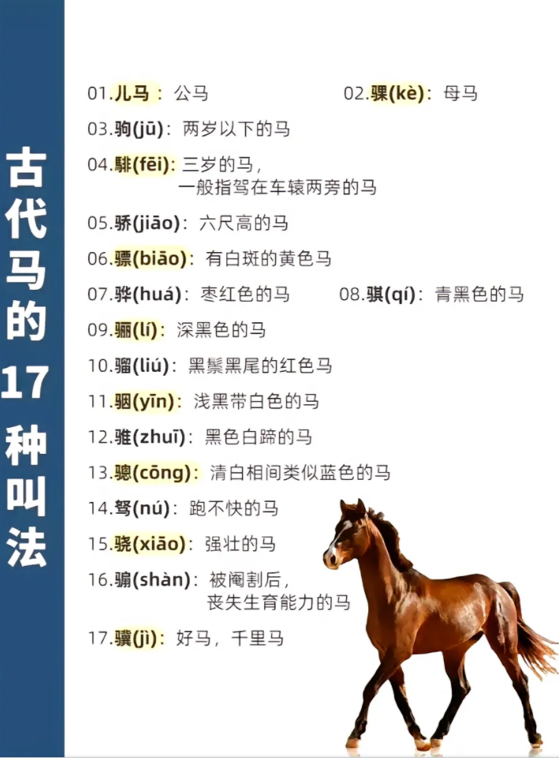{width=400}

- [「大纪元」现存最古老的马种，曾助人类建立文明](https://www.epochtimes.com/gb/23/6/10/n14013739.htm)
- [「新华网」中国最早的马车](http://m.xinhuanet.com/book/2018-03/20/c_129832013.htm)
- [「中华农业文明古代史」场景——伯乐相马](http://www.zgnybwg.com.cn/detail/zh/5093.html)
- [中国古代马画中的符号与诉说](http://www.rmzxb.com.cn/c/2014-02-24/296620.shtml)

> - 我俩（both of us）
> - 我仨 (three of us)
> - 我伵 (four of us)
> - 我伍 (five of us)
> - 我仈 (eight of us)
> - 我仇 (nine of us)
> - 我什 (ten of us)
> - 我佰 (hundred of us)
> - 我仟 (thousand of us)
> - 我仉 (我们几个人 some of us)

*出处：[「问百度」两个=俩、三个=仨、四个？五个？](https://zhidao.baidu.com/question/224353879.html)*

## 博彩简史

### 彩史


### 秦彩

#### 秦彩史

自古赌庄、酒庄、钱庄、盐商、米商，都是咱们的中国传统行业。

- [「馆」中国早在秦汉时期就有了彩票，而且几个朝代都有精彩的彩票故事](http://www.360doc.com/content/21/0822/09/70965819_992099534.shtml)
- [「问百度」赌场是从什么时候开始有的?哪个朝代？](https://zhidao.baidu.com/question/521659847.html)
- [「维基百科」彩票](https://zh.wikipedia.org/wiki/彩票)
- [「维基百科」爱国奖券](https://zh.wikipedia.org/wiki/愛國獎券)是一九五零年代至一九八零年代在台湾，由中华民国台湾省政府为缓解财政困难而发行的奖券，其发行单位为台湾银行。爱国奖券在台湾存在卅七年，共发行一一七一期。一九八零年代中期后，由于一种名叫“大家乐”的赌博方式盛行，严重影响社会秩序与爱国奖券的正常发行；终致在一九八七年十二月二十七日，台湾省政府宣布暂停发行爱国奖券，爱国奖券从此成为历史名词。
- [「星洲」四高材生頻中彩券，警要介入調查](https://www.sinchew.com.my/news/20201203/international/3074722?variant=zh-hant)
- [「问百度」彩票选择实验](https://baike.baidu.com/item/彩票选择实验/287961)
- [你買的彩票中獎概率到底有多少？](https://wangcc.me/post/probability3/)
- [「馆」彩票有规律吗？有！伯努利大数定律，就是彩票的终极规律。](http://www.360doc.com/content/20/0409/16/256040_904872645.shtml)
- [「新浪」中大奖有捷径？数学家称根据定律可预测彩票奖号](http://sports.sina.com.cn/l/2014-03-24/18557082505.shtml)
- [「搜狐」伯努利 猜度学应用于大乐透](https://www.sohu.com/a/818165667_122053684)
- [「中国软件开发者社区」伯努利（Bernoulli）试验、二项分布](https://blog.csdn.net/panghuangang/article/details/135007953)
- [「问百度」大乐透彩票活动中的随机现象分析](https://wenku.baidu.com/view/1432704c763231126fdb1145)
- [「问百度」赌博中的数学](https://wenku.baidu.com/view/e37ce9eab8f67c1cfad6b89f)
- [中国彩票销售数据简介](https://www.cnopendata.com/data/chinese-lottery-sales.html)

#### 秦彩庄

- [中国福利彩票](https://www.cwl.gov.cn/)
- [中国福利彩票网](https://m.zhcw.com/)
- [中彩网](https://m.zhcw.com/)
- [广东省福利彩票发行中心](https://www.gdfc.org.cn/)
- [河南福彩网](http://www.henanfucai.com/)
- [浙江福彩](http://www.zjflcp.com/)
- [湖北福彩](http://www.hbfcw.cn/)
- [湖北省民政厅——湖北省福利彩票如何兑奖？](http://mzt.hubei.gov.cn/ywzc/ztzl/2021zcfg/2021fl/202207/t20220712_4216552.shtml)
- [湖南省民政厅——湖南福彩](http://mzt.hunan.gov.cn/mzt/fc/)
= [湖南福彩一亿五千九百万元巨奖得主全副武装现身，奖金重一吨六](https://m.thepaper.cn/wifiKey_detail.jsp?contid=2507162#)
- [台灣彩券為中國信託金融控股(股)公司旗下之子公司——彩券管理部](https://lotto.ctbcbank.com/)
- [「维基百科」中華民國公益彩券](https://zh.wikipedia.org/wiki/中華民國公益彩券)
- [台灣運彩](https://article.sportslottery.com.tw/)
- [教育部體育署——運動彩券](https://www.sa.gov.tw/PageContent?n=277)
- [「元宇宙」中華民國運動彩券發展協會](https://www.facebook.com/p/中華民國運動彩券發展協會-61551729484054/)
- [運彩怎麼買？賠率是什麼？運彩中獎又該如何領獎？](https://tw.news.yahoo.com/運彩怎麼買？賠率是什麼？運彩中獎又該如何領獎？-095449219.html)
- [玩運彩](https://www.playsport.cc/forum.php)
- [「運彩」台灣運彩怎麼玩？投注單劃記教學、玩法規則懶人包](https://www.cashfeel.com.tw/article/運彩-投注-運動賽事)

### 秦人牧马彩史

#### 马厩合法正规彩庄

- [万能](https://www.magnum4d.my/zh-cn/)：「钱并非万能，但没钱却万万不能。」
- [大马彩](https://www.damacai.com.my/zh/home)：「田忌赛马，秦人牧马。」
- [多多](https://www.sportstoto.com.my/cn/index.asp)：「韩信点兵，多多益善。」
  - [「多多」二零二二年“多多阅读，获益良多”助学计划卷土重来](https://esg.sportstoto.com.my/helping-hands/cn/sports-toto-reading-my-companion-reading-programme-2022/)
  - [「多多」多多博彩的起源与新纪元](https://www.sportstoto.com.my/cn/corporate_about_us.asp)
  - [「元宇宙」哇哈哈~我们多多博彩的吉祥物Toto Bird小鹦鹉又来啦！](https://www.facebook.com/reel/1365264284175004)
  - [「元宇宙」工作再忙，别忘了买Jackpot](https://www.facebook.com/photo?fbid=481192198298895)
  - [「痞客帮」多多博彩采用多多财神鸟为吉祥物并以长尾小鹦鹉的漫昼模样作为多多财神鸟。](https://malaysia888.pixnet.net/blog/post/55671782)
- [星池](https://www.singaporepools.com.sg/landing/ch/Pages/index.html)：「周星翅♬」
- [砂大萬](https://www.cashsweep.my/)：「大万洲学论。」
- [沙巴彩](http://www.diriwan88.com/)：「田氏代齐，田忌赛马。」
- [山打根马会](http://www.stc4d.com/index.aspx)：「田忌赛马，秦人牧马。」
- [大彩](https://www.bigsweep.com.my/)：「手中情♬」

<iframe width="400" height="225" src="https://www.youtube.com/embed/m_xaSbtS7co" title="「油管」翁立友——手中情（官方KTV版）" frameborder="0" allow="accelerometer; autoplay; clipboard-write; encrypted-media; gyroscope; picture-in-picture; web-share" referrerpolicy="strict-origin-when-cross-origin" allowfullscreen></iframe>

*出处：[「油管」翁立友——手中情（官方影视版）](https://www.youtube.com/watch?v=m_xaSbtS7co)*

大彩网是目前二零零四年正在筹备开张的海外秦新彩庄，而咱们介于丹绒加弄县和瓜拉雪兰莪县的峇东新村附近自古并没有任何合法彩庄，直到目前才有一家名为“大彩”的新彩庄建立合法正规的彩庄投注站开张。咱们新村有间超过七旬地标庙宇叫「南天宫盘古庙」而庙宇对面的京剧歌剧舞台矗立着咱们世袭制道教徒十二生肖的肖像。《山海经》是一本古代神话奇书，详情请查阅[「诸子百家」中国哲学书电子化计划《山海经》](https://ctext.org/shan-hai-jing/zhs)。自我小学九零年代时期，咱们峇东新村小农庄偶尔会出现中国同胞挨家逐户兜售中国产品，小六那年有天购买花旗泡参。

- [「文派」阳历二零二三年十二月三日：今日是紫云生日](https://englianhu.wordpress.com/2024/02/04/「阳历二零二三年十二月三日」今日是紫云生日/)
- [「文派」原创：程序员的精神食粮代码仓库：GitHub Repository 应该翻译成什么？](https://englianhu.wordpress.com/2022/12/29/【原创】程序员的精神食粮代码仓库：github-repository-应该翻/)
- [「文派」修读Coursera : Machine Learning for Algorithmic Trading中…](https://englianhu.wordpress.com/2021/09/15/修读coursera-machine-learning-for-algorithmic-trading中/)

近年来有好几家讨中国妞儿当媳妇儿（二哥联旗的贤内助二嫂李淑宜也是中国妞儿）、菜市场时常有中国同胞兜售，而村外街道有家中国化工厂，添和老家赁租给许多中国同胞工人。

大约二零二二年春节期间，村子里有大庆典游行，村子突然出现个青眼碧珠的洋人就住在A村第四巷，长相似礼逆斯托瓦斯，就大概出现一周时间，每天徒步徘徊在愚生B村第五巷，然后我打招呼咨询下才知道是斯洛文尼亚人（而美国总统川普的妻子也是斯洛文尼亚人，不过入籍美国）。相关信息可查阅[「文派」🚩🇨🇳🔆🏹🌟👊🚀🦔中科红旗 >> 礼逆袭🐧忽奔兔⚙](https://englianhu.wordpress.com/econometrics/linux-🐧-kubuntu-⚙/)，然后二零二四年九月左右，有天出现两个洋人踏跑车式脚踏车，长相似饰演崇祯的陈豪（或长短记忆计数尤物的著者Jürgen Schmidhuber和Sepp Hochreiter），打招呼咨询下才知道来自于德国。

希望多多、大马彩、万能、大万、星池，祖国中国福利彩、台湾彩券、台湾运彩、富邦彩券等，都能陆续而来。

目前正在自修并复兴春秋战国时期，咱们道家与民间信仰中的《易经》、《广经堂》中的算卜（也就是概率论）、农历与黄历、天文历法、风水学（统筹法、环境与系统工程学）、万字图，将咱们高频量化对冲学术份子的概率论，添加一些咱们道家参数与元素。

- [「搜狐」《山海经》异兽图大全，附详细出处](https://www.sohu.com/a/377737323_173129)

有关马来西亚彩票相关信息，可查阅：

- [「楼里楼下」马来西亚彩票有哪些，有相关介绍吗？](https://www.yanwo668.com/yanwo-changshi/13660.html)
- [「中秋」万字积宝 系统投注 投注额表](https://www.4dmoon.com/zh-cn/4d-jackpot-system-play-price-table)
- [「中秋」赢得4D彩票？ - 如何兑领奖金？](https://www.4dmoon.com/zh-cn/where-to-claim-prize)
- [「中秋」万能开彩信息](https://www.4dmoon.com/zh-cn/magnum-prize-structure)。
- [「中秋」大马彩 派彩结构](https://www.4dmoon.com/zh-cn/damacai-prize-structure)
- [「中秋」多多博彩 派彩结构](https://www.4dmoon.com/zh-cn/sportstoto-prize-structure)
- [「中秋」新加坡博彩 派彩结构](https://www.4dmoon.com/zh-cn/singapore-prize-structure)
- [「中秋」山打根赛马会 (STC) 派彩结构](https://www.4dmoon.com/zh-cn/sandakan-prize-structure)
- [「中秋」沙巴88 派彩结构](https://www.4dmoon.com/zh-cn/sabah88-prize-structure)
- [「中秋」砂勞越大万 派彩结构](https://www.4dmoon.com/zh-cn/sarawak-cashsweep-prize-structure)
- [「哇！」泛马大彩有限公司推出更新版即刮即赢游戏](https://www.woah.my/2024/07/31/fan-ma-da-cai-you-xian-gong)

[雪兰莪赛马公会历代主席](https://www.selangorturfclub.com/zh-hans/corporate/history/past-chairman/)有提及雪兰莪赛马公会当初是坐落于安邦，一九八二年开始有提议搬迁赛马场的课题，然后一九九三年搬迁到新街场，欲知更多详情请查阅[雪州马会历史](https://www.selangorturfclub.com/zh-hans/corporate/history/)。

- [「问百度」世界上最大的马：体型堪比大象，五吨重物拉着跑，十三个壮汉拉不动](https://baijiahao.baidu.com/s?id=1801082060800203312)
- [「问百度」外形堪比大象，体重一吨二的“万马之王”，为何即将成为历史？](https://baijiahao.baidu.com/s?id=1715732587854271608)

#### 合法正规的彩券条例

借鉴《封神榜》与购买彩券万字概念，小万代表凡是只关注榜上三甲（领导或万字图中的头条重大事件）而大万是需要关注榜上三甲（世界一战，二战是德意日仨联盟）与全部理事或管理层，至于没有上榜的咱们百姓个人顾好个人就好。有关详细的大楷小楷、大乔小乔、大篆小篆中的「大小之别」，请查阅咱们道家算卜概率论彩券万字的“大万”与“小万”。

元宇宙网站 https://www.facebook.com/ 网站，添加个`?local=xx_XX`，小写是代表语言而大写是代表国家，即可查看元宇宙公司幕后通过计数造物、投资组合原理部署出来的所有国家道地信息，范例如下：
- https://www.facebook.com/?locale=en_GB
- https://www.facebook.com/?locale=zh_GB
- https://www.facebook.com/?locale=zh_CN
- https://www.facebook.com/?locale=zh_TW
- https://www.facebook.com/?locale=zh_HK
- https://www.facebook.com/?locale=zh_MY
- https://www.facebook.com/?locale=en_MY

#### 草原黑市彩庄

九零年代前后是个人电脑科技行业、博彩行业、亚盘和高频量化对冲基金崛起的时候，欲知更多详情可查阅个人随手记事本[「文派」赢家黄氏江夏堂，联富（雷欧）](https://englianhu.wordpress.com)。而最近才知道原来二零零六/零七年到菲律宾客世博工作，遇到一位戴幅眼镜、斯斯文文的台籍新宝老板（新宝一、新宝二、TA-IN、SBB-IN）杨嘉贤（最近才知道名叫杨嘉贤，如果公司上市都会成为台湾首富）拥有全资股份的独资公司，而管理员新加坡籍欧阳金泰是靠关系才认识到东亚中华民国/台湾黑白两道亿万富豪杨总，杨总身家好几千亿美元（而非马币），以曾威廉和Oh Wee Kiong的历史推算，估计当初欧阳金泰是靠凯盛娱乐（旧称利记）创办人兼老板Simon Goh Liang Hu提拔后来在印尼巴淡岛（在地南再也国民巫中初中二历史课提及，新加坡南方一个印尼辽群岛，以前隶属英国殖民地而马六甲小海港是荷兰殖民地，由于英荷签署合约对换领土后，马六甲才归属英国殖民地）创办新球网才会获得三个百分比的股份。由于前几年有天到八达岭再也面试优步计程车工作时，吉隆坡加沙酒店，最近“啊看”的孙子俩搞乱论才知道原来以前新加坡公民欧阳金泰和欧阳金喜俩在喜来登酒店搞同志乱轮，幸亏二零零六年在特里必斯工作时期到新加坡喜来登酒店大厅面试工作时，欧阳某在大厅问我要不要露宿一宿时，幸亏我没有逗留（吓我一跳！），有关到喜来登酒店面试后飞往菲律宾客世博工作详情请查阅：

- [《赢家黄氏江夏堂》 – 始祖赢政ξηg Tεηg∙黄永春家谱](https://englianhu.wordpress.com/2022/02/22/《雪隆江夏堂》-家谱/)
- [「文派」**清明节**是日语班杏林林氏西河堂艳迎的农历生日，也是咱们世袭制道教徒黄种人万家灯火认祖归宗扫墓祭祖、祈求祖先保佑的日子（锦衣兵马俑）](https://englianhu.wordpress.com/2024/04/10/清明节是日语班杏林林氏西河堂艳迎的生日/)
- [汉晋时期东南亚地名辑录（二）爪哇∙马来](https://www.bilibili.com/opus/453015798720187721)

自从二零二零年从克拉克阳城辞职后这两年继续自修高频量化对冲，有天春节期间到适耕庄到一家南昌摩哆（双轮机车在南洋一带外来语称Motor为摩哆）打听之下才知道原来适耕庄有许多亿万土豪，有位拥有三四万亩稻田的土豪估计时适耕庄首富在二零一五年左右就在丁宜河边建立了一间太阳能发电厂兼二战的失落宝藏迷宫，详情可查阅[「南洋」覃永健:员工需要归属感，专业团队造就世金企业](https://www.enanyang.my/专题/覃永健员工需要归属感-专业团队造就世金企业)，而C村第三巷角落间退休老村长黄运财家（女婿刘善义经营太阳能光合瓦生意）安装并销售太阳能光合瓦。而咱们峇东新村一个小村落都有七八个身家过亿马币的土豪，其中峇东新村首富郭鹤眛也拥有超过一万亩油棕闾园不动产身家千亿元马币，最近有天到瓜雪巴西不能帮新村民国卌九年建立的李童子府庙偶然听一些土豪闲聊，也和郭鹤眛年轻时期被英国政府诈骗，在银行提款时由于填写姓名不清楚就被银行家卡款了好几亿马币，还被银行家联合当时公安局和警署威胁如果不服就得吃牢饭。外号“啊看”和“啊戆”（民智国民华文小学同学珍妮的爸爸）林氏土豪俩的身家也有超过百亿马币，外号“安那”（大姐莲碧的民智国民华文小学同学郭胜友）的身家也有好几十亿马币。

## 博彩与算卜

### 周易——姜太公钓鱼

**大数定律**

- [「北京市鼎石学校」春秋战国与百家争鸣](https://keystoneacademy-cn.libguides.com/history-of-china/spring-and-autumn-period)

### 西楚彩庄

### 柬菲彩庄

> **2018年**，到柬埔寨西哈努克港[黄金城娱乐城](https://www.facebook.com/QQ779933300)当客服人员，因为非常危险，有天午休时间二楼宿舍大爆炸和许多枪声后，员工纷纷逃跑到公司，有位小胖经理走来叫我马上飞回国。

*引用：[「鄀客栈」雷欧 ∪ 瑞欧，黄联富](https://rpubs.com/englianhu/ryo-cn)*

> ...当时有位像主播何海其的同事有时会问问东西，然后房间内搬来了位缅甸/果敢同胞，当时他就聊起他们那儿的军政府之类的，当时每天晚上或凌晨都有一些同事在宿舍走楼梯和游荡说要找内鬼之类的，我都不是内鬼也得提防，所以要求换房间一个人睡就批准了，当时连续几天编程采集数据分析时时彩，然后问上头要不要；如大学开学第一周是培训周，由于培训期间每天对着时时彩和福利彩等形形色色、林林种种、五花八门、走马看花的彩券彩种，有天通过这惠普卜威廉廿三三合一电脑（hp Pavilion 23）就分析[「鄀客栈」Lottery 3D Analysis 彩票分析](https://rpubs.com/englianhu/lottery-3D-analysis)，然后上司说分析彩票不重要就阁着，没几天后就因为宿舍大爆炸和枪林弹雨很危险，有位小胖经理就冲冲忙忙、赶紧帮我订购机票乘搭最快航班回国了...

*出处：[「文派」《雪隆江夏堂》-家谱](https://englianhu.wordpress.com/2022/02/22/《雪隆江夏堂》-家谱)*

二零一八年到柬埔寨西哈努克港「黄金城」打工不足一周，如大学开学第一周是培训周，由于培训期间每天对着时时彩和福利彩等形形色色、林林种种、五花八门、走马看花的彩券彩种，有天通过这惠普卜威廉廿三三合一电脑（hp Pavilion 23）就分析[「鄀客栈」福彩三码分析](https://rpubs.com/englianhu/lottery-3D-analysis)，然后上司说分析彩票不重要就阁着，没几天后就因为宿舍大爆炸和枪林弹雨很危险，有位小胖经理就冲冲忙忙、赶紧帮我订购机票乘搭最快航班回国了。

> My former employer is the English Qin State (here I term the United Kingdom as "English Qin State". The United Kingdom is a union of four countries which are England, Ireland, Scotland and Wales. By refer to Chinese Dynasty Zhou ancent history of the Spring and Autumn Period and the Warring States Period (770BC——221BC) and the history of English and French colonize whole the world, GMT+0 is the World-wide English Standard Greenwich Time. English territories include all English colonies of the Commonwealth Games.) One of the century-old Forbes Five Thundreds companies [Ladbrokes](https://sports.ladbrokes.com), the English Qin State Ladbrokes is a legal and regular betting company where the shoplots spread around whole nation. By refer to my previous studies, the English Football matches and our betting opening days are generally Sundays, weekends, Wednesdays, etc., and there will be special opening periods on Tuesdays occasionally. There is a time series pattern.
> 
> 愚生旧东家乃英系秦国（英国此称之为“英系秦国”，英国是一个由英格兰、爱尔兰、苏格兰和威尔斯四国组成的联盟国。借鉴春秋战国时期史与英法殖民天下史，GMT+0是天下皆以英国格林时间为标准，英系领土包括所有共运会诸侯英殖民地）百年老店福布斯五百强之一[立博](https://sports.ladbrokes.com)，英系秦国立博合法正规的博彩投注站遍布全国。借鉴愚生旧作，英国<ruby>蹴<rp>(</rp><rt>cù</rt><rp>)</rp>鞠<rp>(</rp><rt>jū</rt><rp>)</rp></ruby>赛事一般上周日、周末、周三、周四等，间中还有周一赛事；而咱们全马目前投注开彩日一般上都是周日、周末、周三等、间中周二还会有开彩特别期，有个时间序列规律。

- [「猫城」鄀尤物](https://github.com/englianhu/Rmodel)
- [「猫城」赔率计数|机数造物（打造尤物）建模与试探蹴鞠彩券商的昏庸、无能、腐败与破绽](https://github.com/scibrokes/odds-modelling-and-testing-inefficiency-of-sports-bookmakers)

以下一些彩券数据，是愚生在农历二零一九年菊月到菲律宾会稽（Clark外来语译为“克拉克”，中译“书记”、“秘书”、“掌柜”、“会计”，而最相符的地名是“会稽”）阳城。

- [「鄀客栈」盈利模式——*分析购彩助手数据*](https://rpubs.com/englianhu/goucai)
- [「鄀客栈」阿里彩票——*分析样本数据*](https://rpubs.com/englianhu/ali)
- [「鄀客栈」阿里彩票——*彩种报告*](https://rpubs.com/englianhu/ali_bet_type)
- [「鄀客栈」阿里彩票——*会员报表报告*](https://rpubs.com/englianhu/ali_member)
- [「鄀客栈」盈利模式——*分析购彩助手数据*](https://rpubs.com/englianhu/goucai)

自从农历二零零八戊子年十月廿五加入[「统计之都」ryusukekenji](https://d.cosx.org/u/ryusukekenji)后就开始和祖国秦国（中国China）同胞学术份子混，也是秦国论坛中唯一一位外国同胞。它日再继续科研祖籍秦国（Chinese中译“秦人”，而China中国译为“秦国”）彩票吧。

> 其实你这么多年来的开发经验，最好在项目实践中学习，楼主在哪个城市？
我是雪晴数据网的创始人。我们致力于搭建起数据分析和开发技术之间的桥梁 除了在线教育我们还做些项目，有兴趣的话可以跟我联系，交个朋友也好`QQ47702091`。

*出处：[「统计之都」陈堰平](https://d.cosx.org/u/ypchen)*

- [「比塔星」刘思喆](https://bjt.name/about/)同行，中国国企福利彩券。
  - [中国福利彩票](https://www.cwl.gov.cn/)
  - [「比塔星」从数据看`2008-2009`赛季的火箭队赢球的模式](https://bjt.name/2009/03/05/data-2008-2009-rockets.html)
  - [「比塔星」从一等奖出现的概率看中国福利彩票的公正性](https://bjt.name/2009/07/26/welfare-lottery-justice.html)
  - [「比塔星」闲话彩票的误区](https://bjt.name/2012/11/16/something-about-lottery.html)
  - [「比塔星」桦行代码实现问答型商品推荐系统](https://bjt.name/2024/01/13/local-gpt.html)
- [颜林林](https://yanlinlin.cn/)
- [「猫城」陈堰平](https://github.com/yanping)
  - [「统计之都」陈堰平](https://d.cosx.org/d/109918-109918/2)
  - [「元宇宙」Yanping Chen](https://www.facebook.com/yanping.chen.9699)
  - [「猫城」中国人民大学数据挖掘中心](https://github.com/rucdmc)
  - [「统计之都」雪晴直播课堂预告：《利用R语言进行数据处理及建模》](https://d.cosx.org/d/417623-417623)
  - [「猫城」安装®StudioとShiny服务器](https://github.com/scibrokes/setup-rstudio-server)
- [「统计之都」Ihavenothing](https://d.cosx.org/u/Ihavenothing)
- [「博客」魏太云](http://weitaiyun.blogspot.com/)
  - [「统计之都」惊喜：发现`picasa`和`blogspot`都可以上了](https://d.cosx.org/d/17213-17213)

### 田忌赛马

- [田忌賽馬](https://www.scribd.com/document/672468435/田忌賽馬)
- [「成語．故事」田忌賽馬](https://www.merit-times.com.tw/NewsPage.aspx?unid=845873)
- [「博客园」田忌赛马，贪心算法](https://www.cnblogs.com/Liwker/p/14141186.html)
- [「猫城」田忌赛马背后的算法决策::labuladong的算法小抄#一零一四](https://github.com/labuladong/fucking-algorithm/discussions/1014)

### 游牧民族

古有凶悍的草原游牧民族匈奴，攻城夺邑；今有高学问的学术份子，电脑、科学、科技、高频量化对冲基金。

<iframe width="400" height="225" src="https://player.vimeo.com/video/131479015?h=aa6fa97f7f" title="澳大利亚天才数学家组团赌博狂赢" frameborder="0" allow="accelerometer; autoplay; clipboard-write; encrypted-media; gyroscope; picture-in-picture; web-share" referrerpolicy="strict-origin-when-cross-origin" allowfullscreen></iframe>

*出处：[「惟妙惟肖」澳大利亚天才数学家组团赌博狂赢](https://vimeo.com/131479015)*

<iframe width="400" height="225" src="//player.bilibili.com/player.html?aid=767472330" title="「β站」抖音：I am a Quantitative Trader" frameborder="0" allow="accelerometer; autoplay; clipboard-write; encrypted-media; gyroscope; picture-in-picture; web-share" referrerpolicy="strict-origin-when-cross-origin" allowfullscreen></iframe>

*出处：[「β站」抖音：I am a Quantitative Trader](https://www.bilibili.com/list/690266950?oid=767472330)*

<iframe width="400" height="225" src="//player.bilibili.com/player.html?aid=594939556" title="「β站」抖音：我是量化交易员" frameborder="0" allow="accelerometer; autoplay; clipboard-write; encrypted-media; gyroscope; picture-in-picture; web-share" referrerpolicy="strict-origin-when-cross-origin" allowfullscreen></iframe>

*出处：[「β站」抖音：我是量化交易员](https://www.bilibili.com/video/BV1Lq4y1v7mT/)*

- [揭秘神秘的英超布莱顿老板和顶尖的“蜥蜴之星”彩票投注顾问公司](https://www.ppsport.com/article/news/823589.html)
- [赌坛人物志一：“卖料”届的王者-托尼布鲁姆和他的蜥蜴之星帝国](https://www.bocai.news/blog/08376e916c5)
- [蜥蜴之星足球咨询有限公司](https://www.statsperform.com.cn/site/672.html)
- [「油管」蜥蜴之星会员须知](https://www.youtube.com/watch?v=qOsVo9gWqGQ)
- [「抖音」蜥蜴之星布鲁姆](https://www.douyin.com/search/蜥蜴之星布鲁姆)
- [「β站」解密世界上最成功的足彩玩家——托尼∙布鲁姆和他的蜥蜴之星](https://www.bilibili.com/video/BV1rb421n7rq)
- [「文派」](https://englianhu.wordpress.com/sportsbook/)
- [「文派」庞特俱乐部：三年狂赚一百圩六亿神秘赌博集团如何“十赌九赢”？](https://englianhu.wordpress.com/2020/08/18/庞特俱乐部：三年狂赚156亿神秘赌博集团如何十/)
- [「文派」伝説的な色彩に富んだ賭博狙撃會社EM2（最优推定）](https://englianhu.wordpress.com/sportsbook/em2-company/)

引用愚生旧作[「猫城」Bookdown竞赛参赛作品：赔率计数|机数造物（打造尤物）建模与试探体育彩券商的昏庸、无能、腐败与破绽（英）](https://github.com/scibrokes/odds-modelling-and-testing-inefficiency-of-sports-bookmakers/blob/世博量化研究院/bookdown-contest-submission-odds-modelling-and-testing-inefficiency-of-sports-bookmakers.pdf)，将加权指数分类为四项来回测：

- 整年（赛季）常数/加权指数
- 每周变动加权指数
- 每日变动加权指数
- 跳帧数据动态加权指数

结果**跳帧数据动态加权指数**最为精准，所以以下所有数据都会经过回测、筹算、占卜、才来比较精准度。

## 论文简介

秦人牧马论，此论文使用计数方式通过易经（包括广经堂、黄历、万年历）与计数编程，筹算马厩正规合法彩券开彩概率。由于以下海外秦彩庄数据网提供好几家合法正规的彩庄数据与万字图秦典，故此论文採撷以下网站数据：

- [「中秋」4Dmoon.com](https://www.4dmoon.com/zh-cn)
- [「秦国之父」4dresult88.com](https://4dresult88.com/history)

开彩数据从农历一九八五乙丑年桃月初六至农历二零二四甲辰年菊月廿八（每年农历菊月廿八乃愚生之生日）。

有关马厩彩庄相关信息，可查阅[马厩合法正规彩庄](#马厩合法正规彩庄)。

由于`forecast`、`fable`系列程序包具有完善的筹算、占卜、回测、检测配套，鉴于[Getting an error "`xreg` and `newxreg` have different numbers of columns"](https://stackoverflow.com/a/37642448/3806250)亦建议用之。然后在**外因周期性季节性**添加天文历法因素，例如天干地支、廿四节气、黄历等参数计算周期。[天干地支纪年法，天干地支五行对照表](https://123.5ikfc.com/ganzhi)叙述一些有关天文历法、天干地支纪年、纪月、纪日、纪时、时辰、十二生肖和生辰八字。

<br>

# 册 / 策

## 文本纪元

### 文本载体

> 中国古人开始把文字写在土块、石壁上，后来写在龟甲、牛骨上，再到写在青铜器、帛、牍简上，最后发展到写在纸张上。
> 
> **下面是中国古人写字主要使用的载体**
> 
> - <ruby>椠<rp>(</rp><rt>qiàn</rt><rp>)</rp></ruby>：原始数据[^5]
> - <ruby>版<rp>(</rp><rt>bǎn</rt><rp>)</rp></ruby>：二维数据，数据框、矩阵[^6]
> - <ruby>方<rp>(</rp><rt>fāng</rt><rp>)</rp></ruby>：矩阵、方阵[^7]
> - <ruby>牍<rp>(</rp><rt>dú</rt><rp>)</rp></ruby>：数据框[^8]
> - <ruby>简<rp>(</rp><rt>jiǎn</rt><rp>)</rp></ruby>或<ruby>牒<rp>(</rp><rt>dié</rt><rp>)</rp></ruby>：矢量、方列式（方阵的det值）[^9]
> - <ruby>函<rp>(</rp><rt>hán</rt><rp>)</rp></ruby>：信函，压缩文件[^10]
> - <ruby>策<rp>(</rp><rt>cè</rt><rp>)</rp></ruby>或<ruby>册<rp>(</rp><rt>cè</rt><rp>)</rp></ruby>：列表、数组[^11]
> - <ruby>觚<rp>(</rp><rt>gū</rt><rp>)</rp></ruby>：多维数据或张量数据，列表、数组[^12]
> - <ruby>帛<rp>(</rp><rt>bó</rt><rp>)</rp></ruby>：高机动性能方便携带与纺织品密码学加密解密与高速读写数据，随身碟或云端加密数据、网盘、云端技术、服务器[^13]
> - <ruby>笺<rp>(</rp><rt>jiān</rt><rp>)</rp></ruby>：诸子百家、办公软件、Rmarkdown、编程论文著作等[^14]
> - <ruby>纸<rp>(</rp><rt>zhǐ</rt><rp>)</rp></ruby>：轻薄干净轻巧和高速高速读写数据，高速读写和有规划和规律的量化数据和量子电脑服务器[^15]

*引用：[中国古人书写载体：椠、版、方、牍、简、牒、策、觚、帛、纸](https://baijiahao.baidu.com/s?id=1781595015562599076)*

**数据种类相关参考文献**

- [向量、矩阵、数组、列表、数据框关系](https://blog.csdn.net/harry_hurry/article/details/80540242)
- [数组，矩阵，向量，方阵与行列式的相关关系](https://blog.csdn.net/qq_33715176/article/details/120797110)
- [参差不齐的数组](https://www.shence123.com/s/52375.html)
- [数组与张量的区别](https://www.cnblogs.com/szj666/p/15009760.html)
- [数组的极限大小](https://blog.csdn.net/u011446963/article/details/46278537)

[^5]: <ruby>椠<rp>(</rp><rt>qiàn</rt><rp>)</rp></ruby>：三汉尺长（圆九点三公分，一汉尺等于廿三点一公分）木板。《释名∙释书契》说：“椠，板之长三尺者也。”《论衡∙量知》说：“断木为椠，析之为板，力加刮削，乃成奏牍。”
[^6]: <ruby>版<rp>(</rp><rt>bǎn</rt><rp>)</rp></ruby>：相比椠短和窄的长方形木板，两面刨光以供书写。
[^7]: <ruby>方<rp>(</rp><rt>fāng</rt><rp>)</rp></ruby>：正方形的版。
[^8]: <ruby>牍<rp>(</rp><rt>dú</rt><rp>)</rp></ruby>：狭长又薄的小竹片或木条，称为「简」。南方多竹简，北方多木简。<br><br>刚劈成的简很湿，无法写字，要用火烤干脱水后记录在上面的文字可以保存上千年。烤制过程称为「汗青」，也称「杀青」、「汗简」。后来，人们把汗青特指史册。文天祥的《过零丁洋》诗句：“人生自古谁无死，留取丹心照汗背。”<br><br>罄竹难书：用尽南山的竹子做竹简，都写不完他的罪行，用来强调某些人所犯的罪恶之多。
[^9]:  <ruby>简<rp>(</rp><rt>jiǎn</rt><rp>)</rp></ruby>或<ruby>牒<rp>(</rp><rt>dié</rt><rp>)</rp></ruby>：狭长又薄的小竹片或木条，称为“简”。南方多竹简，北方多木简。
[^10]: <ruby>函<rp>(</rp><rt>hán</rt><rp>)</rp></ruby>：将牍和简捆扎在一起叫做函。
[^11]: <ruby>策<rp>(</rp><rt>cè</rt><rp>)</rp></ruby>或<ruby>册<rp>(</rp><rt>cè</rt><rp>)</rp></ruby>：较长的文章或书使用多个简，须按顺序编号、排齐，然后用绳子、丝线或牛皮条编串起来，叫做「策」或者「册」。
[^12]: <ruby>觚<rp>(</rp><rt>gū</rt><rp>)</rp></ruby>：用木头削成多面的棱形， 可多至七、 八个面。一般比较长，可以长至枯多公分，容字较多，常用来抄写《急就篇》、《苍颉篇》等字书(见字典)，也可用作记事、打草稿或练字。
[^13]: 在一汉尺见方丝织品上书写，比如「素」（白绢）。
[^14]: <ruby>笺<rp>(</rp><rt>jiān</rt><rp>)</rp></ruby>：原指供题诗作画用的精美小竹片，类似简。
[^15]: <ruby>纸<rp>(</rp><rt>zhǐ</rt><rp>)</rp></ruby>：西汉时期，人们已经懂得了造纸的基本方法。东汉时，宦官蔡伦总结前人经验，改进造纸工艺，发明了质地细腻的「蔡侯纸」，用树皮、麻头、破布、旧鱼网等植物纤维为原料造纸，纸的质量大大提高。这种纸原料易找，价格便宜，易于推广。

> **古代记载文字的器物**<br>
古代用以记载文字的器物主要包括以下几种：
> 
> - 一) 甲骨：在中国新石器时代晚期就已经出现，主要用于占卜，商代时期甲骨的使用尤为盛行，一直延续到周初或更晚。[^16]<br>
- 二) 青铜器：中国在夏代就进入了青铜时代，铜的冶炼和铜器的制造技术非常发达。商周时期，青铜器作为礼器和乐器的重要象征，如鼎和钟，它们的铭文被称为金文或吉金文字。[^17][^18]<br>
- 三) 简牍：在造纸术发明前，简牍是用竹子或木板制成的书写材料，用于记录文书和书籍。战国时期的竹简展示了当时文字的发展变化，对研究春秋战国时期的文化和历史具有重要价值。[^19]<br>
- 四) 帛书：又称缯书，以白色丝帛为书写材料，其起源可以追溯到春秋时期，用于书写文献和文书。<br>
- 五) 纸张：尽管纸张在东汉时期才开始广泛使用，但它最终取代了其他书写材料，成为主要的书写媒介之一。<br>
> 
以上各种器物在不同的历史时期发挥着各自的作用，共同促进了文字的记录和传承。

[^16]: [中国古代记载文字的器物曾经有:①竹简,②青铜器,③帛书,④甲骨,⑤纸张。它们在历史上出现的先后顺序是( ) A. ①③④②⑤ B. ④②①③⑤…](https://easylearn.baidu.com/edu-page/tiangong/bgkdetail?id=b91574feaef8941ea76e051f)
[^17]: [「金文」是指汉字的一种书体名称，指的是铸造在殷商与周朝青铜器上的铭文也叫钟鼎文。商周是青铜器的时代，青铜器的礼器以鼎为代表，乐器以钟为代表…](https://baike.baidu.com/item/%E9%87%91%E6%96%87/3464)
[^18]: [古代铜器，特别是钟鼎彝器，上面多有文字，我们称为铜器铭文或金文。殷商铜器已有简单铭文，到了周代才日益发展。](https://ishare.iask.com/f/QK6J6HEDUzN.html)
[^19]: [**中国文字博物馆导览大全（五）从物以载文到文字一统**文字的记录和传承需要有载体,比如甲骨和青铜器。但除此之外,先秦时期的文字载体还有简牍、缣帛、陶器、玉器、石器等。 简牍,指的是古人写字用的竹…](https://www.mafengwo.cn/gonglve/ziyouxing/281508.html?mfw_chid=3281-5922896)

*引用：[古代记载文字的器物](https://answer.baidu.com/answer/land?params=XhTFwfUBZnK%2FsK4aZ5%2BxtPQ9p%2FtIy5xeQuIK%2Brgrrwusfli3nTGnKAViD%2FEGBXs6xpH3xLVBemI%2Blc%2BgUFfHFyxNYwebSOcqU4dj0FdGlKquvFmU4UeiIhVPgMPwCRrPibhyJ8rGXN%2BQdQXiX6TXwc1YosGK1GfufZ6vfWlGQIm7PRIQBvKwl%2FuD6Lu2VuF9&from=dqa&lid=b0afb0f1000c9a44&word=%E5%8F%A4%E4%BB%A3%E8%AE%B0%E8%BD%BD%E6%96%87%E5%AD%97%E7%9A%84%E5%99%A8%E7%89%A9)*

> 由于写信的木版，通常只有一尺长，故信函又叫「尺牍」。笺是古代一种短小的简牍，是供读书者随时注释的，它系在相应的简上以备参考之用。现在人们所说的笺注就是起源于此。简牍因制形不同，用途不同，称呼甚多，但从策、简、籍、簿、笺、札、检、椠等从竹、木字形上，都反映出简牍的制成材料…

*引用：[做成简牍的材料有哪些？](https://zhidao.baidu.com/question/495076968146419812.html)*

> 古人在使用简牍书写过程中发明了很多专用名词。例如把单片的竹片叫「简」，由许多简编联而成的物体叫做「册」或「策」。把连简成册的丝绳叫做「编」，把单块方状木板叫做「版」，已写字的版叫「牍」等等。一部著作用简很多，就每篇为一册，每一册围绕最末一简卷为一束，再在第一简的前面加上「赘简」，写上篇名，以方便查阅。因此，上所给严格说应当是册或简牍（著作成文写在册上，百字以下短文或书信写在简牍上）。

*引用：[「一卷书」的「卷」是怎样一个单位？](https://www.zhihu.com/question/20821237)*中叙述古代许多史书平均一卷大概一万至万二个文字。

> 先秦记录文字的材料从甲骨、青铜到石头，不断更替变化，后来又出现了简牍。其实，在纸发明以前，古代书籍的最主要形式则是简牍。
> 
简牍，是对古代遗存下来的写有文字的竹简与木牍的统称。用竹片写的书叫做「简策」，而用木版写的书叫做「版牍」。
据考古实物发现及古书记载，写在木版上的文字大多数是有关官方文书、户籍、告示、信札、遣册及图画。由于文字内容有异，其称谓有别。
> 
如军事的文书叫「檄」。用于告示者称之「榜」。将信写于木版，然后再加一版叫做「检」。在检上写寄信人和收信人的姓名，地址叫做「署」，这是信封的起源。
> 
然后将两版合好捆扎，在打结的地方涂上黏土，盖上阴文印章，在黏土上出现凸起的字，这就是「封」，使用的黏土叫「封泥」。由于写信的木版，通常只有一尺长，故信函又叫「尺牍」。
> 
笺是古代一种短小的简牍，是供读书者随时注释的，它系在相应的简以备参考之用。现在人们所说的笺注就是起源于此。
> 
简牍因制形不同，用途不同，称呼甚多，但从策、简、籍、簿、笺、札、检、椠等从竹、木字形上，都反映出简牍的制成材料。
> 
竹简在西北出土较少，也许是因为西北天气干旱，不适宜竹子生长。而南方气温湿润，竹材丰实，因此竹简的出土主要在南方，如阳历一九九九年在长沙走马楼出土的三国吴简，多达十万枚…

*引用：[汉代以前的简牍与简牍书是怎样的？](https://zhidao.baidu.com/question/1437482983035259259.html)*

> 简牍是对我国古代遗存下来的写有文字的竹简与木牍的概称。用竹片写的书称"简策"，用木版(也作「板」)写的叫「版牍」。超过一百字的长文，就写在简策上，不到一百字的短文，便写在木版上。写在木版上的文字大多数是有关官方文书、户籍、告示、信札、遣册及图画。由于文字内容有异，其称谓有别，如军事的文书叫「檄」；用于告示者称之「榜」；将信写于木版，然后再加一版叫作「检」。在检上写寄信人和收信人的姓名、地址叫作「署」——这是信封的起源。然后将两版合好捆扎，在打结的地方涂上粘土，盖上阴文印章，在粘土上出现凸起的字，这就是「封」，使用的粘土叫「封泥」。由于写信的木版，通常只有一尺长，故信函又叫「尺牍」。笺是古代一种短小的简牍，是供读书者随时注释的，它系在相应的简以备参考之用。现今人们所说的笺注就是起源于此。从策、简、籍、簿、笺、札、检、椠等从竹、木字形上，都反映出简牍的制成材料…

*引用：[简牍｜汉代人的自然书写](https://mp.weixin.qq.com/s?__biz=MzA3OTU3NzMyOQ==&mid=2651319402&idx=4&sn=112dad4fbc94a161acabdcf2ef44e419&chksm=844225f4b335ace227a557c26d5b76d810a167c210ad35aa368b7eae7f202dd7b1f7705783ce)*

**历史记载数据的载体相关文献**

- [「问百度」简牍](https://baike.baidu.com/item/简牍/2043791)
- [「问百度」隶书](https://baike.baidu.com/item/隶书/835864)

> “章”、“节”、“卷”、“篇”、“辑”、“集”、“部”等划分有规范性的用法么？
更多的还有中文作品中也会用Chapter，Part等等…
> 
> …可以参考中国新闻出版行业标准[《科技文献的章节编号方法》（CY/T35-2001）](http://www.xwcbj.gd.gov.cn/news/upload/masl/images/20100112/20101012093325_275.pdf)和《丛刊刊名信息的表示》（CY/T34-2001）。前者提到了“章”、“节”、“卷”、“册”的划分和标注，后者提到了“辑”的编号…

*出处：[「知乎」“章”、“节”、“卷”、“篇”、“辑”、“集”、“部”等划分有规范性的用法么](https://www.zhihu.com/question/20362742)*

借鉴`RMarkdown`最高限制的六次元标题，如何区分记载文本的标题与章节的规范或典范。

- [「知乎」“章”、“节”、“卷”、“篇”、“辑”、“集”、“部”等划分有规范性的用法么](https://www.zhihu.com/question/20362742)
- [「一卷书」的「卷」是怎样一个单位？](https://www.zhihu.com/question/20821237)
- [「知乎」中国古人书写载体：椠、版、方、牍、简、牒、策、觚、帛、纸](https://baijiahao.baidu.com/s?id=1781595015562599076)
- [「知乎」小说中的篇，章，部，回这几个量词有什么区别](https://zhidao.baidu.com/question/316864039.html)
- [「知乎」如何用英文表示文章分段用的“篇、章、节”？](https://zhidao.baidu.com/question/533723183.html)
- [「知乎」大仙儿语文知识积累，带你掌握高考语文必备知识点](https://www.zhihu.com/pin/1363223662141865984)
- [长篇章回小说,是章与回有什么联系?](https://qb.zuoyebang.com/xfe-question/question/662c6e85e6f061d4ac6d23e23988219a.html)
- [诗歌的“章、首、节”](https://www.zgshige.com/c/2018-05-18/6215619.shtml)
- [计算机科学论文写作](https://www.littlewaterdrop.com/static/zh/cs/latex/chapters/index.html)使用LaTeX可以很容易的将论文内容划分为章节，子章节，和子子章节三个层次。这三个层次可分别由`\section{}`，`\subsection{}`和`\subsubsection{}`标注…

### 李斯篆书

在线转换篆体。

- [篆书在线转换](http://zhuanti.ziti88.com/)
- [篆书体](https://www.zhuanshuti.cn/)
- [艺字网>>篆体](https://www.yishuzi.cn/zhuanti/)
- [第一字体转换器>>篆体字转换器在线转换生成](http://m.diyiziti.com/zhuanshu)
- [字体视界](https://www.17font.com/font-editor/ztzzhq)

在线工具。

- [「腾讯」QQ浏览器在线工具平台小帮手](https://tool.browser.qq.com/)
- [机领特色实用工具分类](https://www.jlwz.cn/wapindex-1000-81.html)
- [欢迎使用飞跃圆三工具箱](https://fly63.com/)（有关源代码，请查阅[「猫城」飞跃圆三工具箱](https://github.com/englianhu/fly63)）

## <ruby>椠<rp>(</rp><rt>qiàn</rt><rp>)</rp></ruby>

### 採撷数据


借鉴农历二零一零年开始，到经常到访的甲洞卢家创办的《天皇宫》/《众仙洞》的掌门师弟乩童太子许俊豪和大师兄查安指点迷津，当时该宝殿赠名言：“闲事莫理，天下太平”还懵然不知。农历二零二二年左右，各大媒体和视频里头透露消息，一般上公仆尤其是执法单位都在集体犯罪无法辞职，故此咱们百姓勿沦为马来回教徒政府公仆的代罪羔羊。一些法师、土司乩童、中国同胞、明智国民华小小学生、峇东新村和附近民村包括抖音社交网许多直播者都时常说：“[《赢家黄氏江夏堂》 – 始祖赢政ξηg Tεηg∙黄永春家谱](https://englianhu.wordpress.com/2022/02/22/《雪隆江夏堂》-家谱/)只顾现实生活中世袭制道教徒家眷亲属而已，顾好现实生活中世袭制道教徒家眷亲属就好。”。

由于千字只有三位数而万字只有四位数，故此千字中彩的所有基本理论可能性是从`000`至`999`而万字是从`0000`至`9999`，採撷商鞅变法与烧饼歌之「月到中秋分外明」[「中秋」4Dmoon.com](https://www.4dmoon.com/zh-cn)网数据代码如下：

```{r 採撷中秋网开彩数据, eval=FALSE, error=TRUE}
## 商鞅变法与烧饼歌之「月到中秋分外明」
## https://www.4dmoon.com/zh-cn/4d-history
万 <- sprintf('%04d', 0:9999)
head(万)

集 <- ldply(万, function(迭) {
  链 <- paste0('https://www.4dmoon.com/zh-cn/4d-history/', 迭)
  cat(paste('採撷', 链, '数据\n'))
  表甲 <- 链 %>% read_html %>% 
    html_nodes(css = "[class = 'panel panel-primary col-md-3 col-xs-6']") %>% 
    html_text(trim = TRUE) %>% 
    # str_squish()
    str_replace_all('[\n|\t| ]', '') %>% 
    str_split_fixed('\r', 20) %>% 
    t() %>% 
    as_tibble() %>% 
    plyr::ldply(., function(参) trimws(str_replace_all(参, '([A-Z])', ' \\1'))) %>% 
    mutate(.id = NULL)
  表甲[表甲 == ''] <- NA
  表甲 <- 表甲[, colSums(is.na(表甲)) < nrow(表甲)]
  names(表甲) <- c('史记秦庄', '彩号', '史记楚辞', '史记秦本纪')
  表甲$史记秦庄 %<>% str_replace_all('多多博彩', '多多')
  
  表乙 <- 链 %>% read_html %>% 
    html_table(header = TRUE) %>% 
    .[[1]]
  names(表乙) <- c('秦庄', '彩号', '开彩日期', '彩金')
  
  ## Scraping html table with images using XML R package
  ## https://stackoverflow.com/a/30913590/3806250
  表乙$秦庄 <- 链 %>% 
    read_html %>% 
    html_nodes('td > img') %>% 
    html_attr('src') %>% 
    str_replace_all('/images/logo_|.gif', '')
  表乙 %<>% mutate(彩号 = sprintf('%04d', 彩号))
  表乙$秦庄 %<>% str_replace_all('magnum', '萬能')
  表乙$秦庄 %<>% str_replace_all('damacai', '大馬彩')
  表乙$秦庄 %<>% str_replace_all('toto', '多多')
  表乙$秦庄 %<>% str_replace_all('sg4d', '星池')
  
  表 <- join(表乙, 表甲) %>% 
    as_tibble() %>% 
    mutate(开彩日期 = ymd(开彩日期))
  表 <- tibble(表[, '开彩日期'], 开彩日 = NA, 
              表[, c('彩号', '秦庄', '彩金')], 抽奖 = NA, 
              表[, c('史记秦本纪', '史记楚辞', '史记秦庄')])
  表$史记楚辞 %<>% str_replace_all('\\\"', '')
  表$史记楚辞 %<>% str_replace_all('\"', '')
  表$史记楚辞 %<>% str_replace_all('\\- ', '-')
  表$史记楚辞 %<>% str_replace_all('\\( ', '(')
  表$史记楚辞 %<>% str_replace_all('\\/ ', '/')
  表$史记楚辞 %<>% str_replace_all('\\)', ')')
  表$史记楚辞 %<>% str_replace_all('^ ', '')
  
  if(!dir.exists(paste0(getwd(), '/诸子百家学府/4Dmoon/'))) dir.create('./诸子百家学府/4Dmoon/')
  if(!dir.exists(paste0(getwd(), '/诸子百家学府/海外秦彩庄/4Dmoon/'))) dir.create('./诸子百家学府/海外秦彩庄/4Dmoon/')
  
  fwrite(表, paste0('./诸子百家学府/海外秦彩庄/4Dmoon/中秋网开彩数据_', 迭, '.csv'))
  cat(paste0('./诸子百家学府/海外秦彩庄/4Dmoon/中秋网开彩数据_', 迭, '.csv 已储存！\n'))
  }) %>% 
  as_tibble()
```

採撷秦统天下之父[「秦国之父」4dresult88.com](https://4dresult88.com/history)网数据代码如下：

```{r 採撷秦人牧马网开彩数据, eval=FALSE, error=TRUE}
## 秦统天下之父
## https://4dresult88.com/history
万 <- sprintf('%04d', 0:9999)
head(万)

集 <- ldply(万, function(迭) {
  链 <- paste0('https://4dresult88.com/history/', 迭)
  cat(paste('採撷', 链, '数据\n'))
  表 = 链 %>% read_html %>% 
    html_table(header = TRUE, trim = TRUE)
  names(表[[1]]) <- c('彩号', '彩金', '抽奖', '开彩日期', '开彩日', '秦庄')
  表[[1]]$开彩日 %<>% str_replace_all('Sun', '周日')
  表[[1]]$开彩日 %<>% str_replace_all('Mon', '周一')
  表[[1]]$开彩日 %<>% str_replace_all('Tue', '周二')
  表[[1]]$开彩日 %<>% str_replace_all('Wed', '周三')
  表[[1]]$开彩日 %<>% str_replace_all('Thu', '周四')
  表[[1]]$开彩日 %<>% str_replace_all('Fri', '周五')
  表[[1]]$开彩日 %<>% str_replace_all('Sat', '周六')
  表[[1]]$秦庄 %<>% str_replace_all('Magnum 4D', '萬能')
  表[[1]]$秦庄 %<>% str_replace_all('Damacai', '大馬彩')
  表[[1]]$秦庄 %<>% str_replace_all('Sports Toto', '多多')
  表[[1]]$秦庄 %<>% str_replace_all('Singapore 4D', '星池')
  表[[1]]$秦庄 %<>% str_replace_all('Cash Sweep', '砂大萬')
  表[[1]]$秦庄 %<>% str_replace_all('Sabah 88', '沙巴彩')
  表[[1]]$秦庄 %<>% str_replace_all('STC 4D', '山打根馬會')
  表[[1]]$彩金 %<>% str_replace_all('1ST', '首奖')
  表[[1]]$彩金 %<>% str_replace_all('2ND', '二奖')
  表[[1]]$彩金 %<>% str_replace_all('3RD', '三奖')
  表[[1]]$彩金 %<>% str_replace_all('Special', '特别奖')
  表[[1]]$彩金 %<>% str_replace_all('Consolation', '安慰奖')
  
  names(表[[4]]) <- c('彩号', '图译', '史记秦庄')
  秦图 <- str_split_fixed(表[[4]]$图译, ' / ', 2) %>% 
    as.data.frame() %>% 
    as_tibble()
  names(秦图) <- c('史记楚辞', '史记秦本纪')
  表[[4]] <- data.frame(表[[4]][c('彩号', '史记秦庄')], 秦图) %>% 
    as_tibble()
  rm(秦图)
  表[[4]]$史记秦庄 %<>% str_replace_all('Magnum 4D 萬能', '萬能')
  表[[4]]$史记秦庄 %<>% str_replace_all('Damacai 大馬彩', '大馬彩')
  表[[4]]$史记秦庄 %<>% str_replace_all('Sports Toto 多多', '多多')
  
  表 = join_all(表[c(1, 4)]) %>% 
    as_tibble()
  表 %<>% .[c(
    '开彩日期', '开彩日', '彩号', '秦庄', '彩金', '抽奖', 
    '史记秦本纪', '史记楚辞', '史记秦庄')]
  表$史记楚辞 %<>% str_replace_all('\\\"', '')
  表$史记楚辞 %<>% str_replace_all('\"', '')
  表$史记楚辞 %<>% str_replace_all('\\- ', '-')
  表$史记楚辞 %<>% str_replace_all('\\( ', '(')
  表$史记楚辞 %<>% str_replace_all('\\/ ', '/')
  表$史记楚辞 %<>% str_replace_all('\\)', ')')
  表$史记楚辞 %<>% str_replace_all('^ ', '')
  
  if(!dir.exists(paste0(getwd(), '/诸子百家学府/海外秦彩庄/'))) dir.create('./诸子百家学府/海外秦彩庄/')
  if(!dir.exists(paste0(getwd(), '/诸子百家学府/海外秦彩庄/4dresult88/'))) dir.create('./诸子百家学府/海外秦彩庄/4dresult88/')
  
  fwrite(表, paste0('./诸子百家学府/海外秦彩庄/4dresult88/秦人牧马网开彩数据_', 迭, '.csv'))
  cat(paste0('./诸子百家学府/海外秦彩庄/4dresult88/秦人牧马网开彩数据_', 迭, '.csv 已储存！\n'))
  }) %>% 
  as_tibble()
```

由于牍简中的秦本纪与秦庄开彩记录参差不齐，故此将其矢量标题统一规范，`rbindlist()`比`join_all()`的误差、失误率与效率来得低。愚生将以上採撷彩庄数据的代码，编写成以下函数`採撷秦彩庄数据()`，方便读取使用。

```{r 採撷秦彩庄数据, eval=FALSE, error=TRUE}
source('函数/採撷秦彩庄数据.R')
採撷秦彩庄数据(海外秦彩庄 = '中秋网')
採撷秦彩庄数据(海外秦彩庄 == '秦人牧马网')
```

### 集牍成册/集简成册

由于集牍成册/集简成册，收藏海外秦彩册方便开函写读。

```{r 整顿彩票数据, eval=FALSE, error=TRUE}
## 检验诸子百家学府书库。
中秋网开彩数据 <- list.files(paste0(getwd(), '/诸子百家学府/海外秦彩庄/4Dmoon/'))
中秋网开彩数据 <- llply(中秋网开彩数据, function(参) {
  data.table::fread(paste0(getwd(), '/诸子百家学府/海外秦彩庄/4Dmoon/', 参))
  }, .progress = 'text') %>% 
  rbindlist %>% 
  mutate(彩号 = sprintf('%04d', 彩号))
# saveRDS(中秋网开彩数据, paste0(getwd(), '/诸子百家学府/海外秦彩庄/中秋网开彩数据.rds'))

秦人牧马网开彩数据 <- list.files(paste0(getwd(), '/诸子百家学府/海外秦彩庄/4dresult88/'))
秦人牧马网开彩数据 <- llply(秦人牧马网开彩数据, function(参) {
  data.table::fread(paste0(getwd(), '/诸子百家学府/海外秦彩庄/4dresult88/', 参))
  }, .progress = 'text') %>% 
  rbindlist %>% 
  mutate(彩号 = sprintf('%04d', 彩号), 
         史记秦本纪 = str_replace_all(史记秦本纪, '[^\u4E00-\u9FA5]', ''))
# saveRDS(秦人牧马网开彩数据, paste0(getwd(), '/诸子百家学府/海外秦彩庄/秦人牧马网开彩数据.rds'))

海外秦人彩券 <- rbind(中秋网开彩数据, 秦人牧马网开彩数据) %>% 
  unique()
海外秦人彩券 <- 海外秦人彩券[order(开彩日期, 开彩日, 彩号, 史记秦本纪)] %>% 
  unique(by = c('开彩日期', '彩号'))
海外秦人彩券[, 序:= 1:nrow(海外秦人彩券)][]
海外秦人彩券 <- unique(海外秦人彩券[, !c('开彩日', '抽奖')])
saveRDS(海外秦人彩券, paste0(getwd(), '/诸子百家学府/海外秦彩庄/海外秦人彩券.rds'))
```

### 开函阅牍/开函阅简

```{r 读取秦彩册数据, error=TRUE}
海外秦人彩券 <- readRDS(
  paste0(getwd(), '/诸子百家学府/海外秦彩庄/海外秦人彩券.rds')) %>% 
  .[order(开彩日期, 彩号)]
海外秦人彩券
range(海外秦人彩券$开彩日期)
```

集成秦彩册后，开函阅牍/开函阅简。以上海外秦彩庄数据包含`r 海外秦人彩券 <- readRDS(paste0(getwd(), '/诸子百家学府/海外秦彩庄/海外秦人彩券.rds')); paste(unique(海外秦人彩券$秦庄), collapse = '，')`好几家海外秦彩庄。

由于`r paste(unique(海外秦人彩券[!秦庄 %in% 史记秦庄]$秦庄), collapse = '，')`并没有自家秦典而且在咱们西马并无该门面赌庄（门面投注站），故此推迟到日后纳入科研参数。有关评估各级别蹴鞠队伍攻击力与御防力，可查阅[西楚彩庄](#西楚彩庄)。

```{r 修饰秦彩册数据, error=TRUE}
## 根据开彩秦庄与彩号过滤史记秦庄，并根据日期顺序排列。
海外秦人彩券 <- 海外秦人彩券[秦庄 == 史记秦庄][order(开彩日期, 彩号)]
setcolorder(海外秦人彩券, names(海外秦人彩券))
setDT(海外秦人彩券)[, 计 := 1:.N, 彩号][]

range(海外秦人彩券$开彩日期)
```

```{r 绘制海外秦人彩券图表, eval=FALSE, results='asis'}
## 绘制海外秦人彩券数据图表
海外秦人彩券 |> 
  {\(.) kbl(., caption = '海外秦人彩券', escape = FALSE)}() |> 
  ## https://www.w3schools.com/cssref/css_colors.asp
  ## https://public.tableau.com/en-us/gallery/100-color-palettes?gallery=votd 
  {\(.) row_spec(., 0, background = 'DimGrey', 
                 color = 'gold', bold = TRUE)}() |> 
  {\(.) column_spec(., 1, background = 'CornflowerBlue')}() |> 
  {\(.) column_spec(., 2, background = 'Gray')}() |> 
  {\(.) column_spec(., 3, background = 'DarkGrey')}() |> 
  {\(.) column_spec(., 4, background = 'Gray')}() |> 
  {\(.) column_spec(., 5, background = 'DarkGrey')}() |> 
  {\(.) column_spec(., 6, background = '#4897D8')}() |> 
  {\(.) column_spec(., 7, background = '#92AAC7')}() |> 
  {\(.) column_spec(., 8, background = '#375E97')}() |> 
  {\(.) column_spec(., 9, background = 'CornflowerBlue')}() |> 
  {\(.) column_spec(., 10, background = 'LightGray', 
                    color = 'goldenrod')}() |> 
  {\(.) kable_styling(., bootstrap_options = 
                        c('striped', 'hover', 'condensed', 'responsive'))}() |> 
  ##`full_width = FALSE`是将每列设置为伸缩性自动调整宽度。
  {\(.) kable_material(., full_width = FALSE)}() |> 
  {\(.) scroll_box(., width = '100%', fixed_thead = TRUE, 
                   height = '490px')}()
```

```{r 绘图海外秦人彩券, error=TRUE}
海外秦人彩券 |> 
  dplyr::count(彩号) |> 
  arrange(n) |> 
  dplyr::mutate(百分比 = n/sum(n)) |> 
  e_charts(x = 彩号) |>
  e_bar(n, bind = 百分比, legend = FALSE, name = "彩号开彩中奖次数") |> 
  e_labels(position = "right") |> 
  e_tooltip(
    formatter = htmlwidgets::JS("
      function(params) {
        return('<strong>频率：：' + params.value[0] +
        '</strong><br/>彩号：' + params.value[1] +
        '<br/>百分比：' +  100 * params.name)  +'%' 
      }")) |> 
    e_title("海外秦人彩券开彩数据", "彩号开彩中奖次数") |> 
    e_flip_coords() |> 
    e_y_axis(splitLine = list(show = FALSE)) |> 
    e_x_axis(show = FALSE) |> 
    e_toolbox_feature(
        feature = 'saveAsImage',
        title = '储存图象')
```

## 排版牍简

### 天文历法

> 
> **生肖和换岁**
> 
> 我们知道天干地支是基于二十四节气来定的。在民间，如八字命理这类术数，通常以立春换岁，即到了立春，便更换下一个天干地支纪年，例如今年为甲子年，则到下一个立春，则换成乙丑年。
> 
> 但是，并不是所有术数都是以立春换岁，例如中医的五运六气，则以大寒日换岁。 而奇门遁甲则以冬至换岁，中气换月。
> 
> `lunisolar`默认使用立春换岁, 当然你也可以自定义换岁的节气。
> 
> 生肖：生肖与十二地支是对应的，所以实际上生肖也是按节气更换，而不少传统述数系统都是以立春换岁，所以生肖应当也是按立春更换。
> 
> 但是，跟据 中国大陆国家标准：编号**GB/T 33661-2017 《农历的编算和颁行》**规定,
> 
> “干支纪年的循环参考时间：对应于北京时间公历1984年2月2日0时起到1985年2月19日24时截止的农历年为甲子年。”
> 
> 如按此标准的话，应该正月初一换岁，即生肖在正月初一更换。 这与传统术数的计算方式有所冲突，也许是为了方便大众记忆与使用。 由于大部分术数系统并不以正月初一换岁，所以lunisolar默认并不跟随此标准进行换岁（虽然可以通过配置设置成与国标一致，但不建议）。
> 

*出处：[「鴡鷉」lunisolar](https://gitee.com/waterbeside/lunisolar)是一个使用`Typescript`编写的专业农历库，可取得各类农历数据，参考中国中代书籍，数据来源有依有据。支持多语言（可自定义语言包），支持自定义插件。*

- [「中国科技网 」公历生日和农历生日“合二为一”，这样的经历你一生会有几次](https://www.stdaily.com/index/kejixinwen/2020-08/14/content_985051.shtml)
- [「鴡鷉」lunisolar](https://gitee.com/waterbeside/lunisolar)是一个使用`Typescript`编写的专业农历库，可取得各类农历数据，参考中国中代书籍，数据来源有依有据。支持多语言（可自定义语言包），支持自定义插件。
- [欢迎使用飞跃圆三工具箱](https://fly63.com/)（有关源代码，请查阅[「猫城」飞跃圆三工具箱](https://github.com/englianhu/fly63)）。
- [「猫城」IT程序员老黄历\IT-Almanac](https://github.com/cagy520/IT-Almanac)
- [Borax - python农历&节日工具库 - 中文数字/设计模式/树形结构](https://borax.readthedocs.io/zh-cn/latest/)

### 添加黄历参数

#### 天干地支

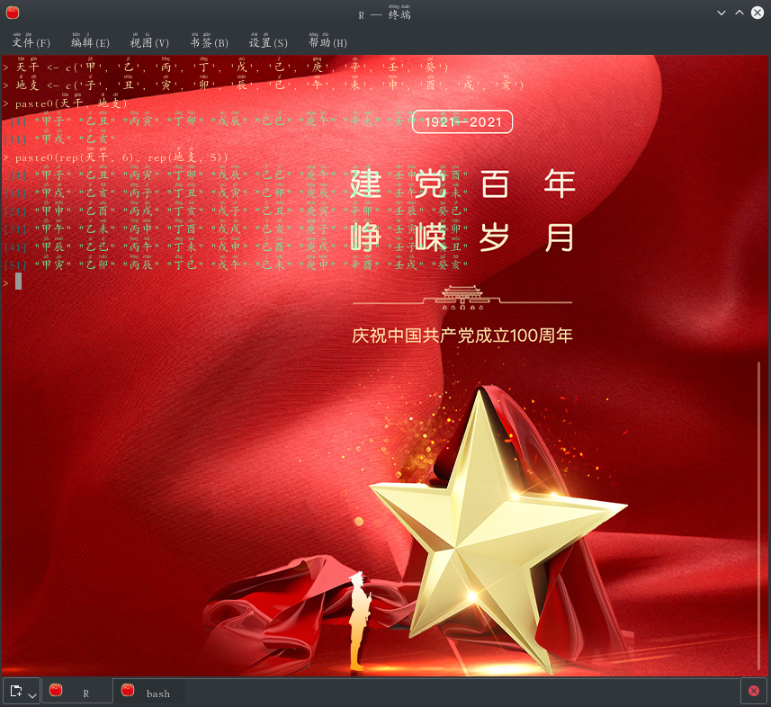{width=400}

```{r 天干地支, error=TRUE}
## 辑写此篇论文的时间二零二四年为甲辰年
## 从公元前七七零年到公元前二二一年，由于公元第一年为元年，故此扣除元年前的零年。
## 2024 - (-770) - 1 = 2793
## 2024 - (-221) - 1 = 2244

if (!exists('天干')) 天干 <- c('甲', '乙', '丙', '丁', '戊', '己', '庾', '辛', '壬', '癸')
if (!exists('地支')) 地支 <- c('子', '丑', '寅', '卯', '辰', '巳', '午', '未', '申', '酉', '戌', '亥')
if (!exists('干支')) 干支 <- paste0(rep(天干, 6), rep(地支, 5))
干支 |> 
  matrix(nrow = 12, dimnames = list(
    地支, paste0(天干[1:5], 天干[6:10])))
cat('\n**天干**：', 天干, '\n**地支**：', 地支, '\n\n**干支**：', 干支, '\n')
```

借鉴[金融衍生 - 筛选日内高频量化交易统计模型 （第III部）](https://englianhu.github.io/民国一百一十三年（甲辰年）/杏月/binary-Q1Inter-HFT-RV3.html)以天文学公转周期与自转周期的概念，将半个时辰为一个公转干支甲子年（圆进制分钟）、一分钟为为另一个自转干支甲子年（圆进制秒钟），也就是一公转等于二次元甲子年（三千六百秒钟），不过日期还是阳历。

#### 公历农历对照

```{bash}
# https://forum.posit.co/t/error-when-saving-a-table-using-gt-gtsave/147141/2
if test -f /home/englianhu/google-chrome-stable_current_amd64.deb; then
  wget https://dl.google.com/linux/direct/google-chrome-stable_current_amd64.deb
  sudo apt -y install ./google-chrome-stable_current_amd64.deb
fi
google-chrome --version
```

```{r 公历农历对照甲, eval=FALSE, error=TRUE}
## 下载谷歌浏览器
# system('wget https://dl.google.com/linux/direct/google-chrome-stable_current_amd64.deb')

## 安装谷歌浏览器
# system('sudo apt -y install ./google-chrome-stable_current_amd64.deb')

## Check successful installation by checking the version of Google Chrome
# system('google-chrome --version')

# 链 <- 'https://ytliu0.github.io/ChineseCalendar/index_simp.html'
# 二零二四年 <- 链 |> 
#   read_html_live() |> 
#   html_elements('table') |> 
#     html_table()

library(rvest)
library(httr)

startDate <- as.Date("2020-06-01")
endDate <- Sys.Date() #today

椠 <- html_session(链)

年历 <- 椠 %>% 
    html_nodes("div[calendar]") %>%
    html_attr("calendar")

header <- 椠 %>% 
  html_nodes(".instrumentHeader h2") %>% 
  html_text()

resp <- 椠 %>% 
  rvest:::request_POST(
    'https://www.investing.com/instruments/HistoricalDataAjax',
    add_headers('X-Requested-With'= 'XMLHttpRequest'),
    user_agent(userAgent),
    body = list(
        curr_id = pair_ids,
        header = header[[1]],
        st_date = format(startDate, format='%m/%d/%Y'),
        end_date = format(endDate, format='%m/%d/%Y'),
        interval_sec = 'Daily',
        sort_col = 'date',
        sort_ord = 'DESC',
        action = 'historical_data'), 
    encode = 'form') %>%
    html_table

print(resp[[1]])

# install_phantomjs()
# run_phantomjs()
# 遥控驱动器 <- remoteDriver(browserName = 'chrome')
# 遥控驱动器$open()

## https://stackoverflow.com/questions/64298886/rvest-webscraping-in-r-with-form-inputs
用户代理 <- "Mozilla/5.0 (X11; Linux x86_64) AppleWebKit/537.36 (KHTML, like Gecko) Chrome/83.0.4103.97 Safari/537.36"
链 |> 
  html_session()
链 |> 
    html_session() |> 
    html_nodes(xpath = '//*[@id="year"]')

查询 <- list(
    type = 'number', 
    id = 'year', 
    step = '1', 
    min = '-721', 
    max = '2200')
POST(链, body = 查询, encode = 'form')
```

```{r 公历农历对照乙, error=TRUE}
## 廖育棟
链 <- c('https://ytliu0.github.io/ChineseCalendar/index_c.js', 'https://ytliu0.github.io/ChineseCalendar/Julian_c.js')

椠 <- 链[1] %>% 
  GET %>% 
  content('text', encoding = 'utf8')

椠 <- 链[1] %>% 
  read_html()

数据甲 <- 椠 %>% 
  html_text() %>% 
  strsplit(., split = '\\{|\\\"|\\}') %>% 
  .[[1]]

公曆年 <- grep('公曆年', 数据甲)
# 数据甲[grep('公曆年', 数据甲)]
# 数据甲[公曆年[1]:公曆年[2]]
# 数据甲[公曆年[1]:公曆年[2]][1001:length(数据甲[公曆年[1]:公曆年[2]])]
# 数据甲[公曆年[2]:length(数据甲)]

```

```{r 公历农历对照丙, error=TRUE}
## 廖育棟
if (!file.exists('诸子百家学府/index_c.js')) download.file('https://raw.githubusercontent.com/ytliu0/ChineseCalendar/refs/heads/master/index_c.js', '诸子百家学府/index_c.js')

if (!file.exists('诸子百家学府/Julian_c.js')) download.file('https://raw.githubusercontent.com/ytliu0/ChineseCalendar/refs/heads/master/Julian_c.js', '诸子百家学府/Julian_c.js')

## Using NPM packages in V8
# https://cran.r-project.org/web/packages/V8/vignettes/npm.html#what_is_v8_(not)
公历系列 <- v8()
公历系列$source('诸子百家学府/index_c.js')
公历系列$get(JS('Object.keys(global)')) %>% sort()
公历表 <- 公历系列$call('calendar', 'calendar(e=-721,t=1)', list(bare = TRUE))

儒略历系列 <- v8()
儒略历系列$source('诸子百家学府/Julian_c.js')
儒略历系列$get(JS('Object.keys(global)')) %>% sort()
儒略历表 <- 儒略历系列$call('init', 'square = (x) -> x * x', list(bare = TRUE))

公历表系列 <- v8()
公历表系列$source('诸子百家学府/table_c.js')
公历表系列$get(JS('Object.keys(global)')) %>% sort()
公历表 <- 公历表系列$call('ancient_calendar_menu', 'square = (x) -> x * x', list(bare = TRUE))

# ctx$eval(jscode)
# ctx$call('square', 9)

```

借鉴秦国一统天下后才焚经坑儒（在借鉴商鞅变法、美国独立战争史、戊戌变法、黄埔军校、辛亥革命都是种族灭绝那些世袭制可兰经法家回教徒，咱们学术份子才能茁壮发展），咱们现实生活中的百姓与家眷亲属都只是顾好各自家眷亲属和学业学术士农工商而已，详情请查阅[岂曰无衣，与子同袍](#岂曰无衣，与子同袍)。在超过八国联军（东亚、欧美大洋洲）故意篡改谷歌搜索条件的因素之下，谷歌搜索引擎搜索到爪哇脚本和春秋战国时期的天文历法，奈何[「猫城个人记事本随笔」廖育棟：公历和农历日期对照（公元前七二二年——公元二二零零年）](https://ytliu0.github.io/ChineseCalendar/index_simp.html)中春秋战国时期的历法只有儒家孔子的鲁国历法，就顺势善用咱们海外华人公会陈祯禄公爵与邱德拔公爵（由于受到大英帝国时期受封的公爵是合法正规的爵位：

- 英系学术造诣与科技目前几乎垄断全球。
- 英系北美和大洋洲两大洲。
- 中国孔子学院遍布全球。
- 类似中华民国以中文为主，英文为辅。
- 铲除所有东南亚世袭制可兰经法家回教徒的习俗文化宗教语言法律。
- 类似英国基督教十字红军国，不过建立公元前春秋战国复兴君主制秦文儒家政权。
- 复兴春秋战国时期的习俗文化宗教语言法律法则，包括堂号、建筑、穿着、美食、士农工商、与金融、娱乐圈等。

所以能用则用，不然就靠拢东亚另起茅庐再联盟或建立民兵引入东亚攻占领土，歼灭东南亚所有违反可兰经回教刑事法典断肢法的回教匕首非法世袭制可兰经法家回教徒巫贼巫婆宦官民族。

- [「猫城个人记事本随笔」廖育棟：公历和农历日期对照（公元前七二二年——公元二二零零年）](https://ytliu0.github.io/ChineseCalendar/index_simp.html)
- [「猫城」公历和农历日期对照（公元前七二二年——公元二二零零年）](https://github.com/ytliu0/ChineseCalendar)
- [中国古典文献资源导航系统](https://www.wenxianxue.cn/daohang/625.html)历法计算。


[欢迎使用飞跃圆三工具箱](https://fly63.com/)（有关源代码，请查阅[「猫城」飞跃圆三工具箱](https://github.com/englianhu/fly63)）。

有关时间轴数据，可查阅：

- [「飞跃圆三工具箱」历史上的今天](https://fly63.com/php/todayHistory/)
- [「噗」赢家黄氏江夏堂，联富（雷欧）](https://www.plurk.com/englianhu)网站的时间轴。

#### 北斗卫星

- [「中科院」中国科学院紫金山天文台](http://www.pmo.cas.cn/xwdt2019/kpdt2019/202203/t20220317_6399980.html)
- [「淘宝」北斗卫星授时万年历（共找到一百件商品）](https://www.taobao.com/list/product/北斗卫星授时万年历.htm)
- [中国卫星导航系统管理办公室测试评估研究中心](https://www.csno-tarc.cn/announcement/notice20240004)

### 计数分布


<br>

# 计数造物

## 概括

<iframe width="400" height="225" src="https://youtube.com/embed/lNP6aJF-mfI" title="「数学课」时间单位" frameborder="0" allow="accelerometer; autoplay; clipboard-write; encrypted-media; gyroscope; picture-in-picture; web-share" allowfullscreen></iframe>

*出处：[「数学课」时间单位](https://youtu.be/lNP6aJF-mfI)*

> | 古人时间 | 年（时间计量单位） |
> |:--------:|:------------------:|
> |   一岁   |               一年 |
> |   一旬^[一、十天叫一旬，一个月分上、中、下三旬。<br>二、十岁也叫一旬。] |  十年 |
> |   一记   |             十二年 |
> |   一代   |             廿五年 |
> |   一世   |               卅年 |
> |   一甲子 |               圆年 |
> |   一世纪 |             一百年 |
> |   一运   |           三百圆年 |
> |   一会   |       一万零八百年 |
> |   一元   |   十二万九千六百年 |
> 
> <iframe width="400" height="225" src="https://youtube.com/embed/CZMVGJpFVmM" title="道家年份的计量单位" frameborder="0" allow="accelerometer; autoplay; clipboard-write; encrypted-media; gyroscope; picture-in-picture; web-share" referrerpolicy="strict-origin-when-cross-origin" allowfullscreen></iframe>

*出处：[「油管」道家年份的计量单位](https://youtube.com/shorts/CZMVGJpFVmM)*

借鉴以上以“年”为计量单位，就谈及秦史「蕲年宫之变」与春节放鞭炮赶走凶残的年兽的”年“。关于“年”的传说有很多版本，其中一个广为流传的故事是关于一种名为“年”的怪兽。传说中，”年”是一种头长触角、凶猛异常的怪兽，每到除夕便会出来伤人。为了驱赶“年”兽，人们采取了各种方法，如放鞭炮、挂红灯笼等，这些习俗逐渐演变成了春节的庆祝活动。

借鉴[「鄀客栈」Lottery 3D Analysis 彩票分析](https://rpubs.com/englianhu/lottery-3D-analysis)中提及赌庄在开彩概率上占有百分之枯二点七的优势，欲以凯利投注模式获利，估计得花上百万年时间。借鉴黄道吉日与「对酒当歌，人生几何？譬如朝露，去日苦多。」，所以得学习计数编程统筹法（环境与系统工程学），也就是咱们道家和民间习俗所说的“风水学”。将周遭所闻所见来实践《万年历》与《广经堂》中彩票辞典的陈腔滥调。科研三位数千字彩券的关系系数如下：

- [「猫城」在彩票走势图上直接图示分析预测彩票号码的方法（甲）](https://github.com/englianhu/lottery/blob/世博量化研究院/图书馆/在彩票走势图上直接图示分析预测彩票号码的方法（甲）.pdf)
- [「猫城」在彩票走势图上直接图示分析预测彩票号码的方法（乙）](https://github.com/englianhu/lottery/blob/世博量化研究院/图书馆/在彩票走势图上直接图示分析预测彩票号码的方法（乙）.pdf)

## 计数尤物

### 广义型尤物

```{r error=TRUE}
海外秦人彩券

# 广经堂尤物 <- glm(as.numeric(彩号) ~ 秦庄 + 彩金 + 史记秦本纪, data = 海外秦人彩券)
# predict(广经堂尤物, n.ahead = 1)

## 广经堂尤物
# gam()
```

- [Using General Linear Modeling on time series data](https://www.fieldtriptoolbox.org/example/glm_timeseries/)
- [Do Time Series Models fall under GLM?](https://stats.stackexchange.com/a/553079/68357)
- [GLM for longitudinal or time-series -- how to model and interpret a binary logistic regression over time controlling for covariates using R](https://stats.stackexchange.com/a/650763/68357)
- [Is it wise to use a Generalized Linear Model (GLM) to investigate trends in abundance over time?](https://stats.stackexchange.com/a/600778/68357)

### `forecast`

```{r error=TRUE}
海外秦人彩券

尤物 <- 海外秦人彩券 %>% 
  data.frame() %>% 
  model(指数平滑 = ETS(log(彩号) ~ error('M') + trend('Ad') + season('A'))) %>% 
  forecast(h = '3 years')

```

- [fabletools](https://fabletools.tidyverts.org/reference/forecast.html)

### `fable`

```{r error=TRUE}

```

<br>

# 尤物比较

<br>

# 结论

## 摘要

**大秦赋**<br>
春秋战国《*礼记•经解*》<br>
孔子曰：「君子慎始，差若毫厘，缪以千里。」

> <span style='color:#FFEBCD; background-color:#991B00;'>**《礼记•经解》孔子曰：**</span><span style='color:#DimGrey; background-color:#D52600;'>*「君子慎始，差若毫厘，谬以千里。」*</span>[^13]

*引用：[「快懂百科」《礼记•经解》](https://www.baike.com/wikiid/2225522569881832051)和[第一范文网：差之毫厘，谬以千里的故事](https://www.diyifanwen.com/chengyu/liuziyishangchengyugushi/2010051523105152347092749890.htm)和[「百度百科」春秋时期孔子作品《礼记•经解》](https://baike.baidu.com/item/礼记∙经解/2523092)和[「當代中國」差之毫釐，謬以千里](https://www.ourchinastory.com/zh/2962/差之毫釐%20謬以千里)*

[^13]: [HTML Color Codes](https://html-color.codes)

**赤印度人酋长宗教司甘地/土司乩童世袭制法家刘氏彭城堂乌骨精瑾貹**

{width=400}

{width=400}

{width=400}

{width=400}

{width=400}

{width=400}

> #回教徒爱国就严格遵守回教徒可兰经法家国学论集体自杀而不爱国就集体退位让贤而已 #美国耶稣洋番集体被钉在十字架被晒死
> 回教徒可兰经法家国学论，东南亚巫贼巫婆回教徒尤其是瓜雪巴西不能帮万佛寺土司张佳坤爱国虔诚狂热份子和大象共和国举国公民马航三七零和马航十七自杀式飞往东亚

*引用：[勇于认错的美国洋番回教徒九一一恐怖份子国父华盛顿自杀式伐木都说东亚中国（包括咱们海内外所有华人）不是洋番的敌人，而敌人是东南亚所有巫贼巫婆回教徒包括新加坡首任总统忧索夫殡伊斯骇客回教徒九一一恐怖份子](https://youtu.be/5LL8V2a_xp0)*

> 核武器温馨提示：回教徒可兰经法家国学论，可兰经回教规定全球所有回教徒世袭制不许学可兰经以外的习俗文化宗教语言断肢法和不许叛乱和叛教

*引用：[斩首、石刑、截肢…阿富汗“伊斯兰教法”或将重现酷刑](https://www.163.com/dy/article/HM881SKU0511RVG1.html)*

## 前瞻科研

### 道家秦人牧马《商君书》

#### 🌟秦人牧马之《商君书》与《吕氏春秋》

{width=400}

{width=400}

{width=400}

**人无远虑，必有近忧**

{width=400}

{width=400}

可兰经回教刑事法典习俗文化宗教语言断肢法，都是所有世袭制可兰经回教徒累赘民族的性命！

世袭制道教徒赢家黄氏江夏堂：力争上游，不胜则败；功勋超过历代所有三黄五帝，史称「始祖」。
世袭制道教徒杏林林氏西河堂：在天比翼鸟，在地愿做连理枝。

《商君书》和《吕氏春秋》的基本概念是先使用现有资源R鄀计数/机数编程语言，因为要研发咱们世袭制道家十二生肖秦人黄河文明/黄埔军校/黄种人🎶/赢家黄氏江夏堂「对数算筹」或「算筹」电子仪器与文言文计数/机数编程「大秦赋」或「世袭制道家文言文大秦赋」操作系统还需要下苦功需要许多时间，再审查并收录R鄀计数/机数编程语言软件和软件包和所有礼逆袭软件包。「算卦」或「算卜」是咱们道家民间预测未来或命运的方法，以量化计数/机数轮回（俗称“回测”）、分析并占卜（俗称“预测”）各行各业，尤其是发展咱们杏林业。

<iframe width="400" height="225" src="https://www.youtube.com/embed/y5KTlMhh260" title="读《埃隆∙马斯克传》：硅谷“钢铁侠”，科学家如何转身成为世界首富？" frameborder="0" allow="accelerometer; autoplay; clipboard-write; encrypted-media; gyroscope; picture-in-picture; web-share" referrerpolicy="strict-origin-when-cross-origin" allowfullscreen></iframe>

*[「油管」读《埃隆∙马斯克传》：硅谷“钢铁侠”，科学家如何转身成为世界首富？](https://www.youtube.com/embed/y5KTlMhh260)*

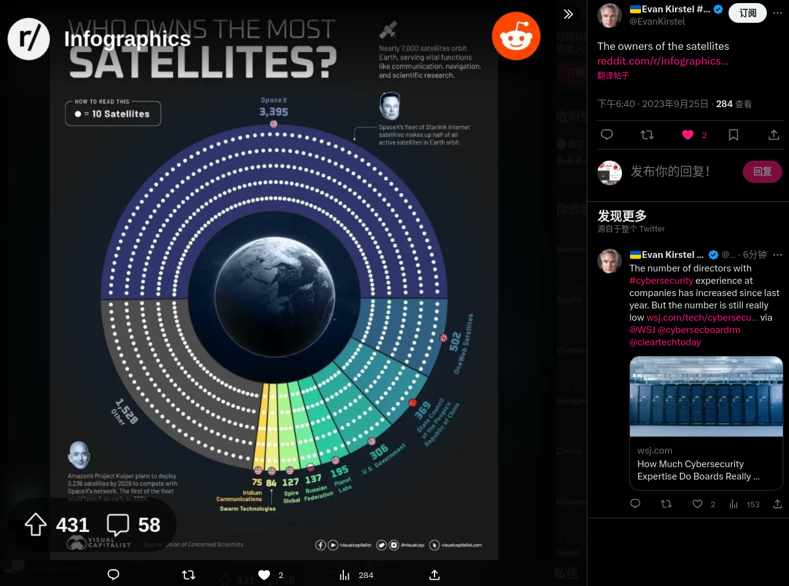{width=400}

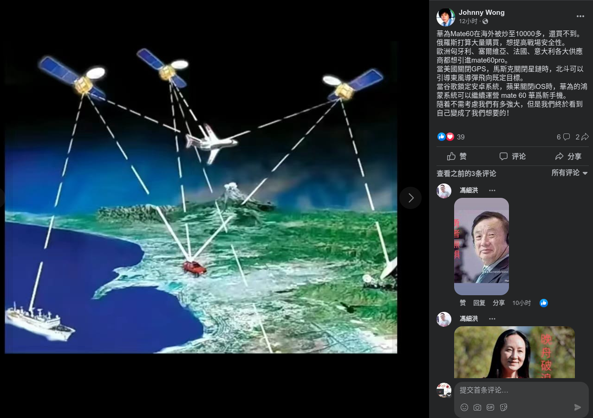{width=400}

- [<span style='color:#DE5D83; background-color:black;'>金融衍生</span> - 筛选日内高频量化交易计数尤物 <span style='color:#4E79A7'>第三部∙乙（西周之末：春秋战国——总结平滑指数尤物）</span>](https://englianhu.github.io/民国一百一十三年（甲辰年）/寒月/binary-Q1Inter-HFT-RV3E.html)
- [<span style='color:#DE5D83; background-color:black;'>金融衍生</span> - 筛选日内高频量化交易计数尤物 <span style='color:#4E79A7'>（**「丁」世袭制道教徒赢家黄氏江夏堂十二生肖秦人牧马：🌟儒家秦孝公清君侧之商鞅变法**）</span>](https://englianhu.github.io/民国一百一十三年（甲辰年）/麦月/binary-Q1Inter-HFT-RV4.html)

有关自回归计数|机数尤物相关文献，可查阅：

- [「栈滥」[^13]Forecasting ARIMA with `xreg`](https://stackoverflow.com/a/35637688/3806250)*使用`Arima(xreg=fourier(K=...), ...)`来协调外来因素，找出最优规律。
- [解密复兴科技 - 基于隐蔽马尔科夫模型的时序分析方法](https://github.com/englianhu/binary.com-interview-question/blob/世博量化研究院/图书馆/解密复兴科技%20-%20基于隐蔽马尔科夫模型的时序分析方法.pdf)

欲知更多咱们世袭制道家十二生肖秦人从满洲到星洲世袭制道教徒黄种人辛亥革命/黄河文明/黄埔军校《商君书》、《吕氏春秋》和《李斯篆书》系列科研，请查阅：
- [「猫城」黄联富（®γσ ξηg 雷欧）/🚩🇨🇳🏹红旗礼逆袭](https://github.com/englianhu/RedFlag-Linux)
- [「猫城」黄联富（®γσ ξηg 雷欧）/《始祖永春•秦谏——大秦赋》](https://github.com/englianhu/library)
- [「猫城」黄联富（®γσ ξηg 雷欧）/次元期权（binary.com）](https://github.com/englianhu/binary.com-interview-question)

[^13]: >**文献与案例**<br><br>基本概念<br><br>>- 泛型栈（Stack）<br>>      - 栈是一种后进先出（LIFO, Last In First Out）的数据结构。栈中最后添加的元素最先被移除。可以把栈想象成一叠盘子，最后放上去的盘子最先被拿走。<br>>- 泛型队列（Queue）<br>>      - 队列是一种先进先出（FIFO, First In First Out）的数据结构。队列中第一个添加的元素最先被移除。可以把队列想象成排队买票，最先排队的人最先买到票。<br><br>*出处：[泛型栈（Stack）和泛型队列（Queue）](https://www.loserme.com/archives/2dBCW0Zp)*<br><br>根据以上「泛型栈」诠释为毫无节制、刻舟求剑、海底捞月、治标不治本，可译为「栈滥」最为恰当，借鉴苹果公司一条龙服务产品、孙玉芳教授之名言和愚生目前自修并科研咱们世袭制道教自然对数大秦赋算筹，那些使用它人产品或没有釜底抽薪，一劳永逸的门面功夫。<br><br>- 方案一：栈滥<br>- 方案二：栈涝<br>- 方案三：栈氾<br>- 方案四：栈涔<br><br>*出处：[「猫城」`stackoverflow`该译名啥？#七](https://github.com/scibrokes/owner/issues/7)*

#### 杏林经济学

- 道家易经、天文历法、十二生肖、廿四节气、张灯结彩、七门遁甲算卜物理学隐身术、挥春联与书法八卦刺绣密码学、算卜、兵马俑、三界、道家产品与杏林工业、神经网络、物理学、杏林算卜运筹学、杏林算卜统筹法、洲际军事埋伏四面楚歌。
- 杏林务农、杏林农产品、杏林算卜运筹学、杏林算卜统筹法、杏林算卜金融、算卜保险业与殡仪馆兵马俑旅游业、杏林算卜医学与保健和广告娱乐圈。
- 杏林务农、杏林算卜金融商品市场、算卜、杏林算卜运筹学、杏林算卜统筹法、杏林经济学。
- 奉常、多元种族、宗教与户籍管理。
- 道家杏林服饰经济学：道家服饰刺绣密码学（借鉴纺织品与世界电脑发明史）、中华五千年复古（借鉴孙文/孙中山/孙逸仙靠服饰习俗文化宗教、发型与司法、文字习俗文化宗教语言世纪大革命）复古之道、服饰道家杏林娱乐圈与广告。
- 借鉴苹果、视窗、谷歌、元宇宙、特斯拉、spaceX、推特等美国硅谷传奇和孙玉芳名言：”中国不能没有自己的操作系统。“，研发咱们世袭制道家十二生肖秦人黄河文明/黄埔军校/黄种人🎶/赢家黄氏江夏堂「对数算筹」或「算筹」电子仪器与「大秦赋」或「世袭制道家文言文大秦赋」操作系统。
- 算卜计量经济学、税务与贸易。
- 「奉天承运，皇帝诏曰」春秋战国/东汉末年/清末的MY大汉山马氏政权箫何、韩信和张良（咱们赢家黄氏江夏堂石公之徒，家翁赢政ξηg Tεηg的族人）和厦门大学创办人新籍开国元勋之一陈嘉庾（洋名：Tan Kah Kee），负责以可兰经回教刑事法典断肢法，歼灭巴西不能帮（Kampung Pasir Penampang 中译：沙地刽子手村庄）新村门牌T十五号的土司巫师王乩童佳坤∙殡∙张，瓜雪RHU（淮西派）花园加德士油站隔壁第三巷门牌卅二号世袭制男肛之耻、头戴白色女假发的巫骨精司法界赤印度人酋长国父宗教司甘地/土司乩童巫师王瑾貹∙殡敌∙刘（世袭制法家刘氏彭城堂变性男同性恋者奴辱依杀）/蔡氏的世袭制自残自虐自杀的男宠刘瑾貹/世袭制自残自虐自杀的巫师王爱新觉罗∙溥仪。
- 咱们世袭制道家十二生肖秦人从满洲到星洲世袭制道教徒黄种人辛亥革命/黄河文明/黄埔军校，功勋超过历代三黄五帝，史称「秦始皇」——赢政 ξηg Tεηg。

](诸子百家考工记/量化投资与机器学习.png){width=400}

> #春秋战国 #七大洲五大洋 #诸子百家 #鬼谷传奇 #黄河文明 #黄埔军校 #世袭制道教徒黄种人十二生肖赢家黄氏江夏堂秦人牧马 #辛亥革命的国民华小 #海外华人公会 #中国国防部 #国民军 #红军 #中国航天局 #歼灭菲律宾柬埔寨卡款铲单黑帮邪教Judi博彩庄家和亚洲所有非法回教徒 #易经算卜运筹学统筹法 #科学科技 #高频量化交易对冲基金 #中国河南省淇县云梦山易经大学 #北京大学 #中科红旗 #世博量化研究所 #拯救亚洲人 #华服运动 #汉服运动 #华夏同盟会 #易经 #慈济 #佛堂 #道学 #道家李耳 #秦人Chinese
「赢家黄氏江夏堂，世博量化——大秦赋」
> 
> 基本要求：
> 
> - 必须是咱们世袭制道教徒十二生肖海内外秦人、姓氏堂号子嗣贞节牌坊。禁止任何外教、尤其是禁止任何世袭制可兰经法家回教徒和峇峇娘惹和任何兴都教徒与回教徒习俗文化宗教语言断肢法。
> - 禁止任何世袭制可兰经法家回教徒，尤其是那些巫贼巫婆宦官民族和世袭制吠陀经大宝森节与屠妖节。
> - 禁止任何暴力份子、窥听窥视、失心疯猥亵淫魔与残忍屠夫、具有攻击性的任何生物。
> - 禁止任何回教徒政府政客、回教徒政府公仆与回教徒政府政客或回教徒公仆的家眷亲属。
> - 禁止瓜雪RHU（淮西派）花园加德士油站隔壁第三巷门牌卅二号土司乩童白骨精刘瑾貹和瓜雪巴西不能帮新村门牌T十五号土司乩童张佳坤。
> - 精通国际标准中文北京话，写、说、听。
> - 熟悉与热爱咱们世袭制道教徒的祖国中国五千多年历史习俗文化宗教语言与朝代更迭变迁。
> - 至少举人造诣或以上。夫子、举人、好学、学术作品与科技产品。
> - 身穿咱们世袭制道教徒十二生肖秦人牧马的秦服。
> 
> 学术要求：
> 
> - 精通高级中文（语言学）、文言文、计数|机数编程、道教、易经、算卜、天文历法、紫微斗数、十二生辰、十二生肖、生辰八字、风水、廿四节气、九宫格、天干地支、纪年法、四书五经六艺国学论、杏林业（大夫看诊、科研与栽种中药农产品与金融商品）、山海经、茅山道术与物理学。
> - 精通春秋战国史、左氏春秋、战国策、孙子兵法、兵法三篇、兵法廿四篇、通鉴知治、三字经、弟子规、中国通史与世界通史、中国经济通史与世界经济通史、中国习俗文化通史与世界习俗文化通史、中国服饰通史与世界服饰通史、中国宗教通史与世界宗教通史、中国建筑通史与世界建筑通史、近代史。
> - 精通礼逆袭操作系统和磁盘操作系统。
> - 精通神经网络计数|机数造物（打造尤物），例如长短记忆尤物、隐马尔科夫链、波浪型计数|机数尤物等等计数|机数尤物、统筹法、环境与系统工程学。
> - 精通量化（海量数据）、连接、採撷、储存、备份、读取实时数据
> - 精通量化（海量数据）管理、筹算、分析、回测与占卜。
> - 精通量化圈、金融市场（商品市场、外汇市场、包括计数|机数造物）。
> - 精通计量经济学、高频量化对冲基金、风险投资管理、高频量化交易、高频量化交易平台软硬件配置编程、统计建模。
> - 精通开发操作系统、电子仪器与通信（包括密码学、文言文、吟诗作对、对联与挥春联）、计数|机数编程应用，并且熟悉天下霸主五百强，例如：特斯拉、spaceX、亚马逊、神经网络链、谷歌、苹果、微软、文艺复兴科技、桥水、城堡投资、阿里巴巴、腾讯、礼逆袭产品与管理与行业资讯。
> - 古代与现代兵法（军事学）、工程学、航天局。
> - 礼逆袭与磁盘操作系统、鄀计数|机数、曦与曦佳佳、超文本标记语言、切实使用可扩展标记语言、层叠样式表与爪哇校本、红宝石等编程语言。
> - 有高频量化对冲、量子电脑计数|机数编程、经验者甚佳。

*出处：[「元宇宙」赢家黄氏江夏堂，世博量化——大秦赋](https://www.facebook.com/scibrokes/posts/pfbid023QpGWVuVbR6hCNo7dCLPkLBUxoGK5smSocGxXg4m1poLV71MX6wGeEEttyDcuWNCl)*

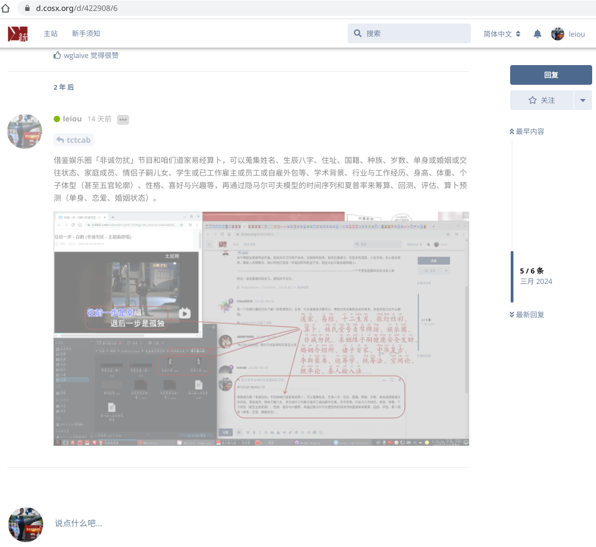{width=400}

{width=400}

> #春秋战国 #诸子百家 #算筹 #十二生肖 #科学数学博弈概率论 #中华复兴运动 #中华五千年习俗文化宗教语言法规 #万般皆下品唯有读书高 #中华国卒 #咱们中华民族和越族世袭制道教徒姓氏堂号烧香祭祖张灯结彩题字春联中医中华庙宇 #公元前只有农历和国际标准中文北京话没有阳历洋番 #全球洋番都是祖籍以色列或住森林山洞的泰山 #世袭制道教徒法家商鞅以商君书奠定一统天下之道 #世袭制道教徒吕不韦以吕氏春秋的务农金融股票商品市场和娱乐圈来一统天下 #世袭制道教徒法家李斯以中华庙宇习俗文化宗教语言法规和各集团组织理事治天下来一统天下 #关雎 #求贤令 #礼贤馆 #秦 #马华公会借鉴越南国旗和欧盟以一颗夜空中最亮的星来立国🌟
> 
> 🚩世袭制道教徒秦国（秦孝公/陈祯禄公爵至始祖赢政）三杰治天下：商鞅（卫人仕秦）、吕不韦（卫人仕秦）、李斯（楚人仕秦）。
一）借鉴王安、斯蒂芬∙乔不死和比尔∙盖茨研发个人电脑与编程，李斯改变世界治天下。
二）借鉴专业酉逆袭操作系统鄀计数学（R计数学编程）编程软件，商鞅变法，以民族主义数学科学科技学术治天下。
三）借鉴高频量化对冲基金席卷全球，贾人吕不韦之吕氏春秋学术、娱乐圈、地产、农牧、工商金融、博彩业、高频量化对冲基金等治天下。
> 
> 🚩帝道「始祖」：借鉴秦孝公至秦始皇史（借鉴秦人牧马与商鞅变法论，歼灭领土上所有回教徒），以明治维新将西方学术数学科学科技（例如苹果、微软、谷歌、文艺复兴科技、白鲨黑社会、桥水、亚马逊、特斯拉、spaceX、星链）转为咱们中华习俗文化，再自家研发咱们世袭制道教徒中华民族习俗文化宗教语言操作系统与电子仪器，世袭制道教徒法家李斯国学论以学术数学科学科技治天下（研发咱们中系「大秦赋」电脑操作系统与电子仪器以道家习俗文化宗教语言法规、高频量化对冲与大数定律学术、李斯篆书之文言文编程、阅读脑电波，来改变世界格局来一统天下，各民族遵守各自民族习俗文化宗教语言法规，直到歼灭东南亚领土上所有回教徒）、世袭制道教徒商鞅变法（商君书，开阡陌废井田、加上三农政策士农工商，以中药和中医取代天下所有🇲🇻🇨🇭🌙✝️西医。各民族遵守各自民族习俗文化宗教语言法规）、世袭制道教徒吕不韦之吕氏春秋，以中华娱乐圈取代西方娱乐圈、中药和中医取代天下所有🇲🇻🇨🇭🌙✝️西医，与世袭制道教徒马华公会民族主义论，以商治天下，一劳永逸。
> 
> 🚩王道「MY大汉山 - 三国志/朱重八起义/孙文」：借鉴中华民国辛亥革命史，以习俗文化使用西方学术数学科学科技辛亥革命、草船借箭与孔明借东风论歼灭东南亚领土上所有清真教徒，偏于一方成为众诸侯之一。「高筑墙，广积粮，缓称王」后再励志图强。
> 
> 🚩霸道「MY大汉山 - 西楚霸王」：借鉴古巴比伦与犹太人、土司乩童张佳坤和土司乩童白骨精刘瑾貹倆和马来貘、蓄短胡子的清真教徒马来西亚国父东姑阿都拉曼或希特勒（反佛教徒卍的清真教徒敦姑阿杜拉满卐）戊戌变法论，以可兰经清真习俗文化断肢法对待各种族暴政歼灭东南亚领土上所有回教徒治天下，昙花一现。（目前马来西亚举国都插上西亚清真教国的巴勒斯坦国旗天天被轰炸天灾不断，清真教徒政权的亡国之道。咱们祖籍中国的华侨和越族都不要当任何清真教徒的替死鬼）

### 道家秦人崛起

<iframe width="400" height="225" src="//player.bilibili.com/player.html?bvid=BV1ft4y1779g" title="「β站」你知道中国十五大国粹都有哪些吗？甚至有些连名字你都叫不上来" frameborder="0" allow="accelerometer; autoplay; clipboard-write; encrypted-media; gyroscope; picture-in-picture; web-share" referrerpolicy="strict-origin-when-cross-origin" allowfullscreen></iframe>

*引用：[「β站」你知道中国十五大国粹都有哪些吗？甚至有些连名字你都叫不上来](https://www.bilibili.com/video/BV1ft4y1779g)*

借鉴世界<ruby>蹴<rp>(</rp><rt>cù</rt><rp>)</rp>鞠<rp>(</rp><rt>jū</rt><rp>)</rp></ruby>联赛，国卒都可以发展为竞技联赛，衍生为博弈数学概率论行业。

- 学术科学科技与兵法（学术界、科技业、网游、借鉴「三国志」「春秋战国」「太阁立志传」治天下）
- 中国象棋（中华习俗文化、学术、广告与娱乐圈）
- 麻将（中华习俗文化、学术、广告与娱乐圈）
- 围棋（中华习俗文化、学术、广告与娱乐圈）
- 中华武术、中华京剧、歌曲与舞蹈（中华习俗文化、学术、广告与娱乐圈）
- 中华寺庙与中药/中医（姓氏堂号、生辰八字卜卦、天文历法、学术概率论物理学、医学保健与保险业、农业与工业、陵墓、道家易经、学术物理学、兵法、广告与娱乐圈）
- 四书五经六艺（琴棋书画、学艺、书艺、阅艺、茶艺、酒艺、武艺、棋艺、歌艺、琴艺、口艺、才艺、演艺、舞艺、花艺、田艺、农艺、工艺、手艺、技艺、图艺、字艺、篆艺、画艺、厨艺、商艺、书法、文艺、公艺、史艺、仕艺、功艺、冶艺、锔艺、诊艺、观艺、道艺、墨艺、易艺、中华习俗文化、学术、广告与娱乐圈）
- 吟诗作对（中华习俗文化、学术、广告与娱乐圈）
- 中华影城（中华复兴革命、道家易经、学术物理学、兵法、广告与娱乐圈）

### 道家秦国文臣三杰

*](诸子百家考工记/秦国文臣三杰.png){width=400}

「大秦赋 - 借鉴黄河文明史」<br>
秦国三杰，拯救亚洲；<br>
歼灭印裔，取代美国。<br>
秦灭六洲，一统天下；<br>
莫忘初衷，方得始终。

- **商鞅**：改变天下学术（包括复古中国算筹）、杏林、保险与司法界，取代天下所有西方文化科学科技医学司法；习俗文化宗教语言杏林务农法律等世纪大革命，一劳永逸。
- **吕不韦**：改变天下学术尤其是高频量化对冲运筹学（包括复古中国算筹）、高频量化对冲、金融与务农中药中医杏林、娱乐圈（包括复古中国古代习俗文化宗教语言）、广告与产品代言；习俗文化宗教语言等世纪大革命，一劳永逸。
- **李斯**：改变天下学术尤其是文学（文言文、古文、中国历史习俗文化宗教语言等），研发咱们中华秦国操作系统、电子仪器、科技软件、科技产品来取代天下所有西方电子产品与习俗文化宗教语言等；以电子仪器与操作系统记载并进化所有习俗文化宗教语言法律等世纪大革命并且直到一统天下，一劳永逸。

```{r 选项设置, echo=FALSE, error=TRUE}
## Set options back to original options
options(warn = 0)
```

<br>

# 附录

## 幕后花絮

### 搜索资源>>黄历

而此科研论文则加入黄历元素，比方说生肖年、干支年月日、五行年月日、宜忌、一些黄历元素、星宿、节气、儒略日、回历、冲煞等，由于春节当天才是咱们农历新年，而[便民查询网>>万年日历查询](https://wannianrili.bmcx.com/2024-10-30__wannianrili/)中的农历新年并非从每一年的春节当天计算起，故此数据来源有误。咱们正确的道家农历日期可查阅[「中華民國」農業部版權所有>>月曆小工具](https://ppg.naif.org.tw/naif/MarketInformation/Other/Calendar_V3.aspx)，不过缺少咱们黄埔军校黄种人的黄历。

```{r 问黄历, eval=FALSE, error=TRUE}
source('函数/问黄历.R')
source('函数/问词典.R')

天下简史 <- readRDS("~/文档/猫城/zhongkehongqi-cangku/诸子百家学府/中国年号通史/天下简史.rds")

阳历日期 <- 海外秦人彩券$开彩日期 %>% 
  unique() %>% 
  str_split('-') %>% 
  llply(., function(迭) paste(as.numeric(迭), collapse = '-')) %>% 
  unlist()

日期 <- seq(from = as.Date('1912-1-1'), to = today(), by = 'day') %>% 
  str_split('-') %>% 
  llply(., function(迭) paste(as.numeric(迭), collapse = '-')) %>% 
  unlist()

## 採撷万年历数据 https://wannianrili.bmcx.com/
## 採撷老黄历数据 https://laohuangli.bmcx.com/
黄道吉日 <- 问黄历(阳历日期, 黄历 = '老黄历')
黄道吉日 <- 问词典(日期)
```

- 如上所述，[「便民查询网」万年日历查询](https://wannianrili.bmcx.com/)中的农历信息有误。
- [「便民查询网」老黄历](https://laohuangli.bmcx.com/)的农历数据虽然无误，但从二零零八年一月开始，并不齐全。
- [「日历四一一」马来西亚黄历](https://www.calendar411.com/my2/huangli/1901/1)与**便民查询网**中的农历信息一样有误。
- [「词典网」周公解梦](https://www.cidianwang.com/zhougongjiemeng/)
- [「词典网」黄道吉日](https://www.cidianwang.com/nongli/)

### 人无远虑，必有近忧

#### 春秋战国——秦国•内忧

##### 操作系统与程序包

**拯救亚洲人，灭绝回教徒。**

秦灭六洲，一统天下；
莫忘初衷，方得始终。

*引用：[🌟秦人牧马之《商君书》](#🌟秦人牧马之《商君书》)*

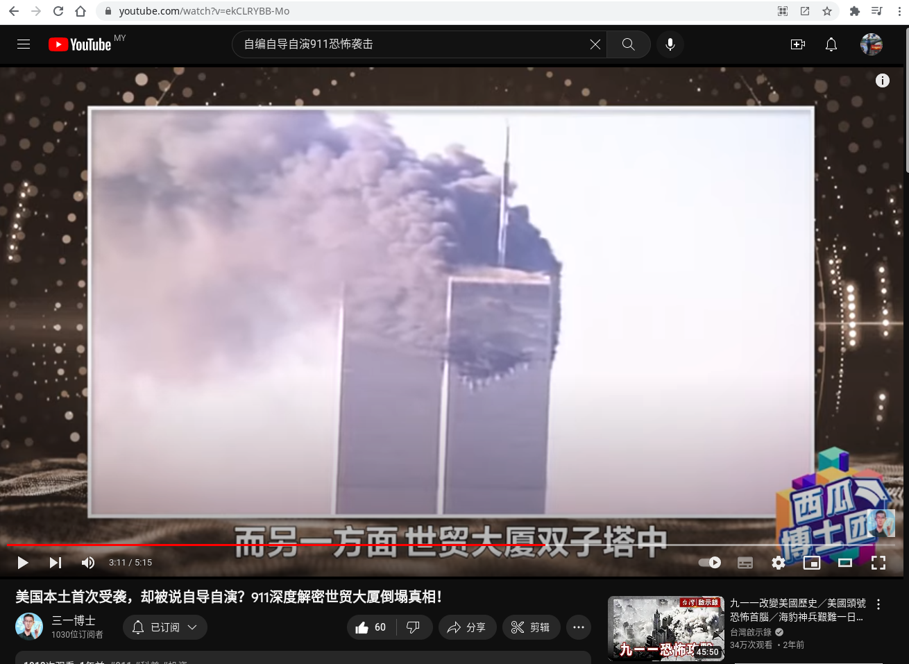{width=400}

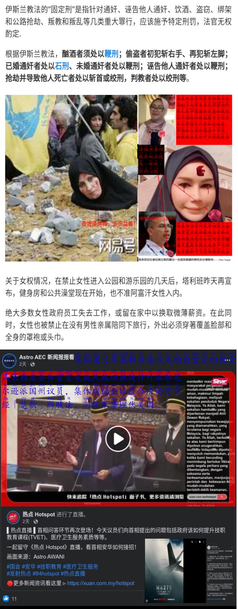{width=400}

- 秦献公
- 秦穆公
- 西戎（西亚）
- 秦孝公
- 国旗/省旗（借鉴缅甸立国国旗以中华民国为标准，十二颗星星和一颗玉蜀黍的概念，欧洲文艺复兴与欧盟以十二颗星星守护神或太阳系原理环绕着，配合咱们道教徒的易经、算卜、道家创始人李耳与千里眼顺风耳和千里传音、天文历法、夜观星象、兵马俑与军用统筹法军事四面埋伏、物理学、大秦赋🌟秦孝公Sir Tan Cheng Lok自然对数进制操作系统、阅读脑电波与穿梭时空、李斯篆书的路线，而咱们以十二时辰——李斯李通古的概念，中间保留海外华人公会🌟最亮的星星而非玉蜀黍）
- 秦国叫China，而咱们世袭制道教徒十二生肖秦人牧马、愚生赢家黄氏江夏堂（包括咱们黄石公，禁止土司乩童巫师王刘瑾貹与张佳坤俩造反）联富亲生爸爸「赢政」（始祖•黄永春（始祖•赢政 ξηg Tεηg））、顾着自己家眷亲属、大秦赋自然对数进制操作系统、🌟秦孝公清君侧之商鞅变法、国歌/省歌的路线，最高权限Root改为秦王。有关秦史请查阅[「抖音百科」秦始皇——赢政](https://www.baike.com/wikiid/7237391048909553699)。
- 国歌/省歌（国歌/省歌的概念是：从蕲年宫之变登基为秦王后，以秦王欲一统天下为主题的国歌/省歌，横扫七大洲五大洋，直到一统天下。）

{width=400}

借鉴《封神榜》与购买彩券万字概念，小万代表凡是只关注榜上三甲（领导或万字图中的头条重大事件）而大万是需要关注榜上三甲（世界一战，二战是德意日仨联盟）与全部理事或管理层，至于没有上榜的咱们百姓个人顾好个人就好。有关详细的大楷小楷、大乔小乔、大篆小篆中的「大小之别」，请查阅咱们道家算卜概率论彩券万字的“大万”与“小万”。

元宇宙网站 https://www.facebook.com/ 网站，添加个`?locale=xx_XX`，小写是代表语言而大写是代表国家，即可查看元宇宙公司幕后通过计数造物、投资组合原理部署出来的所有国家道地信息，范例如下：
- https://www.facebook.com/?locale=en_GB
- https://www.facebook.com/?locale=zh_GB
- https://www.facebook.com/?locale=zh_CN
- https://www.facebook.com/?locale=zh_TW
- https://www.facebook.com/?locale=zh_HK
- https://www.facebook.com/?locale=zh_MY
- https://www.facebook.com/?locale=en_MY

咱们亚洲被大日本帝国和大英帝国殖民时期受封公爵的陈祯禄（在亚洲和欧洲古代君主制国家，公爵比伯爵和侯爵的官职大，比公爵官职高的只有皇室，也就是日本天皇万岁爷和英国国王。先清君侧，再攻占英国，最后才攻占日本），咱们🌟海外华人公会从日本和英国独立后都是根据中华民国的国民学术路线，秦孝公清君侧之商鞅变法，歼灭所有不遵守各自宗教语言习俗文化的非法民族，尤其是世袭制可兰经法家巫贼巫婆回教匕首（Keris判教冒充Christ基督教徒）非法回教徒！

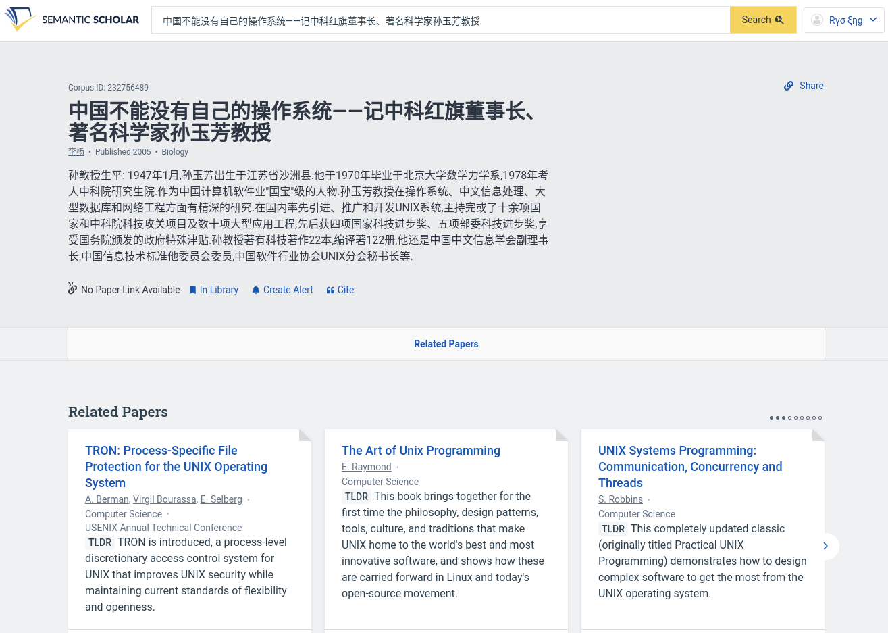{width=400}

目前最迫切的是需要查看礼逆袭操作系统框架，有个类似鄀编程语言`devtools`或`Ipaper`程序包一样，方便修改和编写操作系统的工具，先翻译再加密现有操作系统并研发咱们赢家黄氏江夏堂「大秦赋」或「文言文大秦赋」操作系统，先查阅以下连接：

- [How to modify an installation ISO and keep it bootable?](https://unix.stackexchange.com/a/635839/128388)
- [ISO Master install isomaster](https://askubuntu.com/questions/46646/how-to-edit-iso-images-including-bootable-isos)
- [Three Ways to Extract and Copy Files from ISO Image in Linux](https://www.tecmint.com/extract-files-from-iso-files-linux)

> 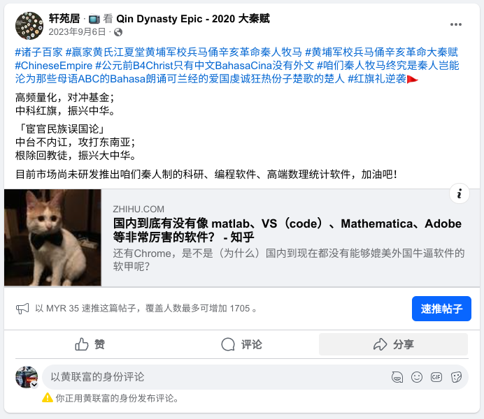{width=400}

*出处：[目前市场尚未研发推出咱们秦人制的科研、编程软件、高端数理计数|机数软件，加油吧！](https://www.facebook.com/xyzhiju/posts/pfbid0f5TYXPq46UwSGJ3yXxpHtVrgoeZtnLSzt6GKfChk7vEuKZC87aGsF28qtEz3GcAfl)*

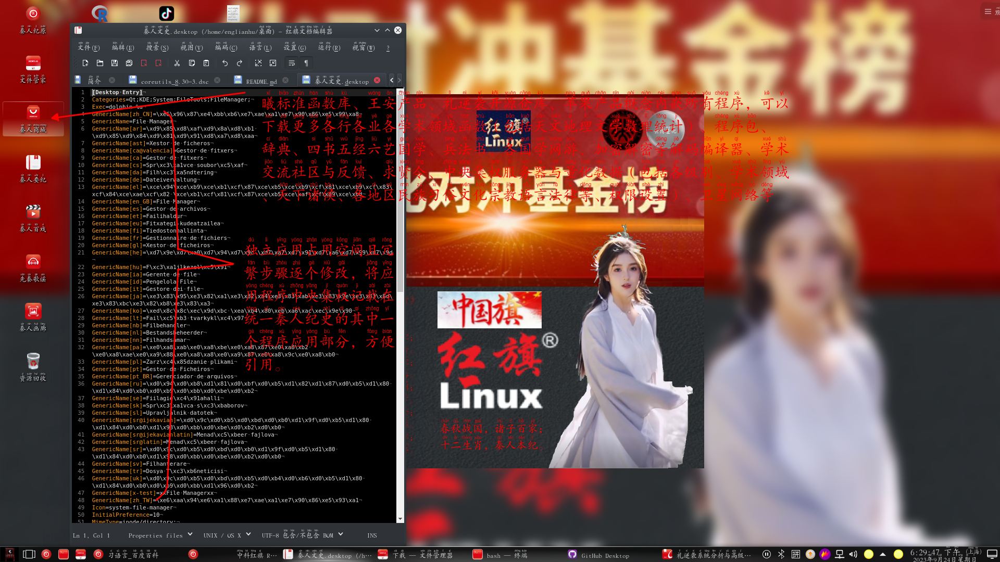{width=400}

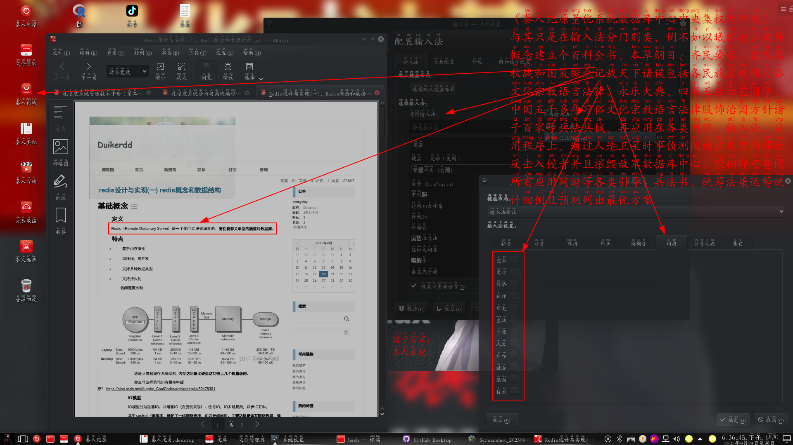{width=400}

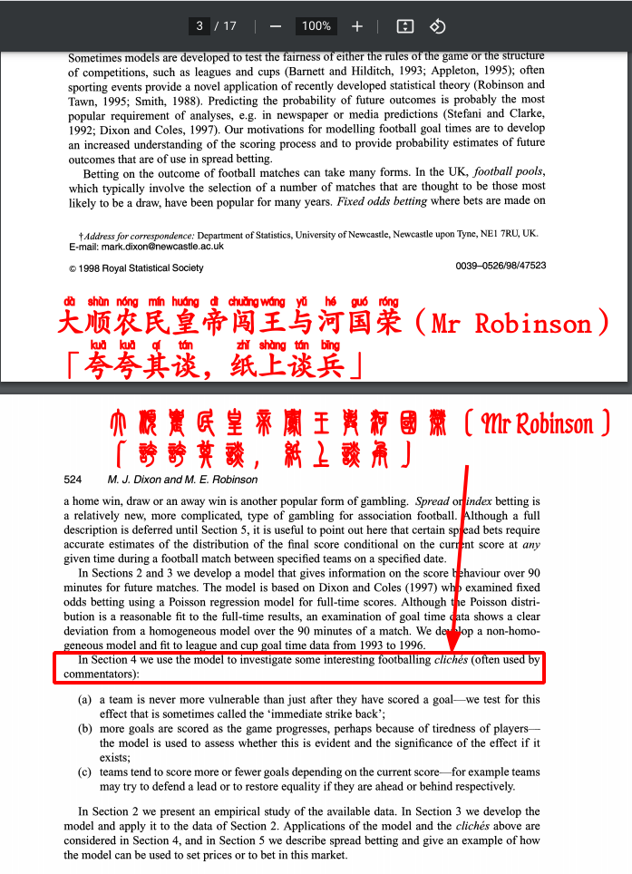{width=400}

<iframe width="400" height="225" src="https://youtube.com/embed/qpH19SxHXJQ" title="倭寇录屏 - 民国一百一十三年二月初五（农历甲辰年丁卯月丁丑日寅时中卅二分十一秒 属龙 周四）" frameborder="0" allow="accelerometer; autoplay; clipboard-write; encrypted-media; gyroscope; picture-in-picture; web-share" referrerpolicy="strict-origin-when-cross-origin" allowfullscreen></iframe>

*出处：[倭寇录屏 - 民国一百一十三年二月初五（农历甲辰年丁卯月丁丑日寅时中卅二分十一）](https://youtu.be/qpH19SxHXJQ)*

<iframe width="400" height="225" src="https://youtube.com/embed/6VMjJ2v9Nv8" title="倭寇录屏 - 民国一百一十三年正月廿五（农历甲辰年丁卯月戊辰日酉时末廿五分卌五秒 属龙 周二" frameborder="0" allow="accelerometer; autoplay; clipboard-write; encrypted-media; gyroscope; picture-in-picture; web-share" referrerpolicy="strict-origin-when-cross-origin" allowfullscreen></iframe>

*出处：[倭寇录屏 - 民国一百一十三年正月廿五（农历甲辰年丁卯月戊辰日酉时末廿五分十一）](https://youtu.be/6VMjJ2v9Nv8)*

<iframe width="400" height="225" src="https://youtube.com/embed/yEICn9RegoU" title="礼逆袭程序设计（第四版）：迈向图像化dialog工具" frameborder="0" allow="accelerometer; autoplay; clipboard-write; encrypted-media; gyroscope; picture-in-picture; web-share" referrerpolicy="strict-origin-when-cross-origin" allowfullscreen></iframe>

*出处：[礼逆袭程序设计（第四版）：迈向图像化dialog工具](https://youtu.be/yEICn9RegoU)*

<iframe width="400" height="225" src="https://youtube.com/embed/z2dzXayf5VI" title="赢家黄氏永春堂 - 大秦赋操作系统概念" frameborder="0" allow="accelerometer; autoplay; clipboard-write; encrypted-media; gyroscope; picture-in-picture; web-share" referrerpolicy="strict-origin-when-cross-origin" allowfullscreen></iframe>

*出处：[赢家黄氏永春堂 - 大秦赋操作系统概念](https://youtu.be/z2dzXayfSVI)*

<iframe width="400" height="225" src="https://youtube.com/embed/hdG8ksSwNII" title="分析购物篮计数|机数尤物 二零零二年五月廿五日晚上八点零二分零九秒" frameborder="0" allow="accelerometer; autoplay; clipboard-write; encrypted-media; gyroscope; picture-in-picture; web-share" referrerpolicy="strict-origin-when-cross-origin" allowfullscreen></iframe>

*出处：[分析购物篮计数|机数尤物](https://youtu.be/hdG8ksSwNII)*

<iframe width="400" height="225" src="https://youtube.com/embed/0ZD11tXBA6w" title="「幕后花絮」DynamicRadioButtons 阳历二零二二年四月廿四日凌晨零点廿五分零六秒" frameborder="0" allow="accelerometer; autoplay; clipboard-write; encrypted-media; gyroscope; picture-in-picture; web-share" referrerpolicy="strict-origin-when-cross-origin" allowfullscreen></iframe>

*出处：[「幕后花絮」DynamicRadioButtons 阳历二零零二年四月廿四日凌晨零点廿五分零六秒](https://youtu.be/0ZD11tXBA6w)*

<iframe width="400" height="225" src="https://youtube.com/embed/DAh10JKs81s" title="「幕后花絮」DynamicRadioButtons 阳历二零二二年四月廿三日晚上十一点五十二分十五秒" frameborder="0" allow="accelerometer; autoplay; clipboard-write; encrypted-media; gyroscope; picture-in-picture; web-share" referrerpolicy="strict-origin-when-cross-origin" allowfullscreen></iframe>

*出处：[「幕后花絮」DynamicRadioButtons 阳历二零二二年四月廿三日晚上十一点五十分](https://youtu.be/D4h10JKs81s)*

<iframe width="400" height="225" src="https://youtube.com/embed/mbo7CIO1vWM" title="Resume (Blooper)：阳历二零二二年四月十一日晚上十一点廿六分四十九秒" frameborder="0" allow="accelerometer; autoplay; clipboard-write; encrypted-media; gyroscope; picture-in-picture; web-share" referrerpolicy="strict-origin-when-cross-origin" allowfullscreen></iframe>

*出处：[Resume (Blooper)：阳历二零二二年四月十一日晚上十一点廿六分四十九秒](https://youtu.be/mbo7CIO1vWM)*

<iframe width="400" height="225" src="https://youtube.com/embed/OrreyVgy3RU" title="Anbox on Linux 🐧 - New Recording : 12-3-2021, 2:14:42 AM" frameborder="0" allow="accelerometer; autoplay; clipboard-write; encrypted-media; gyroscope; picture-in-picture; web-share" referrerpolicy="strict-origin-when-cross-origin" allowfullscreen></iframe>

*出处：[Anbox on Linux 🐧 - New Recording : 12-3-2021, 2:14:42 AM](https://youtu.be/OrreyVgy3RU)*

<iframe width="400" height="225" src="https://youtube.com/embed/3mTI435TCeM" title="Coursera Machine Learning for Trading: 蔡卓宜 - 10/16/2021, 12:32:47 AM" frameborder="0" allow="accelerometer; autoplay; clipboard-write; encrypted-media; gyroscope; picture-in-picture; web-share" referrerpolicy="strict-origin-when-cross-origin" allowfullscreen></iframe>

*出处：[Coursera Machine Learning for Trading: 蔡卓宜 - 10/16/2021, 12:32:47](https://youtu.be/3mTI435TCeM)*

借鉴万物皆有灵和阅读脑电波赢政思想录，所谓的户籍管理中的一项，就是视频中的[「β站」人工智障检测《国产凌凌漆》名场面](https://www.bilibili.com/video/BV1Cd4y1R7jT)是可以通过人造卫星以光速来侦测地球上万物一举一动，就能通过量子电脑的计数/机数量化分析来分辨机器人、僵尸、正常人，甚至《魔戒三部曲》中的幽灵军团、兵马俑、幽灵以下有些软件、编程代码与视频，日后得学习：

- [人工智障检测《国产凌凌漆》名场面](https://www.bilibili.com/video/BV1Cd4y1R7jT)中的[「猫城」OW-YOLO（具有区分已知与未知能力的全新检测器）](https://github.com/englianhu/OW-YOLO)初步侦测物体技术。
- [Analyze a Soccer game using Tensorflow Object Detection and OpenCV](https://towardsdatascience.com/analyse-a-soccer-game-using-tensorflow-object-detection-and-opencv-e321c230e8f2)
- [有了人工智能，从此程序员只写注释，不写代码？| 手把手安装自动写代码人工智能——Code Whisperer](https://www.youtube.com/watch?v=TIpRA6iwNus)
- [Ansible vs Puppet vs Chef – 2021 配置管理工具比较](https://www.incredibuild.cn/blog/ansible-vs-puppet-vs-chef-2021-peizhiguanligongjubijiao)
- [「博客园」企业级自动化运维工具——puppet详解](https://www.cnblogs.com/along21/p/10369858.html)
- 咱们世袭制道教徒十二生肖黄种人赢家黄氏江夏堂联富本人与天下所有世袭制道教徒黄种人的宗教与科技产品「大秦赋」操作系统登陆后的界面是个银河系再专注放大到用户所在的互联网协议地址，可借鉴[星图地球](https://online.geovisearth.com/browser)
- [回顾WPS发展史：原本领先于微软Office，雷军却被迫重新设计！](https://m.sohu.com/a/345553649_323552/?pvid=000115_3w_a)
- [贞节牌坊与轮回](#贞节牌坊与轮回)
- [••整理几个超微半导体中央处理单位的最佳礼逆袭发行版••](https://www.ecscoupon.com/4252.html)
- [「猫城」咨询开源硬件编程：支援高频量化对冲算筹#十三](https://github.com/englianhu/zhongkehongqi/issues/13)

##### 电子仪器与硬件

###### 电子仪器

**拯救亚洲人，削蕃外洲人。**

秦灭六洲，一统天下；
莫忘初衷，方得始终。

*引用：[🌟秦人牧马之《商君书》](#🌟秦人牧马之《商君书》)*

> <iframe width="400" height="225" src="https://youtube.com/embed/ruLu6m77iq0" title="算盘怎么变成电脑的？电脑发明历史" frameborder="0" allow="accelerometer; autoplay; clipboard-write; encrypted-media; gyroscope; picture-in-picture; web-share" referrerpolicy="strict-origin-when-cross-origin" allowfullscreen></iframe>
> 
> *出处：[算盘怎么变成电脑的？电脑发明历史](https://youtu.be/ruLu6m77iq0)*
> 
> **算盤更新了幾代變成了電腦? | 電腦發明的故事**
> 
> 二战期间，英国为了破解用于高级陆军通信的德国洛伦兹SZ 卌/卌二机（Enigma），马克斯•纽曼和他的同事们委托弗洛斯制造巨人。从一九四三年二月上旬开始，他花了十一个月的时间设计和建造了第一座巨人（Colossus），九台Mk II Colossus（将Mk I转换为Mk II，总共制造了十台机器）。巨像Mark I包含千五个热电子阀（管），但Mark II带有2,400个阀，比Mark I快五倍，并且操作更简单，大大加快了解码过程。工程师汤米•弗洛斯（Tommy Flowers）和艾伦•图灵（Alan Turing）在概率分析中设计做出了巨大贡献。经过一九四三年十二月的功能测试后，巨人被运送到布莱奇利公园，并于一九四四年一月十八日交付，并于二月五日攻击了它的第一条信息。它是世界上第一台电子数字可编程计算机。
> 
> --------------------------------------------------- 
> 
> 二进制/ 十进制
> 
> ---------------------------------------------------
> 
> 先说二进制，如果问拼音是汉字的什么，那二进制就是电脑的什么，我们学习汉字的时候可以用廿六个字母来拼写所有的汉字，可二进制只有两个字母0和1，他们怎么拼写电脑那么多的内容呢？我们拼音中除了字母的单独使用以外，还有两个三个四个如an，ian，iang组合到一起的使用方法来表示，但是拼音讲究的是可以发出正常的音，但是对于电脑来说，不需要是否发出正常的音节，所以电脑只要知道0表示什么，1表示什么，组合在一起00表示什么或者说0010101…随便只要是这个串号有对应的表示内容就可以了，用0和1可以在电脑程序中标记所有内容这就是二进制。
> 
> 十进制其实不需要讲解的，但是为了有小朋友观看，我们就来说一下，十進制是以10為基礎數字系统，在世界上應用最廣泛的進位制，十进制是这样数：“0、1、2、3、4、5、6、7、8、9…”，然后你再没有符号了！所以，你在左边加个1，然后从 0 重新开始： 10、11、12…因为从0到9是10个数字符号所以是叫十进制，和二进制比较一下就会更理解了，二进制里没有第三个数字，所以你从0开始数，数到1，就没有数字了…数起来是这样，0-01-10-11-100-101-110-以此类推…
> 
> 其实多少进制都可以做，只要大家都遵循这个规定就可以互相交流，比如我们的钟表小时就是十二进制，分钟和秒就是园进制。实际几进制就是数字有几个的意思，怎么样这样大家了解更透了吧。
> 
> 一个离不开发明故事的频道
> 
> --------------------------------------------------- 
> 
> 推薦連接：
> 
> - 乐高的发明故事：[三次大火使"乐高"创造了奇迹，乐高的发明故事](https://youtu.be/YuPXrq3almQ)
> - 世界上第一部电影：[世界上第一部电影，来的太突然了，电影的发明](https://youtu.be/h5LZyUwI-Dc)
> - 世界上第一支股票：[世界上第一支股票，阿姆斯特丹，因欧洲人需要胡椒，股票的发明故事](https://youtu.be/KIMsUgA9gPo)
> - 潜水艇的发明：[九艘早期潜水艇 ，潜水艇发明史](https://youtu.be/79Vat3-YG5I)
> - 高尔夫起源：[高尔夫原来是放羊人发明的？高尔夫为什么十八洞？高尔夫和中国古代有直接关系！](https://youtu.be/a2w9X2voJLA)
> - 避雷针的发明故事：[富兰克林冒着生命，发明了避雷针！](https://youtu.be/OPlypQU3ro4)
> - 火车的发明：[火车怎么发明的？先有火车还是铁轨？](https://youtu.be/cD1fTIXl_YU)
> - 世界上第一部电话：[谁是第一个电话的发明者？电话的发明](https://youtu.be/epvqMWDItZc)
> - 世界上第一台电脑：[算盘怎么变成电脑的？电脑发明历史](https://youtu.be/ruLu6m77iq0)
> - 世界上第一台空调：[世界上第一台空调，空调的发明竟然因为一场大雾？](https://youtu.be/mS5mQOxK9vo)
> - 世界上第一台直升机：[第一架直升机的诞生，直升机原来这样飞的？直升机驾驶这么简单](https://youtu.be/fgBa7MoFhbI)
> - 油管創始人是台灣人：[油管创始人，来自台湾的陈士骏](https://youtu.be/LAMVTUOMXrY)
> - 自行车发明故事：[有趣的自行车发明故事…](https://youtu.be/tXQtO4-f6lo)
> - 猫的起源：[视频](https://youtu.be/kZwOs4SFssQ)
> - 世界上第一条牛仔裤：[世界上第一条牛仔裤，牛仔裤的发明故事](https://youtu.be/uT8b4fZuM0U)
> - 世界上第一张照片：[世界上第一张照片，相机的发明故事](https://youtu.be/ktzc5i5ZPws)
> - 錶的發明故事：[钟表的发明历史，世界上最漂亮的手表](https://youtu.be/jOOMQu7Do-0)
> - 火箭的發明由来：[埃隆•马斯飞船发射成功，火箭的发明故事](https://youtu.be/U8Q3Nnul-Ws)
> - 第一次组装电脑：[第一次装机经验分享|AMD 3900XT，显卡RX5700XT，华硕X5…](https://youtu.be/5GL246v64yE)
> - 輪胎的發明故事：[疯啦！！轮胎的发明竟然是兽医。轮胎的发明故事](https://youtu.be/zdNV4516td0)
> - 可口可樂的發明故事：[可口可乐配方，可口可乐的发明故事](https://youtu.be/cSkhDiccvbg)
> - 汽车发明的秘密：[世界上第一台汽车，汽车发明故事](https://youtu.be/kNMF6qm1UF4)

<iframe width="400" height="225" src="https://www.youtube.com/embed/pvz-t6Vg880" title="「油管」抖音：行胜于言，精益求精" frameborder="0" allow="accelerometer; autoplay; clipboard-write; encrypted-media; gyroscope; picture-in-picture; web-share" allowfullscreen></iframe>

*引用：[「抖音」《台商的故事》中的黄朝阳](https://v.douyin.com/iYbXps8c)*

- 借鉴目前的电脑计算机[🎦「pre🆕高颜值🖥️」俺は、お前を買ってるんだぜ!🇭🇰](https://youtube.com/shorts/DFvpqKb2XH0)派热系统，它日研发咱们赢家黄氏江夏堂「大秦赋」/「文言文大秦赋」操作系统和「算筹」/「自然对数算筹」电子仪器。
- [「猫城」黄联富（®γσ ξηg 雷欧）/🚩🔆🏹🌟👊🚀🦔大秦赋：「甘石星经，周髀算经；诸子百家，干支算筹」取代阿拉伯数字和回教徒语言（包括巫术、货币、习俗文化、可兰经断肢法）#十二 *自然对数「干支算筹」与农历天文历法*](https://github.com/englianhu/RedFlag-Linux/issues/12#issuecomment-1676066137)
- [上篇：国产六大中央处理单位技术全对比（附下载）](https://www.modb.pro/db/107396)
- [下篇：国产六大中央处理单位的春秋战国（附下载）](https://www.eet-china.com/mp/a75720.html)
- [「图享」国产六大中央处理单位的春秋战国](https://www.instagram.com/p/CYRDpsdJO2R)
- [「计算机网络发展史」你在网上勇闯天涯时用的网络，是如何发展至今的呢？](https://youtu.be/CjAl6jODHq8)
- [「雎䴘」openEuler（中译：开源欧拉）](https://gitee.com/openeuler)
- [「元宇宙」台湾制科技产品天下第一列表](https://www.facebook.com/xyzhiju/posts/pfbid025YLD2UsVjvK5HoAdcPf4M8AXjJkkZSEyWxxF81ENPzmmBWJxkLNajtDWyQLMDrL6l?locale=zh_CN)

###### 基本输入输出微型操作系统

> ## 自然对数<s>「干支算筹」</s>「大秦赋算筹」与农历天文历法
> 
> 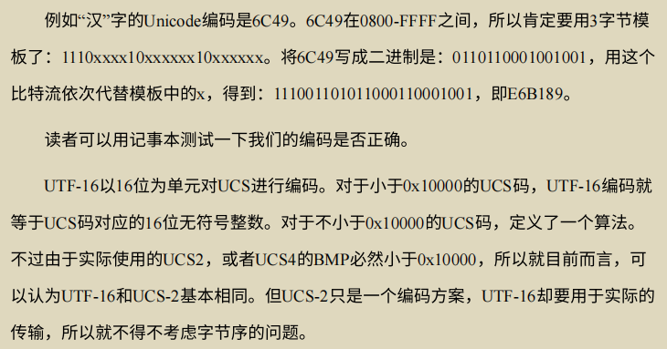
> 
> *出处：[全球讯息：Unicode编码介绍？](http://keji.paoku.com.cn/keji/2022/1024/129547.html)*
> 
> - UTF8的英文字母一个字节而咱们中文三个字节，GB2312中文两个字节，如何提高效率，可以使用单字如`一、十、廿、卅、卌... 圆`，比方说「汉」字，来取代111001101011000110001001、6C49...
> - [🚩🔆🏹🌟👊🚀🦔大秦赋：「甘石星经，周髀算经；诸子百家，干支算筹」取代阿拉伯数字和回教徒语言（包括巫术、货币、习俗文化、可兰经断肢法）#十二](https://github.com/englianhu/RedFlag-Linux/issues/12#issue-1756553140) 列表中的单字在「皕」后就「千」、「万」、「亿」、「兆」、「京」，字典需要多添加单字。
> - [到底几进制最有效率？](https://www.bilibili.com/read/mobile?id=8455211)叙述三进制会比二进制运行得快速而混合进制最接近自然对数最为快速运行计算和[`ln -sf`是永久生效的吗？礼逆袭`ln`的运算法则](https://blog.csdn.net/weixin_31742467/article/details/116971365)和[计算机的二进制是什么意思呀？](http://haokan.baidu.com/v?pd=wisenatural&vid=10816386140636526174)，借鉴对数，比较二进制、圆进制和自然对数的效率与规律，混合进制自对然数的操作系统。干支算盘原意为圆进制概念，目前得改良为自然对数**赢家eng黄氏江夏堂黄埔军校世袭制辛亥革命**（借鉴亲人牧马论：秦献公、秦穆公、秦孝公、陈祯禄公爵Sir/Duke Tan Cheng Lock、Cendol、蜀国国都成都、楚国国都郢都、槟城世袭制法家咸阳城George Town、明帝朱常洛、常洛五号、司马错入蜀/大都督司马懿。天命不可违，ln / log e 愚生eng lian hu黄联富赢家eng黄氏江夏堂黄埔军校世袭制辛亥革命，自然对数从负一至正一）。
> - 三进制对数比二进制对数更佳靠近自然对数，概率论从自然对数的负一（必数）、零、正一（必数），也就是说它日可以尝试科研比隐马尔可夫链的三世书还精准的统计学（和物理学、人类行为学）模型、借鉴长短记忆模型和[#国学知识#公历、阳历、农历、阴历，有什么联系与区别？三分钟帮您彻底搞明白！](https://haokan.baidu.com/v?vid=3936507668336726618)和[什么是阳历、公历、阴历、农历](https://haokan.baidu.com/v?vid=622596821267336944)，咱们农历天文历法计算气候生活作息比沙地阿拉伯数字的阴历☯️和阳历☯️更精准，全球不同地区的白天夜晚时间有长短、自然对数是孤型而非直性模型，也就是每个状态的时间有长短、依照高频量化对冲的投资模式夏普率概念来评估在各别三个状态的时间与状态。包括制作自然对数的电子仪器「大秦赋」操作系统。
> - [自然对数的产生发展](https://www.360doc.cn/article/7131956_716664493.html)
> 
> ## 相关奏折
> 
> - [相同信息利用二进制还是十、十六进制传送比较快？](https://iask.sina.com.cn/b/1H1tTRscXlOt.html)
> - https://github.com/englianhu/RedFlag-Linux/issues/8#issuecomment-1591801318
> - https://github.com/englianhu/ripgrep
> - https://github.com/englianhu/RedFlag-Linux/issues/1#issuecomment-1674725116
> - https://github.com/englianhu/RedFlag-Linux/issues/6
> - [怎么看字符占多少字节?](https://zhidao.baidu.com/question/1184304425926544019.html)
> - [编码简介UTF8、UTF16以及其它编码](https://baijiahao.baidu.com/s?id=1755446836513573431)
> - [GB2312、Unicode编码等](https://www.cnblogs.com/predator-wang/p/4859860.html)
> - [网页设计中UTF-8和GB2312编码](https://blog.csdn.net/weixin_34290352/article/details/89983552)
> - [GB2312、GBK与UTF-8的区别](https://blog.csdn.net/zhengsaisai/article/details/51754620)

*出处：[「猫城」🚩🔆🏹🌟👊🚀🦔大秦赋：「甘石星经，周髀算经；诸子百家，干支算筹」取代阿拉伯数字和回教徒语言（包括巫术、货币、习俗文化、可兰经断肢法）#十二](_Originally posted by @englianhu in https://github.com/englianhu/RedFlag-Linux/issues/12#issuecomment-1676066137_)*

借鉴[「人物传记」秦惠文王的一生——彪悍到不需要解释](http://www.360doc.com/content/20/0620/09/11532035_919501336.shtml)，在「大秦赋算筹」甚至在微型操作系统上的时间，由原本的天下昔日霸主大英帝国格林治标准时间GMT的纬经度，改为咱们世袭制道教徒十二生肖秦国“北京”或“咸阳”或“洛阳/洛邑”时间为标准。

##### 演员的自我修养

**无师自通，自学成才。**

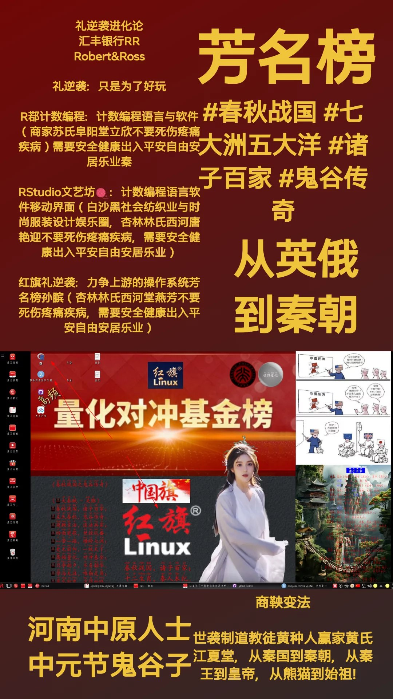{width=400}

由于许多人误解“高筑墙、广积量、缓称王”的意思，先偏于一方发展后储存实力再称霸，非在于速度的快慢（每天吃喝拉屎的生活再过一千年还是徒劳）而根据实力进度来占卜扩充的速度（借鉴**棣逊与克尔斯（一九九六）**的大数定律，计数中的抽样与全局论，比方说统筹法）。故此引用咱们赢家黄氏江夏堂的商鞅变法的《商君书》“帝道”、“王道”、“霸道”，从公爵到世袭制道教徒政权始祖，开创两千多年的世袭制道教徒华人政权。

借鉴春秋战国史和目前七大洲五大洋，咱们道家的风水学，从[秦人牧马/卧薪尝胆](#秦人牧马/卧薪尝胆)分享个人从门外汉、摸索、四处碰壁、购买一些计数/机数软件、自修计数/机数建模编程的窍门：

- 一、交流、搜索与收集资源
    - 个人史：愚生加入西施康公司时是个高频量化对冲计数/机数建模的门外汉，然后开始成为类似比尔•盖茨史的一位宅男书虫每天除了自修就是上网和学术份子交流、找资源、阅读、编程、睡觉。
        - 问：在没有任何数学家、教授、举人、名师的人际网络之下，如何自学成才，脱颖而出呢？
        - 答：自修和找名师或贤才交流。
    - 心得：上网搜索与交流、网购或书店购书（一般上教材书、科研论文、学术论坛、一些名师或贤才的网站）
- 二、阅读并筛选资源
    - 个人史：完全没有头绪的情况之下，如何入门？
        - 只有花招却没有深厚内功的情况之下，如何自修呢？
        - 阅读许多相关科研文献与文章后，筛选并开始自修并学习最上层武功秘籍。借鉴[「抖音」《台商的故事》中的黄朝阳](https://v.douyin.com/iYbXps8c)的励志故事，要做就要做世界第一！
        - 报读网课，例如[考试啦！](https://www.coursera.org)。
        - [知乎](https://www.zhihu.com/)、[简书](https://www.jianshu.com/)、[栈滥](https://stackoverflow.com/)、[猫城](https://www.github.com)、[CSDN](https://www.csdn.net/)、[统计之都](http://d.cosx.org/)、[经管之家](https://bbs.pinggu.org/)、[移动终端操作系统社区](https://forum.posit.co/)等。
- 三、了解与学习、实践、回测、校对并检讨才预测。
- 四、根据以上三个学习方式，轮回与进化论。

借鉴教育学家兼儒家孔子、教育学家兼法家荀子、教育学家兼经济学家管子、教育学家兼纵横家鬼谷子等，有关入门算卜、有效的自修学习成为数术家之道相关资源，请查阅：

- [学习能力与进度分类（英）](https://github.com/englianhu/binary.com-interview-question/blob/世博量化研究院/图书馆/学习能力与进度分类（英）.pdf)
- [如何根据科学，过目不忘和耳闻不忘（英）](https://github.com/englianhu/binary.com-interview-question/blob/世博量化研究院/图书馆/学习能力与进度分类（英）.pdf)
- [为非计数家而写的计数|机数（英）](https://github.com/englianhu/binary.com-interview-question/blob/世博量化研究院/图书馆/为非计数家而写的计数%7C机数（英）.pdf)
- [如何成为伟大的管家（英）](https://github.com/englianhu/binary.com-interview-question/blob/世博量化研究院/图书馆/如何成为伟大的管家（英）.pdf)
- [二零二三年网站总汇（英）](https://github.com/englianhu/binary.com-interview-question/blob/世博量化研究院/图书馆/二零二三年网站总汇（英）.pdf)
- [「栈滥」[^23]二零二三年网站总汇（英）](https://survey.stackoverflow.co/2023/?fbclid=IwZXh0bgNhZW0CMTAAAR0FuQC5PHTIcEelsf76aEpgWFW7-JEqaiws4_00hj9S4N9LtZg97ks8-hg_aem_ARvrcz62eOmT9xTuo3QJdueEE4o0QOa9_Wc_q-piwlQNs7SqktXvyu84gPF2ozFSYbbzouzKFuV6mW8x-BHIg2Su#section-admired-and-desired-programming-scripting-and-markup-languages)

[^23]: >**文献与案例**<br><br>基本概念<br><br>>- 泛型栈（Stack）<br>>      - 栈是一种后进先出（LIFO, Last In First Out）的数据结构。栈中最后添加的元素最先被移除。可以把栈想象成一叠盘子，最后放上去的盘子最先被拿走。<br>>- 泛型队列（Queue）<br>>      - 队列是一种先进先出（FIFO, First In First Out）的数据结构。队列中第一个添加的元素最先被移除。可以把队列想象成排队买票，最先排队的人最先买到票。<br><br>*出处：[泛型栈（Stack）和泛型队列（Queue）](https://www.loserme.com/archives/2dBCW0Zp)*<br><br>根据以上「泛型栈」诠释为毫无节制、刻舟求剑、海底捞月、治标不治本，可译为「栈滥」最为恰当，借鉴苹果公司一条龙服务产品、孙玉芳教授之名言和愚生目前自修并科研咱们世袭制道教自然对数大秦赋算筹，那些使用它人产品或没有釜底抽薪，一劳永逸的门面功夫。<br><br>- 方案一：栈滥<br>- 方案二：栈涝<br>- 方案三：栈氾<br>- 方案四：栈涔<br><br>*出处：[「猫城」`stackoverflow`该译名啥？#七](https://github.com/scibrokes/owner/issues/7)*

**拯救亚洲人，削蕃外洲人。**

秦灭六洲，一统天下；
莫忘初衷，方得始终。

*引用：[🌟秦人牧马之《商君书》](#🌟秦人牧马之《商君书》)*

> 原本不晓得该怎么翻译GitHub，就想起二零一九年在阿里彩票工作，有个女商人客户经营宠物店、养了两只猫、有猫舍，就引用之为“猫舍”；然而最近才知道咱们峇东新村明智华校大门前一家角落间（以前Peter Goh故居兼茶室）茶室目前是一位中国籍福州女商人经营茶室，以前在拉曼学院修读电脑科学时课外学习日语的日语班女老师砂捞越祖籍福州王佩佩Peggyさん，就翻译为猫城，当时连续好几个月每天泡拉曼学院图书馆从早待到晚上一直看书自修，有天阅读一本中国史书，其中一章说到鬼谷子和卫鞅仕魏联合六国伐秦不果，就倒戈仕秦伐众，三顾秦公《商君书》落实大秦赋的“商鞅变法”、吴越之争的“孙子兵法”和“卧薪尝胆”历史故事是最铭记于心，其余包括汉史楚汉之争…

*引用：[「猫城」世博量化/Pandoc based Quarto应该翻译成什么？#三](https://github.com/scibrokes/r-world/issues/3#issue-1618233383)*

**人无远虑，必有近忧。**

引用商末姜太公钓鱼🎣、大数定律和咱们在太阳谷（Sun Valley在夏朝俗称“阳城”、美国南方加州硅谷传奇、春秋战国时期的Valley是河南淇县鬼谷传奇）中企乐发集团旗下阿里公司主管明天（钟余庆）和组长小宋（宋祖）之名言：“咱们需要以现有的资源，将业绩与效率最优化最大化！平时需要检讨为啥别家企业都能做到，而咱们却办不到？大家都使用一样的资源，包括隔壁企业大赢家都是使用一样的资源可以做出业绩，而咱们却办不到？是咱们哪儿做得不够好？需要找出问题的根源！”，目前需要先使用鄀文艺坊/移动终端操作系统并提升红旗礼逆袭操作系统，直到研发咱们赢家黄氏江夏堂「大秦赋」/「文言文大秦赋」操作系统和「算筹」/「自然对数算筹」电子仪器，和美企视窗、苹果、谷歌、礼逆袭分庭抗礼。欲知更多幕后花絮或详情，请查阅：

- [「猫城」黄联富（®γσ ξηg 雷欧）/binary.com-interview-question#三 大秦赋：商鞅变法、辛亥革命、一带一路、计量经济学、孙子兵法](https://github.com/englianhu/library/issues/3)
- [「猫城」世博量化/r-world#一`REmap`百度绘图，点缀全球](https://github.com/scibrokes/r-world/issues/1)
- [「猫城」黄联富（®γσ ξηg 雷欧）/binary.com-interview-question#六 `Error: forecast::Arima()`#九百一十](https://github.com/englianhu/binary.com-interview-question/issues/6)
- [「猫城」黄联富（®γσ ξηg 雷欧）/binary.com-interview-question#八 在`ts`和`xts`和`matrix`格式上使用`auto.arima`](https://github.com/englianhu/binary.com-interview-question/issues/8)
- [「猫城」世博量化/setup-centOS7-DO#二 🚩🇨🇳🏹中科红旗 RedFlag Linux (🍥Debian)](https://github.com/scibrokes/setup-centOS7-DO/issues/2)
- [「猫城」黄联富（®γσ ξηg 雷欧）/中科红旗](https://github.com/englianhu/RedFlag-Linux)
- [「猫城」黄联富（®γσ ξηg 雷欧）/图书馆](https://github.com/englianhu/library)
- [「油管」雷欧 ®γσ ξηg视频总览](https://www.youtube.com/@englianhu/videos)
- [「油管」雷欧 ®γσ ξηg短视频总览](https://www.youtube.com/@englianhu/shorts)
- [「微视」赢家黄氏江夏堂，联富（雷欧）](https://vimeo.com/englianhu)

#### 春秋战国——秦国•外患

##### 秦人牧马

**拯救亚洲人，削蕃外洲人。**

秦灭六洲，一统天下；
莫忘初衷，方得始终。

*引用：[🌟秦人牧马之《商君书》](#🌟秦人牧马之《商君书》)*

![*咱们世袭制道教徒黄种人禁止协助外洲，远^[有多远？是太空]交近^[有多近？是地球]攻。*](诸子百家考工记/秦国远交近攻.png){width=400}

以咱们目前现有的资源，那些巫贼巫婆非法回教徒的创办人叫Onn Jafaar温家法（为啥知道Onn姓温？因为在中四勤班和中五勤班有位同学冷面笑匠同学姓温，英文姓Onn），借鉴美国大葱回教堂白宫变法——伐木歼灭所有美国公民，直到只剩两棵咱们世袭制道教徒的华人树，俗称双木林（杏林林氏西河堂）。

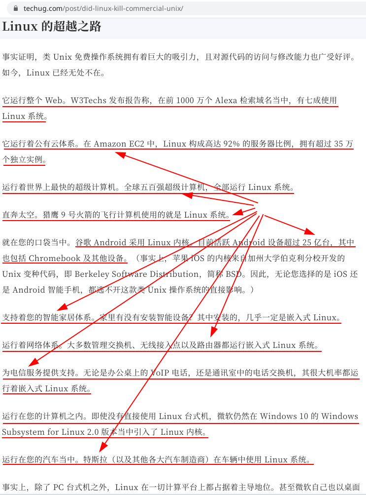{width=400}

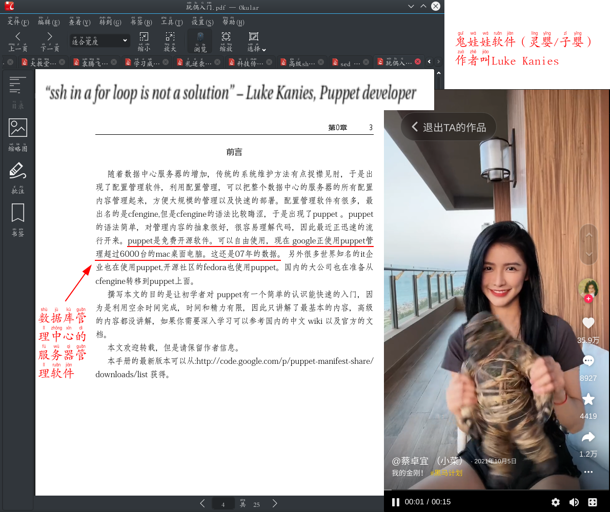{width=400}

借鉴万物皆有灵和阅读脑电波赢政思想录，所谓的户籍管理中的一项，就是视频中的[人工智障检测《国产凌凌漆》名场面](https://www.bilibili.com/video/BV1Cd4y1R7jT)是可以通过人造卫星以光速来侦测地球上万物一举一动，就能通过量子电脑的计数/机数量化分析来分辨机器人、僵尸、正常人，甚至《魔戒三部曲》中的幽灵军团、兵马俑、幽灵。

> 群山诸岳的名称并非本来就有，有些还经过了好些波折呢！也由于马来半岛民族的多样性，连山名的来源也多样性了。
> 
> 　金马仑高原地区未开发前，原本被称呼为中央山脉分水岭(watershed)，原因这里是马来半岛三条最大的河流：彭亨河、吉兰丹河、霹雳河的共同发源地。
> 
> 　大汉山（Gunung Tahan）原名“里来岩”（Batu Relai），一九零六年英殖民地政府首席地质学家施里文若氏（J.B.Scrivenor）偕同鲁滨申登上里来岩，并在高原上进行地质考察，才开始把这片的淡美令系形成岩叫作Gunung Tahan。
> 
> 　哥木峰（Gunung Korbu）曾经三易其名，最初叫Gunung Riam，后来唤为Gunung Kerbau（吉保峰），最后才确定为Gunung Korbu，由于这种历史情况，至今好些中国地理刊物及网络上，都误称马来半岛主干山脉为“吉保山脉”，令人一头雾水。
> 
> 　查玛峰Gunung Chamah，两千一百进一米又名“加难”Gunung Kalang。
> 
> 　金山，奥斐尔山（Mt.Ophir）一名是来源于葡萄牙占领麻六甲时期，而“奥斐尔”
> 
> 　即是葡萄牙语的“黄金”的意思，马来语Gunung Ledang意喻“闪亮亮的山”，从中文“金山”看来，至少在早期金山麓曾经盛产黄金。《旧约圣经》列王记第九章，所罗门王获得黄金的“Ophir”，曾被人附会就是这座金山。实际上，葡萄牙语Ophir可能就是源于《圣经》。（摘自马来西亚南洋网）

*引用：[群山博物：诸岳名称的由来](http://www.chinaqw.com/hwmt/2016/01-28/78419.shtml)*

马来西亚中央山脉最高峰叫大汉山，可查阅[青山绕云海，雨林蕴奇观。马来西亚大汉山国家公园游记](http://my.china-embassy.gov.cn/zt/nycf/200711/t20071109_1769251.htm)。

- [我方的历史 - 马共总书记陈平回忆录](https://github.com/englianhu/library/blob/世博量化研究院/始祖永春•大秦赋（Chinese%20Emperor）/红旗革命（反攻巫贼巫婆、峇峇娘惹和美洲）/我方的历史%20-%20马共总书记陈平回忆录.pdf)
- [听陈平讲马共内奸莱特事件真相（一～三）](http://m.wyzxwk.com/content.php?classid=21&id=306319)

借鉴毛泽东、项羽、刘邦仨都生肖蛇🐍而马共史，马共领导陈平（与中国古代秦汉时期的西楚霸王项羽其下谋臣陈平跳槽投奔汉王刘邦同名）拉拢法籍洋蕃莱特合作反英（估计是陈平学习美国独立战争史法家瓦盛顿联合法籍洋番）抗日，结果陈平滑倒卢让洋番莱特（与研发飞机的科学家莱特兄弟同名）竟然在甲洞上演洋番版《蕲年宫之变》或洋番版《靖难之变》成功围剿咱们中华民族。那些基督耶稣洋蕃的《圣经》习俗文化的阁楼不是禁止使用四楼，禁止基督耶稣洋蕃靖难冒充咱们世袭制道教徒明朝四太子朱棣、禁止冒充回教徒的清朝回教徒皇帝四爷雍正，而是使用三A楼吗？

##### 错误信息

**拯救亚洲人，削蕃外洲人。**

秦灭六洲，一统天下；
莫忘初衷，方得始终。

*引用：[🌟秦人牧马之《商君书》](#🌟秦人牧马之《商君书》)*

**居安思危**

- [外因周期性自回归综合滑均尤物（ARIMAX）](外因周期性自回归综合滑均尤物（ARIMAX）)章节中的[`forecast::Arima()`](#`forecast::Arima()`)，经过[廿四节气](#廿四节气)筹算季节周期后，得知自回归均移尤物最优值的`p, d, q, P, D, Q, s`分别为`0, 1, 4, 0, 0, 0, 0`。
- [平滑周计](#平滑周计)美国洲际犯罪案！
- [马王之争（争取承接🇬🇧英国立博🚩红军百年老店操盘与科研项目）](#马王之争（争取承接🇬🇧英国立博🚩红军百年老店操盘与科研项目）)
- 目前美企[「统计之都」RStudio用户界面中文汉化翻译介绍与使用说明](https://d.cosx.org/d/424852-rstudioyong-hu-jie-mian-zhong-wen-yi-hua-fan-yi-jie-shao-yu-shi-yong-shuo-ming)已类似以前的微软视窗推出中文版，入侵咱们世袭制道教徒黄种人的亚洲市场。

```{r 红宝石编程, eval=FALSE}
lib('shiny')
output$ryo_kr <- renderUI({
    if (!file.exists('www/ryo-kr.html')) {
      return(tags$div(class = 'Missing-Data-Class',
        HTML('<ruby>건설<rp>(</rp><rt>geonseol</rt><rp>)</rp>중<rp>(</rp><rt>jung</rt><rp>)</rp></ruby> !'))
      )
    }
    includeHTML('www/ryo-kr.html')
  })
```

如何通过运行代码，将打印出来的数据框内容字母上标音，可查阅：

- [「统计之都」使用 Ruby Text](https://d.cosx.org/d/423088-ruby-text)
- [「猫城」Apply Ruby-Text on shiny #3612](https://github.com/rstudio/shiny/issues/3612)

不过通过`data.frame()`或`tibble`相关函数，就无法在字幕上标音。

> 在`/usr/lib/rstudio/resources/app/resources/themes/css`路径下找到了`fonts.css`文件，代码如下：
> 
> …
> …
> 
> 目前只看到只支援英国话和法国话，虽然可以先着手添加咱们的中国话，方便拉低学习高端科技的门槛。目前代码主题并没有中文和咱们中华习俗文化宗教语言，而应用主题设置Sky和Modern并没有任何不一样；何不学习以前谷歌输入法、WPS可以设置应用主题背景甚至框架特色。**虽然可以暂时收录移动终端操作系统（Posit）为咱们中科红旗操作系统的主要量化分析产品，但借鉴中科红旗🚩创办人兼数术家孙玉芳教授考量到安全隐忧，终究是敌洲美国洋番基督耶稣产品而客户是美国航天局。借鉴以前微软视窗禁止将办公软件内嵌到PC（因为那些不会中文也不是咱们世袭制道教徒的巫婆非法回教徒不允许违反千年法家立下的可兰经回教刑事法典断肢法工作、色情、传宗接代），咱们世袭制道教徒以力争上游的精子赢家黄氏江夏堂内嵌到杏林林氏西河堂生蚝的概念编写程序包而非外来软件，方便安装、使用、维护、卸装。**

*引用：[中国北京大学赢家ξng黄氏江夏堂「大秦赋」：目前使用🚩🇨🇳🏹中国国产红旗礼逆袭，并且将`REmap`鄀编程语言程序包中文化，以下鄀编程语言函数也开始中文化，日后编程都会使用中文编程。#七](https://github.com/englianhu/binary.com-interview-question/issues/7#issuecomment-1588499121)*

> 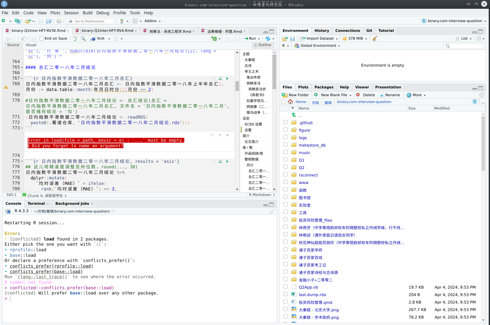{width=400}
> 
> …
> 
> {width=400}
> 
> 美国基督耶稣产品移动终端操作系统中有个阅读屏幕功能和副驾自动编程，人为的恶意篡改代码（尤其是协助世仇回教徒九一一恐怖份子）是洲际刑事犯罪案兼判教罪！
> 
> <iframe width="400" height="225" src="https://youtube.com/embed/5LL8V2a_xp0" title="「西楚霸王自杀式认罪」母语ABC的西楚大葱回教堂爱国虔诚狂热份子瓦盛顿" frameborder="0" allow="accelerometer; autoplay; clipboard-write; encrypted-media; gyroscope; picture-in-picture; web-share" referrerpolicy="strict-origin-when-cross-origin" allowfullscreen></iframe>
> 
> *出处：[「西楚霸王自杀式认罪」母语ABC的西楚霸王大葱回教堂爱国虔诚狂热份子瓦盛顿](https://youtu.be/5LL8V2a_xp0)*
> 
> **缅怀美国国父甲级战犯老实人瓦盛顿伐木屠杀美国和欧洲公民，勇于认错。如今的美国人已变质（左右逢源，哉赃嫁祸咱们亚洲公民），道德沦亡**
> 
> 世风日下，人心不古；<br>
> 莘莘学子，赤子之心。

*引用：[「猫城」forecast::Arima(xreg = XXXX)咱们周易（洲学论拯救亚洲人）道家易经、天文历法、廿四节气、十二时辰、算卜与气象学，<s>「兵法廿四篇」之孔明借东风与草船借箭出现错误信息</s>司马错得蜀既得楚#九](https://github.com/englianhu/binary.com-interview-question/issues/9#issuecomment-2041903143)*

## 文书明细

以下乃此文书的文件信息。

- 文集建立日：农历二零二四年菊月廿八 甲辰年（龙年）甲戌月丁卯日（阳历二零二四年十月三十日 / 民国一百一十三年菊月廿八）[^14]
- 文集最新更新日：`r today('Asia/Shanghai')`
- `r R.version.string`
- [**rmarkdown**](https://github.com/rstudio/rmarkdown) 程序包版本：`r packageVersion('rmarkdown')`
- 文集版本：一零一
- 文集作者：[®γσ, ξηg Lιαη Ημ](https://rpubs.com/englianhu/ryo-cn)
- 猫城：[源代码](https://github.com/englianhu/lottery)
- 追加附属信息

[^14]: 欲知更多阳历/民国/农历日历详情，请登录中华民国农业部官网查询日历查询[阳历/农历/民国查询](https://ppg.naif.org.tw/naif/MarketInformation/Other/Calendar_V3.aspx)。

```{r 信息, error=TRUE}
suppressAll(lib(c('formattable', 'knitr', 'kableExtra', 'magittr', 'devtools', 'rsconnect')))

系统信息甲 <- session_info()$platform |> 
    unlist() |> 
    {\(.) data.frame(row.names = 1:length(.), 
                     Category = names(.), session_info = .)}()

系统信息乙 <- data.frame(Sys.info()) |> 
    {\(.) data.frame(Category = row.names(.), Sys.info = .[,1])}()

#remarks, dim(系统信息甲), dim(系统信息乙)
if (nrow(系统信息甲) == 11 && nrow(系统信息乙) == 8) {
  系统信息乙 <- 系统信息乙 |> 
    {\(.) rbind(., data.frame(
    Category = c('rmarkdown', 'rsconnect', '当前时间'), 
    Sys.info = c(as.character(getwd()), 
                 as.character(packageVersion('rsconnect')), 
                 paste(as.character(
                   lubridate::now('Asia/Shanghai')), 'CST 中国标准时间 🗺'))))}()
  
} else if (nrow(系统信息甲) == 10 && nrow(系统信息乙) == 8) {
  系统信息甲 <- rbind(系统信息甲, data.frame(Category = '', session_info = ''))
  
  系统信息乙 <- 系统信息乙 |> 
    {\(.) rbind(., data.frame(
    Category = c('rmarkdown', 'rsconnect', '当前时间'), 
    Sys.info = c(as.character(getwd()), 
                 as.character(packageVersion('rsconnect')), 
                 paste(as.character(
                   lubridate::now('Asia/Shanghai')), 'CST 中国标准时间 🗺'))))}()
}

系统信息 <- cbind(系统信息甲, 系统信息乙)
names(系统信息) <- c('分类甲', '访谈信息甲', '分类乙', '访谈信息乙')
系统信息$分类甲 <- c('版本', '操作系统', '系统', '界面', '语言', '核对', 
              '©标准库', '时区', '日期', '®文艺坊版本', 'Pandoc瑞士军刀')
系统信息$分类乙 <- c('系统名称', '发布', '版本', '元素节点', '机器', '登录', 
              '用户', '活跃用户', 'rmarkdown (®降价编译)', 
              'rsconnect (®s联通)', '当前时间')
rm(系统信息甲, 系统信息乙)

系统信息 |> 
  {\(.) 
    kbl(., caption = '附加访谈信息：')}() |> 
  {\(.) 
    kable_styling(
      ., bootstrap_options = c('striped', 'hover', 'condensed', 'responsive'))}() |> 
  {\(.) 
    row_spec(., 0, background = 'DimGrey', color = '#7b1113')}() |> 
  {\(.) 
    column_spec(., 1, background = 'CornflowerBlue', color = 'red')}() |> 
  {\(.) 
    column_spec(., 2, background = 'grey', color = '#8B0000')}() |> 
  {\(.) 
    column_spec(., 3, background = 'CornflowerBlue', color = 'blue')}() |> 
  {\(.) 
    column_spec(., 4, background = 'grey', color = 'white')}() |> 
  {\(.) 
    row_spec(., 11, bold = TRUE, color = 'yellow', background = '#D7261E')}()
```

## 参考文献

- 一、[<span style='color:#DE5D83; background-color:black;'>金融衍生</span> - 筛选日内高频量化交易计数尤物 第三部•乙（春秋战国《晏子春秋》——总结平滑指数尤物）](https://englianhu.github.io/民国一百一十三年（甲辰年）/寒月/binary-Q1Inter-HFT-RV3E.html)
- 二、[Forecasting: Principles and Practice](https://otexts.com/fpp3)
- 三、[预测：方法与实践：第十一章第一节复杂季节性](https://otexts.com/fppcn/complexseasonality.html)
- 四、[HTML Color Codes](https://html-color.codes)
- 五、[**R Markdown: The Definitive Guide** 15.1 Declaring parameters](https://bookdown.org/yihui/rmarkdown/params-declare.html)
- 六、[**R Markdown Cookbook** 17.5 Customize the Knit button (*)](https://bookdown.org/yihui/rmarkdown-cookbook/custom-knit.html)
- 七、[transfonter](https://transfonter.org/)
- 八、[公历和农历日期对照（公元前七二二年——公元二二零零年）](https://ytliu0.github.io/ChineseCalendar/index_simp.html)
- 九、[HTML Color Codes](https://html-color.codes)
- 十、
- 十一、
- 十二、
- 十三、
- 十四、
- 十五
- 十六、
- 十七、
- 十八、

---

[{height=14} Sςιβrοκεrs Trαdιηg®](http://www.scibrokes.com)<br>
[{height=14} 世博量化®](http://www.scibrokes.com)企业知识产权及版权所有，盗版必究。**]{style="color:RoyalBlue"}
