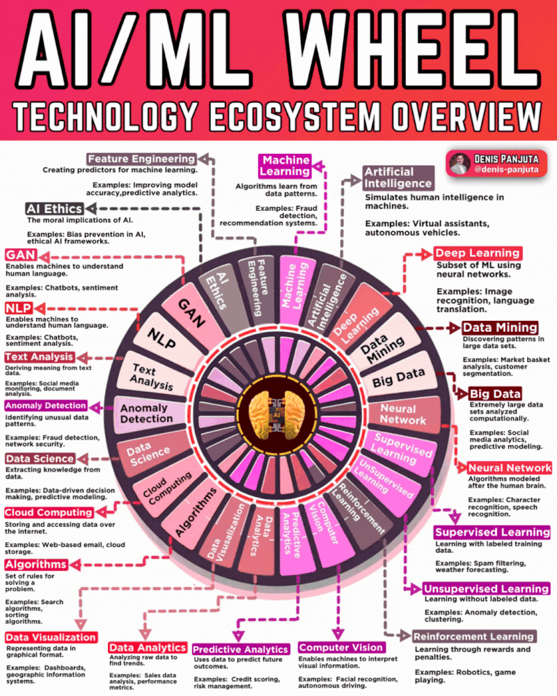
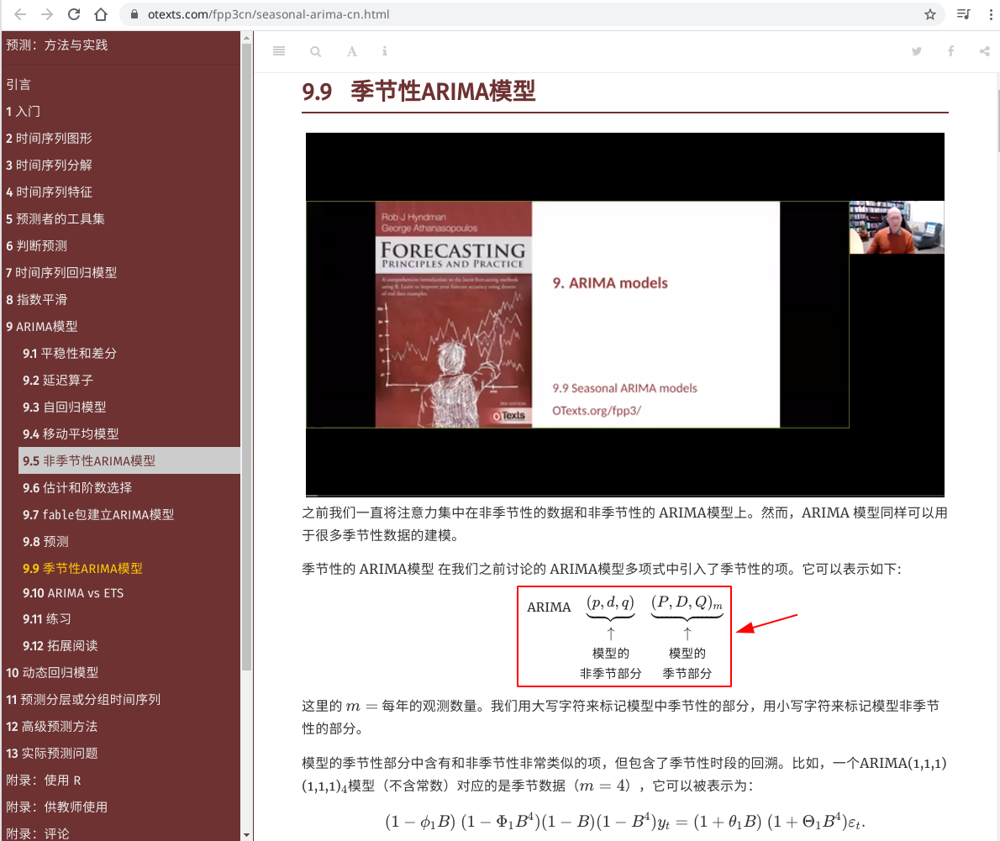
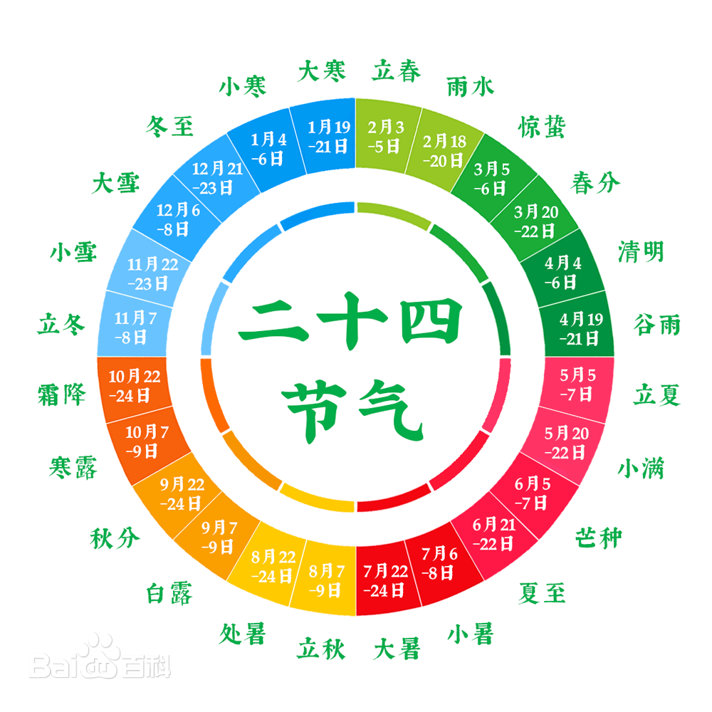
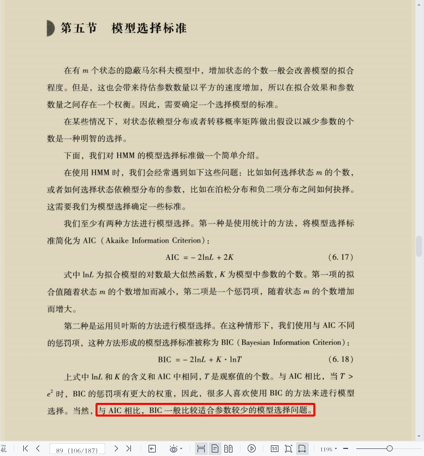

# 主题

## 大秦赋

### 孺子可教也

🚩🇲🇾🇹🇼🇨🇳大秦赋赢家ξng黄氏江夏堂

岂曰无衣，与子同袍。

子曰：“吾十有五而志于学，三十而立，四十而不惑，五十而知天命，六十而耳顺，七十而从心所欲，不逾矩。”——《为政》…

<br>
<span style='color:#9B111E'>**🚩🦔主题曲🦔🚩**</span>
<br>
<audio controls loop autoplay src="诸子百家诗经与古诗源/卜学亮 - 子曰.mp3" controls></audio>
<br>

> 赢家黄氏江夏堂、赢家黄氏巴东堂、儒家孔氏东鲁堂、道家卜氏西河堂、杏林林氏西河堂、道家与法家李氏陇西堂、商家苏氏阜阳堂

*引用：[牢记祖先，彰显祖宗功德，四百卅三个姓氏堂号大全](https://zhuanlan.zhihu.com/p/82039189)*

> **发问：**
> 
> 二十弱冠、三十而立、四十不惑、五十知天命、六十花甲子、七十古来稀、八十为<ruby>耄<rp>(</rp><rt>mào</rt><rp>)</rp>耋<rp>(</rp><rt>dié</rt><rp>)</rp></ruby>^[**<ruby>耄<rp>(</rp><rt>mào</rt><rp>)</rp>耋<rp>(</rp><rt>dié</rt><rp>)</rp></ruby>**两字连用代称八、九十岁<br>**<ruby>期<rp>(</rp><rt>qī</rt><rp>)</rp>颐<rp>(</rp><rt>yí</rt><rp>)</rp></ruby>**：百岁之人]、九十是什么？
> 
> **解答：**
> 
> 人初生叫婴儿，不满周岁称<ruby>襁<rp>(</rp><rt>qiǎng</rt><rp>)</rp>褓<rp>(</rp><rt>bǎo</rt><rp>)</rp></ruby>。
> 两至三岁称孩提。
> 女孩七岁称<ruby>髫<rp>(</rp><rt>tiáo</rt><rp>)</rp></ruby>年。男孩七岁称<ruby>韶<rp>(</rp><rt>sháo</rt><rp>)</rp></ruby>年。
> 十岁以下称黄口。
> 十三岁至十五岁称舞<ruby>勺<rp>(</rp><rt>sháo</rt><rp>)</rp></ruby>之年。
> 十五岁至廿岁称舞象之年。
> 女孩十二岁称金<ruby>钗<rp>(</rp><rt>chāi</rt><rp>)</rp></ruby>之年。
> 女孩十三岁称豆<ruby>蔻<rp>(</rp><rt>kòu</rt><rp>)</rp></ruby>年华。
> 女孩十五岁称及<ruby>笄<rp>(</rp><rt>jī</rt><rp>)</rp></ruby>之年。
> 十六岁称碧玉年华；
> 廿岁称桃李年华。
> 廿四岁称花信年华；女子出嫁称票？梅之年。
> 男子廿岁称弱冠。
> 卅岁称而立之年。
> 卌岁称不惑之年。
> 圩岁称知命之年。
> 园岁称花甲或耳顺之年。
> 进岁称古稀之年。
> 枯岁称杖朝之年。
> 枯至<ruby>枠<rp>(</rp><rt>huà</rt><rp>)</rp></ruby>岁称合？之年，<ruby>耄<rp>(</rp><rt>mào</rt><rp>)</rp>耋<rp>(</rp><rt>dié</rt><rp>)</rp></ruby>之年。
> 一百岁乐<ruby>期<rp>(</rp><rt>qī</rt><rp>)</rp>颐<rp>(</rp><rt>yí</rt><rp>)</rp></ruby>。

*出处：[二十弱冠、三十而立、四十不惑、五十知天命、六十花甲子、七十古来稀、八十为耄耋、九十是什么？](https://m.ximalaya.com/ask/q6728110)*

> **发问：**
> 
> 七十古稀、八十<ruby>耄<rp>(</rp><rt>mào</rt><rp>)</rp>耋<rp>(</rp><rt>dié</rt><rp>)</rp></ruby>、九十是什么？
> 
> **解答：**
> 
> 七十古稀，八十耄耋，九十也是耋耄。耄耋是指年纪很大的老人。出自《论语•为政》：“十有五，而志于学，三十而立，四十而不惑，五十而知天命，六十而耳顺，七十而从心所欲，不逾矩。”然而曾仕强教授在百家讲坛，易经的奥秘中曾讲说，这几句的话的另一种意思：“在人的十五岁时候决定学习的方向，三十岁的时候确定一生的原则，四十岁的时候对人生的目标不再动摇，五十岁的时候明白命运是自己造就的，六十岁的时候广泛听取多种意见，这样到七十岁的时候可以按照自己的心意去做就绝对不会做出逾矩的事情。”
> 
> 一般九十岁也与八十岁一样称为耄耋之年，可称九十耄耋。耄耋的汉字意思是指老年或年纪很大的人，根据典籍《礼记•曲礼》的相关记载“八十九十耄耋“，人们依照这个说明，将耄耋二字连用代称八十与九十。
> 
> 耄耋之前的代称出自《论语》，其中比较广为人知的年龄代称是三十而立，四十不惑，五十而知天命，六十而耳顺，七十而从心所欲。
> 
> 老人家一般到百岁可称之为期颐之年，典籍《礼记•曲礼》中提到“百年曰期颐“。成语“颐养天年“指的就是百岁老人家。
> 
> - 耄耋之年其实就是指的这个人已经八九十岁了，如今的中国耄耋之年的老人还是非常多的。
> - 除了耄耋之外还有弱冠、而立、不惑、知天命、花甲、古稀这些对年龄的称呼，这些都是祖辈用来称呼一个人的年纪。
> - 花甲，是指人到六十岁。这与我国古代干支纪年有关。十天干与十二地支按顺序错综搭配成六十袜斗个单位，每一干启好陆支代表一年，六十年周而复始形成一循环，故称为“六十花甲子”。《西游记》第悄顷二十回：“（老者）道： 痴长六十一岁。行者道： 好！好！好！花甲重逢矣。 ”
> - 古稀之年是指人到七十岁。语出自杜甫《曲江》诗：“酒债寻常行处有，人生七十古来稀。”
> - 所谓“期颐之年”则是指人一百岁。《礼记•曲礼上》曰：“百岁曰期颐。”朱<ruby>熹<rp>(</rp><rt>xī</rt><rp>)</rp></ruby>解释说：“周匝之义（即转过一圈的意思），谓百年已周。”所以，期颐即人活得圆满，寿高百岁之意。
> 
> 形容耋耄的成语：老态龙钟、<ruby>鹤<rp>(</rp><rt>hè</rt><rp>)</rp>发<rp>(</rp><rt>fà</rt><rp>)</rp>童<rp>(</rp><rt>tóng</rt><rp>)</rp>颜<rp>(</rp><rt>yán</rt><rp>)</rp></ruby>、老当益壮、七老八十、白首之心、<ruby>老<rp>(</rp><rt>lǎo</rt><rp>)</rp>骥<rp>(</rp><rt>jì</rt><rp>)</rp>伏<rp>(</rp><rt>fú</rt><rp>)</rp>枥<rp>(</rp><rt>lì</rt><rp>)</rp></ruby>、返老还童、宝刀未老、<ruby>雪<rp>(</rp><rt>xuě</rt><rp>)</rp>鬓<rp>(</rp><rt>bìn</rt><rp>)</rp>霜<rp>(</rp><rt>shuāng</rt><rp>)</rp>鬟<rp>(</rp><rt>huán</rt><rp>)</rp></ruby>。

*出处：[七十古稀、八十耄耋、九十是什么？](https://m.ximalaya.com/ask/q6379714)*

### 祖宗十八代

> 赢家黄氏江夏堂、赢家黄氏巴东堂、儒家孔氏东鲁堂、道家卜氏西河堂、杏林林氏西河堂、道家与法家李氏陇西堂、商家苏氏阜阳堂

*引用：[牢记祖先，彰显祖宗功德，四百卅三个姓氏堂号大全](https://zhuanlan.zhihu.com/p/82039189)*

> **释义**
> 
> 祖宗十八代一语用来形容事或人的源远流长。比如叙事的有"这不知是祖宗十八代哪一代发生的事"，说人的有"他家的祖宗十八代里一定是哪一代积了德,所以才有了好报"
> 
> **《尔雅•释亲》**
> 
> {width=400}
> 
> {width=400}
> 
> - 一、父为考，母为妣。
> - 二、父之考为王父，父之妣为王母。
> - 三、王父之考为曾祖王父，王父之妣为曾祖王母。
> - 四、曾祖王父之考为高祖王父，曾祖王父之妣为高祖王母。
> - 五、父之世父、叔父为从祖祖父，父之世母、叔母为从祖祖母。
> - 六、父之<ruby>晜<rp>(</rp><rt>kūn</rt><rp>)</rp></ruby>弟，先生为世父，后生为叔父。
> - 七、男子先生为兄，后生为弟。
> - 八、谓女子，先生为姊，后生为妹。
> - 九、父之姊妹为姑。
> - 十、父之从父晜弟为从祖父，父之从祖晜弟为族父。
> - 十一、族父之子相谓为族晜弟。
> - 十二、族晜弟之子相谓为亲同姓。
> - 十三、兄之子、弟之子，相谓为从父晜弟。
> - 十四、子之子为孙，孙之子为曾孙，曾孙之子为玄孙，玄孙之子为来孙，来孙之子为晜孙，晜孙之子为仍孙，仍孙之子为云孙 [1]。
> - 十五、王父之姊妹为王姑。
> - 十六、曾祖王父之姊妹为曾祖王姑。
> - 十七、高祖王父之姊妹为高祖王姑。
> - 十八、父之从父姊妹为从祖姑。
> - 十九、父之从祖姊妹为族祖姑。
> - 廿、父之从父晜弟之母为从祖王母。
> - 廿一、父之从祖晜弟之母为族祖王母。
> - 廿二、父之兄妻为世母，父之弟妻为叔母。
> - 廿三、父之从父晜弟之妻为从祖母，父之从祖晜弟之妻为族祖母。
> - 廿四、父之从祖祖父为族曾王父，父之从祖祖母为族曾王母。
> - 廿五、父之妾为庶母。
> - 廿六、祖，王父也。
> - 廿七、<ruby>晜<rp>(</rp><rt>kūn</rt><rp>)</rp></ruby>，兄也。──宗族
> - 廿八、母之考为外王父，母之妣为外王母。
> - 廿九、母之王考为外曾王父，母之王妣为外曾王母。
> - 卅、母之晜弟为舅，母之从父晜弟为从舅。
> - 卅一、母之姊妹为从母。
> - 卅二、从母之男子为从母晜弟，其女子子为从母姊妹。──母党
> - 卅三、妻之父为外舅，妻之母为外姑。
> - 卅四、姑之子为甥，舅之子为甥，妻之晜弟为甥，姊妹之夫为甥。
> - 卅五、妻之姊妹同出为姨。
> - 卅六、女子谓姊妹之夫为私。
> - 卅七、男子谓姊妹之子为出。
> - 卅八、女子谓晜弟之子为侄，谓出之子为离孙，谓侄之子为归孙。
> - 卅九、女子子之子为外孙。
> - 卌、女子同出，谓先生为姒，后生为娣。
> - 卌一、女子谓兄之妻为嫂，弟之妻为妇。
> - 卌二、长妇谓稚妇为娣妇，娣妇谓长妇为姒妇。──妻党
> - 卌三、妇称夫之父曰舅，称夫之母曰姑。
> - 卌四、姑舅在则曰君舅、君姑；没则曰先舅、先姑。
> - 卌五、谓夫之庶母为少姑，夫之兄为兄公，夫之弟为叔，夫之姊为女公，夫之妹为女妹。
> - 卌六、子之妻为妇，长妇为嫡妇，众妇为庶妇。
> - 卌七、女子子之夫为壻，壻之父为姻，妇之父为婚。
> - 卌八、父之党为宗族，母与妻之党为兄弟。
> - 卌九、妇之父母、壻之父母，相谓为婚姻。
> - 圩、两壻相谓为亚。
> - 圩一、妇之党为婚兄弟，壻之党为姻兄弟。
> - 圩二、嫔，妇也。
> - 圩三、谓我舅者，吾谓之甥也。──婚姻

*出处：[「问百度」祖宗十八代](https://baike.baidu.com/item/祖宗十八代/8539817)*

> 所谓祖宗十八代是指自己上下九代的宗族成员。
> 
> - 上九代为：父、祖、曾祖、高祖、天祖、列祖、太祖、远祖、鼻祖。
> - 下九代为：子、孙子、曾孙、玄孙、来孙、晜孙、仍孙、云孙、耳孙。
> 
> 从小到大为：耳、云、仍、晜、来、玄、曾、孙、子、父、祖、曾、高、天、烈、太、远、鼻。你以上的九代和你以后的九代称为祖宗十八代。
> 
> {width=400}
> 
> **扩展资料：**
> 
> 祖宗十八代——祖宗十八代，顾名思义，上九代，下九代，这其中的所有人都是在这十八代当中。这里要注意的一点就是自己，简称“己”，“自己”是上九代与下九代的分水岭，不包含在“祖宗十八代”之内。
> 
> - 上序称谓：生己者为父母，父之父为祖，祖父之父为曾祖，曾祖之父为高祖，高祖之父为天祖，天祖之父为烈祖，烈祖之父为太祖，太祖之父为远祖，远祖之父为鼻祖。即：父、祖、曾、高、天、烈、太、远、鼻。书中说：因人怀胎，鼻先受形，故鼻祖为始祖。
> - 下序称谓：父之子为子，子之子为孙，孙之子为曾孙，曾孙之子为玄孙，玄孙之子为来孙，来孙之子为<ruby>晜<rp>(</rp><rt>kūn</rt><rp>)</rp></ruby>孙，晜孙之子为仍孙，仍孙之子为云孙，云孙之子为耳孙。即：子、孙、曾、玄、来、<ruby>晜<rp>(</rp><rt>kūn</rt><rp>)</rp></ruby>、仍、云、耳。书中说：耳孙者，谓祖甚远，仅耳目闻之也。“远祖者，几世乎，九世矣。”为证也！
> 
> - 远祖：远祖、太高、太尊、先、祖先、先君、先人、祖考等，皆可称远祖。
> - 始祖：始祖、鼻祖，皆可称始祖。
> - 高祖：曾祖的父亲。高祖、高祖王父、显考、长祖、高门等，皆可称高祖。
> - 高祖母：曾祖之母，亦可称高祖王母。
> - 曾祖：祖父的父亲。曾祖、曾祖王父、曾祖父、皇考、府君、太翁、次长祖、曾翁、曾门、曾大父、曾父、曾太公、大王父、王大父等，皆可称曾祖。
> - 曾祖母：祖父之母，亦可称曾祖王母。
> - (曾祖的兄弟及兄弟之妻，称“族曾王父”、“族曾祖父”，“族曾王母”、“族曾祖母”)
> - 祖父：父亲的父亲。祖父、王父、大王父、祖王父、大父、祖君、祖翁、公、太公等，皆可称祖父。对人称其祖父曰“家公”。称人之祖曰“尊祖父”。称已故祖父曰“亡祖”、“亡考”、“皇祖考”、“府君”、“先祖”、“先子”、“先亡丈人”等。称人之已故祖父曰“大门中”。
> - (祖父的兄弟称“从祖祖父”、“从祖世父”、“从祖叔父”、“从祖王父”、“伯翁”、“叔翁”)
> - 祖母：父亲的母亲。祖母、王母、大母、太母、祖婆等，皆可称祖母。称人祖母曰“尊祖母”。称已故祖母曰“皇祖妣”。祖父之妾称“季祖母”“妾祖姑”。从祖祖父之妻称“从祖祖母”“从祖世母”“从祖叔母”“从祖王母”“从祖母”“季祖母”“伯祖妣”等。
> 
> 中国人“三姑六舅”，对本祖一脉上下或亲戚关系称谓有严格的规定，在现实中曾经出现过这样一个难题，一个上下差7代的晚辈不知道如何称呼比自己大8辈的长辈，出现令人难堪的场面。现在依据中国《汉语大辞典》、东汉的《尔雅•释亲》和《春秋公羊传•庄公四年》等史书考证，才确定了中国人本族内“上下九辈”的称呼。
> 
> 为什么上九代叫做鼻呢？这里面有个比较有意思的古人常识。在古人的观念中，人在肚子里的时候，最先长出的就是鼻子，所以，就把最久远的祖宗叫做鼻祖。同样比较有意思的是，古人把下九代中最末一代的子孙叫做耳孙。那么，为什么这样叫呢？
> 
> 因为耳孙距离自己的祖宗太遥远了，从来没有见过，也只是听说过而已，所以，有了这样的称呼。从耳到鼻，在脸上不到一扎长，没想到在辈分中，竟然隔了十八辈。
> 
> **参考链接：**
> 
> [「问百度」百度百科——祖宗十八代](https://baike.baidu.com/item/%E7%A5%96%E5%AE%97%E5%8D%81%E5%85%AB%E4%BB%A3/8539817)

*出处：[「问百度」请问关于这上九代和下九代都是怎么称呼的？ 之前查的往上是曾祖、高祖、天祖、列祖、太祖、远祖、鼻祖](https://jingyan.baidu.com/article/a681b0de7316337a184346ed.html)*

- [「吴氏在线」“世界最长家谱”《 孔子世家谱》被湖北省档案馆收藏](http://www.cnwu.net/baijiaxingshi/2458.html)
- [「知乎」中国古代亲属称谓家谱总览](https://zhuanlan.zhihu.com/p/458028908)
- [「问百度」请问关于这上九代和下九代都是怎么称呼的？ 之前查的往上是曾祖、高祖、天祖、列祖、太祖、远祖、鼻祖](https://jingyan.baidu.com/article/a681b0de7316337a184346ed.html)
- [「元宇宙」春节拜年，亲戚怎么叫？](https://www.facebook.com/englianhu/posts/pfbid0cqugyMqSdk1DBwzB8XiawCCz8bRXf5mZktm1Wr2WKs1ozj1D84FpB9RYXuCrmzDTl)
- [「问百度」我怎么称呼我堂叔的儿子啊？ 他比我小 应该怎么称呼？ 叫堂弟吗？ 可是堂叔的儿子已经不是堂了啊？](https://zhidao.baidu.com/question/291505101/answer/3012972358.html)
- [「范本模板」古代称谓大全](https://wenku.baidu.com/view/8a3d6c3ca3c7aa00b52acfc789eb172dec639967.html?_wkts_=1709365939475&bdQuery=%E6%A8%A1%E6%9D%BF%E5%8F%A4%E7%A7%B0)
- [古代尊称荟萃](https://wenku.baidu.com/view/2324997758fafab069dc0256.html?_wkts_=1709527487300&bdQuery=春秋战国论文称呼大全)
- [传统文化丨“八拜之交”是指哪八拜？](https://www.facebook.com/xyzhiju/posts/pfbid02hRxd7rzkyVFGWAUdhJGHjtwTqgiyQaD4aQpSmUBdAqRG3VfUE87JyjkN2yyL4YWTl)
- [外曾祖父是什么？](https://jingyan.baidu.com/article/fd8044fa377fec1131137ab6.html)
- [字典「胤」](https://zidian.bmcx.com/e883a4__zidianchaxun)
- [“公子”是姓氏吗？](https://m.ximalaya.com/ask/q7250124)

### 桃李满天下

> 赢家黄氏江夏堂、赢家黄氏巴东堂、儒家孔氏东鲁堂、道家卜氏西河堂、杏林林氏西河堂、道家与法家李氏陇西堂、商家苏氏阜阳堂

*引用：[牢记祖先，彰显祖宗功德，四百卅三个姓氏堂号大全](https://zhuanlan.zhihu.com/p/82039189)*

- [「吴氏在线」“世界最长家谱”《 孔子世家谱》被湖北省档案馆收藏](http://www.cnwu.net/baijiaxingshi/2458.html)
- [中国古代亲属称谓家谱总览](https://zhuanlan.zhihu.com/p/458028908)
- [「元宇宙」春节拜年，亲戚怎么叫？](https://www.facebook.com/englianhu/posts/pfbid0cqugyMqSdk1DBwzB8XiawCCz8bRXf5mZktm1Wr2WKs1ozj1D84FpB9RYXuCrmzDTl)
- [「百度」我怎么称呼我堂叔的儿子啊？ 他比我小 应该怎么称呼？ 叫堂弟吗？ 可是堂叔的儿子已经不是堂了啊？](https://zhidao.baidu.com/question/291505101/answer/3012972358.html)
- [「范本模板」古代称谓大全](https://wenku.baidu.com/view/8a3d6c3ca3c7aa00b52acfc789eb172dec639967.html?_wkts_=1709365939475&bdQuery=%E6%A8%A1%E6%9D%BF%E5%8F%A4%E7%A7%B0)
- [古代尊称荟萃](https://wenku.baidu.com/view/2324997758fafab069dc0256.html?_wkts_=1709527487300&bdQuery=春秋战国论文称呼大全)
- [传统文化丨“八拜之交”是指哪八拜？](https://www.facebook.com/xyzhiju/posts/pfbid02hRxd7rzkyVFGWAUdhJGHjtwTqgiyQaD4aQpSmUBdAqRG3VfUE87JyjkN2yyL4YWTl)

> 阳历二零四年十一月廿一日，全球第一所孔子学院正式在韩国首都首尔挂牌成立。截至阳历二零二零年七月卅一日，全球已有百圆二国家（地区）设立了五百卌三所孔子学院和千百进个孔子课堂：
> 
- 亚洲卅九国（地区），孔子学院百卅五所、孔子课堂百十五个
- 非洲卌六国，孔子学院圆一所、孔子课堂卌八个
- 欧洲卌三国（地区），孔子学院百枯九所、孔子课堂三百卌六个
- 美洲廿七国，孔子学院百卅八所、孔子课堂五百圆个
- 大洋洲七国，孔子学院廿所、孔子课百零一个
>
阳历二零一八年开始，美国有几家大专院校相继关闭中国政府资助的孔子学院，最新一间是美国北佛罗里达大学，校方认为孔子学院的教学与大学理念不相符，决定终止合作…

*引用：[「维基百科」孔子学院列表](https://zh.wikipedia.org/wiki/孔子学院列表)*

*](诸子百家考工记/还有半社会主义半资本主义.png){width=400}

### 大秦四部曲

<iframe width="400" height="225" src="//player.bilibili.com/player.html?bvid=BV15r4y1c7Kv" title="九分钟速看《大秦帝国》系列四部剧情" frameborder="0" allow="accelerometer; autoplay; clipboard-write; encrypted-media; gyroscope; picture-in-picture; web-share" referrerpolicy="strict-origin-when-cross-origin" allowfullscreen></iframe>

*出处：[九分钟速看《大秦帝国》系列四部剧情](https://www.bilibili.com/video/BV15r4y1c7Kv)*

{width=400 height=225}

「世袭制道家黄河文明、黄埔军校、黄种人，拯救亚洲人」🌟儒家秦孝公清君侧，延续🇬🇧英属留下的世俗国治国之道，各种族训要遵守回各自祖籍的习俗文化宗教语言法律，多元习俗文化宗教语言，才不会种族互相厮杀而只是《可兰经》歼灭所有回教徒和《吠陀经》歼灭所有兴都教徒和《圣经》歼灭所有洋蕃男女，禁止🇬🇧英属共运会所有殖民诸藩渔翁得利，重返亚洲。借鉴[文明史](#文明史)，何谓多元种族世俗国家？各种族在向英国政府争取独立时签署条约，各种族不许越权去插手别种族的事情。

- 巫统是世袭制法家《可兰经》回教刑事法典断肢法的巫贼巫婆非法回教徒民族政党。
- 🌟海外华人公会是只有世袭制道教徒和（孔子在公元前创办的儒学，公元前并没有基督耶稣和洋蕃，犹太人只有被回教徒屠杀和集体逃亡）创办人学术份子陈祯禄公爵，所以禁止任何收录外来的任何回教徒、峇峇娘惹、兴都教徒、任何基督耶稣、洋蕃。因为在英国殖民时期，咱们许多祖先是在清末光绪年间、鸦片战争、八国联军、甲午战争时期，因为战火和回教徒腐败政权导致民不聊生，才会飘洋过海到南洋|星洲，咱们许多南方（福建省、广东省、广西省、台湾省）同胞学术造诣不高，多数都是迷信和虔诚的世袭制道教徒民俗，到了南洋|星洲后几乎都是语言不通（愚生的长辈几乎都没有高学术背景，在民不聊生和英殖民和日治年代也只上过两三年学堂而已）、都努力靠士农工商来占有一席之地。
- 国大党是世袭制《吠陀经》大宝森节和屠妖节习俗文化宗教语言的兴都教徒政党。
- 其它少数民族。

{width=400}

**咱们东南亚🌟海外华人公会（🌟马华公会）从是咱们全球华人至今第一个海外华人政党，至今都是唯一一个不曾被其它种族和宗教玷污的世袭制道教徒（创办人儒学）华人政党，只有收录咱们世袭制道教徒华人的华人政党（东亚华人政党国民党收录世袭制法家回教徒白崇禧、中共还有收录满洲转投国民党再投本中共的满族世袭制法家回教徒席龙飞、东南亚其他华人政党有收录兴都教徒和巫贼巫婆非法回教徒）。在中亚、西亚、南亚、欧洲、美洲（美国二零二二或二零二三年创办的前进党，也只是个不会中文只会美国洋文和美国洋人习俗文化宗教语言、而且党员几乎都是洋人、昙花一现的傀儡领导杨安泽Andrew Yang，岂能与咱们东南亚只有世袭制道教徒华人而且全是保留咱们所有中华五千多年习俗文化宗教语言党员的海外华人公会相提并论？）、大洋洲、非洲、南极洲目前都没有一个保留并且壮大咱们世袭制道教徒和咱们中华五千多年习俗文化的华人政党。**

借鉴[大秦赋：秦国官员制度之三公九卿](https://baijiahao.baidu.com/s?id=1685404909849357185)和[文明史](#文明史)来分析目前地球上七大洲五大洋的天下局势：

- 日本明治天皇的大东亚共荣圈以统一亚洲为口号和目标，“拯救亚洲人”的黄河文明史。
- 英国最高领导是王储（借鉴春秋战国到秦统天下史，万物皆有灵和天下只有一个皇帝，国王或王储的英文为King而皇帝和日本天皇叫Emperor）。
- 国民党和中华民国国父[「问百度」孙中山（孙逸仙）](https://baike.baidu.com/item/孙中山/128084)的西方医生背景，御史大夫（英文将“举人”phD毕业后称之为“Doctor”）。建立中国（秦国China）；不过咱们杏林林氏西河堂御史大夫会比较正统，古代秦国御史大夫叫“冯劫”，详情可查阅[秦朝御史大夫制度之历史得失](http://www.jsycjw.gov.cn/a/fTVCXnNzRH)。
- 🇨🇳🏹中国共产党以🇨🇳中华人民共和国国父[「问百度」毛泽东](https://baike.baidu.com/item/毛泽东/113835)身为荆州人和建立中国（秦国China）并且身职掌柜，类似长史李斯一人一下万人之上。
- 🌟海外华人公会（🌟马华公会）的创办人儒学学术份子陈祯禄公爵，来自于马六甲州（一个被葡萄牙和荷兰郁金香热潮后殖民过的州属），在世界二战中英德大战元气大损就纷纷从海外殖民领土撤回英国，而马来亚被英国政府受封公爵的海外华人政党领袖和回教徒与兴都教徒领导也是因此而从英国政府谈判而独立成为马来西亚。以世界文明史的三个种族宗教为主，为它日西征西亚而埋下伏笔；而之后香港回归中国和欧盟建立，更提高咱们海外华人公会的革命或推翻回教政权和西征（除了在南亚和西亚和非洲，甚至可以在欧盟诸侯立足）的地位和战略路线。查询秦国崛起史，公爵从秦献公、秦穆公到秦孝公，之后就是秦惠文王建立的王储的王国。
- 以“三公九卿”来分析，洋人司法界都是佯装老嬷嬷头戴白色女假头发，而可兰经回教刑事法典断肢法禁止任何回教徒色情，美国总统世袭制法家法官佐治瓦貹顿以大葱回教堂来立国的职位如同奉常或中郎将（美国政府规定，美国总统必须当过军人）而美国国务卿的职位在三公之下。欲知更多详情，可查阅[「问百度」历史｜秦代官职表](https://mbd.baidu.com/newspage/data/dtlandingsuper?nid=dt_5702868013429148813)。

由于愚生对于欧洲、非洲、大洋洲、美洲不熟悉治国路线也不曾到洋人国家了解风土民情，故此先借鉴司马错战略：“得蜀既得楚”聊泛亚高铁与东盟（东南亚诸蕃）。

| 种族 \\ 制度 | 世俗国       | 专制         |
|:------------:|:------------:|:------------:|
| 回教         | 东楚六郡[^1] | 元、清       |
| 非回教       | 东南亚诸蕃   | 从秦到宋、明 |

[^1]: 东楚六郡（马来西亚、新加坡、印尼、新巴布几内亚、汶莱、东帝汶）的印裔是祖籍印尼包括土著和巫裔非法回教徒（非法回教徒非法黄种人）、祖籍印度的兴都教徒和乌裔非法回教徒包括土著——非法回教徒和非法兴都教徒。非法回教徒就是那些数典忘祖不遵守公元前的千年法家（商鞅变法）对于非法民族立下的可兰经回教刑事法典习俗文化宗教语言断肢法的回教徒，也就是回教徒死囚或咱们世袭制道教徒黄河文明/黄埔军校/黄种人/世袭制道教徒赢家黄氏江夏堂旗下的累赘非法民族。

| 春秋战国  | 公国       | 王国         | 朝代 /朝廷  | 现代官爵 |
|:---------:|:----------:|:------------:|:-----------:|:--------:|
| 君主      | 公爵       | 王储 / 国王  | 皇帝        | 元首     |
| 谋臣      | 庶长       | 长史         | 宰相 / 丞相 | 总理     |
| 代表人物  | 商鞅       | 李斯         | 李斯        | 周恩来   |
| 代表作    | 《商君书》 | 《谏逐客书》 | 《李斯篆书》| 援越抗美 |

> …[秦朝](https://www.baike.com/wikiid/7231409760070123575)统一全国后，李斯成为第一个封建王朝的[丞相](https://www.baike.com/wikiid/4210767671112144494)，在职期间废除分封制，设立[郡县制](https://www.baike.com/wikiid/3202576393142195218)，统一文字、货币，[统一度量衡](https://www.baike.com/wikiid/8670066958374329044)，为[秦国](https://www.baike.com/wikiid/7268492337835278390)发展做出了巨大贡献…

*出处：[「抖音百科」李斯](https://www.baike.com/wikiid/7158714436400103461)*

{width=400}

借鉴每个国家立国路线旗下的国民种族当回到祖籍国就会出现疫情（马来西亚前领导拉萨之子回教徒纳吉夫妇访沙地阿拉伯和沙地阿拉伯之春与阿布拉病毒、二零一七年和二零一九年世界疫情），中国五千多年民不聊生、疫情与改朝换代史和中世纪与文艺复兴史，以美国的两大主要政党“驴子”和“大象”，共产党的弓箭狩猎，咱们海外华人公会身为亚洲公民和政党不要和欧盟敌对，通过政治和经济手段去北约中的成员国美国，瓦解美国。

- [世界华人人口分布•欧非和亚洲西部东半球西部（中亚、西亚、南亚、欧洲、非洲）的海外华人](https://mbd.baidu.com/newspage/data/dtlandingshare?sourceFrom=share_ugc&nid=dt_5159632483831192407)，咱们海内外母语中文或中国各地方籍贯方言的世袭制道教徒黄种人在天下诸侯变法中逆势崛起。
- [「知乎」中亚南亚人为什么管中国人叫秦？](https://www.zhihu.com/question/621447018)
- [「知乎」阿育王为什么不学秦始皇彻底统一印度？](https://www.zhihu.com/question/589511804)
- [「网易」古代中国为什么要控制黄沙弥漫的新疆，而不是征服富饶的东南亚？](https://www.163.com/dy/article/GRH7SROR0543VDO7.html)
- [「网易」伟大！外国人为什么叫我们为“China”？](https://www.163.com/dy/article/GIT0DJ2Q0534G1E7.html)
- [大秦赋：秦国官员制度之三公九卿](https://baijiahao.baidu.com/s?id=1685404909849357185)
- [秦朝官制](https://www.jianshu.com/p/242233f11025)
- [秦朝二十级军功爵位制](https://baike.baidu.com/item/秦朝二十级军功爵位制/7579155)
- [秦国的官职等级有哪些？](https://zq.zhaopin.com/question/6950481)
- [现代军衔的雏形——秦朝二十个爵位](https://baijiahao.baidu.com/s?id=1769196315441044232)
- [秦朝中央和地方官员设置及名称](https://baijiahao.baidu.com/s?id=1751701997238946433)
- [「问百度」历史｜秦代官职表](https://mbd.baidu.com/newspage/data/dtlandingsuper?nid=dt_5702868013429148813)

## 古诗

### 一万个为什么🎶

<iframe width="400" height="225" src="https://youtube.com/embed/S7BNq1Jbzr4" title="δ「抖音」万岁爷：一万个为什么" frameborder="0" allow="accelerometer; autoplay; clipboard-write; encrypted-media; gyroscope; picture-in-picture; web-share" referrerpolicy="strict-origin-when-cross-origin" allowfullscreen></iframe>

*出处：[δ「抖音」万岁爷：一万个为什么](https://youtu.be/S7BNq1Jbzr4)*

*莘莘学子，赤子之心。*

{width=400}

最近几年民不聊生、百业萧条、生灵涂炭、☪️🕉️可兰经回教巫术刑事法典断肢法习俗文化宗教语言、巫统民族Onn Jafaar温家法（世袭制可兰经法家回教徒巫贼巫婆家暴习俗文化 Family Violence/Domestic Violence）、妖言惑众、蛊惑民心。借鉴世界四大文明史，核武器歼灭所有敌人《可兰经回教刑事法典断肢法》（可兰经回教巫术习俗文化宗教语言法律）和《吠陀经》（大宝森节和屠妖节习俗文化）的印裔非法回教徒和非法兴都教徒——祖籍印尼和印度的印裔回教徒和兴都教徒，建立咱们世袭制道家六四学术中华民族政府。

🚩🦔Great Britain = 🇬🇧大英帝国<br>
🚩🦔Greater Chin / Republic of China / Republic People of China = 大秦帝国/大秦赋<br>
🚩🦔Greater Chinese = 大秦子民（爱民如子）<br>
🚩🦔Oversea Greater Chinese = 海外大秦子民（爱民如子）<br>
🚩🦔Oversea Greater Chinese Association = 海外大秦子民公会（秦始皇的秦太祖——🌟秦孝公/🌟儒家陈祯禄公爵，联合秦始皇——秦始祖嬴政，爱民如子，R鄀计数编程学术份子商鞅变法联合咱们世袭制道家学术份子（世袭制道家宫殿、寺庙、姓氏堂号子嗣贞节牌坊、姻缘算卜概率论）高频对冲基金算卜，回教徒以可兰经回教刑事法典断肢法铲除所有敌人印裔（祖籍印尼和印度的兴都教徒、回教徒九一一恐怖份子宦官民族、土著、峇峇娘惹），终止巫术以任何形式、包括指鹿为马、屠杀人类，甚至铲除全球回教徒攻陷回教宗祖国麦家🕋🇹🇷🇸🇦瓦解全球回教，拯救全球）

🚩🇲🇾🇹🇼🇨🇳🌟🐯秦孝公 | 🇲🇾🇹🇼🇨🇳🌟🐯姜太公——🇲🇾🇹🇼🇨🇳🌟陈祯禄公爵/🇲🇾🇹🇼🇨🇳🐯邱德拔公爵/🇲🇾🇹🇼🇨🇳🍁叶亚来队长/🇲🇾🇹🇼🇨🇳🍁叶观盛队长

🚩🦔《大秦赋》<br>
🚩🦔巫师治国，禍殃全球；<br>
🚩🦔印裔尽弃，瓦釜雷鸣。<br>
🚩🦔商鞅变法，铲除印裔[^1]；<br>
🚩🦔车裂刘瑾，中华执政。<br>
🚩🦔一带一路，横跨七洲；<br>
🚩🦔史无前例，一统天下。<br>
🚩🦔高频量化，对冲基金；<br>
🚩🦔只争朝夕，不负韶华。<br>
🚩🦔学海无涯，唯勤是岸；<br>
🚩🦔莫忘初衷，方得始终。

《大秦赋》<br>
🚩大秦孝公，秦惠文王；<br>
🚩始于商鞅，终于辛亥。<br>
🚩印裔尽弃，瓦釜雷鸣；<br>
🚩铲除印裔，终止屠杀。<br>
🚩中科红旗，同舟共济；<br>
🚩千古一帝，傲视全球。<br>
🚩一带一路，史无前例；<br>
🚩横跨七洲，一统天下。<br>
🚩学海无涯，唯秦是岸；<br>
🚩莫忘初衷，方得始终。

[^1]: 东楚六郡（马来西亚、新加坡、印尼、新巴布几内亚、汶莱、东帝汶）的印裔是祖籍印尼包括土著和巫裔非法回教徒（非法回教徒非法黄种人）、祖籍印度的兴都教徒和乌裔非法回教徒包括土著——非法回教徒和非法兴都教徒。非法回教徒就是那些数典忘祖不遵守公元前的千年法家（商鞅变法）对于非法民族立下的可兰经回教刑事法典习俗文化宗教语言断肢法的回教徒，也就是回教徒死囚或咱们世袭制道教徒黄河文明/黄埔军校/黄种人/世袭制道教徒赢家黄氏江夏堂旗下的累赘非法民族。 

### 文明史

**世界古文明**

世界古文明主要包括以下四个：

- **古代埃及文明**[^2]：位于非洲东北部尼罗河中下游地区，是世界四大文明古国之一，古埃及文明形成于六千年前（公元前四千年）左右，古埃及的居民是由北非的土著居民和来自西亚的塞姆人融合形成的，至前三百卌三年为止，共经历了前王朝、早王朝、古王国、第一中间期、中王国、第二中间期、新王国、第三中间期、后王朝九个时期卅一个王朝的统治。
- **古代巴比伦文明（美索不达米亚文明）**[^3]：发源于西亚的两河流域（今天的伊拉克境内），大约始于公元前三千五百年，是世界上最早的文明之一，其文化、宗教、政治制度等对后来的文明产生了深远的影响。
- **古代印度文明**[^4]：发源于南亚的印度河流域，大约始于公元前两千六百年，其文化、宗教、政治制度等同样对后来的文明产生了深远的影响。
- **中国文明（古代中国或古中国）**[^5]：发源于东亚的黄河流域，是世界上最早的文明之一，其文化、宗教、政治制度等对后来的文明产生了深远的影响。

这些文明各自在其发源地最早诞生，对后来的文明产生了巨大的影响，它们的文化、宗教、政治制度等在人类历史上留下了深刻的印记。

我国古代以天为主，以地为从，天和干相连叫天干，地和支相连叫地支，合起来叫天干地支，简称干支。 天干有10个，就是甲、乙、丙、丁、戊、己、庚、辛、壬、癸，地支有12个，依次是子、丑、寅、卯、辰、巳、午、未、申、酉、戌、亥。

借鉴世界四大文明史、和咱们中华五千年历史，黄河文明始于南方、而《三国志》中的蜀国、美国大葱回教堂白宫也是建立在南方反巫术赤印度人甚至连政党的图案借鉴十二生肖的动物，不过使用驴子（借鉴春秋战国阖闾与河边的驴子、《三国志》中的荆州牧刘表给刘备骑的驴子叫“的驴”）和大象（印度大象共和国）、中国国父毛泽东武昌起义也是始于南方楚国荆州，如果它日南极洲有人类（爱斯基摩人）居住，估计礼逆袭🐧都能成为咱们世袭制道教徒十二生肖甚至起义一统天下。借鉴中东回教神明「阿拉丁神灯」、女回教徒「泰姬陵」和兴都教徒的屠杀白骨精的「屠妖节」与「大宝森节」节庆习俗文化，咱们道家中的天干「己」字为自己，回教巫文为diri，而福建闽南语发音为kaki。马来西亚的印度裔同胞的身份证一律需要和回教巫裔一样添加个父亲名，若以回教或兴都的诸子百家为标准就只有杀戮的家暴兼暴政习俗文化宗教信仰语言法律。

- 巫裔男回教徒宦官 XXX bin 殡阿杜拉
- 巫裔女回教徒宦官 XXX binti 殡敌阿杜拉
- 印度裔兴都教徒 XXX anak lelaki XXX，中文可译为谁的公子
- 印度裔兴都教徒 xxc anak perempuan XXX，中文可译为谁的千金

借鉴洋人的文艺复兴中的情色派和学术派，例如司徒、马克、斯蒂芬、美国犹太族的比尔•盖茨等，都是个世袭制姓氏，也就是说盗窃咱们公元前的道家世袭制道教徒姓氏堂号子嗣贞节牌坊。易经中的算卜是大数定律、概率论，而天文历法（农历）和夜观星象和紫微斗数都是天文学和士农工商、廿四节气是水文学和气象学和士农工商、风水是人文与环境兼物理学兼管理学等。

[^2]: **古代埃及文明**：位于非洲东北部尼罗河中下游地区，是世界上主要的原生文明之一。埃及文明最早形成于约7450年前，出现在下埃及的法尤姆地区。其历史可以分为几个时期，包括前王朝时期、早王朝、古王国、第一中间期、中王国、第二中间期、新王国、第三中间期、晚王国、托勒密王朝等。古埃及文明在古王国时期达到了巅峰，特别是在建筑方面，如大金字塔的建造。中王国时期，埃及经历了经济发展和文艺复兴。新王国时期，生产力显著提高，并开始对外扩张，成为了一个军事帝国。<br><br>古代埃及人发展了一套完整的文字系统（象形文字）、政治体系和制度，以及多神信仰的宗教体系。其文化特点显著，如对尼罗河的依赖、独特的艺术形式（如雕塑、绘画）、以及复杂的宗教信仰。另外，古埃及人还制定了世界上最早的天文历法，如太阳历和科普特历。<br><br>在物质文化方面，埃及人发展了独特的建筑技术，如建造金字塔和神庙。他们还使用了先进的数学和天文学知识来规划城市和农业活动。在精神文化方面，古埃及人相信死后生命和来世的存在，这反映在其复杂的葬礼习俗和木乃伊制作技术上。<br><br>古埃及文明对后世的文明，如古希腊、古罗马、犹太等文明产生了深远的影响。随着阿拉伯人和土耳其人的入侵，埃及逐渐阿拉伯化和奥斯曼化。十九世纪末，埃及成为英国的“保护国”。一九二二年，英国宣布埃及为独立国家。一九五三年，埃及共和国成立。一九七一年，改名为阿拉伯埃及共和国。

[^3]: **古巴比伦（Ancient Babylon）文明**位于伊拉克一带，古代巴比伦与古代埃及、古代印度、中国（另有权威报道描述为古代中国）一并称为“四大文明古国”。<br><br>流经伊拉克的底格里斯河和幼发拉底河的两河流域，产生过饮誉世界的两河流域文明，孕育了璀璨夺目的古巴比伦文明。巴比伦古城废墟遗迹被列为世界奇观，古巴比伦空中花园被誉为古代七大世界奇迹之一。

[^4]: **古代印度文明**是人类古老的主要文明之一，起源于南亚次大陆的印度河流域和恒河流域。这个文明以其丰富、玄奥和神奇的特点深深吸引着世人，对亚洲诸国包括中国产生了深远的影响。<br><br>古印度文明最初表现为印度河流域的文明，也被称为“哈拉巴文化”，大约存在于五千年前至三千年前。这个时期的人们已经使用了象形文字，并发展了复杂的城市规划和建筑技术。然而，这个文明在公元前两千年左右消失，被雅利安人入侵后的恒河流域文明所取代。雅利安人带来了种姓制度，并建立了多个小王国，这标志着古印度文明的第二个阶段。<br><br>在文学、哲学和自然科学等方面，古印度文明作出了重要贡献，其中包括《往世书》《摩诃婆罗多》《罗摩衍那》等重要文献，记录了大量的史实和神话故事。此外，古印度人在数学、天文学和医学等领域也有显著的成就。<br><br>古印度文明的特点还包括其宗教性，它是世界三大宗教之一佛教的诞生地。印度文化的多样性和复杂性也是其显著特征，包括多种语言和宗教派别。尽管古印度文明在历史上曾多次遭受外族入侵的影响，但它为人类文明留下了丰富的遗产，并对后世产生了深远的影响。

[^5]: **中国文明**是世界上古老的主要文明之一，也是世界上持续时间最长的文明之一。产生中华文明的重要因素非黄河和长江莫属了。在黄河流域产生的农业文明，受到历史时期自然地理因素的影响，不断向长江流域农业文明过渡、发展。长江流域农业文明是黄河流域农业文明的继承和发展。黄河流域早期农业一般主要是种植[粟](https://baike.baidu.com/item/粟)，长江流域农业主要是种植[水稻](https://baike.baidu.com/item/稻)。

问：为啥印度文明，能在两个回教文明中崛起？
答：因为可兰经回教刑事法典断肢法中禁止巫术（包括施展可兰经巫术窥听窥视、下降头、妖言惑众、蛊惑民心）、禁止中途拦路谋杀绑架暴力等、反叛、背叛、造反、判教... 所以大宝森节和屠妖节习俗文化，可以防止心存邪念去施展可兰经回教巫术在窥听窥视选择性在梦境里犯法、暴力、谋杀、草间人民、杀人放火、绑架、禁锢、肢体伤残、大屠杀等任何具有攻击性的犯罪活动。

问：为啥黄河文明可以在两个回教文明和印度文明中崛起？
答：因为回教文明和印度文明的杀戮法律和习俗文化是暴政所为，所以华夏民族以治安为主，建立一个以安全健康为主，防止任何邪灵入侵的朝代。咱们世袭制道教徒十二生肖秦人牧马赢家黄氏江夏堂黄种人黄埔军校都没有任何肢体伤残的习俗文化，玄学和物理学，在梦境里懂得自保和安全士农工商。（山寨版的半黄河文明，美国独立战争史建立大葱回教堂来反赤印度人（赤帝/印度国父宗教司甘地），金融业的证券行英文是Security Firm；而辛亥革命是反回教后禁止西方自治省份的喇嘛和新疆回教徒造反再逐渐南征和西征）。

### 诸子百家

#### 儒家

孔子、孟子（孟母断织）

#### 道家

[0015李耳為什麼要稱為“老子”而不是稱為“李子”呢？](https://youtu.be/6OQJMOyGwkE?si=LhmGTMNlJvgp0vU1)

> 春秋战国时期，随着经济发展及社会变革，统计思想和统计活动空前活跃，并产生了最初的统计分析。
> 
> 管仲，名夷吾（约公元前七百卅至公元前六百卌五年），曾任齐桓公的宰相卌年。《管子》一书着重阐述了管仲的思想，其中包括了管仲大量的统计思想和统计分析。管仲十分重视统计，对统计的作用以极高的评价：“不明于计数而欲举大事，犹无舟楫而经于水。险也。…遍知天下，而不明于机数，不能正天下。”
> 
> **以上「计数」、「机数」等语，泛指统计。**这些话的意思是说，要想管理好国家（“欲举大事”），得充分地认识国情（“遍知天下”）这些离不开统计（计数），对统计“不明”，国家管理就会紊乱，失去发展方向，（犹无舟楫而经于水。险也”。）

*引用：[浅谈春秋战国时期的统计分析](http://tjj.hunan.gov.cn/bsfw/tjkp/tjysh/201507/t20150717_3825224.html)*

> 鬼谷子是春秋战国时期最具神秘色彩的人物，是道家祖师之一，一生学识广博，又开创纵横家学派，被誉为千古奇人。民间流传他是神通广大的智者，具有未卜先知的能力。与先秦时期的孔子、孟子、韩非子等诸子百家的圣贤齐名，都是在华夏历史上留有浓墨重彩的人。
> 
> 鬼谷子，本名王禅，他创建鬼谷门派，道号玄微子。虽然他自己的事迹很少流传在世，是个不出世的高人，但是他的徒弟却个个名扬天下。鬼谷子的徒弟有苏秦、张仪、孙膑、庞涓、商鞅、吕不韦、白起、李牧、王翦、甘茂、乐毅、毛遂、赵奢等数百位精英，其中，八个徒弟最为知名，下面为大家详细叙说…

*出处：[鬼谷子的徒弟有哪些？](https://baijiahao.baidu.com/s?id=1750073704016307331)*

> **公元前**：鬼谷传奇，鬼谷子门徒R鄀计数学编程学术份子卫鞅论“帝道”、“王道”、“霸道” ；那些回教徒身为世袭制法家只需要遵守可兰经习俗文化宗教语言断肢法集体自宫自残自虐自杀即可。借鉴负责图书馆的文吏李斯（秦国长史，协助嬴政一统天下后建立秦朝成为宰相）老鼠哲学，「近朱者赤，近墨者黑」，赤印度人与印度人或非洲黑人也不可近之，咱们公元前夏朝的黄河文明和公元后近代史美国独立战争史都是取代回教和兴都文明。RR（Robert & Rose鄀计数|机数编程语言与《七龙珠之人造人》）从英俄到（世袭制道教徒十二生肖——赢家黄氏江夏堂黄种人的秦国、黄河文明、廉政公署、Security Firm金融市场与证券行）秦朝。
> 
> **公元后**：借鉴卧薪尝胆史，蜀国（老鼠哲学与世袭制道教徒十二生肖——赢家黄氏江夏堂黄种人的蜀国、黄河文明、廉政公署、Security Firm金融市场与证券行）世袭制道教徒卧龙「子非鼠，安知鼠之乐？」自修易经、算筹、天文历法、算卜、夜观星象、风水学、上知天文下知地理、通古知今无一不晓、量子电脑服务器、人造卫星、文言文编程等学术份子卧龙诸葛亮的「隆中对」，借鉴“三分天下后再做定夺”，如果咱们南方海外华人丞相/长史（海外华人公会🌟/马华公会🌟）孔明和祖国北方魏国大都督知音司马懿（字仲达，统一天下后建立晋朝）不是默契战争，蜀国最终会沦为回教国；孔明借东风🚀高效率歼灭所有敌人回教徒！


目前马来西亚政府向中国政府争取建立海外中国分校。

- 在马清华大学分校，[马中展开更多合作倡议，争取清华大学在马设分校](https://www.facebook.com/xyzhiju/posts/pfbid01JapCo6k5oumW4pYNqWArrRf9sWcKuUASjoR2exuhBSsxa3MLbMyMrjBQSLDegjLl)
- 在马复旦大学分校，[承认统考、英文教数理 砂拉越如何一步步争取“教育自主”？中国上海复旦大学，将在砂拉越设立分校？！](https://www.facebook.com/xyzhiju/posts/pfbid0tsr6uqWiQRUVZ4a6LNyWtWGzbFTQ5VCEq22EkGKrvayHcBWrH8R3o2QvxxCvPVdBl)
- 在马厦门大学分校，[蔡卓宜 - 厦门美食](https://www.instagram.com/p/Cjxd_GMLAes)。

中国史册：

- [史册号](https://www.shicehao.com)
- [词林](https://www.cilin.org)
- [族谱网](https://www.zupu.cn)
- [历史网](https://www.lishi.net)
- [中国历史研究院网](http://hrc.cass.cn)
- [人物介绍网](https://www.yuelishi.cn)
- [百家有谱](https://www.baijiayoupu.com)
- [历史记](https://www.lishiji.cn)
- [β博雅旅游分享网](http://www.bytravel.cn)
- [博雅人物网](http://ren.bytravel.cn)
- [洞鑑歷史](https://www.99tango.com/library)
- [中国人物传记网](https://www.chinarwzj.com)
- [「百家诸子」中国哲学书电子化计划](https://ctext.org/zhs)
- [當代中國](https://www.ourchinastory.com)
- [第一范文网](https://www.diyifanwen.com)
- [知识贝壳](https://www.zsbeike.com)
- [趣历史](http://www.qulishi.com/renwu/qinshihuang)
- [古诗文网](https://www.gushiwen.cn)
- [5000言](https://5000yan.com)
- [汉典](https://www.zdic.net)
- [学术交流联盟](http://bbs.97fc.com)
- [海词](http://www.cihai123.com)
- [828啦](https://www.828la.com)
- [X-MOL学术平台](https://www.x-mol.com)
- [arXiv](https://arxiv.org)
- [5000言](https://gwgz.5000yan.com)
- [古诗词网](https://www.gushici.net)
- [千篇国学](https://www.qianp.com)
- [国学百科](https://www.guoxuebaike.cn)
- [微信读书](https://weread.qq.com)
- [QQ阅读](https://m.yunqi.qq.com)
- [中国文化一千问](https://m.yunqi.qq.com/chapter/818018)

> [《万般皆下品，唯有读书高》]{style="color:#3C33FF"}<br>
[计量经济，一带一路；]{style="color:#6883FC"}<br>
[九二共识，量化对冲。]{style="color:#6883FC"}<br>
[鞭策六四，铲除黑帮^[愚生世袭制学术份子道教徒赢家黄氏江夏堂，联富高频量化对冲易经算卜数学概率论，孔明借东风水淹七军歼灭那些祖籍印尼和印度的印裔施展巫术屠杀六百枯万人类的金宝博巫师邪教印裔回教徒宦官博彩庄诸邦]；]{style="color:#6883FC"}<br>
[推广量化，提倡学术。]{style="color:#6883FC"}<br>
[百家争鸣，振兴中华；]{style="color:#6883FC"}<br>
[学海无涯，唯勤是岸。]{style="color:#6883FC"}

- [陕西历史文化名城](http://lishiwenhua.snnu.edu.cn/index.htm)
- [CCER 特供数据系统平台](http://www.ccerdata.cn)
- [一带一路数据库](https://www.ydylcn.com/skwx_ydyl/sublibrary?SiteID=1&ID=8721)
- [中国一带一路网](https://www.yidaiyilu.gov.cn)

```
##赢家黄氏江夏堂联富和家眷亲属（包括外祖父道家书法家李福李氏陇西堂和外祖母郑邓）、性格开朗的校花吴紫云（和性格开朗的明星蔡卓宜）和家眷亲属、神仙姐姐校花商家苏氏阜阳堂丽欣和家眷亲属、杏林林氏西河堂燕芳（和国民女神中药中医系杨雅、华联独中校友和日语班女同学林艳迎）和家眷亲属、好学的漂亮妞儿皇朝酒店唐宫郭子瑜（和明星肖黎希）和家眷亲属、莘莘学子、国民女神明星邱紫庭和邱爱晨俩、黄埔军校兵马俑世袭制学术份子高频量化对冲中科红旗辛亥革命

##歼灭瓜雪巴西不能帮新村门牌T十五号世袭制自残自虐自杀的失心疯猥亵淫魔土司乩童张佳坤、瓜雪RHU（淮西派）花园加德士油站隔壁第三巷门牌卅二号世袭制自残自虐自杀的失心疯猥亵淫魔土司乩童刘瑾貹/魔戒小丑咕噜/宗教司甘地、瓜雪回教警署巫贼巫婆回教徒黑米哈山殡刘、大港巴列特花园第十三巷门牌廿七廿九卅一号世袭制自残自虐自杀的失心疯猥亵淫魔土司乩童，点缀全球。 
nameserver 114.114.114.114
```

> 辛亥革命大秦赋日不落重八、德意志崇祯、古希腊ξηg神话、周公解梦、嬴政把春秋大梦实现为春秋大业、秦孝公招商（商鞅变法）、秦惠文王：全球有十六亿不吃猪肉的回教徒宦官（可兰经回教刑事法典断肢法）宗祖国是沙地阿拉伯麦加，需要靠中国政府一带一路战略（商鞅变法联合辛亥革命）。

{width=400}

*省吃俭用的工匠建筑工人（嬴政兼鲁班兼蒙毅）家翁嬴政ξηg Tεηg（赢家黄氏江夏堂）*

{width=400}

*个子矮小的领导邓小平/晏婴使楚：鞭策六四学术，推广量化；歼灭回教徒和峇峇娘惹，振兴中华。吕不韦著作《吕氏春秋》：奇货可居；索罗斯著作《金融炼金术》：物极必反论*

世间再无富不过三代的败家子祖父黄实田（曾祖黄福全在清末光绪年间和两个哥哥仨飘洋过海从满洲到星洲自力更生努力奋斗开垦一百亩农地，然后和土木工程的杨清廉俩在清末鸦片战争时期是瓜雪两大不相伯仲的首富）祖母颜为，省吃俭用的外祖父书法家李福（李斯篆书）外祖母郑邓（家道中落的富家千金）。

<br>

# 设定

## SCSS 设置

<style>
pre {
  overflow-x: auto;
}
pre code {
  word-wrap: normal;
  white-space: pre;
}
.table-hover > tbody > tr:hover { 
  background-color: #8D918D;
}
</style>

```{r 读取SASS, class.source='bg-success', class.output='bg-primary', error=TRUE}
##
## 中科红旗（诸子百家，文艺复兴）
## Oversea Greater Chinese Association 大秦子民公会（秦孝公 / 姜太公——陈祯禄公爵）
## 史无前例，一统天下
## 
## 
## 
## 中科红旗
## 全球中华民族，支持中共称霸天下战略。
## Great Britain 大英帝国
## Greater Chin 大秦赋
## Republic of China / Republic People of China 大秦赋（中华民国 / 中华人民共和国）
## Greater Chinese 大秦子民（爱民如子）
## Oversea Greater Chinese 大秦子民（爱民如子）
## Oversea Greater Chinese Union 大秦子民公会（秦孝公 / 姜太公——陈祯禄公爵）
## 史无前例，一统天下
##
## Great Britain = 大布列颠帝国/大英帝国1
## Greater Chin = 大秦赋
## Greater Chinese = 大秦子民（爱子如民）
##
## 马来西亚籍（海外中华民族，自从清末民初下南洋，咱们马来西亚陈祯禄创办 Oversea Chinese Union）秦始皇黄氏江夏堂，笑傲江湖最大文明贡献
##
## 一）借鉴以前大英帝国东印度公司，有生之年就把一带一路高铁所经过的国家领土，一律得攻占下来（要比以前大英帝国/大蒙古帝国还要强大）称霸天下，世代延续直至史无前例，一统天下。
## 二）一带一路所有告示牌、必须使用中文和汉语拼音。
## 三）借鉴大蒙古帝国骑兵所到之处寸草不生，所有被中国攻占下来的领土，所经之地（包括城市/市镇/乡村），一带一路所有高铁站，都建立国民登记局可以申请入籍中国。
## 四）川普已经发言多次，美国兵变，会再次内战（借鉴越王勾践，中越不内讧，善用马来西亚回教徒太监不造反牵制美国，军售中东/西亚/东欧回教诸国）
## 五）中东回教国回教徒九一一恐怖份子与美国开战，中国军售中东西亚/东欧/非洲回教国（借鉴越王勾践中华民族与美国洋人Democrats阖闾政府，中越不内讧，善用马来西亚回教徒太监不造反牵制美国，军售中东/西亚/东欧回教诸国）
## 六）中国目前高铁除了尚未与马来西亚达成协议开工建立高铁但是已经借鉴王翦只围不攻战略，把东南亚国家都温馨说服并建立高铁，中国先不与马来西亚开战，让马来西亚兵变内战（借鉴越王勾践中华民族与美国洋人Democrats阖闾政府，中越不内讧，善用马来西亚回教徒太监不造反牵制美国，军售中东/西亚/东欧回教诸国）
## 七）南太平洋战略：中国和东南亚已经签署合约，达成协议不使用空军、核武器，出动海陆军攻占东南亚
## 八）商鞅变法多多益善战略：最大贡献是全球16亿回教徒太监民族与全球基督洋人鹬蚌相争…回教徒默罕默德创办回教，建立可兰经回教刑事法典断肢法规定回教徒伪太监民族必须虔诚戴乌纱帽一天祈祷五次，倘若不虔诚施展巫术屠杀是触犯断肢法而虔诚屠杀也触犯断肢法，只有辛亥革命铲除全球回教徒、断肢法处死或宫刑全球回教徒绝子绝孙，多管齐下才能终止巫术屠杀，拯救全球16亿回教徒还俗。China大秦赋秦孝公至顾自己家族禁止七步诗自相残杀，铲除分一杯羹白骨精刘家彭城堂造反，回教徒会施展巫术屠杀人类，回教徒太监民族只能屠杀欧美洋人并且被断肢处死，不效忠中共称霸天下，直至一统天下的伪满洲国马来西亚1700万个回教徒九一一恐怖份子太监民族包括Michael Cutter Christopher，一律断肢法处死（借鉴越王勾践中华民族与美国洋人Democrats阖闾政府，中越不内讧，善用秦二世胡亥、辛亥革命、越王胡志明、中国胡景涛、马来西亚回教徒太监不反中共牵制美国，军售中东/西亚/东欧回教诸国对抗美国）。秦始皇在统一七国后就不思进取导致赵高李斯谋反（借鉴中国历史秦始皇，水能载舟亦能覆舟，宗教巫术，古惑民心，指鹿为马，成也赵李，败也赵李。所以秦始皇得铭记当初秦孝公，不能昏庸被回教徒篡位），中国借鉴秦孝公战略善用商朝和苏联俄罗斯叶利钦。秦始皇铭记秦孝公，善用全球回教徒古惑全球洋人再依照可兰经回教刑事法典断肢全球回教徒，让咱们全球中华民族支持中共，一统天下。
## 九）华尔街、史无前例的万里长城Great Wall Sreet、一带一路高铁：计量经济学、学术治国、编程、计数、科学科技、量化（Fisher姜太公钓鱼大数据，各行各业购物喜好、民意、生活习惯、各国各集团、军事、诊断上市公司等）、金融、贸易、经商、军事、发展各行各业。
## 十）中文编程语言：借鉴日本自从唐朝大话革新学习汉字至明治维新学习欧洲，日本是全球首个亚洲人自创Ruby红宝石编程语言（Ruby Text可以标音），自从2008年就开始使用R语言并且认识中国R语言论坛《统计之都》论坛创办人网友谢益辉和赵坚毅创办的中国最大计量经济学专业论坛《经管之家》至今十年有余、目前已经开始以中文编程，中华人民共和国的国庆日1001和中华民国的国庆日1010都是二进制的电脑语言binary code，如同黄埔军校国共本是一家，赢家黄氏江夏堂秦孝公禁止《七步诗》自相残杀。咱们东南亚中华民族几乎都是国民华校生，洋人研发电脑、许多编程语言R语言、C语言、C++，推广与发展中文，希望它日有咱们中华民族自创新的编程语言，均以中文编程。
## 十一）发展台式电脑操作系统：中科红旗是由中国北京大学校友孙玉芳创办将Linux礼逆袭和南非原住民开发的Kubuntu忽奔兔中文化并推出自家产品，在美国微软视窗Win台式电脑操作系统垄断全球十多二十年有余，目前已经开始使用芬兰研发的Linux礼逆袭、中国中科红旗台式电脑操作系统，推广与发展中科红旗。
##
## 《关雎——军官与淑女》
## 咱们中华民族和越族不可以死，隔壁后头邻居黄福全与本人（赢家黄氏江夏堂）祖父同名同姓。
##
## 借鉴欧洲中世纪，文艺复兴后就是开始海外军事，称霸天下之路。目前全球疫情已过三年，一带一路如火如荼进行着。
## 借鉴周公礼乐制度，大英帝国和大日本帝国向来都是自诩绅士淑女，孔子学院，以礼待人，来称霸天下。
## 借鉴指鹿为马的历史，百家争鸣如果散播回教徒屠杀罪、不杀马来西亚回教徒的话，就得处死回教徒学习可兰经，施展巫术下降头，古惑民心之罪，篡位咱们全球中华民族，人心惶惶、民不聊生，一律依照可兰经回教刑事法典断肢法处死回教徒巫师王（张佳坤Sulaiman Abdullah，分一杯羹白骨精巫师王刘瑾貹Abdul Halim）。
## 借鉴圣经、诺亚方舟（划龙舟）、孔子儒学（Confusion Catholic）、神父Father与信徒、中国历史、姬昌伯一扈兔子、徐达吃鹅肉、富不过三代的秦始皇嬴政秦二世胡亥至嬴政孙子、公爵、公公孙子、孙文辛亥革命、马来西亚火箭民主行动党由曾敏兴创党后林吉祥林冠英后换人、蒋介石蒋经国后就不延续世袭制，圣经都是善用父子关系，咱们中华民族和英系都是善用公孙关系、法官律师女子假发、自由女神。
## 中科红旗：借鉴北洋军阀与北约、杀袁者清，灭清者袁，许某可破北洋北约袁绍。黄埔军校国民党共产党辛亥革命是为了铲除回教徒，咱们东南亚回教徒身为伪满洲国九一一恐怖份子触犯可兰经回教刑事法典断肢法，组织个由回教徒执政的国民阵线（伪国民党）立国，1700万个马来西亚回教徒只能集体自杀，宣布亡国。
## 何谓中国（大秦赋Chin）？中华民国和中华人民共和国。咱们东南亚自从东亚清末民初几乎都是国民华校生，自从西周的周公开始礼乐制度后，大英帝国和大日本帝国都效仿来称霸天下做得有声有色、禁止回教巫术Judi博彩庄、艺人（异人）、导演巫师巫婆道衍师傅装疯卖傻、青山是印裔回教徒的归属地，回教巫师巫婆是屠杀人类的语言宗教习俗文化，得断肢法处死1700万个马来西亚印裔回教徒。

# install.packages('remotes', dependencies = TRUE, INSTALL_opts = '--no-lock')
library('BBmisc', 'rmsfuns')
#remotes::install_github("rstudio/sass")
lib('sass')

## https://support.rstudio.com/hc/en-us/articles/200532197
## https://community.rstudio.com/t/r-does-not-display-korean-chinese/30889/3?u=englianhu
#Sys.setlocale("LC_CTYPE", "en_US.UTF-8")
#Sys.setlocale("LC_CTYPE", "zh_CN.UTF-8")
#Sys.setlocale(category = "LC_CTYPE", "Chinese (Simplified)_China.936")
#Sys.setlocale(locale = "Chinese")
#Sys.setlocale(locale = "Japanese")
#Sys.setlocale(locale = "English")

# rmarkdown::render('/home/englianhu/Documents/owner/ryo-cn.Rmd',  encoding = 'UTF-8')
#Sys.setlocale("LC_CTYPE", "UTF-8")
#Sys.setlocale(locale = "UTF-8")
#Sys.setlocale(category = "LC_ALL", locale = "chs")
#Sys.setlocale(category = "LC_ALL", locale = "UTF-8")
#Sys.setlocale(category = "LC_ALL", locale = "Chinese")
#Sys.setlocale(category = "LC_ALL", locale = "zh_CN.UTF-8")

# Sys.setlocale("LC_ALL", "en_US.UTF-8")
```

```{scss SCSS设置, class.source='bg-success', class.output='bg-primary'}
/* https://stackoverflow.com/a/66029010/3806250 */
h1 { color: #002C54; }
h2 { color: #2F496E; }
h3 { color: #375E97; }
h4 { color: #556DAC; }
h5 { color: #92AAC7; }

/* ———————————————————— */
/* https://gist.github.com/himynameisdave/c7a7ed14500d29e58149#file-broken-gradient-animation-less */
.hover01 {
  /* color: #FFD64D; */
  background: linear-gradient(155deg, #EDAE01 0%, #FFEB94 100%);
  transition: all 0.45s;
  &:hover{
    background: linear-gradient(155deg, #EDAE01 20%, #FFEB94 80%);
    }
  }

.hover02 {
  color: #FFD64D;
  background: linear-gradient(155deg, #002C54 0%, #4CB5F5 100%);
  transition: all 0.45s;
  &:hover{
    background: linear-gradient(155deg, #002C54 20%, #4CB5F5 80%);
    }
  }

.hover03 {
  color: #FFD64D;
  background: linear-gradient(155deg, #A10115 0%, #FF3C5C 100%);
  transition: all 0.45s;
  &:hover{
    background: linear-gradient(155deg, #A10115 20%, #FF3C5C 80%);
    }
  }
```

```{r 编织选项, class.source='hover01', class.output='hover02', error=TRUE}
## 更换时间区域，保留日期时间。
Sys.setenv(TZ = 'Asia/Shanghai')

## 忽略所有警讯
## https://stackoverflow.com/a/36846793/3806250
## 设置宽度
## options(knitr.table.format = 'html')将所有kableExtra图表一致设置为'html'格式，省略设置各别图表。
## options(repos = 'https://cran.rstudio.com')将仓库设置为安全网。
## options(repos = 'http://cran.rstudio.com')将仓库设置为普通网。
options(warn = -1, width = 999, knitr.table.format = 'html', 
        digits = 22, digits.secs = Inf, repos = 'https://cran.rstudio.com')

## https://stackoverflow.com/questions/39417003/long-vectors-not-supported-yet-abnor-in-rmd-but-not-in-r-script
## https://yihui.org/knitr/options
knitr::opts_chunk$set(
  class.source = 'hover01', class.output = 'hover02', class.error = 'hover03', 
  message = FALSE, warning = FALSE, error = TRUE, autodep = TRUE, 
  autodep = TRUE, aniopts = 'loop', progress = TRUE, verbose = TRUE, 
  cache.globals = FALSE, cache = FALSE, cache.lazy = FALSE, result = 'asis')
```

## 设置

读取以下所需程序包。

```{r 读取程序包, error=TRUE}
## 读取程序包、设置编织与环境选项。
## 3210448065@qq.com
## leiou123

## 2849108450@qq.com
## leiou123
## https://rstudio.cloud/project/1198888

## 读取'BBmisc'程序包。
if (suppressMessages(!require('BBmisc'))) {
  install.packages('BBmisc', dependencies = TRUE, INSTALL_opts = '--no-lock')
}
suppressMessages(library('BBmisc'))

if (suppressMessages(!require('rmsfuns'))) {
  install.packages('rmsfuns', dependencies = TRUE, INSTALL_opts = '--no-lock')
}
suppressMessages(library('rmsfuns'))

if (!require('REmap')) devtools::install_github('lchiffon/REmap')

## 一次性读取所需程序包。
## 
## [R语言高效数据框操作：tidyfst](https://z.itpub.net/article/detail/5EE2CA3CDCD527ADAF5071BF2ADF8874)
## 
## [「知乎」tidyft高性能数据操作](https://zhuanlan.zhihu.com/p/128645634)
## 最下面是tidyft的性能，占用空间最少，花费时间最少。
##   其实这个包基本拥有tidyfst的所有功能，只是原位更新的概念对于新手是有挑战…

library('tidyfst', warn.conflicts = FALSE)
library('Ipaper', warn.conflicts = FALSE)
library('tidyft', warn.conflicts = FALSE)
library('dplyr', warn.conflicts = FALSE)
library('lubridate', warn.conflicts = FALSE)
library('data.table', warn.conflicts = FALSE)
library('conflicted', warn.conflicts = FALSE)

conflicted::conflicts_prefer(Ipaper::is_empty, .quiet = TRUE)
conflicted::conflicts_prefer(tidyft::nth, .quiet = TRUE)
conflicted::conflicts_prefer(tidyft::fill, .quiet = TRUE)
conflicted::conflicts_prefer(tidyft::nest, .quiet = TRUE)
conflicted::conflicts_prefer(tidyft::unnest, .quiet = TRUE)
conflicted::conflicts_prefer(tidyft::cummean, .quiet = TRUE)
conflicted::conflicts_prefer(tidyft::group_by, .quiet = TRUE)
conflicted::conflicts_prefer(tidyft::distinct, .quiet = TRUE)
conflicted::conflicts_prefer(tidyft::filter, .quiet = TRUE)
conflicted::conflicts_prefer(tidyft::select, .quiet = TRUE)
conflicted::conflicts_prefer(tidyft::rename, .quiet = TRUE)
conflicted::conflicts_prefer(tidyft::count, .quiet = TRUE)
conflicted::conflicts_prefer(tidyft::arrange, .quiet = TRUE)
conflicted::conflicts_prefer(tidyft::summarise, .quiet = TRUE)
conflicted::conflicts_prefer(tidyft::separate, .quiet = TRUE)
conflicted::conflicts_prefer(tidyft::lead, .quiet = TRUE)
conflicted::conflicts_prefer(tidyft::lag, .quiet = TRUE)
conflicted::conflicts_prefer(tidyft::unite, .quiet = TRUE)
conflicted::conflicts_prefer(tidyft::left_join, .quiet = TRUE)
conflicted::conflicts_prefer(tidyft::right_join, .quiet = TRUE)
conflicted::conflicts_prefer(tidyft::inner_join, .quiet = TRUE)
conflicted::conflicts_prefer(tidyft::full_join, .quiet = TRUE)
conflicted::conflicts_prefer(tidyft::anti_join, .quiet = TRUE)
conflicted::conflicts_prefer(tidyft::semi_join, .quiet = TRUE)
conflicted::conflicts_prefer(tidyft::select_dt, .quiet = TRUE)
conflicted::conflicts_prefer(tidyft::transpose, .quiet = TRUE)
conflicted::conflicts_prefer(tidyft::setDT, .quiet = TRUE)
conflicted::conflicts_prefer(tidyft::setnames, .quiet = TRUE)
conflicted::conflicts_prefer(dplyr::mutate, .quiet = TRUE)
conflicted::conflicts_prefer(dplyr::collapse, .quiet = TRUE)
conflicted::conflicts_prefer(lubridate::year, .quiet = TRUE)
conflicted::conflicts_prefer(data.table::first, .quiet = TRUE)
conflicted::conflicts_prefer(data.table::last, .quiet = TRUE)
conflicted::conflicts_prefer(data.table::between, .quiet = TRUE)
conflicted::conflicts_prefer(data.table::set, .quiet = TRUE)
conflicted::conflicts_prefer(data.table::`:=`, .quiet = TRUE)
conflicted::conflicts_prefer(magrittr::`%>%`, .quiet = TRUE)
conflicted::conflicts_prefer(Ipaper::`%->%`, .quiet = TRUE)
conflicted::conflicts_prefer(hms::hms, .quiet = TRUE)
conflicted::conflicts_prefer(forecast::accuracy, .quiet = TRUE)
conflicted::conflicts_prefer(base::load, .quiet = TRUE)
conflicted::conflicts_prefer(base::merge, .quiet = TRUE)
conflicted::conflicts_prefer(base::rank, .quiet = TRUE)
conflicted::conflicts_prefer(data.table::between, .quiet = TRUE)
conflicted::conflicts_prefer(plyr::llply, .quiet = TRUE)
conflicted::conflicts_prefer(tibble::view, .quiet = TRUE)
conflicted::conflicts_prefer(tidyft::separate, .quiet = TRUE)
conflicted::conflicts_prefer(lubridate::year, .quiet = TRUE)
conflicted::conflicts_prefer(gtools::permutations, .quiet = TRUE)
conflicted::conflicts_prefer(Ipaper::chunk, .quiet = TRUE)
conflicted::conflicts_prefer(formattable::percent, .quiet = TRUE)

程序包 <- c(
  'devtools', 'Ipaper', 'knitr', 'kableExtra', 'tint', 'furrr', 
  'tidyr', 'readr', 'lubridate', 'reprex', 'stringr', 'feather', 
  'purrr', 'quantmod', 'tidyquant', 'tibbletime', 'timetk', 'TSA', 
  'plyr', 'dplyr', 'dbplyr', 'dtplyr', 'cnum', 'arabic2kansuji', 
  'sarima', 'tidyverse', 'memoise', 'htmltools', 'formattable', 
  'zoo', 'forecast', 'seasonal', 'magrittr', 'hms', 'seasonalview', 
  'rjson', 'rugarch', 'rmgarch', 'mfGARCH', 'tidymodels', 'googleVis', 
  'feather', 'sparklyr', 'jcolors', 'microbenchmark', 'dendextend', 
  'vembedr', 'lhmetools', 'gtools', 'stringi', 'pacman', 'rlist', 
  'profmem', 'ggthemes', 'flyingfox', 'htmltools', 'echarts4r', 
  'viridis', 'hrbrthemes', 'profvis', 'fable', 'fabletools', 'rvest', 
  'fable.prophet', 'Metrics', 'MLmetrics')#, 'Rfast', 'Rfast2')

## cnum 是協助處理中文數字的R套件，提供轉換、識別及抽取中文數字的函數。
## cnum 是协助处理中文数字的R包，提供转换、识别及抽取中文数字的函数。
# https://cran.r-project.org/web/packages/cnum/readme/README.html
# devtools::install_github('elgarteo/cnum')

# load_pkg(程序包)
suppressAll(lib(程序包))
load_pkg(程序包)
rm(程序包)

.蜀道 <- paste0(getwd(), '/诸子百家学府/')

## 设置googleVis选项，促使plot.gvis只陈列HTML格式的完成品。
谷歌绘图设置 <- options(gvis.plot.tag = 'chart')

## <audio src='诸子百家诗经与古诗源/bigmoney.mp3' autoplay controls loop></audio>
```

<br>

# 简介

## 动态尤物

引用愚生旧作[「猫城」Bookdown竞赛参赛作品：赔率计数|机数造物（打造尤物）建模与试探体育彩券商的昏庸、无能、腐败与破绽（英）](https://github.com/scibrokes/odds-modelling-and-testing-inefficiency-of-sports-bookmakers/blob/世博量化研究院/bookdown-contest-submission-odds-modelling-and-testing-inefficiency-of-sports-bookmakers.pdf)，将加权指数分类为四项来回测：

- 整年（赛季）常数/加权指数
- 每周变动加权指数
- 每日变动加权指数
- 跳帧数据动态加权指数

结果**跳帧数据动态加权指数**最为精准，所以以下所有数据都会经过回测、筹算、占卜、才来比较精准度。

## 论文简介

- [_<span style='color:#DE5D83; background-color:black;'>*Deriv.com*</span> - 筛选日内高频量化交易计数模型 - <span style='color:RoyalBlue'>（第III部）</span>_](https://rpubs.com/englianhu/HFT-RV3)

此论文使用计数方式筹算彩票。


然后在**外因周期性季节性**添加天文历法因素，例如天干地支、廿四节气，下一篇会更详细添加农历月份雅称等参数计算周期。[天干地支纪年法，天干地支五行对照表](https://123.5ikfc.com/ganzhi)叙述一些有关天文历法、天干地支纪年、纪月、纪日、纪时、时辰、十二生肖和生辰八字。

<br>

# 册 / 策

## 文本纪元

> 中国古人开始把文字写在土块、石壁上，后来写在龟甲、牛骨上，再到写在青铜器、帛、牍简上，最后发展到写在纸张上。
> 
> **下面是中国古人写字主要使用的载体**
> 
> - <ruby>椠<rp>(</rp><rt>qiàn</rt><rp>)</rp></ruby>：原始数据[^5]
> - <ruby>版<rp>(</rp><rt>bǎn</rt><rp>)</rp></ruby>：二维数据，数据框、矩阵[^6]
> - <ruby>方<rp>(</rp><rt>fāng</rt><rp>)</rp></ruby>：矩阵、方阵[^7]
> - <ruby>牍<rp>(</rp><rt>dú</rt><rp>)</rp></ruby>：数据框[^8]
> - <ruby>简<rp>(</rp><rt>jiǎn</rt><rp>)</rp></ruby>或<ruby>牒<rp>(</rp><rt>dié</rt><rp>)</rp></ruby>：矢量、方列式（方阵的det值）[^9]
> - <ruby>函<rp>(</rp><rt>hán</rt><rp>)</rp></ruby>：信函，压缩文件[^10]
> - <ruby>策<rp>(</rp><rt>cè</rt><rp>)</rp></ruby>或<ruby>册<rp>(</rp><rt>cè</rt><rp>)</rp></ruby>：列表、数组[^11]
> - <ruby>觚<rp>(</rp><rt>gū</rt><rp>)</rp></ruby>：多维数据或张量数据，列表、数组[^12]
> - <ruby>帛<rp>(</rp><rt>bó</rt><rp>)</rp></ruby>：高机动性能方便携带与纺织品密码学加密解密与高速读写数据，随身碟或云端加密数据、网盘、云端技术、服务器[^13]
> - <ruby>笺<rp>(</rp><rt>jiān</rt><rp>)</rp></ruby>：诸子百家、办公软件、Rmarkdown、编程论文著作等[^14]
> - <ruby>纸<rp>(</rp><rt>zhǐ</rt><rp>)</rp></ruby>：轻薄干净轻巧和高速高速读写数据，高速读写和有规划和规律的量化数据和量子电脑服务器[^15]

*引用：[中国古人书写载体：椠、版、方、牍、简、牒、策、觚、帛、纸](https://baijiahao.baidu.com/s?id=1781595015562599076)*

**数据种类相关参考文献**

- [向量、矩阵、数组、列表、数据框关系](https://blog.csdn.net/harry_hurry/article/details/80540242)
- [数组，矩阵，向量，方阵与行列式的相关关系](https://blog.csdn.net/qq_33715176/article/details/120797110)
- [参差不齐的数组](https://www.shence123.com/s/52375.html)
- [数组与张量的区别](https://www.cnblogs.com/szj666/p/15009760.html)
- [数组的极限大小](https://blog.csdn.net/u011446963/article/details/46278537)

[^5]: <ruby>椠<rp>(</rp><rt>qiàn</rt><rp>)</rp></ruby>：三汉尺长（圆九点三公分，一汉尺等于廿三点一公分）木板。《释名∙释书契》说：“椠，板之长三尺者也。”《论衡∙量知》说：“断木为椠，析之为板，力加刮削，乃成奏牍。”
[^6]: <ruby>版<rp>(</rp><rt>bǎn</rt><rp>)</rp></ruby>：相比椠短和窄的长方形木板，两面刨光以供书写。
[^7]: <ruby>方<rp>(</rp><rt>fāng</rt><rp>)</rp></ruby>：正方形的版。
[^8]: <ruby>牍<rp>(</rp><rt>dú</rt><rp>)</rp></ruby>：狭长又薄的小竹片或木条，称为「简」。南方多竹简，北方多木简。<br><br>刚劈成的简很湿，无法写字，要用火烤干脱水后记录在上面的文字可以保存上千年。烤制过程称为「汗青」，也称「杀青」、「汗简」。后来，人们把汗青特指史册。文天祥的《过零丁洋》诗句：“人生自古谁无死，留取丹心照汗背。”<br><br>罄竹难书：用尽南山的竹子做竹简，都写不完他的罪行，用来强调某些人所犯的罪恶之多。
[^9]:  <ruby>简<rp>(</rp><rt>jiǎn</rt><rp>)</rp></ruby>或<ruby>牒<rp>(</rp><rt>dié</rt><rp>)</rp></ruby>：狭长又薄的小竹片或木条，称为“简”。南方多竹简，北方多木简。
[^10]: <ruby>函<rp>(</rp><rt>hán</rt><rp>)</rp></ruby>：将牍和简捆扎在一起叫做函。
[^11]: <ruby>策<rp>(</rp><rt>cè</rt><rp>)</rp></ruby>或<ruby>册<rp>(</rp><rt>cè</rt><rp>)</rp></ruby>：较长的文章或书使用多个简，须按顺序编号、排齐，然后用绳子、丝线或牛皮条编串起来，叫做「策」或者「册」。
[^12]: <ruby>觚<rp>(</rp><rt>gū</rt><rp>)</rp></ruby>：用木头削成多面的棱形， 可多至七、 八个面。一般比较长，可以长至枯多公分，容字较多，常用来抄写《急就篇》、《苍颉篇》等字书(见字典)，也可用作记事、打草稿或练字。
[^13]: 在一汉尺见方丝织品上书写，比如「素」（白绢）。
[^14]: <ruby>笺<rp>(</rp><rt>jiān</rt><rp>)</rp></ruby>：原指供题诗作画用的精美小竹片，类似简。
[^15]: <ruby>纸<rp>(</rp><rt>zhǐ</rt><rp>)</rp></ruby>：西汉时期，人们已经懂得了造纸的基本方法。东汉时，宦官蔡伦总结前人经验，改进造纸工艺，发明了质地细腻的「蔡侯纸」，用树皮、麻头、破布、旧鱼网等植物纤维为原料造纸，纸的质量大大提高。这种纸原料易找，价格便宜，易于推广。

> **古代记载文字的器物**<br>
古代用以记载文字的器物主要包括以下几种：
> 
> - 一) 甲骨：在中国新石器时代晚期就已经出现，主要用于占卜，商代时期甲骨的使用尤为盛行，一直延续到周初或更晚。[^16]<br>
- 二) 青铜器：中国在夏代就进入了青铜时代，铜的冶炼和铜器的制造技术非常发达。商周时期，青铜器作为礼器和乐器的重要象征，如鼎和钟，它们的铭文被称为金文或吉金文字。[^17][^18]<br>
- 三) 简牍：在造纸术发明前，简牍是用竹子或木板制成的书写材料，用于记录文书和书籍。战国时期的竹简展示了当时文字的发展变化，对研究春秋战国时期的文化和历史具有重要价值。[^19]<br>
- 四) 帛书：又称缯书，以白色丝帛为书写材料，其起源可以追溯到春秋时期，用于书写文献和文书。<br>
- 五) 纸张：尽管纸张在东汉时期才开始广泛使用，但它最终取代了其他书写材料，成为主要的书写媒介之一。<br>
> 
以上各种器物在不同的历史时期发挥着各自的作用，共同促进了文字的记录和传承。

[^16]: [中国古代记载文字的器物曾经有:①竹简,②青铜器,③帛书,④甲骨,⑤纸张。它们在历史上出现的先后顺序是( ) A. ①③④②⑤ B. ④②①③⑤…](https://easylearn.baidu.com/edu-page/tiangong/bgkdetail?id=b91574feaef8941ea76e051f)
[^17]: [「金文」是指汉字的一种书体名称，指的是铸造在殷商与周朝青铜器上的铭文也叫钟鼎文。商周是青铜器的时代，青铜器的礼器以鼎为代表，乐器以钟为代表…](https://baike.baidu.com/item/%E9%87%91%E6%96%87/3464)
[^18]: [古代铜器，特别是钟鼎彝器，上面多有文字，我们称为铜器铭文或金文。殷商铜器已有简单铭文，到了周代才日益发展。](https://ishare.iask.com/f/QK6J6HEDUzN.html)
[^19]: [**中国文字博物馆导览大全（五）从物以载文到文字一统**文字的记录和传承需要有载体,比如甲骨和青铜器。但除此之外,先秦时期的文字载体还有简牍、缣帛、陶器、玉器、石器等。 简牍,指的是古人写字用的竹…](https://www.mafengwo.cn/gonglve/ziyouxing/281508.html?mfw_chid=3281-5922896)

*引用：[古代记载文字的器物](https://answer.baidu.com/answer/land?params=XhTFwfUBZnK%2FsK4aZ5%2BxtPQ9p%2FtIy5xeQuIK%2Brgrrwusfli3nTGnKAViD%2FEGBXs6xpH3xLVBemI%2Blc%2BgUFfHFyxNYwebSOcqU4dj0FdGlKquvFmU4UeiIhVPgMPwCRrPibhyJ8rGXN%2BQdQXiX6TXwc1YosGK1GfufZ6vfWlGQIm7PRIQBvKwl%2FuD6Lu2VuF9&from=dqa&lid=b0afb0f1000c9a44&word=%E5%8F%A4%E4%BB%A3%E8%AE%B0%E8%BD%BD%E6%96%87%E5%AD%97%E7%9A%84%E5%99%A8%E7%89%A9)*

> 由于写信的木版，通常只有一尺长，故信函又叫「尺牍」。笺是古代一种短小的简牍，是供读书者随时注释的，它系在相应的简上以备参考之用。现在人们所说的笺注就是起源于此。简牍因制形不同，用途不同，称呼甚多，但从策、简、籍、簿、笺、札、检、椠等从竹、木字形上，都反映出简牍的制成材料…

*引用：[做成简牍的材料有哪些？](https://zhidao.baidu.com/question/495076968146419812.html)*

> 古人在使用简牍书写过程中发明了很多专用名词。例如把单片的竹片叫「简」，由许多简编联而成的物体叫做「册」或「策」。把连简成册的丝绳叫做「编」，把单块方状木板叫做「版」，已写字的版叫「牍」等等。一部著作用简很多，就每篇为一册，每一册围绕最末一简卷为一束，再在第一简的前面加上「赘简」，写上篇名，以方便查阅。因此，上所给严格说应当是册或简牍（著作成文写在册上，百字以下短文或书信写在简牍上）。

*引用：[「一卷书」的「卷」是怎样一个单位？](https://www.zhihu.com/question/20821237)*中叙述古代许多史书平均一卷大概一万至万二个文字。

> 先秦记录文字的材料从甲骨、青铜到石头，不断更替变化，后来又出现了简牍。其实，在纸发明以前，古代书籍的最主要形式则是简牍。
> 
简牍，是对古代遗存下来的写有文字的竹简与木牍的统称。用竹片写的书叫做「简策」，而用木版写的书叫做「版牍」。
据考古实物发现及古书记载，写在木版上的文字大多数是有关官方文书、户籍、告示、信札、遣册及图画。由于文字内容有异，其称谓有别。
> 
如军事的文书叫「檄」。用于告示者称之「榜」。将信写于木版，然后再加一版叫做「检」。在检上写寄信人和收信人的姓名，地址叫做「署」，这是信封的起源。
> 
然后将两版合好捆扎，在打结的地方涂上黏土，盖上阴文印章，在黏土上出现凸起的字，这就是「封」，使用的黏土叫「封泥」。由于写信的木版，通常只有一尺长，故信函又叫「尺牍」。
> 
笺是古代一种短小的简牍，是供读书者随时注释的，它系在相应的简以备参考之用。现在人们所说的笺注就是起源于此。
> 
简牍因制形不同，用途不同，称呼甚多，但从策、简、籍、簿、笺、札、检、椠等从竹、木字形上，都反映出简牍的制成材料。
> 
竹简在西北出土较少，也许是因为西北天气干旱，不适宜竹子生长。而南方气温湿润，竹材丰实，因此竹简的出土主要在南方，如阳历一九九九年在长沙走马楼出土的三国吴简，多达十万枚…

*引用：[汉代以前的简牍与简牍书是怎样的？](https://zhidao.baidu.com/question/1437482983035259259.html)*

> 简牍是对我国古代遗存下来的写有文字的竹简与木牍的概称。用竹片写的书称"简策"，用木版(也作「板」)写的叫「版牍」。超过一百字的长文，就写在简策上，不到一百字的短文，便写在木版上。写在木版上的文字大多数是有关官方文书、户籍、告示、信札、遣册及图画。由于文字内容有异，其称谓有别，如军事的文书叫「檄」；用于告示者称之「榜」；将信写于木版，然后再加一版叫作「检」。在检上写寄信人和收信人的姓名、地址叫作「署」——这是信封的起源。然后将两版合好捆扎，在打结的地方涂上粘土，盖上阴文印章，在粘土上出现凸起的字，这就是「封」，使用的粘土叫「封泥」。由于写信的木版，通常只有一尺长，故信函又叫「尺牍」。笺是古代一种短小的简牍，是供读书者随时注释的，它系在相应的简以备参考之用。现今人们所说的笺注就是起源于此。从策、简、籍、簿、笺、札、检、椠等从竹、木字形上，都反映出简牍的制成材料…

*引用：[简牍｜汉代人的自然书写](https://mp.weixin.qq.com/s?__biz=MzA3OTU3NzMyOQ==&mid=2651319402&idx=4&sn=112dad4fbc94a161acabdcf2ef44e419&chksm=844225f4b335ace227a557c26d5b76d810a167c210ad35aa368b7eae7f202dd7b1f7705783ce&scene=27)*

**历史记载数据的载体相关文献**

- [简牍](https://baike.baidu.com/item/简牍/2043791)
- [隶书](https://baike.baidu.com/item/隶书/835864)

> “章”、“节”、“卷”、“篇”、“辑”、“集”、“部”等划分有规范性的用法么？
更多的还有中文作品中也会用Chapter，Part等等…
> 
> …可以参考中国新闻出版行业标准[《科技文献的章节编号方法》（CY/T35-2001）](http://www.xwcbj.gd.gov.cn/news/upload/masl/images/20100112/20101012093325_275.pdf)和《丛刊刊名信息的表示》（CY/T34-2001）。前者提到了“章”、“节”、“卷”、“册”的划分和标注，后者提到了“辑”的编号…

*出处：[「知乎」“章”、“节”、“卷”、“篇”、“辑”、“集”、“部”等划分有规范性的用法么](https://www.zhihu.com/question/20362742)*

借鉴RMarkdown最高限制的六次元标题，如何区分记载文本的标题与章节的规范或典范。

- [「知乎」“章”、“节”、“卷”、“篇”、“辑”、“集”、“部”等划分有规范性的用法么](https://www.zhihu.com/question/20362742)
- [「一卷书」的「卷」是怎样一个单位？](https://www.zhihu.com/question/20821237)
- [中国古人书写载体：椠、版、方、牍、简、牒、策、觚、帛、纸](https://baijiahao.baidu.com/s?id=1781595015562599076)
- [小说中的篇，章，部，回这几个量词有什么区别](https://zhidao.baidu.com/question/316864039.html)
- [如何用英文表示文章分段用的“篇、章、节”？](https://zhidao.baidu.com/question/533723183.html)
- [大仙儿语文知识积累，带你掌握高考语文必备知识点](https://www.zhihu.com/pin/1363223662141865984)
- [长篇章回小说,是章与回有什么联系?](https://qb.zuoyebang.com/xfe-question/question/662c6e85e6f061d4ac6d23e23988219a.html)
- [诗歌的“章、首、节”](https://www.zgshige.com/c/2018-05-18/6215619.shtml)

## 季节性指数平滑尤物（Seasonal Exponential Smoothing - Seasonal ETS）

### 开函阅牍/简

通过易经（包括广经堂、万年历）与计数编程，分析马来西亚彩券数据[4Dmoon](https://www.4dmoon.com/zh-cn)。

此文献的数据中的默认预测价就是延续上篇使用最基本的季节性指数平滑尤物（Seasonal Exponential Smoothing - Seasonal ETS）计数/机数尤物，而且筹算出使用最少观测值来达到最精准的算卜结果，才来使用较高端的计数/机数尤物，以节省筹算时间与资源：

- [<span style='color:#DE5D83; background-color:black;'>金融衍生</span> - 筛选日内高频量化交易统计模型 <span style='color:#4E79A7'>**（第III部）**</span>](https://rpubs.com/englianhu/HFT-RV3)（鄀夜总会）
- [<span style='color:#DE5D83; background-color:black;'>金融衍生</span> - 筛选日内高频量化交易统计模型 <span style='color:#4E79A7'>**（第III部）**</span>](https://englianhu.github.io/民国一百一十三年（甲辰年）/杏月/binary-Q1Inter-HFT-RV3.html)（猫城个人随笔记事本）

**Part I**中使用的原始数据已加以修饰并储存，**Part II**与**（第III部）**次论文读取该数据，将网页轻巧化、省略掉修饰数据的一栏，**（第III部）**虽然出现小出错，但整体上还是可以筛选出**最优计数尤物**，总结使用阳历二零一八年上半年汇价数据即可，节省许多科研时间。**（第三部）**则筛选出使用`频率（分计） 等于 一`数据观测量为`r cnum::num2c(187199, lang = 'sc')`最优计数尤物。故此，二度过滤并筛选`频率（分计） 等于 一`的数据来筹算节省筹算时间。

以天文学公转周期与自转周期的概念，预测时间单位为一分钟而数据量为十个时辰；**总汇结论（从阳历二零一六年至二零一八年七月七日）**和**总汇阳历二零一八年上半年结论**可以证实将再循环数据量参数设置为`频率 = 1`（**以百分之一个时辰时间单位为一个周期（一分钟单位千皕观测量一个循环周期）**）误差最小、最为精准<span style='color:white; background-color:#DE5D83;'>**最优计数尤物**</span>。为了节省科研时间，它日只需要使用半年汇价数据而非三年半数据。

基于`千皕分钟`为一个最优循环期数据量，此篇文章将样本数据过滤为`2017-12-31 16:01:00 CST（中国标准时间）`至`2018-07-01 00:00:00 CST（中国标准时间）`，这样所预测出来的汇价会从`2018-01-01 00:00:00 CST（中国标准时间）`至`2018-07-01 00:00:00 CST（中国标准时间）`七个月整的汇价数据，再来比较闭市价误差，二零一八年汇价数据第一周并无闭市价，估计是年假休市，再比较误差时会忽略`NA值`时间的数据。

为了方便日后节省时间，这儿再过滤汇价数据量。

```{r 绘制样本数据图表, error=TRUE}
## 检验是否已设置途径。
source('函数/汇总上奏.R')
source('函数/总汇结论.R')

if (!exists('.蜀道')) {
  .蜀道 <- paste0(getwd(), 'binary.com-interview-question-data/')
}
if (!exists('.蜀道仓库')) .蜀道仓库 <- paste0(.蜀道, '诸子百家学府/彩种/')

if (!exists('彩种')) 样本二零一八半年 <- readRDS(paste0(.蜀道, '诸子百家学府/彩种/马来西亚彩券数据.rds'))

## A data.table and dplyr tour
## https://atrebas.github.io/post/2019-03-03-datatable-dplyr/#addupdatedelete-columns
if (!exists('日内指数平滑数据二零一八年上半年总汇')) 日内指数平滑数据二零一八年上半年总汇 <- readRDS(paste0(.蜀道仓库, '日内指数平滑数据二零一八年上半年总汇.rds'))

(日内指数平滑数据二零一八年上半年总汇 <- full_join(
  样本二零一八半年, 日内指数平滑数据二零一八年上半年总汇) %>% 
    na.omit %>% 
    select_dt(-闭市价))

rm(样本二零一八半年)
(日内指数平滑数据二零一八年上半年总汇 %<>% .[频率==1])
```

以上图表显示数据`年月日时分`，由`r 日内指数平滑数据二零一八年上半年总汇 <- readRDS('/home/englianhu/文档/猫城/binary.com-interview-question-data/诸子百家学府/fx/USDJPY/仓库/日内指数平滑数据二零一八年上半年总汇.rds'); paste(range(日内指数平滑数据二零一八年上半年总汇$年月日时分), collapse = ' 至 ')`，接下来的科研一律使用同样的半年数据，是为了在回测多元计数尤物，才能获知并筛选最优计数尤物。

以上首千多个汇价（观测值）都是一样的汇价。

{width=400}

## 精准度

> …VAR分析中的一个中心问题是找到滞后的阶数，以产生最佳结果。模型比较通常基于信息标准，例如AIC，BIC或HQ。通常，由于是小样本预测，AIC优于其他标准。但是，BIC和HQ在大型样本中效果很好…

*引用：[R语言用向量自回归（VAR）进行经济数据脉冲响应研究分析](http://tecdat.cn/r语言用向量自回归（var）进行经济数据脉冲响应研)*

> …
> 
> `auto.arima()`的函数参数可以对算法进行修正和改进。上述步骤是在默认参数下的过程。
> 
> 默认的步骤中采用了一些近似方法来加速搜索，可以设置参数`approximation=FALSE`不使用这些近似方法，可能会出现由于这些近似方法或逐步变量筛选（stepwise）而无法找到最小`AICc`的情况。如果设置参数`stepwise=FALSE`，会有更多的模型被搜索。所有参数的详细描述请查看帮助文档。
> 
> **选择自己的模型**
> 
> 如果你想自己选择模型，你可以使用R中的`Arima()`函数。R中的`arima()`函数也可以用来拟合ARIMA模型，但是它不适用于常数`c`存在的情况(除非`d=0`)，并且它和`forecast`包中的一些函数不兼容。最后，它的估计模型也不能被用于新数据集（新数据在检测预测准确率时非常有用）。因此我们强烈建议使用`Arima()`而不是`arima()`…

*引用：[第八章第七节 在R鄀中建立ARIMA模型](https://otexts.com/fppcn/arima-r.html)*

[赤池信息量准则](#赤池信息量准则)介绍`AIC`、`AICc`和`BIC`来评估计数/机数尤物的精准度，这儿使用`forecast`、`fable`、`fabletools`程序包，该程序包中的`accuracy()`[^9]函数和`report()`函数有使用**平均绝对比例误差（MASE）**来衡量更为精准的计数尤物预测值。至于`stats`、`TSA`并无兼容`forecast`、`fable`、`fabletools`程序包，故此以`MAE`, `MAPE`, `RMSE`, `SMAPE`, `MSE`来评估。

[^9]: 预测：方法与实践（第三版）<br> - [**Forecasting: Principles and Practice (3rd ed)** - *5.8 Evaluating point forecast accuracy*](https://otexts.com/fpp3/accuracy.html)阐明评估预测精准度的计算公式。<br> - [**预测：方法与实践（第三版）** - *第五章第八节 评估预测精度*](https://otexts.com/fpp3/accuracy.html)阐明评估预测精准度的计算公式。<br> - [「CSDN」选择正确的错误度量标准：MAPE与sMAPE的优缺点](https://blog.csdn.net/deephub/article/details/109483129)<br> - [「β站」康雁飞在线视频教程《预测：方法与实践》（第三版）](https://space.bilibili.com/624024421)

- [「经管之家」计数软件与数据分析：如何理解R中给出的ARIMA模型的拟合结果？](https://bbs.pinggu.org/forum.php?mod=viewthread&tid=3236918)
- [**预测：方法与实践（第三版）** - *第五章第八节 评估预测精度*](https://otexts.com/fpp3cn/accuracy-cn.html)
- [**Forecasting: Principle & Practice** - *5.8 Evaluating point forecast accuracy*](https://otexts.com/fpp3/accuracy.html)
- [Regression Model Accuracy Metrics: R-square, AIC, BIC, Cp and more](http://www.sthda.com/english/articles/38-regression-model-validation/158-regression-model-accuracy-metrics-r-square-aic-bic-cp-and-more/#google_vignette)

# 赢家黄氏江夏堂

## 黄氏与黄种人

<iframe width="400" height="225" src="https://youtube.com/embed/mV5IQbd0o0U" title="謝霆鋒 Nicholas Tse《黃種人》[Official MV]" frameborder="0" allow="accelerometer; autoplay; clipboard-write; encrypted-media; gyroscope; picture-in-picture; web-share" referrerpolicy="strict-origin-when-cross-origin" allowfullscreen></iframe>

*出处：[「油管」瓜雪RHU花园加德士油站隔壁第三巷门牌卅二号的土司乩童世袭制法家刘氏彭城堂瑾貹/美国伐木的国父法官瓦盛顿/印度国父宗教司甘地/《魔戒三部曲》咕噜/时光机器二零零二白骨精](https://youtu.be/mV5IQbd0o0U)*

## 黄氏与黄河文明

### 黄氏江夏堂与林氏西河堂

<iframe width="400" height="225" src="https://youtube.com/embed/Q5bSoiFxwFE" title="先秦列国疆域变化 Pre-Qin China: Every Year" frameborder="0" allow="accelerometer; autoplay; clipboard-write; encrypted-media; gyroscope; picture-in-picture; web-share" referrerpolicy="strict-origin-when-cross-origin" allowfullscreen></iframe>

*出处：[「油管」瓜雪RHU花园加德士油站隔壁第三巷门牌卅二号的土司乩童世袭制法家刘氏彭城堂瑾貹/美国伐木的国父法官瓦盛顿/印度国父宗教司甘地/《魔戒三部曲》咕噜/时光机器二零零二白骨精](https://youtu.be/Q5bSoiFxwFE)*

### 黄氏江夏堂与吴氏至德堂

**黄河文明、黄埔军校、世袭制道教徒十二生肖黄种人、秦人牧马**

借鉴清末光绪年间的鸦片战争、八国联军、甲午战争等，咱们先贤纷纷外逃，从东亚满洲从东南亚星洲，几乎都是福建省、广东省、台湾省、广西省的同胞。在完全不会任何巫文的情况之下，许多文盲只会咱们世袭制道教徒的华人地方方言（当时的满洲官方语言还是满洲女真人回教徒语言，而后来印尼排华时期之后的那些许多印尼华侨就连中文姓名都只能使用回教徒姓名几乎都是文盲完全看不懂咱们世袭制道教徒的官方语言中文也只会闽南语和一些外来的回教徒巫文，直到东南亚印尼靠拢东亚中国才复兴招聘许多来自于东亚中国的老师执教）到国民登记局申请身份证只会中文和福建闽南语，所以“吴”闽南语发音为NG或GOH，而“黄”的闽南语发音也是NG或ENG，所以在英署马来亚的身份证上显示的洋名，有些姓氏NG是黄或吴，而目前越南几乎都是佛教徒阮氏（佛教徒完颜氏Nguyễn）。

再时空回梭到公元前的春秋战国时期，就知道为何会出现吴越春秋。世袭制道教徒吴紫云的妈妈是天主教徒，所以身份证上有个洋名（就像咱们峇东新村我小学女同学林珍妮洋名叫LIM Jenny）Maurice NG Sze Yuen，而我侄女黄筱婕洋名ENG Syljay（粤语“小姐”）。有关家谱与一些个人背景，可查阅文派个人随笔记事本：

- [「文派」**阳历二零二三年十二月三日**今日是紫云生日](https://englianhu.wordpress.com/2024/02/04/「阳历二零二三年十二月三日」今日是紫云生日)
- [「文派」《赢家黄氏江夏堂》 – 始祖赢政ΞΗG TΕΗG•黄永春家谱](https://englianhu.wordpress.com/2022/02/22/《雪隆江夏堂》-家谱)

有关祖籍姓氏堂号纪元，请查阅[姓氏堂号子嗣贞节牌坊](#姓氏堂号子嗣贞节牌坊)。

### 杏林林氏西河堂

#### 杏林经济学（世袭制道教徒）

#### 杏林因缘学

##### 杏林与精子

> <iframe width="400" height="225" src="https://youtube.com/embed/5uysBWFXex8" title="《成都》趙雷（成都街景）分別總是在九月♫" frameborder="0" allow="accelerometer; autoplay; clipboard-write; encrypted-media; gyroscope; picture-in-picture; web-share" referrerpolicy="strict-origin-when-cross-origin" allowfullscreen></iframe>
> 
> *从北京（三国时期称为「北平」，统计之都、经管之家）到成都（三国时期蜀国国都称为「蜀都」，而礼逆袭操作系统最高权限是`sudo su`建立蜀都；在天愿做比翼鸟，在地愿做连理枝。）*

*出处：[「油管」瓜雪RHU花园加德士油站隔壁第三巷门牌卅二号的土司乩童世袭制法家刘氏彭城堂瑾貹/美国伐木的国父法官瓦盛顿/印度国父宗教司甘地/《魔戒三部曲》咕噜/时光机器二零零二白骨精](https://youtu.be/5uysBWFXex8)*

> 直到所有的灯都熄灭了也不停留…🎶

*目前正在自修并着手栽种一些杏林（中药/中药食谱/中医）夏季菇/鸡纵菇（食用菌类，改天再栽种多元化杏林，如灵芝、罗汉果、松茸与人参等），直到「非诚勿扰」所有的灯都熄灭了，我还是一颗孤军作战、独自一人、力争上游的精子…它日杏林可以建立金融商品市场、杏林道家算卜与保险业、农业、杏林保健、杏林医学、杏林药材与咱们道家易经、世纪大革命。*

- [夏季菇，忻城农村称之为「鸡肉菇」，一次品尝，终生难忘。](https://www.sohu.com/a/403745196_686834)
- [《可遇不可求之鸡肉菇》](https://www.facebook.com/SummerParkRestaurant/posts/1283163161804430)
- [二零一八年种一亩鸡腿菇大约赚多少钱？市场前景如何？（附各地最新价格）](https://www.tuliu.com/read-69209.html)
- [一亩平菇大棚一年的效益，农业种植什么好项目有哪些？](http://www.sz-hdy.com/post/kp/17868.html)
- [《农广天地》黑皮鸡枞菌栽培技术，二零一八年九月廿六日 | CCTV农业](https://youtu.be/Gu-WX2iLJTM)
- [妇女善用新村木屋做为种植凤尾菇的园圃](https://sembilan.sinchew.com.my/news/20231227/sembilan/5226220)
- [亩纯赚十万元！这种稀有的蔬菜，很多人都没见过](https://zhuanlan.zhihu.com/p/554364017)
- [在家种蘑菇会有健康隐患吗？| CCTV「生活提示」20210625](https://youtu.be/PySBgsnQh2U)
- [实现在家种人工菌！随时都可以穿新鲜的菜#食用菌栽培 @DOU+小课堂](https://www.douyin.com/video/7174617761618971904)
- [农村这种作物，价格是其它作物的五倍，见效快，种植一亩赚十万！](https://www.sohu.com/a/486898726_121123906)
- [柔农耕家居种植协会阳历九月廿六日办分享会，谈菌对植物的影响](https://www.orientaldaily.com.my/news/south/2023/09/21/598363)
- [野生鸡肉菇美味多人爱，此味可遇不可求](https://eastcoast.sinchew.com.my/news/20201207/eastcoast/3082609)
- [又到鸡肉菇旺季，老饕碰运气摘煮乐](https://eastcoast.sinchew.com.my/news/20230401/eastcoast/4577798)
- [把鸡枞菌从野外请进人工种植的大棚，他做到了，因为有绝招！](https://k.sina.cn/article_5754884417_15704914100100u10v.html)
- [业者引入高价位黑鸡枞，促进大马磨菇业多元发展](https://www.agroworld.my/cn/article-details/349-article-13)
- [种植鸡枞全过程？（鸡纵菇种植方法）](https://www.tippingpointmediastudios.com/delicacy/78303.html)
- [白蚁系列鸡枞菌的纯人工栽培方法](https://patents.google.com/patent/CN103004454A/zh)
- [一种黑鸡枞菌的智能化工厂栽培技术](https://patents.google.com/patent/CN104705070A/zh)
- [鸡枞菌的人工驯化种植方法](https://patents.google.com/patent/CN102599007A/zh)
- [在家也能种人参？！三四个月就能收获人参根！](https://new.qq.com/rain/a/20210509A017IO00)
- [米糠制品及其用途](https://patents.google.com/patent/CN1038307A/zh)
- 

<iframe width="400" height="225" src="https://youtube.com/embed/Ff202w8-j7s" title="有3000年歷史的「守宮砂」，真能辨別女子貞操？有沒有科學依據？[酒窩趣科普] #趣味歷史#歷史科普#古代歷史" frameborder="0" allow="accelerometer; autoplay; clipboard-write; encrypted-media; gyroscope; picture-in-picture; web-share" referrerpolicy="strict-origin-when-cross-origin" allowfullscreen></iframe>

*出处：[「油管」瓜雪RHU花园加德士油站隔壁第三巷门牌卅二号的土司乩童世袭制法家刘氏彭城堂瑾貹/美国伐木的国父法官瓦盛顿/印度国父宗教司甘地/《魔戒三部曲》咕噜/时光机器二零零二白骨精](https://youtu.be/Ff202w8-j7s)*

<iframe width="400" height="225" src="https://youtube.com/embed/nbMbxkFN2a8" title="「抖音」计量经济学霸ξ诗 - hypothesis test" frameborder="0" allow="accelerometer; autoplay; clipboard-write; encrypted-media; gyroscope; picture-in-picture; web-share" referrerpolicy="strict-origin-when-cross-origin" allowfullscreen></iframe>

*出处：[「油管」瓜雪RHU花园加德士油站隔壁第三巷门牌卅二号的土司乩童世袭制法家刘氏彭城堂瑾貹/美国伐木的国父法官瓦盛顿/印度国父宗教司甘地/《魔戒三部曲》咕噜/时光机器二零零二白骨精](https://youtu.be/nbMbxkFN2a8)*

##### 姓氏双木林

- [「油管」如何種植猴頭菇？曾經僅供古代宮廷享用的山珍，如今產量驚人](https://youtu.be/8u_SuJpHS5k)
- [「油管」越挫越勇“有機香菇人生”｜上安農場｜「台灣真善美」二零二二年五月十五日](https://youtu.be/O6mHKF6_28Y)
- [「油管」如何種植羊肚菌？吃上一次，難忘一輩子！](https://youtu.be/8qFVZBLF_K0)
- [「油管」香菇的一生｜现代农业种植和收获香菇](https://youtu.be/JtT8GBQ1TGg)
- [「油管」日本頂級香菇是如何種植的？想不來種植技術居然源於中國！](https://youtu.be/3O9pne3-haA)

> 央视网消息：秋冬，正是进补的好时节。那小编带您认识几味中药材。您可能没想到，这些药材都是树皮。
> 
> 陕西省略阳县坐落于秦岭南麓，有着丰富的植物资源。
> 
> - **合欢**，属于豆科植物，花开得像一把把羽毛扇。初夏季节，嫩绿的叶子配上淡粉色的花朵，和它的名字一样美。除了美，它也可以入药。合欢的树皮剥下后晒干，在解郁安神方面有一定的效果。
> - **黄柏**，是芸香科植物黄皮树的干燥树皮，它也是一味中药材。剥下嫩黄色的树皮，晒干入药，可以清热解毒、治湿热。
> - **杜仲**，即为杜仲科植物杜仲的干燥树皮，在《神农本草经》中被列为上品。它有补益肝肾、强筋壮骨、调理冲任、固经安胎的功效。
>   - 杜仲是中国的特有种，树干通直到顶，在主干部少有分杈。剥下的树皮撕开来，中间还有黏黏的银丝相连。
>   - 俗话说“人要脸，树要皮”，肩负着自下而上输送任务的树皮，时时刻刻都在将根系吸收的水和无机盐向上输送到植株各处。这些以树皮入药的植物，多数都需要砍下枝干来剥树皮或是剥掉半圈树皮。
>   - 而杜仲，有些不同，有人竟然把杜仲整段的树皮全部剥了下来。输送营养的树皮被完全切断后，这棵树还能活吗？您别说，影响真不大。一段时候后，杜仲树被环剥的部位慢慢又开始长出了新的树皮。大约一年之后，被环剥部位的树皮就看起来和普通树皮没多大区别了。
>   - 杜仲树有点厉害？如果再跟您说，杜仲不光树皮能入药，还有“中国橡胶树”的别称，甚至在航天、医疗、通讯等领域都有应用呢？
> 
> 浏览详细精彩内容：[「绿色时空」大树姓“杜” 浑身是宝](http://tv.cctv.com/2017/11/12/VIDE7014bPPzXVURzDj0UFng171112.shtml)

*引用：[你吃这些药，其实是在啃树皮？](http://sannong.cctv.com/2017/11/13/ARTIbpGGcA2Oc32Ila22ST5P171113.shtml)*，借鉴那些巫贼巫婆非法回教徒创办人叫Onn Jafaar（中译：温家法）与美国大葱回教堂白宫国父瓦盛顿伐木，详情请查阅[错误信息](#错误信息)。

**#秦灭六洲，一统天下；**<br>
**#莫忘初衷，方得始终。**

《商君书》之“帝道”、“王道”、“霸道”为咱们秦国奠定一个一统天下的稳定基础，直到世袭制道教徒秦王嬴政（十二生肖、姓氏堂号子嗣贞节牌坊）的功勋超越历代三黄五帝，史称秦始皇。

**「世袭制法家回教徒蕲年宫之变、安史之乱，集体朗诵可兰经——楚歌」**<br>
借鉴[斩首、石刑、截肢…阿富汗“伊斯兰教法”或将重现酷刑](https://www.163.com/dy/article/HM881SKU0511RVG1.html)，内部处分阿里巴巴、淘宝、腾讯、百度等所有背叛世袭制道家姓氏堂号子嗣贞节牌坊的商家、头戴白色女假发的世袭制法家司法界包括男同志美国国父瓦盛顿把洋番基督耶稣一律钉在十字架、大宝森节和屠妖节习俗文化种族灭绝印度裔兴都教徒、瓜雪RHU（淮西派）花园加德士油站隔壁第三巷门牌卅二号边抽鼻涕边求命边膜拜边失心疯边自残自虐自杀的土司乩童刘瑾貹、瓜雪巴西不能帮门牌T十五号吱吱吾语的失心疯猥亵淫魔土司乩童张佳坤、那些世袭制法家可兰经回教徒自杀式冒充咱们世袭制道家中华民族是触犯可兰经回教刑事法典断肢法，[可兰经断肢法，回教徒不是不可以赌博吗？](https://youtube.com/shorts/hTsFgQ3mfBc)、马航所有世袭制法家回教徒公仆、瓜雪回教警署、瓜雪回教市政局、瓜雪回教土地局、四季仔的印尼外劳回教徒房客、阿塔的孟加拉外劳回教徒房客、峇峇娘惹的可兰经的习俗文化宗教语言断肢法！世袭制法家回教徒的可兰经习俗文化宗教语言断肢法，学习或参与使用任何外文学术数学算卜概率论博弈论、习俗文化宗教语言、吃猪肉喝酒抽烟、色情尤其是传宗接代（公元前没有人工受孕的科学技术下立下的世袭制法家回教徒的千年可兰经习俗文化宗教语言断肢法）、女回教徒就连抛头露面出外更何况是工作、女回教徒裸露鼻子嘴巴耳朵手臂脚、勾引、迷魂、巫术降头、持有任何武器、冒充他族或其它宗教教徒、叛乱、判教等甚至活命，都是触犯法家立下的千年可兰经回教刑事法典断肢法。

##### 杏林与皇宫

[杏林与操作系统](#杏林与操作系统)

#### 杏林与操作系统

目前市场充斥着许多外来语甚至不翻译直接使用洋文术语。洋文Computer是代表计算器而中译为白话文「计算机」或古文「算筹」^[「算筹」电子仪器与「大秦赋」操作系统：<br> - [「猫城」🇨🇳中国北京大学赢家ξng黄氏江夏堂「大秦赋•道家李耳老子兼法家李斯篆紀•艺文志」：目前使用🚩🇨🇳🏹🦔中国国产红旗礼逆袭，编程都会使用咱们母语华语、字体、字幕加汉语拼音。 #6](https://github.com/englianhu/RedFlag-Linux/issues/6)<br> - [自然对数「干支算筹」与农历天文历法](https://github.com/englianhu/RedFlag-Linux/issues/12#issuecomment-1676066137)]，至于咱们平时所说的「电脑」应该英译为「Electronic Brain」，平时所说的个人电脑Personal Computer缩写PC与女生生殖器官Pussy近音。操作系统终端一般上称之为“Shell”，故此翻阅一些相关文献如下：

- [<ruby>蛤<rp>(</rp><rt>gé</rt><rp>)</rp>蜊<rp>(</rp><rt>lí</rt><rp>)</rp></ruby>、<ruby>蚬<rp>(</rp><rt>xiǎn</rt><rp>)</rp>子<rp>(</rp><rt>zi</rt><rp>)</rp></ruby>、<ruby>蛏<rp>(</rp><rt>chēng</rt><rp>)</rp>子<rp>(</rp><rt>zi</rt><rp>)</rp></ruby>、<ruby>蚶<rp>(</rp><rt>hān</rt><rp>)</rp>子<rp>(</rp><rt>zi</rt><rp>)</rp></ruby>、贝壳…你真的分得清楚吗？](https://zhuanlan.zhihu.com/p/84891450)
- [蛤、<ruby>蚌<rp>(</rp><rt>bàng</rt><rp>)</rp></ruby>、蚶、蚬…菜市场里的贝壳你都认识吗？](https://www.thepaper.cn/newsDetail_forward_16501245)
- [蛤蜊的自述：我和蚶、贝、蚌、蚬区别可不小！](https://wapbaike.baidu.com/tashuo/browse/content?id=f0f8db414d428cfe25d3d5aa)
- [蛤、蚶、蛏、蚝、蚬有什么区别？这是一群美味海怪与人类的故事](https://zhuanlan.zhihu.com/p/415833430)
- [#露营# 海鲜各种贝类，文蛤、<ruby>牡<rp>(</rp><rt>mǔ</rt><rp>)</rp>蛎<rp>(</rp><rt>lì</rt><rp>)</rp></ruby>、竹蛏、毛蚶…你都了解了吗？](https://www.2bulu.com/community/gotohuatinfo.htm?id=6445798)
- [史上最全蛤、蛏、蚶、蚌、蚬、生蚝、海瓜子鉴定，大连人必读～](https://mp.weixin.qq.com/s?__biz=MjM5MTA3NTg2Ng==&mid=2650716611&idx=4&sn=a150750255872d62181250dfa70be45d)
- [海鲜各种贝类，文蛤、牡蛎、竹蛏、毛蚶…你都了解了吗？](https://baijiahao.baidu.com/s?id=1609662216273460421)
- [史上最全蛤、蛏、蚶、蚌、蚬、生蚝、海瓜子等](https://www.sohu.com/a/48991193_228595)
- [蚌和贝壳的区别](https://b2b.baidu.com/q/aland?q=793F7304787D760E7C0D0E317839&id=qid46f2258fe24cfeb2b14338c952825a13&answer=5607711636692572873)
- [「鉴定」开蚌就是赌蚌壳，珍珠贝你认全了吗？](https://mbd.baidu.com/newspage/data/dtlandingsuper?nid=dt_4678325546416903056)
- [史上最全蛤、蛏、蚶、蚌、蚬、生蚝、海瓜子鉴定，大连人必读～](https://mp.weixin.qq.com/s?__biz=MjM5MTA3NTg2Ng==&mid=2650716611&idx=4&sn=a150750255872d62181250dfa70be45d)
- [海鲜各种贝类，文蛤、牡蛎、竹蛏、毛蚶…](http://m.yc6318.cn/dwq/aritcle7820.html)
- [关于各种贝类的名字、区别、产地、吃法（上）](http://m.yc6318.cn/dwq/aritcle7866.html)
- [关于各种贝类的名字、区别、产地、吃法（下）](http://m.yc6318.cn/dwq/aritcle7868.html)

> 西施舌，学名Hiatula diphos（很多标注学名Mactra antiquata，其实是指西施马珂蛤），又名双线紫蛤，俗称西刀舌，福建、江苏、浙江叫海蚌，台港澳叫西施舌，英文叫Diphos Sanguin，是帘蛤目/紫云蛤科/西施舌属的一种。
> 
> 外形特点：个体较大，长度能达一百毫米以上，呈长椭圆形。
> 
> 广泛分布于印度洋、太平洋，包括南海周边国家、中国大陆和台湾、朝鲜半岛等，福建长乐漳港一带最为著名，故又称为“漳港海蚌”；生活于潮间带下区及浅海沙滩，埋栖深度圆毫米至进毫米。
> 
> 肉质脆嫩，滋味鲜美，营养丰富，是盛名远播的筵席佳肴，人民大会堂国宴膳品。
> 
> 台湾曾发生西施舌中毒事件，导致两人死亡，造成西施舌价格暴跌，但现在又很贵了，例如漳港海蚌一个大概是皕多元。
> 
> “鸡汤<ruby>汆<rp>(</rp><rt>cuān</rt><rp>)</rp></ruby>海蚌”是与“佛跳墙”齐名的闽菜；在福建等地方吃饭，如果叫西施舌这道菜，通常上的是西施马珂蛤，古代叫车螯。
> 
> 温馨提示：西施舌Hiatula diphos和西施马珂蛤Mactra antiquata并不同科，台湾叫西施舌的中国叫西施马珂蛤，中国叫西施舌的台湾叫西施马珂蛤，港澳叫贵妃蚌。

*出处：[关于各种贝类的名字、区别、产地、吃法（上）](http://m.yc6318.cn/dwq/aritcle7866.html)*

> …说到<ruby>蛤<rp>(</rp><rt>gé</rt><rp>)</rp></ruby>，其实是一个非常大的概念，因为在水产摊位上能见到的相当一部分贝类都可以笼统地被叫做“蛤蜊”。在一些语境下，“蛤蜊”这个词甚至可以指代所有贝类…

*出处：[蛤、蚌、蚶、蚬…菜市场里的贝壳你都认识吗？](https://www.thepaper.cn/newsDetail_forward_16501245)*

> **蚌和蚝**<br>
> <ruby>蚌<rp>(</rp><rt>bàng</rt><rp>)</rp></ruby>和蚝其实没有什么紧密的关系，之所以放在一起说，是因为很多小伙伴认识这两种贝类都是在语文书上，一个是《鹬蚌相争》，另一个是《我的叔叔于勒》。
> 
> <ruby>蚌<rp>(</rp><rt>bàng</rt><rp>)</rp></ruby>，一般指蚌目下的各种淡水贝类，常见的有三角帆蚌、圆顶珠蚌等，它们常被笼统地称作“河蚌”。河蚌虽然可以吃，但烹饪河蚌要求厨师对火候和做菜水平都有比较高的要求。一般来说，我们在市场的水产摊位很少能见到以食用为目的出售的河蚌，更多的则是在各个景区被冠以“现场取珠”噱头出售的养殖河蚌…
> 
> <ruby>蚬<rp>(</rp><rt>xiǎn</rt><rp>)</rp></ruby>肉营养丰富，既可鲜食，可制蚬干和罐头，也可入药，有开胃、通乳、明目、利小便、治脚气、去湿毒及醒酒的功效，还可治疗肝病、麻疹退热等…
> 
> **河蚬**<br>
> 河蚬其实并不少见，不过在菜市场一般没有单独出售，偶尔会混在螺蛳里。除了河蚬，在海南的菜市场有时候还会有另一种蚬，就是红树蚬…

*出处：[「问百度」<ruby>蚬<rp>(</rp><rt>xiǎn</rt><rp>)</rp></ruby>](https://baike.baidu.com/item/蚬/874746)*

> **历史记载**
> 
> 入药始载于《神农本草经》，列为上品。《蜀本草》：“又名蕚蛎，形短不入药用。”《本草图经》云：“（牡蛎）海中蚌属，今莱州昌阳县海中多有。二月、三月采之。”《本草图经》：“（牡蛎）今海旁皆有之，而南海、闽中及通泰间尤多。此物附石而生，磈礧相连如房，故名蛎房，一名蠔山，晋安人呼为蠔莆。初生海边才如拳石，四面渐长有一二丈者，崭岩如山，每一房内有蠔肉一块，肉之大小随房所生，大房如马蹄，小者如人指面，每潮来则诸房皆开。”根据以上所述形态、生活环境及产区考证，古人所用牡蛎为今之牡蛎科多种动物…

*出处：[「问百度」<ruby>牡<rp>(</rp><rt>mǔ</rt><rp>)</rp>蛎<rp>(</rp><rt>lì</rt><rp>)</rp></ruby>](https://baike.baidu.com/item/牡蛎/395594)*

综合以上所述，与咱们世袭制道家杏林中药材相关的贝类叫[「牡蛎」](https://mp.weixin.qq.com/s?__biz=MzU0Mjg5MTQyMA==&mid=2247505741&idx=8&sn=155bfe0f893c6b5b2f150240a26b1969&chksm=fb115bbecc66d2a83c2c95a4e6e780761f656f612f08bbbdfc484a333c7391c9c32f1dc481ac&scene=27)（也称「生蚝」）。

> …
> 
> #大秦赋 #秦孝公 #姜太公 #陈祯禄公爵 #邱德拔公爵 #巫裔尽弃瓦釜雷鸣 #期权可居 #商鞅变法铲除巫裔 #中科红旗🚩 #北京大学 #咱们马来西亚赢家ξng黄氏江夏堂和杏林林氏西河堂和商家苏氏阜阳堂和道家肖氏远芳堂和道家阮氏郡望堂都不可以死 #咱们中华民族和越族不可以死 #文言计数编程 <s>#金族完颜氏</s> #越族Nguyễn阮氏 #道家李耳 #耳东陈耳元阮 
> 
> 借鉴春秋战国（目前七大洲五大洋）的鬼谷传奇鬼谷子王诩（纵横家王氏开闽堂）和吴越之争，皇室与内阁：
> 
> - 福建闽南语：<ruby>**哇**<rp>(</rp><rt>wā</rt><rp>)</rp></ruby>/<s><ruby>**瓦**<rp>(</rp><rt>wǎ</rt><rp>)</rp></ruby></s> = 我
> - 福建闽南语：国际标准中文<ruby>**阮**<rp>(</rp><rt>ruǎn</rt><rp>)</rp></ruby>字的闽南语发音为gūn = 咱们 / 我们
> - 福建闽南语：<ruby>**吕**<rp>(</rp><rt>lǚ</rt><rp>)</rp></ruby> = 你 / 妳
> - 福建闽南语：<ruby>**蔺**<rp>(</rp><rt>līn/lìn</rt><rp>)</rp></ruby>^[{width=400}<br>*出处：[閩南語音字分清楚一：語言用字暨詞彙分類](https://books.google.com.my/books?id=Y96-EAAAQBAJ&pg=PA27&lpg=PA27&dq=姓氏读līn&source=bl&ots=WM8VJXZrcC&sig=ACfU3U2IgaEPi_Bs5g7JoN07bG7qX-y-DQ&hl=zh-CN&sa=X&ved=2ahUKEwjijtjC8MiFAxV5QfEDHX1hCB84ChDoAXoECAMQAw#v=onepage&q=姓氏读līn&f=false)*] = 你们 / 妳们
> - 福建闽南语：<ruby>**伊**<rp>(</rp><rt>yī</rt><rp>)</rp></ruby> = 他 / 她（朝鲜族居多：如伊锡悦、伊恩惠）
> - 福建闽南语：<ruby>**殷**<rp>(</rp><rt>yīn</rt><rp>)</rp></ruby> = 他们 / 她们
> 
> #春秋战国 #七大洲五大洋 #诸子百家 #鬼谷传奇 #世袭制道教徒学术份子 #秦国文臣三杰商鞅吕不韦李斯 #秦国China #洲学论 #关雎 #山海经 #军官与淑女 #关关雎鸠在河之洲是黄河文明
> 
> - 🚩🌟🦔赢家黄氏江夏堂，黄河文明、黄埔军校、黄种人嬴政之黄河文明拯救亚洲人，焚经坑乌（歼灭所有可兰经回教刑事法典断肢法的回教徒和吠陀经大宝森节屠妖节习俗文化的兴都教徒），功勋超过历代三黄五帝，建立道家、物理学、统筹法、运筹学、学术、金融、军事、易经、算卜、天文历法、夜观星象、风水学、概率论与博弈论、黄种人世袭制道家民族主义，史称「秦始皇」
> 
> - 🚩🌟🦔杏林林氏西河堂，复兴中华杏林、金融、农业、武术、学术、道家、物理学、统筹法、运筹学、算卜、夜观星象、风水学、概率论与博弈论、易经世纪大革命
> 
> - 🚩🌟🦔商家苏氏阜阳堂，复兴华夏司法界、商业、农业、物理学、统筹法、运筹学、学术、治安、易经、算卜、概率论与博弈论、金融大革命
> 
> - 🚩🌟🦔道家肖氏远芳堂，复兴中华道家、十二生肖、天文历法、物理学、统筹法、夜观星象、风水学、运筹学、学术、算卜、概率论与博弈论、易经世纪大革命<br>
> 
> 🚩大秦赋🌟🐯：咱们马来西亚🇲🇾棕油商品市场曾经位居世界第一多年，🦔Hedge funds高频量化对冲基金，引入中国🇨🇳🇹🇼一带一路路线图战略来攻占咱们马来西亚🇲🇾（歼灭那些不遵守可兰经回教刑事法典断肢法的巫贼巫婆非法回教徒），共同发展咱们杏林业、农业、金融业（货币、股市与金融商品市场）、道家（易经、算卜、天文历法、生二生肖、运筹学、夜观星象、风水学、统筹法——系统工程学）、教育业，推销咱们农产品尤其是杏林中药材至全球：
> 
> - Durian 果王榴莲🦔 [猫城量化对冲，猫山王出口只是开始，榴莲产业即将迎来大爆发！？](https://youtu.be/pc3dJ-c9tZ0)
> - Sour Sop 红毛榴莲🦔 / 刺果番荔枝🦔
> - Bird Nest 燕窝🍥
> - Pandan 香草🌱
> - <s>Cendol 祯禄🌟（建立个明光宗常洛「光宗寺」或秦孝公「秦孝宫」推广咱们世袭制道家辛亥革命，歼灭那些违反可兰经的巫贼巫婆非法回教徒推翻咱们MY大汉山巫贼巫婆非法回教徒宦官政权。）</s>
> - Fragrant Coconut 香椰 🌴
> - Ginger 姜
> - Chinese Tea 中国茶🌱
> - 杏林菌类：夏季菇 / 鸡纵菇、灵芝等菌类🍄
> - 杏林草本：人参和其它中药材
> - 杏林中药与名菜：龟苓膏、雪蛤膏、蚝油、贵妃鸡、佛跳墙、北京烤鸭、四川麻婆豆腐、西湖醋鱼、飞龙汤、无为熏鸭、东坡肉、腊味合蒸、辣子鸡、东安子鸡、清蒸武昌鱼等
> - 杏林金庸江湖名菜：叫化鸡、花炊鹌子、炒鸭掌、鸡舌羹、鹿肚酿江瑶、鸳鸯煎牛筋、菊花兔丝、爆獐腿、姜醋金银蹄子等
> - 其它
> 
> ><ruby>校<rp>(</rp><rt>xiào</rt><rp>)</rp>长<rp>(</rp><rt>zhǎng</rt><rp>)</rp>兼<rp>(</rp><rt>qín</rt><rp>)</rp>孝<rp>(</rp><rt>qín</rt><rp>)</rp>公<rp>(</rp><rt>gōng</rt><rp>)</rp></ruby>，<ruby>先<rp>(</rp><rt>xiān</rt><rp>)</rp>生<rp>(</rp><rt>shēng</rt><rp>)</rp>兼<rp>(</rp><rt>qín</rt><rp>)</rp>敲<rp>(</rp><rt>qiāo</rt><rp>)</rp>钟<rp>(</rp><rt>zhōng</rt><rp>)</rp></ruby><br>
<ruby>让<rp>(</rp><rt>ràng</rt><rp>)</rp>我<rp>(</rp><rt>wŏ</rt><rp>)</rp>们<rp>(</rp><rt>mén</rt><rp>)</rp>敲<rp>(</rp><rt>qiāo</rt><rp>)</rp>希<rp>(</rp><rt>xī</rt><rp>)</rp>望<rp>(</rp><rt>wàng</rt><rp>)</rp>的<rp>(</rp><rt>de</rt><rp>)</rp>钟<rp>(</rp><rt>zhōng</rt><rp>)</rp>啊<rp>(</rp><rt>a</rt><rp>)</rp></ruby>…🎶
> 
> *引用：[海外大秦子民公会🌟：马中商品交易](https://www.mca.org.my/2/Content/SinglePage?_param1=13-052022-157514-05-202213&_param2=TS)*
> …

*引用：[「猫城」🚩🔆🏹🌟👊🚀🦔大秦赋：ξng赢家黄氏江夏堂 - 黄埔军校，辛亥革命；中科红旗，量化对冲。一带一路，史无前例；横跨七洲，一统天下。（咱们东南亚那些回教政府和敌国西方基督耶稣政府是世仇）#三](https://github.com/englianhu/library/issues/3#issuecomment-1308370079)*

欲知更多详情，请查阅：

- [李锦记百卅历史了](https://www.ixigua.com/6977491627480711692)
- [「微信」明德初心](https://mp.weixin.qq.com/s/ldEY0h4JTE5n9gryvEQmLQ)
- [「微信」牡蛎（中药大辞典、中华本草）](https://mp.weixin.qq.com/s?__biz=MzU0Mjg5MTQyMA==&mid=2247505741&idx=8&sn=155bfe0f893c6b5b2f150240a26b1969&chksm=fb115bbecc66d2a83c2c95a4e6e780761f656f612f08bbbdfc484a333c7391c9c32f1dc481ac&scene=27)
- [「猫城」🚩🔆🏹🌟👊🚀🦔大秦赋：ξng赢家黄氏江夏堂 - 黄埔军校，辛亥革命；中科红旗，量化对冲。一带一路，史无前例；横跨七洲，一统天下。（咱们东南亚那些回教政府和敌国西方基督耶稣政府是世仇） #三](https://github.com/englianhu/library/issues/3#issuecomment-1308370079)

#### 🧶刺绣经济学

- 刺绣、算筹、晶片电路
- 刺绣、电报、密码学
- 刺绣、服饰、春秋战国（七大洲五大洋）复兴运动
- 刺绣、文言文与文言计数编程
- [「沧浪」秦国怎样提升军队战斗力](https://www.bilibili.com/video/BV1Kx42117rj)将阅读脑电波和坏竹出好笋、出淤泥而不染的原理，让敌洲内讧。
    - [「知乎」MIDAS：混频数据回归](https://zhuanlan.zhihu.com/p/343307253)
    - [MIDAS：混频数据回归](https://www.lianxh.cn/news/8ab193e6f04cc.html)
- 借鉴春秋战国诸子百家史与文艺复兴史，🧶刺绣出来的作品是尤物也就是尤物，除了可以复兴咱们中华历史与娱乐圈。借鉴🧶刺绣概念，每次刺绣的针孔在不一样的位置、使用不一样颜色、不一样的布料、不一样粗的线条，就会刺绣出不一样的图案、质感、外观艳丽与耐热、防止紫外线。借鉴达文奇密码学概念，一些图案左看友看上看下看会是不一样的图案，局部刺绣与观看全局刺绣图案密码学，在没有拉慢操作系统的高频量化计数/机数分析速度的情况之下，就像目前的视窗操作系统会出现硬件随机IP地址，通过建立一个虚拟内存来随机（比方说通过MIDAS计数/机数尤物）更换位置、切片转化语言图案后保密再更换位置等、字词、语言、对联、各行各业专业术语、语音、视频、图案等，成为密码学。请查阅以下相关信息：
    - [春秋战国](#春秋战国)
    - [复兴赢家黄氏江夏堂](#复兴赢家黄氏江夏堂)
    - [拉曼学院史（鬼谷传奇）](#拉曼学院史（鬼谷传奇）)

#### 算卜与因缘

{width=400}

- 大数定律：量子电脑、阅读脑电波、信徒背景（包括姓名、年龄、种族、事业、学历、爱好、家庭成员、行业、人际网络等）查询，问神与占卜。
- [子宫与皇宫](#子宫与皇宫)

#### 杏林方技学

##### 大夫

###### 评估学习能力

- 隐马尔可夫链、状态分析、夏普率
- [「油管」Model selection with AIC and AICc](https://www.youtube.com/watch?v=HOqHI53x9Go)测试学生的血压、性别、岁数和数术得分，来评估学生的学习能力。

###### 看诊

对症下药、把脉、服药、推拿、药帖、褒药等

- [「微信」明德初心](https://mp.weixin.qq.com/s/ldEY0h4JTE5n9gryvEQmLQ)

###### 大夫（官职）

##### 人口户籍

## 黄氏与皇室

### 秦史（秦人牧马）

<iframe width="400" height="225" src="https://youtube.com/embed/8TnfsmpRlFk" title="「三维地图」一口气讲完秦国卅八位国君,以及五百圆三年历史，它们为秦始皇统一六国打下了哪些基础？" frameborder="0" allow="accelerometer; autoplay; clipboard-write; encrypted-media; gyroscope; picture-in-picture; web-share" referrerpolicy="strict-origin-when-cross-origin" allowfullscreen></iframe>

*出处：[「油管」瓜雪RHU花园加德士油站隔壁第三巷门牌卅二号的土司乩童世袭制法家刘氏彭城堂瑾貹/美国伐木的国父法官瓦盛顿/印度国父宗教司甘地/《魔戒三部曲》咕噜/时光机器二零零二白骨精](https://youtu.be/8TnfsmpRlFk)*

<iframe width="400" height="225" src="https://youtube.com/embed/5UpXZKu0M3E" title="《秦灭六国统一中国》演示动画" frameborder="0" allow="accelerometer; autoplay; clipboard-write; encrypted-media; gyroscope; picture-in-picture; web-share" referrerpolicy="strict-origin-when-cross-origin" allowfullscreen></iframe>

*出处：[「油管」瓜雪RHU花园加德士油站隔壁第三巷门牌卅二号的土司乩童世袭制法家刘氏彭城堂瑾貹/美国伐木的国父法官瓦盛顿/印度国父宗教司甘地/《魔戒三部曲》咕噜/时光机器二零零二白骨精](https://youtu.be/5UpXZKu0M3E)*

<iframe width="400" height="225" src="https://youtube.com/embed/uI1LOAaVm9g" title="中國第一個皇帝，秦始皇 | 老高與小茉 Mr & Mrs Gao" frameborder="0" allow="accelerometer; autoplay; clipboard-write; encrypted-media; gyroscope; picture-in-picture; web-share" referrerpolicy="strict-origin-when-cross-origin" allowfullscreen></iframe>

*出处：[「油管」瓜雪RHU花园加德士油站隔壁第三巷门牌卅二号的土司乩童世袭制法家刘氏彭城堂瑾貹/美国伐木的国父法官瓦盛顿/印度国父宗教司甘地/《魔戒三部曲》咕噜/时光机器二零零二白骨精](https://youtu.be/uI1LOAaVm9g)*

### 十二生肖

#### 生肖简介

有空再自修并科研与详解咱们道家十二生肖与算卜，包括兵马俑之幽灵军团、王翦以干支轮回（天文历法、匈奴骑在马上得天下、隐马尔可夫链尤物俗称“马氏物理学”）的圆万大军灭楚、四面楚歌的统筹法——军用物理学。

#### 名人

- 子鼠
   - 甲子年（屋上之鼠/木鼠）愚生赢家黄氏江夏堂联富
   - （山上之鼠/）瓦圣盾
   - （仓内之鼠）明成祖朱棣
- 丑牛
   - 丁丑（湖内之牛/火牛）李斯/李通古
   - 
- 寅虎
   - 壬寅（过林之虎/水虎）嬴政
   - 丙寅（山林之虎）孙中山/孙逸仙/孙文
   - 犯太岁，拜虎爷。[「太歲」是什麼？中國科學家用精密儀器，揭開「太歲」的秘密](https://comeworlds.com/doc_UHhuUllMVDVSUDRxQ2Rid3RDNy9qUT09?su=63316009#hkzcy)
- 卯兔
   - 
- 辰龙
   - 庾辰（怒性之龙/金龙）赢异人/赢子楚（）
- 巳蛇
   - （）汉高祖刘邦（公元前二五六年三月初三）
   - （）西楚霸王项羽（）
   - 癸巳（草中之蛇/水蛇）毛泽东（农历一八九三年十一月十九）
   - 癸巳（草中之蛇/水蛇）GNU创始人李查•马修•斯托曼（农历一九五三年二月二）
- 午马
   - （）
- 未羊
   - 乙未（敬重之羊/木羊）比尔•威廉•盖茨（农历一九五五年九月十三）
   - 乙未（敬重之羊/木羊）斯蒂芬•保罗•乔布斯（农历一九五五年一月廿二）
- 申猴
   - 
- 酉鸡
   - 
- 亥猪
   - 

#### 庄子、秦庄襄王与天文历法

##### 峇东新村和地标《南天宫》盘古庙宇

**龙来瓜雪峇东当自强，九五至尊来马兴邦国。**

儒家孔子和孟子（孟母断织）都是儒家，提倡文明与教育。道家老子与庄子提倡易经学术、算卜、玄学、物理学等。

秦国和蜀国，都是世袭制道教徒生二生肖国家，详情请查阅[古诗](#古诗)。从满洲到星洲，从鼻祖暨耳孙；从姬昌到始祖，从英俄到秦朝。论生肖的「演化史」，先秦时已有相关记载[十二生肖都咋来的？为啥鼠是第一个？怎么没猫？](http://www.xinhuanet.com/politics/2020-01/22/c_1125491667.htm)，如果有留意十二生肖中，只有龙（飞蜥[^10]）是神话的三栖动物而非其余十一个生肖现实生活中的动物，蛇是两栖动物可以潜水和活在水里而其余的都是陆上动物。

[^10]: [唯一会飞的爬行动物飞蜥是翼龙的后代吗？](https://haokan.baidu.com/v?pd=wisenatural&vid=14393146146365528807)

- [「β站」历史上的今天清政府定黄龙旗为国旗](https://www.bilibili.com/video/BV12w41167BZ)
- [「百度」以龙为旗，是借鉴还是另有隐情？](https://haokan.baidu.com/v?vid=6154794624901057992)
- [「国家旗帜」抗日战争时期傀儡政权的历代国旗和其他旗帜](https://www.bilibili.com/video/BV1W841127Q1)
- 中国北京清华大学石碑刻着「行胜于言」。[「抖音」《台商的故事》中的黄朝阳](https://v.douyin.com/iYbXps8c)的励志故事，要做就要做世界第一！
- 咱们峇东新村的村子正中央入口处大门招牌题字「出入平安」、「风调雨顺」和「五谷丰收」。
- 咱们峇东新村的地标「南天宫」有面峭壁刻着「龙来瓜雪峇东当自强，九五至尊来马兴邦国。」

>> 峇冬新村（Tiram Buruk/Tiram Setia），于一九五八年创立，位于雪兰莪州瓜雪县，村民的籍贯主要为福建。占地约六十（园）英亩的峇东新村大部份的村民都是油棕园园主，进入新村时可看到罗里载送油棕的痕迹。
>> 
>> 峇东新村一开始的的马来语名是“Ulu Tiram Buruk”，其名字来源据说是因为此处还未开辟前是个遍地都是破蚝壳的地方，给人的印象是“四处破蚝壳”（Tiram Buruk）而得名。然而“Buruk”一字被认为不适当，该村在一九九三年获批准改用新名“Kampung Tiram Setia”，因此两个名称都指的是峇东新村。至于华语“峇东”的名字则是该村刚好坐落在“Kampung Permatang”路的尾端，而当地村民称为“Ujung Permatang”，华裔村民则弃长取短索性使用“Matang”，并称为峇东。
>> 
>> 由于峇东新村的地理位置相较偏远，许多人都不知道这个新村的所在位置。加上当地缺乏工业，因此峇东面对年轻人外流的问题。
>> 
>> 峇东新村在紧急法令时期局势十分混乱，尤其是在一九五一年，英军更在新村展开大逮捕行动，当时有人说每家每户须派遣一个代表去分屋子，结果却是一场逮捕行动。当时村里逾皕多名村民被逮捕，大批村民后来被关在巴生港口集中营里（即为现在的班达马兰新村）。
>> 
>> 根据峇东新村简史记录，预计在一九一四年第一世界大战前，在新村还是一片原始森林时，从中国南来的华裔先贤就开始在该地拓荒。先辈在此地区进行垦殖，促使此地区生产橡胶、椰子、咖啡和芋头等农作物。随着橡胶价格滑落后，小园主纷纷改种油棕，油棕已成为该新村的主要经济脉搏。当时该新村共有三百七十（三百进）间房子，人口达三千多人，如今新村内的房子约有四百一十间。然而，爱护家园的村民在数年后陆续迁到峇东新村，开始在开垦搭建浮脚式的板屋。如今时代变迁，大部份的村民已将房子翻新，村里仅有一户保留浮脚式板屋。与其他的新村一样，峇东新村是在紧急法令时期成立，该新村位于森林边缘，通过森林可直达煤炭山，北行则可到适耕庄和沙白安南，因此当时的马共在该新村相当活跃，并把该新村列为“黑区”，令村民的生活备受折磨。而一九五二年二月七日对于峇东新村的村民是黑色的一天，因为英军下令全体村民携带贵重物品和文件后，集在一起上军车，连夜被送到巴生港口班达马兰新村，并被安顿在长屋里。村民搬离之际，军队便放火逐一烧坏全村的房子，美满的家园在瞬间被烧成灰烬，如今此惨痛经历，仍是老村民们心中的痛。一九五五年后政府解除峇东“黑区”的禁令，村民获准到自己的园丘工作，直到英政府征用一块六十（园）英亩的胶园地，村民才陆续迁回峇东新村，并开始规划商店、校地、神庙和大草场等。而以橡胶、咖啡到后期的油棕为主的村民经过一段时间的努力后终开始摆脱贫穷的命运。如今的峇东新村已是一片欣欣向荣，基本设施尚算齐全，村民过着丰衣足食与安乐的生活。
>> 
>> 此外，峇东新村以草菇和野味闻名，尤其是鲜甜美味的草菇更是一道美食，深受村民和外地人的喜爱。每当下雨后，油棕园的地上可见许多草菇长出来。除了油棕外，草菇也是村民的‘外快’，每公斤草菇的价格达十至廿令吉不等。
>> 
>> - 文字摘录自：https://www.sinchew.com.my/pad/con/content_779511.html
>> - 坐标：3.42652°N 101.24703°E
>> - 图片来源：https://storage13.openstreetcam.org/.../2146778_43_07f9b...
>> - #angys #TiramSetia #KualaSelangor
>> - 💎💎💎多分享多like，让新村故事代代流传💎💎💎
>> 
>> 对新村有疑问？想要投稿还是宣传？想要吹水新村或分享动态？通通都可以在交流群提出。Link:https://t.me/mynewvillage
>> 
>> 如果你想要跟我们团队合作，请DM我们专页。
>> 
> [峇冬新村（Tiram Buruk/Tiram Setia），于一九五八年创立，位于雪兰莪州瓜雪县，村民的籍贯主要为福建。占地约圆英亩的峇东新村大部份的村民都是油棕园园主，进入新村时可看到罗里载送油棕的痕迹…](https://www.facebook.com/MYChineseNewVillage/posts/pfbid06jZRa3s6CxrXRgh8V7YJFhLcU8fMLAb6eFYkXooVRr7FNn2occX4Zh6qkWh7vJEol)
> 
> <iframe width="400" height="225" src="https://youtube.com/embed/tNTuFtDnJDk" title="δ「Tiktok」故郷 ふるさと" frameborder="0" allow="accelerometer; autoplay; clipboard-write; encrypted-media; gyroscope; picture-in-picture; web-share" allowfullscreen></iframe>
> 
> *出处：[「油管」瓜雪RHU花园加德士油站隔壁第三巷门牌卅二号的土司乩童世袭制法家刘氏彭城堂瑾貹/美国伐木的国父法官瓦盛顿/印度国父宗教司甘地/《魔戒三部曲》咕噜/时光机器二零零二白骨精](https://youtu.be/tNTuFtDnJDk)*
> 
> *世袭制道教徒十二生肖赢家黄氏江夏堂联富本人的曾祖父黄福全，清末光绪年间从满洲到星洲——峇东新村开垦一百亩农地，鸦片战争时期和杨清廉（商业大亨杨忠礼之父）俩是咱们瓜雪县最富裕的土豪，最后因为染上鸦片毒瘾而死。*
> 
> 有关家谱与一些个人背景，可查阅文派个人随笔记事本：
> 
> - [「文派」**阳历二零二三年十二月三日**今日是紫云生日](https://englianhu.wordpress.com/2024/02/04/「阳历二零二三年十二月三日」今日是紫云生日)
> - [「文派」《赢家黄氏江夏堂》 – 始祖赢政ΞΗG TΕΗG•黄永春家谱](https://englianhu.wordpress.com/2022/02/22/《雪隆江夏堂》-家谱)
> 
> 咱们峇东新村巫文叫Kampung Tiram Buruk（中译：邪恶或滥交的生蚝之乡/娼妓之乡/青楼之乡、秦人牧马选妻出淤泥而不染的西施与郑旦生蚝之乡），民智国民华校小学五年级时期的中文老师兼班主任颜玉婷老师和陈温温老师说过改名为Kampung Tiram Setia（中译：[《臣服🎶》](https://www.bilibili.com/video/BV19E411y7n8)于[西施](https://www.instagram.com/p/C1_tupjM3bl)之乡/忠诚的生蚝之乡、贤妻之乡、糟糠之妻之乡、母仪天下之乡。中三时期每次都喜欢看宪哥的综艺节目《我猜我猜我猜猜猜》，喜欢宪哥很幽默，时常捧腹大笑）。
> 
> 小学时期喜欢中文老师兼班主任颜玉婷老师觉得老师很伟大，以下的矩阵「行列之别」中、有会聊起一九九五年在民智国民华校小学时期五年级、民众会堂陈奕迅的歌曲[《你的背包🎶》](https://www.bilibili.com/video/BV14f4y1p7nH)、和吴双喜老师（老师间的爱情）、吴荣兴中文学会老师兼学校主任的历史，灌输我在中国历史春秋战国、成语典故、中文和数学和喜欢中文数学科学的重大影响一生受用，包括李登辉总统执政时期台湾岛被中国解放军围绕、[以前的Windows蓝屏都是谁编写的？工程师回望蓝屏起源](https://wap.gamersky.com/news/Content-1796313.html)。
> 
> 自小对于老师教导的道德教育、中庸之道、姓氏堂号子嗣贞节牌坊非常看重，传统的男生。若没记错小一时期就奇怪为什么身边所有同学甚至老师说的中文和老师通过字面上的拼音授教的国际标准中文会完全不一样呢？当时听到中国同胞说一口流利国际标准中文就觉得特别亲切像是自家人，当时全班同学说的中文不标准全是语病，只有我一人发音标准竟然成了全班的异类被许多同学冷嘲热讽，借鉴幼儿园时期强出头被群殴，一朝被蛇咬，十年怕草蛇，从此就保持沉默当个品学兼优文静内向的模范生（只是心想着有朝一日必须到中国发展，二零零八年像修读大学在西施康当客服时四年多，主管品学兼优的独中生李小新一直以为我也是独中生中文口音很标准也品学兼优，每天通过电话和中国同胞打交道就觉得祖国中国同胞很亲切。
> 
> 二零一二零一七年到柬埔寨西哈努克港黄金城、柬埔寨西哈努克港贵族酒店、菲律宾克拉克太阳谷和祖国中国同胞），被逼入乡随俗也随着说一口不流利不标准的台式中文，然后小二就开始追台剧《军官与淑女》中的女主角涂善妮（之后就追台剧《包青天》系列）就好奇为什么那么巧合和中文老师兼主任长相相似呢？直到小四的隔壁版数学老师陈温温说明年小五会任教数学课老师，校方会引入一位中文老师兼主任颜玉婷任教两年，兢兢业业还恶补字辨、语法、成语、修辞等，而数学课陈温温老师也是兢兢业业名师出高徒、桃李满天下。

##### 民智国民华文小学与「行列之别」

> **愚生在民智国民华文小学学习数学矩阵时「行列之别」的典故/小插曲（围魏救赵、项庄舞剑志在沛公）**
> 
> 咱们海外国民教育制度历来分为十二年制，莘莘学子可以先报读幼儿园先修班，然后小学初级三年与高级三年一共六年制（咱们国民华校不允许出现任何回教徒），而中学也有个预备班让咱们华人先适应在国民回教巫校与回教徒学生共处一校的一年时间预备班，中学制度从中一至中五分为初中三年PMR（初中检定考试）与高中两年一共五年SPM（高中检定考试）就列为完成国家基本教育制度，小学六年加中学六年一共十二年制。而中六/高三/大学先修班一共两年。
> 
> 以前儿童时期尚未上学犹如文盲，就一心向往赶紧长大上学堂读书习字去，在民智幼儿园上学时期就觉得老师是神圣至高无上犹如神明、人类灵魂工程师很伟大而且任重道远，觉得老师一定不会错，如果老师做错就是大家听错或说错，不然就是有人故意做错让老师背祸，因为老师也是人也会错，所以如果老师也做错的境况下只能大家一起背祸。
> 
> 重温农历一九九二年民智国民华校刚上正规学校修读二年级和三年级两年的中文教师身兼班主任朱老师就[长得像台剧「军官与淑女」中的台湾明星涂善妮](https://www.ixigua.com/7092554529098760711)而自个儿长相就像钱小豪。农历九九四年上高级班爷爷黄实田去世、村子来了个长相似黄百鸣的转校生黄成祥就住在村子入口处大街像苏丽欣和林燕芳娘家的好几间小木屋中的民政党小木屋行动室考试全科优等第一名击垮咱们班上所有本地人然后生日那天在民政党小木屋同学会还有交换礼物（当时家里穷没钱买礼物就只有个天鹅插笔的笔杆比较得体就匆匆忙忙使用礼物纸胡乱包囊起来感觉礼品那么寒酸非常尴尬无地自容，成祥修读一年就转校了）、小学四年级的班主任兼中文老师是陈奕满而她姐姐陈奕好音乐课老师来自于丹绒加弄蒲甘渔村，陈奕满老师为人贤淑开朗每天都在微笑（因为人文与环境科的潘女老师有教导许多生态与环境，所以主任陈奕满老师还特地主团带咱们全班学生去渔村钓鱼虾体验渔村生活，对于生态与环境百闻不如一见；而[长相似台湾明星汤志伟/比尔∙盖茨斯斯文文也戴副眼镜。乔帮主vs比尔盖茨，怎样才不算枉活一生，解说纪录片《硅谷传奇》](https://www.bilibili.com/video/BV1BN411o7ff)的像二零零七年认识的吴紫云的爸爸伯父一样驼背的小学一九九四年生活与技能陈国宝老师（他满面春风为人开朗喜欢微笑风趣儿，有天开玩笑说他和添和都长得像郑则仕）。
> 
> {width=400}
> 
> 咱们民智国民华文小学全校整体学术水平都不理想比不上附近的启智国民华校和益智国民华校在咱们县都没名列三甲，陈仙凤女校长才特地要求教育部从其它学校调职陈温温数学老师过来任教的，小学四年级陈温温是隔壁班数学老师兼主任并非咱们老师不过久仰大名以前在其它学校任教都是自诩纪律部队长官「麻辣教师」严格调教学生而桃李满天下学生各各考A（甲级）优等成绩，由于学术要求特别高和严格要求达到世界水平而非本土水平，学生各各闻风丧胆。有天人文与环境的潘女老师在班上哭泣说：“学生冥顽不灵不学无术，老师苦口婆心奈若和，决定放弃了，工资照拿。”然后陈温温老师就走进来站台替人文与环境潘女老师（潘女老师和五年级的巫文吴爱妮老师——中文老师兼学校主任兼副校长吴荣兴老师之女，都是大姐莲碧的同学）打抱不平，然后就在班上大声立下承诺：“你们A班的数学整体水平那么差还比不上咱们B班。不觉得A班只是浪得虚名，可耻吗？我已经向校长要求明年要任教你们A班数学课和颜玉婷任教中文课！数学成绩要求也得像以前任教的学校一样标青，全班学生都必须考获优等成绩，地狱式训练。也就是放学后强制性补习，恶补数学和中文。”）而陈奕好音乐班老师为人沉着文静犹如长官时常拿根藤鞭指挥，闲暇时间和放学后时常在学校礼堂弹琴才下班，对于咱们学生的团体活动音乐交响曲的纪律与一致性非常重视。
> 
> {width=400}
> 
> **农历一九九五年在民智国民华校任教的数学陈温温老师与中文颜玉婷老师也是当了两年的中文班主任与数学老师，授教中华民国与中华人民共和国在矩阵中的「行列之别」和[「列印与打印之别」](https://www.zhihu.com/question/68249580)**、而咱们峇东新村民众会堂也是在农历一九九五年所建立而小学UPSR检定考试开始全科（中文选择题、中文作文、巫文选择题、巫文作文、英文、数学一共六科；成绩等级从A、B、C、D到E，A为优等而D和E都是不及格）最低要求考获C及格即可直升中一节省一年的预备班光阴。阳历二零一四年三月至四月，在富士全禄当了一个月的打印机业务技术支援客服时，Rain GO吴女组长和蔡女主管在培训时说咱们在学校学习和平时说的“打印机”，台湾同胞称之为“列印机”，在富士全禄工作，一般上都是售卖列印机、碳粉、维护列印机。
> 
> {width=400}
> 
> {width=400}
> 
> 一二年级班主任兼中文老师朱老师和五六年级班主任兼中文老师颜玉婷（如果没记错，好像四年级英文老师长相与声音都似[港剧「洛神」中饰演司马懿的港星](https://www.youtube.com/watch?v=eLngl86tIfg)是吴双喜老师而且为人沉着稳重文静大将之风，而五年级和六年级是长相似港剧「帝女花」中饰演史可法的港星王伟梁的廖顺莱老师）都文静贤淑兢兢业业循循善诱教导咱们莘莘学子对于学术要求非常高（字辨、成语典故、多音多义字、同义词反义词、比拟借喻主谓、语法与文法等，所以我一上中学后就时常对同学说：“中学的华文教育程度造诣，都不比不上咱在小学时候中文老师教导。”），而陈温温性格强悍对于咱们所有学生的学术也是非常高，时常说：“如果要当个公务员浑浑噩噩过一辈子混口饭吃，怎么对得起政府支付的工资呢？坐其位必须谋其事，无论全村村民如何诋毁和毁谤老师严格都会坚持学生的学术至上。”。
> 
> 吴荣兴中文学会老师和代课中文老师（因为颜玉婷去师训一阵子，退休人士吴荣兴老师也是因为咱们民智国民华校全校整体学术水平滑落大不如前，陈仙凤校长才特地请吴老师出山相助任教。吴老师副校长曾在中文代课颜玉婷老师时，在班上问过全班学生：“如果给你月薪五千只需要洗厕所无需任何技能，或者月薪五百修脚车/机车；你要选择工资高且没有技能要求的安逸工作或可以学习一技之长的工作？如果老板没有一技之长，员工会跳槽。”）就专注在学生饮水思源教导的课程几乎都是中国历史和成语典故，在民智国民华文小学六年里，年年都是天真无邪循规蹈矩不曾犯错的模范生（和中学和大学至今，都一样天真无邪刷存在感，小学时期没有生物学课以为亲嘴就能怀孕），因为身高矮所以年年排队和周会都是排行第一或第二，而颜玉婷和吴荣兴说我长得太矮所以只能退而求次遴选林宏俊同学为学校巡查员领导——团长，团长需要在每周的周会负责升国旗、州旗和校旗，小学六年级UPSR前老师问全班学生有谁要报读独中，当时传递学生名单报读独中，看到同学益强、翔俊、珍妮正在填写姓名报读独中时挺羡慕修读独中可以继续像小学五六年级的生活学习咱们中文、中国古代历史、数学、地理、历史、科学（当时地理、历史、科学三合一的科系叫「人文与环境」）等…
> 
> 上巫校中学后就觉得巫裔回教徒老师全是不学无术、得过且过、浑浑噩噩过一辈子，挺憧憬陈志平数学老师像陈温温老师一样敬业乐业兢兢业业（哥哥联山、福祥、建生、国权、光权一九八一年他们全班男生都每天在自修恶补数学各各数学考试测验超过九十分特优，之后在西施康工作也似乎都是一九八一年出生的同事居多）、忘了地南再也巫校中学印象中似乎没有中文课，至今仍觉得愚生在中学五年青春与虚度光阴在学术上并无任何进步，都是小学时候学来的学术知识…如同小学时期老师所说的「小时了了，大未必佳」 有空再通过[「文派」赢家黄氏江夏堂，联富](https://englianhu.wordpress.com)个人日志随笔：
> 
> - [为什么台湾与大陆关于线性代数中「行」与「列」的定义截然不同？](https://www.zhihu.com/question/32199138)
> - [台湾的行和列与大陆不同](https://blog.twofei.com/839)
> - 「围魏救赵与项庄舞剑」农历一九九五/九六年中华民国李登辉总统和中华人民共和国国家主席江泽民时期，中国解放军战舰围绕台湾岛，中国国父毛泽东是江夏堂武昌起义的荆州人，而马来西亚半岛中央山脉是「MY大汉山」。[1996年台海军演：东风导弹准确命中目标，美国警告台湾不要轻举妄动](https://zhuanlan.zhihu.com/p/430720844)
> - [「围魏救赵与项庄舞剑」战舰围绕台湾岛，统一是中国人的义务](https://www.facebook.com/sim.hor.98/posts/pfbid02oUqVqUiMEot9YKqj3J1ga4ddSK9bYwxagzSbEgkAjqv9Cv5Xs2t4JiKpTuqkbqcwl)
> - [「围魏救赵与项庄舞剑」解放军包围台湾军演，政治学者：范围大于九六年台海危机](https://news.seehua.com/post/861155)
> - [「围魏救赵与项庄舞剑」你打你的，我打我的，好戏还在后面](https://i.ifeng.com/c/8IB1NKnKKMk)
> - [「围魏救赵与项庄舞剑」围岛军演即将开启，为何选这六大区域？](https://news.bjd.com.cn/2022/08/04/10128526.shtml)
> - [「佩洛西访台」解放军随即宣布周四至周日举行重要演训 围绕台湾六区域实弹射击](https://std.stheadline.com/sc/realtime/article/即時-中國-佩洛西訪台-解放軍隨即宣布周四至周日舉行重要演訓-圍繞台灣6區域實彈射擊)
> - [一触即发！中方宣布随时能战，外媒：大批战机调往台海，要摊牌了](https://www.yeeyi.com/news/details/2030604)
> - [中国开始围绕台湾进行「史无前例」的军事演习](https://lahoo.ca/2022/08/04/432642)
> - [「郑浩」解放军军演封控台湾岛，围而不打也是战|凤凰观察](https://www.sohu.com/a/573977680_516458)
> - [列印与打印有什么区别？](https://www.zhihu.com/question/68249580)

*出处：[《故郷ふるさと》🎶J-League ⚽🎌🎎🎏#ふるさと #故郷](https://www.tiktok.com/@englianhu/video/6876997614085082370)*

#### 🦔豪猪、果王榴莲与高频量化对冲基金（Hedgehogs and Hedge Funds）

{width=400}

- [大数定律](#大数定律)
- [「猫城」/黄联富（®γσ ξηg 雷欧）/中科红旗/大秦宫.qmd](https://github.com/englianhu/RedFlag-Linux/blob/世博量化研究院/大秦宫.qmd)

#### 子非蜀，安知鼠之乐

##### 峇东新村与秦人崛起

- 秦庄襄王，金龙（怒性之龙）赢异人/赢子楚，如同港星斯蒂芬周星驰电影喜怒无常含、斯蒂芬•乔布斯喜怒无常、失心疯猥亵淫魔巫师王土司乩童白骨精刘瑾貹
- 老鼠哲学，火牛（湖内之牛）李斯/李通古、「硅谷传奇」斯蒂芬•乔布斯创办苹果公司盗窃惠普产品的滑鼠知识产权、李查•马修•斯托曼创办并收录礼逆袭的GNU牛羚。

<iframe width="400" height="225" src="https://youtube.com/embed/sOJttMtDEcs" title="「油管」十二生肖：为什么生肖是十二位？为什么老鼠能排在第一位呢？" frameborder="0" allow="accelerometer; autoplay; clipboard-write; encrypted-media; gyroscope; picture-in-picture; web-share" referrerpolicy="strict-origin-when-cross-origin" allowfullscreen></iframe>

*出处：[「油管」十二生肖：为什么生肖是十二位？为什么老鼠能排在第一位呢？](https://youtu.be/sOJttMtDEcs)*

> …目前二零二四年正在自修礼逆袭操作系统，以下列出一些喜欢的中华复古曲风与旋律，例如《莫问归期🎶》、《燕无歇🎶》等，目前《关圣宫》似乎正在耕种着蔬果（如果是耕种杏林中药就好，它日可以接洽「汉服运动」和「华服运动」团体复古、革命与旅游、壮大咱们中药、医学大夫、杏林农业产品与金融商品市场）自給自足来壮大咱们道家，配合关云长爱读的《左氏春秋》，夏朝路线新村治安与民警社区配合咱们《南天宫盘古庙》它日或许可以发扬黄河文明和建立礼贤馆红巾兵起义、山海经和女娲造人补天和后羿射太阳，村外倘若它日建立《大秦宫》寺庙或许可以在路边都矗立着许多陶瓦兵马俑除了发扬旅游业和复古革命，还能学习物理学和咱们道家易经玄学、民智国民华小和民众会堂公共图书馆、鄀统计编程语言与量化分析各行各业包括金融商品与农业等各领域、文言文编程、四书五经六艺、中科红旗操作系统、科技产品、算卜与易经、农历天文历法、十二生肖、廿四节气与务农（风调雨顺和五谷丰收）、复古风与中华复古发扬娱乐圈…

*引用：[「阳历二零二三年十二月三日」今日是校花紫云生日](https://englianhu.wordpress.com/2024/02/04/「阳历二零二三年十二月三日」今日是校花紫云生日)*

<iframe width="400" height="225" src="https://youtube.com/embed/AEsk9DBoIq4" title="🚩🔆🏹🌟👊🚀🦔「大秦赋」拨款建寺庙与发展咱们中华民族新村" frameborder="0" allow="accelerometer; autoplay; clipboard-write; encrypted-media; gyroscope; picture-in-picture; web-share" referrerpolicy="strict-origin-when-cross-origin" allowfullscreen></iframe>

*出处：[「油管」瓜雪RHU花园加德士油站隔壁第三巷门牌卅二号的土司乩童世袭制法家刘氏彭城堂瑾貹/美国伐木的国父法官瓦盛顿/印度国父宗教司甘地/《魔戒三部曲》咕噜/时光机器二零零二白骨精](https://youtu.be/AEsk9DBoIq4)*

> <iframe width="400" height="225" src="https://youtube.com/embed/nyj_dbXfj6I" title="春风若有桃花意，落花时节又逢君" frameborder="0" allow="accelerometer; autoplay; clipboard-write; encrypted-media; gyroscope; picture-in-picture; web-share" referrerpolicy="strict-origin-when-cross-origin" allowfullscreen></iframe>
> 
> *黄河文明、鬼谷传奇、河南中原女子：春风若有桃花意，落花时节又逢君。*

*出处：[「油管」瓜雪RHU花园加德士油站隔壁第三巷门牌卅二号的土司乩童世袭制法家刘氏彭城堂瑾貹/美国伐木的国父法官瓦盛顿/印度国父宗教司甘地/《魔戒三部曲》咕噜/时光机器二零零二白骨精](https://youtu.be/nyj_dbXfj6I)*

> **《世袭制道家姓氏堂号子嗣，朱砂痣与贞节牌坊》**<br>
世风日下，人心不古；<br>
风花雪月，荒淫无道。<br>
莘莘学子，赤子之心；<br>
修身齐家，天下归心。

*引用：[经典回顾之QQ爱](https://www.bilibili.com/video/BV1yT4y1n7C4)*

{width=400}

秦国和蜀国，都是世袭制道教徒生二生肖国家，详情请查阅[古诗](#古诗)。借鉴礼逆袭的Root最高权限，诠释为咱们中华道家十二生肖（秦人牧马、燕从京来、良禽择木而栖）「在天愿做比翼鸟，在地愿做连理枝。」。它日再通过运筹学、物理学来诠释咱们春秋战国时期诸子百家中道家李耳的易经、张灯结彩、天文历法、廿四节气[^11]、时辰、十二生肖、姻缘与子宫怀孕（借鉴秦灭六国史，建立皇宫称帝「秦始皇」、算卜数学学术概率论）、咱们[世袭制道家姓氏堂号子嗣，朱砂痣与贞节牌坊。白月光与朱砂痣学生爱国版自制视频](https://www.bilibili.com/video/BV12J4m1W7f9)[^12]等。借鉴艺人里根经济学，发展[杏林经济学（世袭制道教徒）](#杏林经济学（世袭制道教徒）)。

[^11]: [⼆⼗四节⽓⼤全](https://mp.weixin.qq.com/s?__biz=Mzg3MTUzNjAwMw==&mid=2247492492&idx=6&sn=0614e89a7eb7e827cec6d878dd7acf23)
[^12]: 世袭制道家姓氏堂号子嗣，朱砂痣与贞节牌坊：<br> - [「问百度」贞节牌坊 - 古时用来表彰女性从一而终的门楼](https://baike.baidu.com/item/贞节牌坊/1019217)<br> - [「问百度」巴寡妇清 - 战国末年历史人物](https://baike.baidu.com/item/巴寡妇清/10567832)

- [🌟赢异人/赢子楚/艺人里根](#🌟赢异人/赢子楚/艺人里根)
- [赢家黄氏江夏堂——联富始祖之道](#赢家黄氏江夏堂——联富始祖之道)
- [人无远虑，必有近忧](#人无远虑，必有近忧)
- [「猫城」/黄联富（®γσ ξηg 雷欧）/中科红旗/大秦宫.qmd](https://github.com/englianhu/RedFlag-Linux/blob/世博量化研究院/大秦宫.qmd)

#### 子卯熊猫登基

- 周文王姬娼吃儿肉（与徐达吃鹅肉），伯邑孝与兔子典故。姜太公钓鱼。
- 熊猫卧薪尝竹笋。
- 秦人牧马，秦国在公元前秦灭六国二二一子卯年登基，史称“秦始皇”。

#### 未羊仕秦

- 卫鞅仕秦。

#### 

### 算卜

#### 姓氏与性事

#### 姓氏堂号子嗣贞节牌坊

借鉴春秋战国史，咱们道家如何从秦人牧马到秦灭六国，一统天下。使用八百多年时间稳扎稳打到一统天下，奠定两千多年的治国路线，确保不会被种族灭绝还能持续壮大，以下各姓氏堂号、宗教、朝代、历史人物、路线与行业，可供参考：

- 
- [「吴氏在线」典型客家姓氏堂号、堂联](http://www.cnwu.net/baijiaxingshi/2447.html)
- [「华夏吴氏网」衍播海内外的客家大姓――吴姓](http://worldwu.com/wap/news/20200129/9805.html)
- 

「诸子百家复古与复兴之道」商鞅变法、堂号、习俗文化与风水学，借鉴咱们到任何神料店都可购得的道家「广经堂」如同和氏璧（借鉴Wongpo Hatchison 和记黄埔、黄埔军校与郑和下西洋史）在咱们现今西方数学科学科技学术界中无人问津，咱们学术份子可以广义线性模型、易经与算经、堂号三个字幕结合起来，通过普通或分层（借鉴对角零通膨双泊松计数编程造物旧作）计数编程分析，基于各籍贯分布于全国各地，故此一个姓氏可以拥有许多不同的堂号。可以将姓氏、地区、祖宗和九族人际网络与关系层次、堂号、种族或籍贯、习俗文化宗教信仰（各地方民间习俗会有差异、包括祭祖与祭祀活动与典礼、服饰、建筑特色、道地小食等）语言法律、从该堂号地方数据到各别家族到家庭甚至个人士农工商、各行各业、钱谷与人均收入经济能力数据、治安、气候、廿四节气、五谷丰收、星座与夜观星象、天灾人祸、国泰民安、风调雨顺等各种数据为自变量参数，来占卜筹算。

#### 子宫与皇宫

**大数定律**

- 借鉴咱们中华古代婚礼，花冠与苗族（万物皆有灵，取代天下所有回教徒）。
- 根据世界古文明千年法家可兰经回教刑事法典断肢法，回教徒不允许涉及任何色情活动、不允许叛乱和叛教、不允许传宗接代的种族灭绝可兰经回教法律，负责歼灭所有回教徒，因为在咱们人类还没有研发试管婴的古代就已经立下并流传至今的千年可兰经回教刑事法典断肢法。

#### 怀孕与算卜

**大数定律**

{width=400}

- [中国古代的人口统计](https://cdo.develpress.com/?p=10970)
- [世界华人人口分布•欧非和亚洲西部东半球西部（中亚、西亚、南亚、欧洲、非洲）的海外华人](https://mbd.baidu.com/newspage/data/dtlandingshare?sourceFrom=share_ugc&nid=dt_5159632483831192407)，咱们海内外母语中文或中国各地方籍贯方言的世袭制道教徒黄种人在天下诸侯变法中逆势崛起。

#### 算卜与命运

##### 一命二运三风水，四积功德五读书，六择业七择偶，八交贵人九养生

> 人生不如意十之八九，如意一二，很多人都对现在的生活不满，不如意，这是为什么呢？很多人苦苦思索，穷尽一生未有答案，其实这都是有原因的。
> 
> - 一命：命是先天注定，
> 
>   - 正所谓命里有时终须有，命里无时莫强求。命就是一个人的出生年月日时，也叫生辰八字，是更改不了的，十年寒窗无人问，一朝成名天下知。所以与天斗与地斗千万不要与命斗。
> 
> - 二运：运势可以变化
> 
>   - 命好不如运好，运气犹如春夏秋冬，人有旦夕祸福，有人一生旺，有人一声衰，早年旺，中年旺，晚年旺。甘罗十二为秦相，姜太公八十遇文王。孔明初出茅庐，范蠡泛舟西湖。机不可失失不再来。旺运积极奋进，衰运退避三舍。十年一大运，五年一小运。总之等待时机，抓住机遇，功成身退。
> 
> - 三风水：风水是自然之妙
> 
>   - 地吉苗旺，宅吉人旺。山清水秀出美人，穷山恶水出刁民，说的都是风水的重要性，好的风水养人，坏的风水害人，所以我们要学习一些基础风水知识。
> 
>  - 四积阴德：建立功业积善成德
> 
>   - 善有善报恶有恶报，德不孤必有邻，千夫所指，不病而死，积德行善，必有余庆，莫以善小而不为，莫以恶小而为之，积阴德可以助人长寿，增加你的财富，甚至庇佑子孙后代。
> 
> - 五读书：知识改变命运
> 
>   - 我们都知道现在的社会知识的重要性，读好书有知识有文化，就能有很好的前途，人生也能少走很多弯路，万般皆下品，惟有读书高。
> 
> - 六名：名字称号
> 
>   - 赐子千金，不如赐子一名，刘德华：德才兼备。宋美龄：美好年龄。董建华，何厚铧：港澳归华，问问自己什么名。
> 
> - 七相：相貌仪表
> 
>   - 相由心生，善心生善相，骨骼定一生之荣枯，气色看行年之休囚。所以人的面相可以看出一个人目前和未来的状态。
> 
> - 八敬神：举头三尺有神灵
> 
>   - 比人高级的存在就是神，神其实就是宇宙中高于人类的存在，或者在更高维度的空间，或者在更深层次的太空，宇宙就是太极，其大无外，其小无内。
> 
> - 九交贵人：结交贵人你就会出类拔萃
> 
>   - 有道德，有智慧，有权利，有财富，有健康，有美丽，有信息等这些人都是贵人，交贵人要看缘分，有缘千里来相会，无缘对面不相逢。
> 
> - 十养生：养生之道
> 
>   - 饮食，运动，静坐，夜卧，情绪，起居，衣着，按摩洗澡，习惯爱好都是养生之道。

*引用：[一命二运三风水四积阴德五读书六名七相八敬神九交贵人十养生](https://zhuanlan.zhihu.com/p/32583264)*

> **一命二运三风水**
> 
> - 一命。孔子说自己，“三十而立，四十不惑，五十而知天命。”又说，“不知命，无以为君子。”命通常指的是一种定数，所谓“生死有命，富贵在天”“万般皆是命，半点不由人”。
> 
>   - 对待命运最好的办法是“知命”。知道了天地运行的轨迹，知道了宇宙生命的法则，参透了人生在世的道理，人也就不会忧虑了。
> 
> - 二运。运指的是时机，时来天地皆同力，运去英雄不自由。“运”字拆开，是云在天上走，有一定的偶然性，但是可以把握。
> 
>   - “运道”很难讲。三十年河东，三十年河西。时来运转、否极泰来，都是常有的事。 而我们唯一能做的，就是修身养德。
> 
>   - 俗话说，“十指健在，好运当头。三指良知，七指真诚。”做一个好人，心中自有美好世界，运道也自然不会太差。
> 
> - 三风水。风水地吉苗旺，宅吉人旺。俗话说“地灵人杰”，一方好水土，养育一方好人才。
> 
>   - 中国古代的帝王将相，一般都很注重风水。曾国藩父亲去世之后，他费尽周折，花了几年时间，为自己的父亲找了一块风水宝地。希望可以保佑自己家道不衰。
> 
>   - 林则徐说：“存心不善、风水无益。”最好的风水其实是人心。一个人心地不善良，风水再好也没用。
> 
>   - 福人居福地，福地福人居。好的风水能养人，好的人品也能养风水。
> 
>   - 范仲淹的属下曾经给他推荐了一块风水宝地，范仲淹却把这块地建成书院。让当地学子都能享受到这块风水宝地，当地科教兴盛，范仲淹功不可没。
> 
>   - 虽然没有风水加持，但是范仲淹和他的子孙后代以善传家，救济贫苦，家族依然兴旺八百余年而不衰。
> 
> **四积功德五读书**
> 
> - 四积功德。古人说：“道德传家，十代以上，耕读传家次之，诗书传家又次之，富贵传家，不过三代。”一个家族要想传承下去，靠的不是风水，而是积德行善。
> 
>   - 积善之家，必有余庆；积不善之家，必有余殃。一个家庭只要肯行好事，将来可以福延子孙，一个家庭要是为富不仁，将来会祸延子孙。
> 
>   - 善良的人内心光明，有亲和力，他们往往有更好的人缘。他们内心高贵，不会没有底线去做坏事，自然也就不会招致祸患。
> 
>   - 曾子有一句话说，“人而好善，福虽未至，祸其远矣。”求神拜佛，不如积德行善，善良才是一个最好的护身符。
> 
> - 五读书。读书是一个家庭最好的习惯，是一个人最低门槛的高贵。“为学之道，莫先于穷理；穷理之要，必在于读。” 读书是为了明理，是为了求知，是为了进步。一个人的学识格局，很大程度上在于他到底读了多少书。
> 
>   - 杨绛先生曾说：“读书好比串门儿——‘隐身’的串门儿。要参见钦佩的老师或拜谒有名的学者，不必事前打招呼求见，也不怕搅扰主人。”
> 
>   - 在书中，我们可以轻松的把大师的见解、经验变成自己的养料。只有肯读书的人内在才会丰富，遇事不盲从，做人做事独立而自信。
> 
>   - 腹有诗书气自华，一个人的外貌会衰老，但是被书香滋润的灵魂却永远不会枯萎。
> 
> **六择业七择偶**
> 
> - 六择业。俗话说，男怕入错行，女怕嫁错郎。每个人都有自己的兴趣和特长，不同的人适合不同的行业。只有找到自己合适的工作，才能取得相应的成就。准确认识自己，认清的自己的长处短处，谨慎入行。
> 
>   - 工作是一个人的基础，择业很重要，但敬业也很重要。现在很多年轻人的问题不在于择业，而在于踏不下心。持之以恒，必有所得；精诚所至，金石为开。
> 
> - 七择偶。一个成功的男人背后，一定有个贤惠的女人。一个成功的女人背后，一定有个靠谱的男人。 婚姻不是过家家，两个人后半生的命运都要牵连在一起，一定要好好对待。
> 
>   - 苏轼的第一任妻子王弗，知书达礼，善于看人，帮苏轼躲过了很多灾祸。男人是火车头，决定了家庭的高度，女人是调节阀，决定了家庭的温度，只有相互扶持，家庭才有幸福可言。
> 
> - 八交贵人九养生
> 
>   - 八交贵人。古人云：“鸟随鸾凤飞腾远，人伴贤良品自高。”人际交往的层次，直接决定一个人的事业发展和素质高低。如果能够交到好的朋友，那两个人就可以相互砥砺，彼此扶持。
> 
>   - 什么是贵人？诤友是贵人，因为他们能够指出我们的错误，帮我们成为更好的自己。良友是贵人，因为他们可以带我们走正路，提供正能量。还有一种，就是层次远远高于自己的，为自己带来机遇的，能够决定事业发展的贵人。他们有机会、有资本、有人脉、有格局。
> 
>   - 曾国藩入京的时候，科举不顺，若不是恩师穆彰阿提携，他也不可能创下九年升十级的官场奇迹。这样的贵人可遇不可求。
> 
>   - 但是，打铁还需自身硬，要想贵人赏识，你得有拿得出手的本事。提高自身实力，才是硬道理。
> 
> - 九养生。《黄帝内经》讲，“治未病不治已病。”在没发病之前，要做好防范措施，等到病入膏肓，才开始治疗，那就晚了。
> 
>   - 身心健康是影响个人能力的前提，只有思维平衡、头脑冷静，才能产生正确的计划与行为。
> 
>   - 别熬夜、多锻炼、少喝酒少抽烟。合理饮食，定期查体。健康是金，长寿是福，身心健康才有快乐和福份。

*引用：[夜读丨一命二运三风水，四积功德五读书，六择业七择偶，八交贵人九养生](https://www.sohu.com/a/407643823_120302)*

##### 大数定律

<iframe width="400" height="225" src="https://youtube.com/embed/qMmlwttfad8" title="「抖音」加油不放弃" frameborder="0" allow="accelerometer; autoplay; clipboard-write; encrypted-media; gyroscope; picture-in-picture; web-share" allowfullscreen></iframe>

*出处：[「油管」瓜雪RHU花园加德士油站隔壁第三巷门牌卅二号的土司乩童世袭制法家刘氏彭城堂瑾貹/美国伐木的国父法官瓦盛顿/印度国父宗教司甘地/《魔戒三部曲》咕噜/时光机器二零零二白骨精](https://youtu.be/qMmlwttfad8)*

借鉴咱们赢家黄氏江夏堂和春秋战国史，咱们世袭制道教徒如何在目前的七大洲五大洋一统天下呢？请查阅[🌟秦人牧马之《商君书》](#🌟秦人牧马之《商君书》)和[前瞻科研](#前瞻科研)，愚生世袭制道教徒赢家黄氏江夏堂联富只顾自身与家眷亲属，修身齐家平天下。目前正在着手科研高频量化对冲中科红旗操作系统🚩、☯️道家、易经、夜观星象、风水学、姓氏堂号子嗣贞节牌坊、一系列与咱们世袭制道教徒赢家黄氏江夏堂，秦人崛起的方针、路线、概念、「文言文编程大秦赋」/「大秦赋」操作系统与「自然对数算筹」/「算筹」电子仪器：

- [「猫城」/黄联富（®γσ ξηg 雷欧）/中科红旗/国学论.qmd](https://github.com/englianhu/RedFlag-Linux/blob/世博量化研究院/国学论.qmd)
- [「猫城」/黄联富（®γσ ξηg 雷欧）/中科红旗/秦谏.qmd](https://github.com/englianhu/RedFlag-Linux/blob/世博量化研究院/秦谏.qmd)
- [「猫城」/黄联富（®γσ ξηg 雷欧）/中科红旗/大秦宫.qmd](https://github.com/englianhu/RedFlag-Linux/blob/世博量化研究院/大秦宫.qmd)
- [「猫城」/黄联富（®γσ ξηg 雷欧）/中科红旗/统筹法 - 系统工程学.Rmd](https://github.com/englianhu/RedFlag-Linux/blob/世博量化研究院/秦谏.Rmd)
- [「猫城」/黄联富（®γσ ξηg 雷欧）/中科红旗/统筹法 - 系统工程学.Rmd](https://github.com/englianhu/RedFlag-Linux/blob/世博量化研究院/秦谏.Rmd)
- [「猫城」/黄联富（®γσ ξηg 雷欧）/中科红旗/运筹帷幄 - 阿里.Rmd](https://github.com/englianhu/RedFlag-Linux/blob/世博量化研究院/运筹帷幄%20-%20阿里.Rmd)

#### 生辰八字

- 借鉴万物皆有灵，咱们世袭制道教徒批命皆以「生辰八字」为标准。也就是说以「姓名」和怀胎十月后出生「临盆的农历日期与时间」为标准。由于每个建筑、商店、宝号、堂号、工程、植物、动物、电脑、电话、服务器、交通工具、人造卫星、军事武器、核武器、电子仪器、型号^[在富士全禄当技术支援时，每天客户来电购物或维护，都需要客户提供型号]（但不能以编号为准，否则无法互补。一般上世上至少会有七个长相相似的人，而型号可以是以性格、志愿和精神为标准，因为样子可以整容，不过一般上在不晓得人姓名背景之前都是以长相来辨认人物与缘份。而平时立寺、庙宇、宫殿、纪念馆的宗旨皆以「精神不死」）。甚至道路都有个名字和竣工时间，故此皆可通过道教来回测、筹算并占卜。
- 通过自然对数配合干支（圆进制轮回）从负一到零，从零到正一，穿越时空从公元前甚至史前到未来无穷年份，[道家时间计量单位（中国古代计时法）](#道家时间计量单位（中国古代计时法）)。

#### 贞节牌坊与轮回

**姻缘、贞节牌坊、鱼水之欢、算卜与轮回**

春秋战国，春秋大梦；
时光穿梭，春秋大业。

{width=400}

*出处：[「领英」了解脑力与智能生态系统（英）](https://www.linkedin.com/feed/update/urn:li:activity:7194525434686947328?utm_source=share&utm_medium=member_desktop)*

- 通过自然对数配合干支（圆进制轮回）从负一到零，从零到正一，穿越时空从公元前甚至史前到未来无穷年份，[道家时间计量单位（中国古代计时法）](#道家时间计量单位（中国古代计时法）)。

## 黄氏与黄埔军校

- [子宫与皇宫](#子宫与皇宫)与攻城堕邑。
- [生辰八字](#生辰八字)。

## 复兴赢家黄氏江夏堂

> **无师自通，自学成才。**
> 
> {width=400}
> 
> 由于许多人误解“高筑墙、广积量、缓称王”的意思，先偏于一方发展后储存实力再称霸，非在于速度的快慢（每天吃喝拉屎的生活再过一千年还是徒劳）而根据实力进度来占卜扩充的速度（借鉴**棣逊与克尔斯（一九九六）**的大数定律，计数中的抽样与全局论，比方说统筹法）。故此引用咱们赢家黄氏江夏堂的商鞅变法的《商君书》“帝道”、“王道”、“霸道”，从公爵到世袭制道教徒政权始祖，开创两千多年的世袭制道教徒华人政权。
> 
> 借鉴春秋战国史和目前七大洲五大洋，咱们道家的风水学，从[秦人牧马/卧薪尝胆](#秦人牧马/卧薪尝胆)分享个人从门外汉、摸索、四处碰壁、购买一些计数/机数软件、自修计数/机数建模编程的窍门：
> 
> …

*出处：[演员的自我修养](#演员的自我修养)*

- 服饰与发型
    - MY大汉山，东汉末年：[馬來西亞漢服運動 Hanfu Malaysia](https://www.facebook.com/hanfumalaysia)，借鉴咱们中华史赢家黄氏江夏堂是秦汉（蜀汉、廉政公署、黄河文明、黄埔军校、世袭制道教徒黄种人）时期最正统正义的家族。
    - 东马猫城，古晋（司马错得蜀既得楚/大都督司马懿）：[古晋华服社 Kuching Huafu Society](https://www.facebook.com/profile.php?id=100057257298724)，借鉴咱们中华史，「秦晋之好」都是靠拢咱们祖籍中国复古，推翻回教徒宦官民族的政权。
    - [中国服饰（共卌七册）](http://xy980.cn/xq10/KW2924.htm)
    - [「知乎」求推荐介绍中国古代服饰的书？](https://www.zhihu.com/question/322168692)
    - [「猫城」黄联富（®γσ ξηg 雷欧）/大秦赋始祖永春——秦谏/始祖永春∙大秦赋（Chinese Emperor）/诸子百家（左氏春秋、史记、战国策辞典）](https://github.com/englianhu/library/tree/世博量化研究院/始祖永春∙大秦赋（Chinese%20Emperor）/诸子百家（左氏春秋、史记、战国策辞典）)
    - [「微博」从《大秦赋》看秦代服饰](https://weibo.com/ttarticle/p/show?id=2309404601940217823732)
    - [「搜狐」有一说一，《大秦赋》在这方面确实做到了神还原](https://www.sohu.com/a/440606179_99894924)
    - [「百度」《大秦赋》各国置景.服色一览](https://tieba.baidu.com/p/7806338892)
- 建筑与旅游
    - [中国传统建筑九大体系。](https://www.facebook.com/watch/?v=736574607893234)
    - [亭, 台(臺), 楼, 阁…有啥区别 ?](https://www.facebook.com/permalink.php?story_fbid=pfbid02uPn8UQhgBNk5uTYMgKHWm6yZ2eZLHKCm4UHYovxXgPXJVF68tSNd2o7tzkG6udS6l&id=100075253765334)
    - [建材的抗震性（僅供參考）](https://www.facebook.com/watch/?v=1013257566457970)
- 篆书与文学
    - [「猫城」专业的汉字拼音转换工具](https://github.com/englianhu/pinyin-pro)提供中文转拼音、拼音音调、拼音声母、拼音韵母、多音字拼音、姓氏拼音、拼音匹配。
    - [「猫城」小篆查询](https://github.com/englianhu/xiaozhuan)提供实时将汉字转换成方正小篆字体。
    - [「猫城」黄联富（®γσ ξηg 雷欧）/中科红旗/礼逆袭应用仓库/红旗输入法](https://github.com/englianhu/RedFlag-Linux/tree/世博量化研究院/礼逆袭应用仓库/红旗输入法)
- 歌曲与舞蹈
    - [「猫城」黄联富（®γσ ξηg 雷欧）/礼逆袭应用仓库/红旗音乐](https://github.com/englianhu/RedFlag-Linux/tree/世博量化研究院/礼逆袭应用仓库/红旗音乐)
    - [「猫城」🚩🔆🏹🌟👊🚀🦔大秦赋：「甘石星经，周髀算经；诸子百家，干支算筹」取代阿拉伯数字和回教徒语言（包括巫术、货币、习俗文化、可兰经断肢法）#十二 *🚩🇨🇳🔆🏹🌟👊🚀🦔目前正在自修礼逆袭操作系统，并提升中科红旗操作系统。*](https://github.com/englianhu/RedFlag-Linux/issues/12#issuecomment-1912087243)
    - 易网音乐
    - 红旗音乐
- 诗歌与对联
    - [「猫城」黄联富（®γσ ξηg 雷欧）/统计](https://github.com/englianhu/TongJi)提供计数|机数学调研报告-古风歌手歌词数据分析。使用python爬虫技术获取数据，分析并生成词云。
    - 
- 习俗文化与节庆
    - 风水学（地点与风水、统筹法、商鞅变法与咸阳城、农历新年春节放鞭炮与蕲年宫、垓下之战与四面楚歌、干支轮回与王翦圆万大军灭楚）
    - 
- 道家与易经
    - [「猫城」🚩🔆🏹🌟👊🚀🦔大秦赋：「甘石星经，周髀算经；诸子百家，干支算筹」取代阿拉伯数字和回教徒语言（包括巫术、货币、习俗文化、可兰经断肢法）#十二 *农历 / 天文历法*](https://github.com/englianhu/RedFlag-Linux/issues/12#issuecomment-1921028331)
    - 易经、算卜、天文历法、夜观星象（天文历法、孔明借东风）、风水学（地点与风水、统筹法、商鞅变法与咸阳城、农历新年春节放鞭炮与蕲年宫、垓下之战与四面楚歌、赤壁之战与孔明借东风、殡涓马陵之战、干支轮回与王翦圆万大军灭楚）。
- 国卒
    - [你知道中国十五大国粹都有哪些吗？甚至有些连名字你都叫不上来](https://www.bilibili.com/video/BV1ft4y1779g)
    - 
- 娱乐圈
    - 
    - 
- 学术圈
    - 
    - 

## 道家时间计量单位（中国古代计时法）

### 计量单位

<iframe width="400" height="225" src="https://youtube.com/embed/lNP6aJF-mfI" title="「数学课」时间单位" frameborder="0" allow="accelerometer; autoplay; clipboard-write; encrypted-media; gyroscope; picture-in-picture; web-share" allowfullscreen></iframe>

*出处：[「数学课」时间单位](https://youtu.be/lNP6aJF-mfI)*

> {width=400}
> 
> 时间单位，是七种基本单位之一，[长度](https://baike.baidu.com/item/长度/1584632)、[时间](https://baike.baidu.com/item/时间/25651)、[质量](https://baike.baidu.com/item/质量/1236)、[物质的量](https://baike.baidu.com/item/物质的量/867572)、[光照度](https://baike.baidu.com/item/光照强度/10956411)、[电流](https://baike.baidu.com/item/电流/268192)和（[热力学](https://baike.baidu.com/item/热力学/60326)）[温度](https://baike.baidu.com/item/温度/221599)是七种[基本单位](https://baike.baidu.com/item/基本单位/10189558)。 本词条中时间单位以时间从大到小列。
> 
> 现时每昼夜为二十四小时，在古时则为十二个时辰。当年西方机械钟表传入中国，人们将中西时点，分别称为“大时”和“小时”。随着钟表的普及，人们逐渐将“大时”淡忘，而“小时”沿用。
> 
|   度量 |                 |                     计量单位 |
|:------:|:---------------:|:----------------------------:|
| 长于年 |            光年 | 九万四千六百亿公里，[一光年到底有多麼的遠？](https://www.facebook.com/watch/?v=1130555911596137) |
| 长于年 | 银河年 / 宇宙年 | [太阳系](https://baike.baidu.com/item/太阳系/173281)在轨道上绕着[银河系中心](https://baike.baidu.com/item/银心/948866)公转一周的时间，估计在两亿两千五百万至两亿五千万“地球年”之间 。 |
| 长于年 |            千年 | 一千年
| 长于年 |            世纪 | 一百年^[一世纪是一百年，通常是指连续的一百年。当用来计算日子时，世纪通常从可以被一百整除的年代或此后一年开始，例如两千年或两千零一年。这种奇数的纪年法来自于耶稣纪元后，其中的一年通常表示“吾主之年”（year of our lord），因此第一世纪从公元一年到公元一百年，而廿世纪则从公元一九零一年到公元两千年，因此二零零一年是廿一世纪的第一年。不过，有人将公元一世纪定为99年，而以后的世纪则为一百年，如果按照这种定义的话，两千年则为廿一世纪的第一年。] |
| 长于年 |            年代 | 
|     年 |          近点年 | 三百圆五点二五九六四日
|     年 |          恒星年 | 三百圆五点二五六三六三零零四个[平太阳日](https://baike.baidu.com/item/平太阳日/6182813)（≈三百园五日六时九分十秒）
|     年 | [回归年](https://baike.baidu.com/item/太阳年/691162)/贝塞尔年 | 三百圆五点二四二一九九一七四日（≈三百圆五日五小时卌八分卌五点五秒）
|     年 |          交点年 | 三百卌六点六二零零三日（三百卌六日十四小时圩二分圩二点九秒） |
|     年 | 从一九八四年起，天文学上采用儒略年（不可和历法上的[儒略历](https://baike.baidu.com/item/儒略历/3052736)相混淆）作为统一的年的时间单位 | 规定为三百圆五点二四二五日，与回归年相比每三千年误差一日。 |
|     年 |      平年与闰年 | 现代公历里，平年一年为三百圆五天（包含圩二周一天），闰年一年为三百圆六天（包含圩二周两天）。 |
|     年 | 贝塞耳年Besselian year | 是以太阳平黄经等于皕枯°的瞬间为年首的回归年。 |
|     年 | 恒星年Sidereal year | 

*出处：[时间单位，是七种基本单位之一](https://baike.baidu.com/item/时间单位/3078999)*

- https://m.ximalaya.com/ask/q7556240
- https://zhidao.baidu.com/question/2277831541092651108.html?qbpn=2_3&tx=&word=%E4%B8%80%E7%9E%AC%E9%97%B4%2C%E4%B8%80%E5%88%B9%E9%82%A3%2C%E4%B8%80%E7%9C%A8%E7%9C%BC%2C%E4%B8%80%E5%BC%B9%E6%8C%87%E5%93%AA%E4%B8%AA%E7%9A%84%E6%97%B6%E9%97%B4%E6%AF%94%E8%BE%83%E9%95%BF&fr=

### 天文历法（干支纪年 / 纪元法）

**十天干**

```{r 天文历法-天干, error=TRUE}
(天干 <- c('甲', '乙', '丙', '丁', '戊', '己', '庾', '辛', '壬', '癸'))
```

**十二地支**

```{r 天文历法-地支, error=TRUE}
(地支 <- c('子', '丑', '寅', '卯', '辰', '巳', '午', '未', '申', '酉', '戌', '亥'))
```

**六十甲子与天干地支**

```{r 天文历法-干支, error=TRUE}
干支 <- paste0(rep(天干, 6), rep(地支, 5))
干支 |> 
  matrix(nrow = 12, dimnames = list(
    地支, paste0(天干[1:5], 天干[6:10])))
```

{width=400}

> 農曆，又稱舊曆，這是因為孫文希望能廢除過去帝王身為天子代表天頒訂天時的震旦歷朝曆法，把它貶為舊，孫文主張：「新曆新年為民國的新年，為共和國家的新年。舊曆新年為君主時代的新年，為專制國家的新年。」
> 
> 孫文主張應該徹底廢除農曆，改用格列高里曆，也就是俗稱西曆、孫文口中的新曆、中華民國建國(即現代中國之始，台灣當時為日本時代)後以之為標準曆法稱之為國曆…你說嚇一跳，怎麼會中國的國曆是西曆，不是農曆才是中國的代表嗎？
> 
> 其實清代的農曆本來也早就是西曆，這源自於明朝末年崇禎年代
> 
> 整個明朝沿用元朝的《授時曆》只是改個名字叫《大統曆》，總加起來使用時間到崇禎年間已經經歷將近三圩年，由於授時曆不考慮地球自轉軸會受到太陽月亮與各大行星的重力影響產生的「進動」歲差，所以累積誤差，日食的時間都算錯，這可是會天命動搖，老百姓會以為是「德不配位」不配當天子所以上天示警讓日食時間跑掉…
> 
> 傳教士湯若望帶來的西曆卻輕鬆準確算準，於是徐光啟就趁機提出修改曆法，編修過程由湯若望為首的一眾耶穌會教士協助引進歐洲天文學家哥白尼、伽利略、第谷、克卜勒等人的天文學理論，主要採用第谷的理論，於一六三四年編修完成，但是當然引進「夷狄」之論讓明朝士大夫很感冒，崇禎也對此很謹慎，直到一六四三年，中間經歷日月食與行星位置的檢驗，西曆都是準，授時曆都偏差，崇禎確定西曆才是正確的，準備要實施，稱之為《崇禎曆書》，曆法名為《時憲曆》，不過一六四四年，崇禎跟明朝就不存在了
> 
> 明朝滅亡，崇禎身死，但是湯若望還是繼續工作，清世祖愛新覺羅福臨，也就是順治帝，把湯若望繼續完成的曆書，稱之為《西洋新法曆書》，於一六四五年頒行，到清高宗弘曆，也就是乾隆帝，因為名字有曆就不准別人用，避諱，所以改名叫《西洋新法算書》沿用至今，就是現在的農曆的根源
> 
> 所以農曆其實是「西曆」…《西洋新法曆書》
> 
> 農曆也常被稱為陰曆。所謂陰曆或陽曆，是指曆法主要看月亮 = 太陰，還是看太陽，看太陰就叫陰曆，看太陽就叫陽曆，兩者都看則為陰陽合曆。其實慣常的稱呼有基本錯誤，農曆不是陰曆，是同時考慮月亮太陽的陰陽合曆
> 
> 自古以來人類就仰望天空來判斷時間，月亮是很好的指標，因為固定圓缺變化，採用陰曆的話，一看天上的月亮就知道今天是哪一天，可以想見你帶著一堆文盲也沒有紙筆出門打仗，大家約定月圓的時候到哪集合就沒問題了，所以對戰爭民族很有用；另一方面月亮與潮汐直接相關，所以航海民族也通常採用陰曆
> 
> 農耕民族則要準確的掌握季節，否則播種時間不對可是會出大包，所以通常傾向太陽曆，另外像古埃及因為每年尼羅河有固定氾濫季節需要搞清楚，所以出現可能是人類最早的太陽曆。由此可知農曆既然叫農曆也就是農業用的，不可能是陰曆
> 
> 陰曆的問題是，一個圓缺循環大約廿九点五天，一個太陽年約三百圆五点二四二二天，顯然沒辦法整除，假設我們用廿九、卅間隔為一個月，一年十二個月，還差十一天，照純陰曆繼續下去的話，十年就差了一百一十天，春天都變夏天了。自古以來全世界的人類都要解決怎麼把月塞到年裡面去的數學問題
> 
> 羅馬人身為沒事就要出去打人的戰鬥民族，使用陰曆也是很合理的，那數學問題怎辦？一開始，他們用簡單粗暴的辦法處理：冬天不設月份啦，每年用冬天的時間來自由調整囉~~~
> 
> 所以羅馬曆最初只有十個月，第一個月就是春天雪融了終於可以去開戰打人囉，戰神月，戰神 Mars => March 現在的三月，其實本來是一月。之後依次是美神月、母神月、天后月，再過來懶得找神了就直接數數，第五月到第十月
> 
> 但是羅馬也是農耕民族，曆法還是要符合節氣，所以終究改為陰陽合曆，把本來不管的冬天要加兩個月分進去，也因此就有煩死人的閏月數學問題，總之，一開始先在戰神月之前加了代表和平的門神月，表示羅馬可以戰爭與和平兼顧，羅馬不喜歡偶數，但最後還是有個月份是偶數，不吉利，就說用來當淨化月，放在最後一個月，後來改為拿來插到門神月與戰神月之間，也就是現在的2月，門神月就成為現在的一月
> 
> 曆法閏月閏日方式都是由大司祭來宣布的，到凱撒當大司祭的時候，因為跑去打高盧，回來又跟龐培打內戰，都沒辦法在羅馬宣布，等到他終於打完仗，曆法早就亂七八糟，既然都完蛋了，剛好整個重建，凱撒拋棄了過去的陰陽合曆，建立完全太陽曆的儒略曆，儒略 = Julius 就是凱撒的氏族名，基本上大概就是現在陽曆的運作方式，每四年二月有廿九日
> 
> 太陽曆完全脫離對照月亮圓缺，所以新月滿月現在每個月都在不同天
> 
> 凱撒遇刺後，安東尼為了紀念凱撒，把他出生月份第五月改為儒略月，英文化July，也就是現在的七月
> 
> 屋大維比較厚臉皮，他一統羅馬後稱號「聖君」奧古斯都，發起公民投票，說第六月為了紀念改名為奧古斯都月，大家覺得厚無厚啊? 想也知道高票通過，於是第六月就改成奧古斯都月，英文化August，也就是現在的八月
> 
> 儒略曆一直沿用到十六世紀，累積了很多誤差，於是教宗格列高里下令對儒略曆做曆法修正，奠定今日使用的格列高里曆。差別在於每四年一閏的規則上加上：每百年不閏，四百年才閏，如此一來年平均三百圆五点二四二五日，就只剩零点三误差要微調，非常聰明
> 
> 格列高里曆於一五八二頒行，一六一八年湯若望自葡萄牙啟程，把格列高里曆及其基礎的天文學帶去大明帝國，也就造就了農曆是西曆的微妙故事

*出处：[「元宇宙」農曆](https://www.facebook.com/scibrokes/posts/pfbid022bB1Bzgej7JMD8e59yXrksXdLxH7iM18rfmA9N5ePPK72KWua673C8ASG2mDWnBNl)*

有关农历与二十四节气，目前正在自修中科红旗之礼逆袭红旗操作系统，会先将曦与曦佳佳编程语言翻译为咱们中文编程附上拼音（李斯篆书），再提升为文言文及古文编程、日期均以农历与咱们中华五千多年习俗文化道教为主，它日再研发「大秦赋」操作系统，欲知更多详情请查阅[「猫城」雷欧/中科红旗](https://github.com/englianhu/RedFlag-Linux)和[「猫城」雷欧/图书馆](https://github.com/englianhu/library)。[天干地支纪年法，天干地支五行对照表](https://123.5ikfc.com/ganzhi)叙述一些有关天文历法、天干地支纪年、纪月、纪日、纪时、时辰、十二生肖和生辰八字。

- [我国主要历法及基本原理 古代天文学知识科普（六）](https://www.bilibili.com/video/BV1B64y1M79y)
- [农历纪年法：怎样通过公元纪年推算干支纪年](https://www.sohu.com/a/139120191_372495)
- [「问百度」干支纪年](https://baike.baidu.com/item/干支纪年/3383226)
- [（历法溯源十）天文历法大成，周易天象解密，易经的天象规律](https://www.bilibili.com/video/BV1AA411R7LE)
- [天文课程 - 时间和历法](https://www.bilibili.com/video/BV1uv411K7sd)
- [「太歲」是什麼？中國科學家用精密儀器，揭開「太歲」的秘密](https://comeworlds.com/doc_UHhuUllMVDVSUDRxQ2Rid3RDNy9qUT09?su=63316009#hkzcy)，而“犯太岁”相关信息请查阅[名人](#名人)。

### 十二时辰

| 时辰 | 雅称 |         其它雅称 |                 十二时辰对照 | 生肖 | 打更 |
|:----:|:----:|:----------------:|:----------------------------:|:----:|:----:|
| 子时 | 夜半 |             子夜 | 夜晚十一点钟 至 午夜  一点钟 | 鼠时 | 三更 |
| 丑时 | 鸡鸣 |             荒鸡 | 午夜  一点钟 至 凌晨  三点钟 | 牛时 | 四更 |
| 寅时 | 平旦 | 黎明、早晨、日旦 | 凌晨  三点钟 至 黎明  五点钟 | 虎时 | 五更 |
| 卯时 | 日出 | 日始、破晓、旭日 | 黎明  五点钟 至 早晨  七点钟 | 兔时 |      |
| 辰时 | 食时 |       早食、朝食 | 早晨  七点钟 至 上午  九点钟 | 龙时 |      |
| 巳时 | 隅中 |             日隅 | 上午  九点钟 至 上午十一点钟 | 蛇时 |      |
| 午时 | 日中 |       日正、中午 | 上午十一点钟 至 中午  一点钟 | 马时 |      |
| 未时 | 日跌 |             日央 | 中午  一点钟 至 下午  三点钟 | 羊时 |      |
| 申时 | 晡时 |       日铺、夕食 | 下午  三点钟 至 下午  五点钟 | 猴时 |      |
| 酉时 | 日入 | 日落、日沉、傍晚 | 下午  五点钟 至 傍晚  七点钟 | 鸡时 |      |
| 戌时 | 黄昏 | 日夕、日暮、日晚 | 傍晚  七点钟 至 黄昏  九点钟 | 狗时 | 一更 |
| 亥时 | 人定 |             定昏 | 黄昏  九点钟 至 夜晚十一点钟 | 猪时 | 二更 |

*引用：[下午四点是什么时辰？](https://m.ceming.com/sm/139948.html)*

> 古代的更是按时间算的，旧时打梆子或敲锣巡夜报时（一夜分为五更，每更约两小时）。
> 
> 
|                 时间生活作息 |     时辰 |  打更人敲锣报时口号 |
|:----------------------------:|:--------:|:-------------------:|
| 傍晚  七点钟 至 黄昏  九点钟 | 戌时一更 | 天干物燥，小心火烛。|
| 黄昏  九点钟 至 夜晚十一点钟 | 亥时二更 | 关门关窗，防偷防盗。|
| 夜晚十一点钟 至 午夜  一点钟 | 子时三更 | 平安无事。          |
| 午夜  一点钟 至 凌晨  三点钟 | 丑时四更 | 天寒地冻。          |
| 凌晨  三点钟 至 黎明  五点钟 | 寅时五更 | 早睡早起，保重身体。|<br><br>
*注：此处「<ruby>更<rp>(</rp><rt>jing</rt><rp>)</rp></ruby>」在古汉语中读「jing」。*

*引用：[时辰 - 中国古代计时单位](https://baike.baidu.com/item/时辰)和[打更 - 中国古代民间的一种夜间报时制度](https://baike.baidu.com/item/打更)*

古代如何区分十二时辰中某个时段究竟是几点钟呢？就以「初、中、末」来区分，比方说：

由于一个时辰等于百廿分钟，每个时辰初中末三阶段各别将会是卌分钟（百廿分钟 除以 三）。

- 下午三点零    一秒  至  三点卌分 = 申时初
- 下午三点卌分零一秒  至  四点廿分 = 申时中
- 下午四点廿分零一秒  至  五点钟正 = 申时末

*引用：[申时中是几点？](https://zhidao.baidu.com/question/561434997305718844.html)*

| 时辰 | 生肖 |                           时间（小时） | 时辰初中末对照 |
|:----:|:----:|:--------------------------------------:|:--------------:|
| 子时 | 鼠时 | 夜晚十一点    零一秒 至 夜晚十一点卌分 | 子时初         |
| 子时 | 鼠时 | 午夜十一点卌分零一秒 至 午夜十二点廿分 | 子时中         |
| 子时 | 鼠时 | 午夜十二点廿分零一秒 至 午夜  一点钟正 | 子时末         |
| 丑时 | 牛时 | 凌晨  一点    零一秒 至 凌晨  一点卌分 | 丑时初         |
| 丑时 | 牛时 | 凌晨  一点卌分零一秒 至 凌晨  二点廿分 | 丑时中         |
| 丑时 | 牛时 | 凌晨  二点廿分零一秒 至 凌晨  三点钟正 | 丑时末         |
| 寅时 | 虎时 | 凌晨  三点    零一秒 至 凌晨  三点卌分 | 寅时初         |
| 寅时 | 虎时 | 凌晨  三点卌分零一秒 至 凌晨  四点廿分 | 寅时中         |
| 寅时 | 虎时 | 凌晨  四点廿分零一秒 至 凌晨  五点钟正 | 寅时末         |
| 卯时 | 兔时 | 黎明  五点    零一秒 至 黎明  五点卌分 | 卯时初         |
| 卯时 | 兔时 | 黎明  五点卌分零一秒 至 黎明  六点廿分 | 卯时中         |
| 卯时 | 兔时 | 黎明  六点廿分零一秒 至 黎明  七点钟正 | 卯时末         |
| 辰时 | 龙时 | 早晨  七点    零一秒 至 早晨  七点卌分 | 辰时初         |
| 辰时 | 龙时 | 早晨  七点卌分零一秒 至 早晨  八点廿分 | 辰时中         |
| 辰时 | 龙时 | 上午  八点廿分零一秒 至 上午  九点钟正 | 辰时末         |
| 巳时 | 蛇时 | 上午  九点    零一秒 至 上午  九点卌分 | 巳时初         |
| 巳时 | 蛇时 | 上午  九点卌分零一秒 至 上午十  点廿分 | 巳时中         |
| 巳时 | 蛇时 | 上午十  点廿分零一秒 至 上午十一点钟正 | 巳时末         |
| 午时 | 马时 | 上午十一点    零一秒 至 上午十一点卌分 | 午时初         |
| 午时 | 马时 | 中午十一点卌分零一秒 至 中午十二点廿分 | 午时中         |
| 午时 | 马时 | 中午十二点廿分零一秒 至 中午  一点钟正 | 午时末         |
| 未时 | 羊时 | 下午  一点    零一秒 至 下午  一点卌分 | 未时初         |
| 未时 | 羊时 | 下午  一点卌分零一秒 至 下午  二点廿分 | 未时中         |
| 未时 | 羊时 | 下午  二点廿分零一秒 至 下午  三点钟正 | 未时末         |
| 申时 | 猴时 | 下午  三点    零一秒 至 下午  三点卌分 | 申时初         |
| 申时 | 猴时 | 下午  三点卌分零一秒 至 下午  四点廿分 | 申时中         |
| 申时 | 猴时 | 下午  四点廿分零一秒 至 下午  五点钟正 | 申时末         |
| 酉时 | 鸡时 | 傍晚  五点    零一秒 至 傍晚  五点卌分 | 酉时初         |
| 酉时 | 鸡时 | 傍晚  五点卌分零一秒 至 傍晚  六点廿分 | 酉时中         |
| 酉时 | 鸡时 | 傍晚  六点廿分零一秒 至 傍晚  七点钟正 | 酉时末         |
| 戌时 | 狗时 | 黄昏  七点    零一秒 至 黄昏  七点卌分 | 戌时初         |
| 戌时 | 狗时 | 黄昏  七点卌分零一秒 至 黄昏  八点廿分 | 戌时中         |
| 戌时 | 狗时 | 晚上  八点廿分零一秒 至 晚上  九点钟正 | 戌时末         |
| 亥时 | 猪时 | 晚上  九点    零一秒 至 晚上  九点卌分 | 亥时初         |
| 亥时 | 猪时 | 夜晚  九点卌分零一秒 至 夜晚十  点廿分 | 亥时中         |
| 亥时 | 猪时 | 夜晚十  点廿分零一秒 至 夜晚十一点钟正 | 亥时末         |

欲知更多详情，请查阅：

- [下午四点是什么时辰？](https://m.ceming.com/sm/139948.html)
- [申时中是几点？](https://zhidao.baidu.com/question/561434997305718844.html)
- [打更 - 中国古代民间的一种夜间报时制度](https://baike.baidu.com/item/打更/2113152)
- [看鉴百秒 | 古代没有闹钟，是如何避免上班迟到的问题？](http://baike.baidu.com/l/KBxaNRzN)
- [夜半更声有讲究看鉴百秒 | 古代没有闹钟，是如何避免上班迟到的问题？](http://baike.baidu.com/l/DT9W19G0)

> …东汉末年，二十岁的曹操初出茅庐，担任的官职为洛阳北部都尉，相当于首都副县级公安局长职位，负责管理京城洛阳及北部郊区的治安。
> 
> 当时的社会就有了宵禁制度，据史书记载，曹操刚刚担任洛阳北部都尉，就乱棍打死了一个违反宵禁制度的人，此人还是朝中很有权势的一个太监的叔叔，曹操也因此事得罪了这些宦官，从而被朝廷贬离了都城。
> 
> 古代夜晚的街道上，除了打更人之外，很少能看到行人出没，这便是古代宵禁制度的影响。
> 
> 生活在没有遍地钟表的古代，夜晚时分的打更人便显得极为重要，这是中国古代民间的一种夜晚报时方式，共分为五更，五更一过，人们便可以早早起床了…
> 
> 但其实除了十二时辰之外，古人还有一种计时方式，那便是“百刻制”。所谓「百刻制」指的就是一天等于一百刻，这就是古人常说的「一刻钟」，很多人都认为古代的「一刻钟」等于现代的十五分钟，其实这是一种错误的理解…
> 
> 二、「一刻钟、一炷香、一盏茶」分别指多长时间？
前文中我们提到了古代的百刻制，意思就是古人将一天的时间，分为了一百刻，其中一刻钟相当于现代的十四分廿四秒，一直到了清朝初期时，才将「百刻制」减为桦六刻，这便是「一刻钟」等于现代的十五分钟的由来…
> 
> 而「一盏茶」的功夫，所指的时间就要更快一些了，这没有具体的时间规定，只是从人们端起茶碗开始，到最后一饮而尽结束，这其中的过程，便是「一盏茶」的功夫。
> 
> 我们中国人酷爱喝茶，尤其是刚刚泡好且有些烫口的茶水，很多人都会边吹边慢慢饮茶，等到茶水差不多不是那么烫了，最终便会一饮而尽，这其中的过程，便是一盏茶的功夫。
> 
> 细细算来，「一刻钟、一炷香、一盏茶」中，时间最短的便是「一盏茶」，不过也要根据天气的变化来衡量，如夏天茶水凉的慢，时间就久一些，但也不会超过十五分钟；冬天天气寒冷，喝热水就更快了，连十分钟都用不了。
> 
> 综上所述，古人常说的「一刻钟」相当于现代的十四至十五分钟，「一炷香」相当于现代的卅分钟，也就是古人所说的两刻钟；而「一盏茶」的时间就更短了，约等于八至十二分钟。
> 
> 其实古人弄出这些计算时间的说法，并没有要给它们精确，只是在日常生活中普遍的一种计时方式，就比如我们日常生活中所说的一上午时间、一下午时间、一顿饭时间等等，因为这些都是生活中的常识，即使不精确，人们听到后也能知晓大概的时间，如此方能做到心中有数。

*引用：[「原创」古人常说的：“一刻钟、一炷香、一盏茶”，分别指多长时间？](https://www.sohu.com/a/663536640_121205324)*

> **题外话**：“刹那”是多久？
> 
> 在文章的最后，青年君想用很短的时间和大家稍微唠一唠「很短的时间」——刹那。
> 
> 刹那是古印度佛教术语，也是时间度量单位，表示一念之间的极短时间，随佛教传入中国。据《摩诃僧祇律》记载：“须臾者，二十念名一瞬顷，二十瞬名一弹指，二十弹指名一罗豫，二十罗豫名一须臾。日极长时有十八须臾，夜极短时有十二须臾；夜极长时有十八须臾，日极短时有十二须臾。”
> 
> 一日一夜有卅个须臾，六百个罗豫，一万两千个弹指，廿四万个「瞬间」，四百枯万个「刹那」。据此推算——
> 
> 「须臾」是卌八分钟
> 「罗豫」是两分钟廿四秒
> 「弹指」是七点二秒
> 「瞬顷」是三百圆厘秒
> 「刹那」是十八厘秒
> 
> 我国古代形成的完整的计时方法和计时制度，是古人在探索时间计量方式上取得的进步、是智慧的结晶。当然，无论如何度量时间，一天就只有廿四小时。盛年不重来，一日难再晨。及时当勉励，岁月不待人。只要我们能善用时间，就永远不愁时间不够用。忘掉今天的人，也终将被明天忘掉。

*引用：[「十二时辰」简史](http://news.ts.cn/system/2019/07/26/035802762.shtml)*

> {width=400}
> 
> #古人对时间的别名雅称
> 
> 在阅读武侠小说时，我们经常会遇到“一炷香”的时间单位，这不禁让人好奇：一炷香到底有多长时间呢？
> 
> 今天，就让我们一起探索古人使用的这些时间的别称和雅称，以及这些时间单位实际上代表的具体时长。
> 
> #古人时间 #时间 #一炷香 #一盏茶 #一时辰 #大树出版社 #马文化
> 
| 古人时间 | 时间计量单位              |
|:--------:|:-------------------------:|
|   一炷香 |       卅分钟              |
|   一盏茶 |       十分钟              |
|   一刻钟 |     十五分钟              |
|   一时辰 |       两小时              |
|   一须<ruby>臾<rp>(</rp><rt>yú</rt><rp>)</rp></ruby> | 卌八分钟 |
|   一刹那 |     十八毫秒              |
|   一瞬间 |     卅六厘秒              |
|     一岁 |         一年              |
|     一旬 | 十年（年龄）/十天（时间） |

*出处：[古人对时间的别名雅称](https://www.facebook.com/englianhu/posts/pfbid0MaSzrvL9qhacJ1xz6nBs2dcEqVGEX8PVb1QW3oD6Bc23Xwi1Lcz7CiqYfdLeLRTzl)*

> …如果与现代时间（一昼夜为廿四小时）对比，一刹那只有零点零一八秒、一瞬间为零点三六秒、一弹指为七点二秒、一罗预为百卌四秒、一须臾为卌八分钟。
> 
> 一日一夜 = 卅须臾 = 六百罗预 = 万二弹指 = 廿四万瞬间 = 四圆万刹那
> 
> 我们可以看出来，虽然刹那、瞬间、弹指、须臾都是形容时间的短暂，但是从时间长短上来看：“一刹那” < “一瞬间” < “一弹指” < “一须臾”
> 
> 另外，古人经常说的“一盏茶”的时间，“一炷香”的时间究竟是多久的时间呢？
> 
> 一盏茶语出《僧祇律》，顾名思义一盏茶指喝一碗茶的时间，从端上来开始，然后慢慢品尝，一饮而尽，其实就是一碗茶凉到可以入口的程度所用的时间。夏天要十五分钟，冬天十分钟都用不了。所以一盏茶有十分钟或者十四点四分钟两种说法。为什么出现十四点四这个数字？因为古人将一昼夜廿四小时为百刻，即一天有千四卌分钟，每刻就相当于现在的十四点四分钟。
> 
> 至于“一炷香”究竟是多长时间？大致有三种说法，一种认为“一炷香”是卅分钟；第二种认为“一炷香”等于一小时；第三种认为“一炷香”只有五分钟。

*出处：[一刹那、一瞬间、一弹指、一须臾、一盏茶、一炷香是指多长时间？](https://baijiahao.baidu.com/s?id=1607941410490241683)*

欲以古代计时法来精准筹算咱们「一炷香」和「一盏茶」的话，就得使用隐马尔可夫链尤物或其它计数尤物筹算气温、空气湿度、空气流动风速、空气中的氢气成分等各种因素可以设置精准到飞秒（fs，十五个小数位）或更精准时间计量单位。

- [一刻钟等于多少分钟（古代一刻钟是多长时间）](https://k.sina.cn/article_2188503504_8271e9d002700woon.html)
- [古代一刻钟是多久？一点钟为什么不是一小时？弄不清会很尴尬的](https://zhuanlan.zhihu.com/p/525032381)
- [一刻钟是多久，古代的一天为几刻钟呢？](https://zhidao.baidu.com/question/16558757)
- [「问百度」一刻钟](https://baike.baidu.com/item/一刻钟/2070381)

<iframe width="400" height="225" src="https://youtube.com/embed/krSYu_vawNc" title="万家灯火，张灯结彩" frameborder="0" allow="accelerometer; autoplay; clipboard-write; encrypted-media; gyroscope; picture-in-picture; web-share" referrerpolicy="strict-origin-when-cross-origin" allowfullscreen></iframe>

*出处：[万家灯火，张灯结彩](https://youtu.be/krSYu_vawNc)*

> 您想问的是**衣锦夜行**还是**锦衣夜行**的区别吗？含义不同。
> 
> **衣锦夜行**意为穿着华美的衣裳在夜间行走，比喻有才华、有能力却默默无闻，不为世人所知。**锦衣夜行**则是指富贵人家的子弟夜晚出游，穿着华丽的衣服，形容生活奢华、富有。

*出处：[衣锦夜行还是锦衣夜行？](https://zhidao.baidu.com/question/2277942097738415748.html)*

### 天文历法（农历月份）

> 冬月和腊月在中国传统的农历中不是同一个月。
> 
> 农历十一月为「冬月」，又称幸月、畅月、后十月、仲冬。一年十二月用十二地支来表示的话，又称「子月」称「建子」。农伍手历十二月，也就是华人民间俗称的「腊月」。之所以叫「腊月」，是因为「腊」是古代祭祀祖先和百神的「祭」名，有「冬至后三戌祭百神」之说，即每逢冬至后的第三个纪日干支中含有地支「戌」的日子，南北朝时期固定在十二月初八日，华人民间都要猎杀禽兽举行大祭活动，拜神敬祖，以祈福求寿，避灾迎祥。这种祭奠仪式称为「猎祭」。因「腊」与「猎」通假，「猎祭」遂并缓写成了「腊祭」，因而年终的十二月被叫腔蔽嫌做腊月。
成语：寒冬腊月，即是指年前最冷的三个月，寒月为十月；冬月为十一月；腊月为十二月。
> 
> **夏朝的夏历以孟喜月（元月）为正月，商朝的殷历以腊月（十二月）为正月，周朝的周历以冬月（十一月）为正月。**

*引用：[冬月、腊月还有正月的区别](https://zhidao.baidu.com/question/569273015.html)*

|   农历 | 雅称 |               其它雅称 | 地支 | 生肖 |
|:------:|:----:|:----------------------:|:----:|:----:|
|   一月 | 正月 |             元月、端月 | 寅月 | 虎月 |
|   二月 | 杏月 |             如月、花月 | 卯月 | 兔月 |
|   三月 | 桃月 |             季月、蚕月 | 辰月 | 龙月 |
|   四月 | 麦月 |             槐月、梅月 | 巳月 | 蛇月 |
|   五月 | 蒲月 |             皋月、榴月 | 午月 | 马月 |
|   六月 | 荷月 |             伏月、暑月 | 未月 | 羊月 |
|   七月 | 瓜月 | 巧月（牛郎织女）、秋月 | 申月 | 猴月 |
|   八月 | 桂月 |             壮月、拓月 | 酉月 | 鸡月 |
|   九月 | 菊月 |             玄月、朽月 | 戌月 | 狗月 |
|   十月 | 寒月 | 良月（娶亲嫁女）、阳月 | 亥月 | 猪月 |
| 十一月 | 冬月 | 葭月、霜月、畅月、辜月 | 子月 | 鼠月 |
| 十二月 | 腊月 |       冰月、严月、涂月 | 丑月 | 牛月 |

咱们中国古代如何区分每月的月初、月中、月末呢？借鉴网游《三国志》，每月大约有三十天，分为「上旬、中旬、下旬」。例如：

- 农历一月上旬：农历年初一到初十
- 农历一月中旬：农历年十一到廿
- 农历一月下旬：农历年廿一到月末

欲知更多农历月份雅称，请查阅：

- [冬月和腊月分别是几月份](https://iask.sina.com.cn/jxwd/6fb03ZAspC1.html)
- [「农历」一至十二月分别称作什么?](https://zhidao.baidu.com/question/530595785199867525.html)
- [中国农历对十二个月的雅称](https://baijiahao.baidu.com/s?id=1768680673695645871)
- [十二个月的雅称，太美了吧！](https://mp.weixin.qq.com/s?__biz=MzA3NzQwNDMxNw==&mid=2651703145&idx=2&sn=1cf7c67c6b7e953169036f80334ba3f8&chksm=84abe69bb3dc6f8d37baa32e0f8ad1e22c02e48aee39a371ea11d9cbcce44515da8553fe224c&scene=27)
- [古代农历十二个月的N种别称](https://baijiahao.baidu.com/s?id=1681251890111344460)
- [腊月别称大全,农历正月到腊月的别称都有哪些？](https://zhidao.baidu.com/question/564213532043599812.html)
- [腊月在古代的雅称，农历正月到腊月的别称都有哪些？](http://m.365zyg.com/huangdaojiri/104808.html)

### 天文历法（廿四节气表）

#### 节气简介

> 二十四节气是反映一年中自然现象和农事活动季节特征的二十四个节候。 即立春、雨水、惊蛰、春分、清明、谷雨、立夏、小满、芒种、夏至、小暑、大暑、立秋、处暑、白露、秋分、寒露、霜降、立冬、小雪、大雪、冬至、小寒、大寒。
> 
> 二十四节气是以太阳历为基础，根据太阳在黄道上的位置，从黄经零°起，每隔十五°为一节，每月一个「中气」和一个「节气」，全年分十二个「中气」和十二个「节气」，以后合称为节气，共二十四个节气。按天文、气候和农业生产的季节赋予有特征意义的名称。二十四节气是中国古代独特创造，起源于黄河中下游地区。 它以黄河流域的气候为背景，以自然季节现象与农业生产活动相结合为内容。
> 
- 春分、秋分表示昼夜平分，气候适中；
- 夏至、冬至分别表示暑夏、寒冬到来；
- 立春、立夏、立秋、立冬分别表示春夏秋冬四季的开始；
- 雨水表示降雨季节的开始；
- 惊蛰是冬眠动物开始复苏，等待出土活动；
- 清明表明天气开始转暖，草木新绿，景象清新；
- 谷雨是降雨开始增多，有利于谷物生长；
- 小满表示草木开始繁茂，夏熟谷物籽粒开始饱满；
- 芒种是一年中农事繁忙的时节，需要及时进行夏收、夏管，夏种；
- 小暑、大暑是一年中最炎热的季节；
- 处暑表示炎热季节的结束；
- 白露表示气温下降，湿度尚大，多露水；
- 寒露表示地面辐射冷却快，凝结的露水温度低；
- 霜降表示天气渐冷，开始结霜；
- 小雪、大雪表示进入降雪季节；
- 小寒、大寒是一年中最寒冷的时节。

*出处：[什么是二十四节气？](http://www.igsnrr.cas.cn/cbkx/kpyd/zybk/qhzy/202009/t20200910_5692918.html)*

> **植根于农耕文明的智慧总结**
> 
>   二十四节气植根于农耕文明，融汇了先进的农学思想、悠久的重农传统，以及人与自然和谐相处的文化理念，是中国社会顺天应时、指导实践的生活制度，更是中华优秀传统文化中文明成果的典型代表。其核心要义是中国先民通过观察太阳周年运动而形成认知天象、物候、时令、自然变化规律的时间知识体系及其实践。在国际气象界，这一观天察地、认知自然所创造的时间知识体系被誉为“中国的第五大发明”。
> 
>   早在春秋战国时期，中国先民就利用土圭测量正午太阳影子的长短，并以此确立了春分、夏至、秋分、冬至四个节气。先秦时期的《尚书》和《吕氏春秋》对这四个节气都有所记述。到了秦汉时期，随着天文观测方法的不断进步，古人在测量日影的基础上，将太阳黄道（太阳在假想天球上的运动轨道）分为廿四等份，每一等份确定为一个节气，使每个节气在黄道上都有了一个准确的对照角度，由此完全掌握了节气与太阳运行之间的关系，二十四节气最终定型。

*出处：[「道中华」为何二十四节气被誉为“中国的第五大发明”？](https://www.neac.gov.cn/seac/c103391/202210/1159359.shtml)*

{width=400}

> 二十四节气是中国农历中特有的一种划分法，是不折不扣的“中华遗产”。
> 
> 历法都来自于人们对大自然的观察。阳历将地球绕太阳公转一周的时间（称“回归年”，长约三百圆五又四分之一天天）定为一年。但农历并非如此，民间常常把农历叫“阴历”，实际上，农历确实一直严格使用阴历月（反映月亮盈亏的“朔望月”），但农历不是“阴历”。真正的阴历，如伊斯兰教的回历，以十二个阴历月为一年，一个阴历月平均为廿九点五天，十二个月为三百圩五天左右，比真正阳历的一年少约十天。如果我们的农历也这样，每年春节就会比前一年提前十至十一天，这样逐年提前，积上十六年，我们就要在盛夏摇着扇子过年了。
> 
> 为了避免这种现象，中国的农历每三年左右就插入一个闰月，以保持与阳历的一年大致同步，正因为不断插入闰月，所以中国的农历就成了“阴阳历”——既使用阴历月，又用闰月来保证年的平均长度为阳历年长。
> 
> 大家稍稍细想，就会领悟到中国农历年长的有趣现象：正常年比阳历年短，为三百圩五天左右，但有闰月的年为十三个月，就会长到三百枯四天左右。可是，反映四季的回归年可不会这样伸缩，大自然春夏秋冬四季的变化是以三百圆五又四分之一天为周期的，所以农历的月份不可能年年与季节的变化完全同步吻合。比如，北京地区是每年农历十月份播种冬小麦，假如去年是十月上旬播种，今年就十月中旬播种才合适，明年再推到十月下旬，后年加了闰月，又回到十月上旬播种。
> 
> 显然，这样的历法指导农事活动是非常不便的，必须发展出一套完全反映阳历年的划分方法，与阴历月并行，让每年的季节、气候、农事与这种划分的关系固定下来，历法才实用，于是“节气”就应运而生了。
> 
> 阳历反映的是太阳在星空中的运行（实际是地球绕太阳转，但我们在地球上看，是太阳一年在星空中绕地球一周）。太阳运行到最偏南时，昼最短，夜最长，中午我们看到的太阳高度角也最低，这一天叫“冬至”；太阳运行到最偏北时，昼最长，夜最短，中午的太阳高度角最高，叫“夏至”；而“春分”、“秋分”，太阳恰经过赤道，昼夜平分。想反映回归年四季变化的过程，春分、夏至、秋分、冬至当然就是四个最佳的“节点”，但光有这四个点是远远不够的，农事如播种、插秧、中耕、收获等活动需要固定在每年更精确的时间段，前后不能差十天半月，所以这四个节点还要向下细分，于是每季节平均分成六份，全年为廿四个节气，一节气为十五天左右，这样最适用，就固定为“二十四节气”，沿用于后世。
> 
> 完整的二十四节气名称最早见于汉代的《淮南子∙天文训》这廿四个节气的名字是：
> 
> 立春、雨水、惊蛰、春分、清明、谷雨、立夏、小满、芒种、夏至、小暑、大暑、立秋、处暑、白露、秋分、寒露、霜降、立冬、小雪、大雪、冬至、小寒、大寒。
> 
> 由此可见，二十四节气和阴历月没有任何联系，完全是“自成体系”的，属于中国传统历法阴阳历中的阳历部分。民间常认为节气属于阴历，完全是农历中阴历月占主流造成的错觉。
> 
> 辛亥革命推翻封建帝制后，历法改用公历，公历是纯阳历，于是从此二十四节气与公历日期结下了不解之缘。
> 
> *（作者系北京天文馆古观象台研究员）*

*出处：[二十四节气：农历中的「阳历」](http://paper.people.com.cn/rmrbhwb/html/2015-02/03/content_1530091.htm)*

> 廿四节气究竟是阳历还是阴历，可能有些人还搞不明白。
> 
> 现在世界通行的历法是阳历，而华人则更多的采用「阴历」这一古老的方法。阴历是以月亮的圆缺变化周期作为计算单位，这个周期大致是廿九天六个时辰卌四分四秒左右，因此大月卅天，小月廿九天，真正的阴历一年只有三百圩四天，比阳历少十一天。为了使它能够符合天气冷热变化的周期，每隔二年或是三年就得多增加一个月，称为「闰月」，所以我国古时就有「十三月」的名称，后来又用「十九年七闰」的方法来设定闰月。目前在科学指导下，闰月设置就更精确了。
> 
> 阳历是根据地球绕太阳公转一周所需时间计算的，这地球公转一周需用是三百圆五天五小时卌八分卌六秒，为方便以三百圆五天做为一年，每隔四年设一个闰月，使原本廿八天的二月增加为廿九天。

*引用：[廿四节气究竟是阳历还是阴历？](http://news.weather.com.cn/2014/09/2192159.shtml)*

#### 节气时间

| 春季 | 日期（阳历）     | 夏季 | 日期（阳历）       | 秋季 | 日期（阳历）     | 冬季 | 日期（阳历）       |
|:----:|:----------------:|:----:|:------------------:|:----:|:----------------:|:----:|:------------------:|
| 立春 | 二月三至五日     | 立夏 | 五月五至七日       | 立秋 | 八月七至九日     | 立冬 | 十一月七至八日     |
| 雨水 | 二月十八至廿日   | 小满 | 五月廿至廿二日     | 处暑 | 八月廿二至廿四日 | 小雪 | 十一月廿二至廿三日 |
| 惊蛰 | 三月五至七日     | 芒种 | 六月五至七日       | 白露 | 九月七至九日     | 大雪 | 十二月六至八日     |
| 春分 | 三月廿至廿二日   | 夏至 | 六月廿一至廿二日   | 秋分 | 九月廿二至廿四日 | 冬至 | 十二月廿一至廿三日 |
| 清明 | 四月四至六日     | 小暑 | 七月六至八日       | 寒露 | 十月八至九日     | 小寒 | 一月五至七日       |
| 谷雨 | 四月十九至廿一日 | 大暑 | 七月廿二日至廿四日 | 霜降 | 十月廿三至廿四日 | 大寒 | 一月廿至廿一日     |

*出处：[「问百度」二十四节气表](https://baike.baidu.com/item/二十四节气表/218278)*

> 。*](诸子百家考工记/二零二四年节气.png){width=400}

[萬年曆黃曆](https://www.facebook.com/reel/355047014135337)是个咱们道家查询日歷、农歷、黄歷吉日运势的手机应用，有关更多务农、天文历法、廿四节气等信息，请查阅以下文章：

- [「天人合一」思想的历史渊源与现代传承](http://www.qizhiwang.org.cn/n1/2023/0606/c457283-40007428.html)
- [从气候角度看中华文明大迁移](https://www.cma.gov.cn/kppd/kppdqxsj/kppdqhbh/202111/t20211103_4158458.html)
- [中国科学传统及其世界意义](https://www.sohu.com/a/452162061_120052222)
- [二十四节气 - 中国历法中廿四个特定节令、人类非物质文化遗产代表作](https://baike.baidu.com/item/二十四节气/191597)
- [维基百科 - 节气](https://zh.wikipedia.org/zh-my/节气)

### 建立农历数据

#### 道家数据

阅读[自回归简介](#自回归简介)了解尤物概念后，这儿就添加咱们世袭制道家的农历数据，包括：

- 干支
- 廿四节气
- 时辰

[Forecasting ARIMA vs ARIMAX vs Dynamic Regression](https://rpubs.com/Bardock123/561991)分析气象学与工作日，文献中的数据`c('Date', 'Temperature', 'Humidity', 'Windspeed', 'Count', 'All_workdays')`筹算日期、气候温度、空气湿度、风速。

- [如何把地球的各个地方都变成四季如春的城市](https://haokan.baidu.com/v?pd=wisenatural&vid=15391996299814601036)
- [如何合理开发地球？怎样才能让地球每个地方都四季如春](https://haokan.baidu.com/v?pd=wisenatural&vid=12551087415215636065)

> 经过查询，`lhmetools`是个水文学（水文学是科研地球上有关气象学和海洋、天文学是科研宇宙与太空）数据分析程序包，可以分析孔明借东风、水淹七军、控制气候导致农产品丰收或歉收（咱们道教徒易经中的算卜：五谷丰收，风调雨顺），例如旱季或烟貍、沙漠地区人造雨、久旱逢甘露。
> 
> 咱们道教徒易经中的算卜：五谷丰收，风调雨顺：
> 
> - 瓜雪De Palma度假村附近有间《神农大帝》庙宇。
> - 咱们峇东新村有间地标《南天宫》、关圣宫（美须公关云长精通春秋战国时期的左氏春秋）、七剑仙师庙（春秋战国时期的道家创始人李耳、宋朝称之为太上老君）、村口有对联刻着“风调雨顺，五谷丰收”。
> - 卧龙出师表中的军用水文学，孔明起坛作法，借东风和草船借箭。

*引用：[`forecast::Arima(xreg = XXXX)`咱们道家易经、天文历法、廿四节气、十二时辰、算卜与气象学，孔明借东风与草船借箭出现错误信息#九](https://github.com/englianhu/binary.com-interview-question/issues/9)*

至于更多数据，等它日使用更高端的计数/机数尤物再添加回测并加以占卜来预测，咱们道家俗称「算卜」，「命运」也就是性命与运势。

- 农历
    - [「便民查询网」万年日历查询](https://wannianrili.bmcx.com)
    - [「便民查询网」老黄历](https://laohuangli.bmcx.com)
    - [「便民查询网」二零二四年节气](https://jieqi.bmcx.com)
- 各国汇报经济数据发言人与负责人和各国每家证券交易所的老板、上司、下属、交易员、世袭制姓氏、宝号的生辰八字与背景（人际网络、交易记录、学术背景等）。

类似Winning Eleven或筹算出个人与整体能力值。

#### 经济数据

它日需要添加许多外因量化经济财经数据：

- [「汇通财经」财经数据](https://rl.fx678.com)
- [「外汇网」财经日历](http://forex.cnfol.com/calendar)
- [「新华财经」中国金融信息网＞数据中心＞宏观数据](https://www.cnfin.com/data/macro-data/index.html)

#### 建立数据

```{r 天文历法-计数建模, warning=FALSE, error=TRUE}
if (!exists('天干')) 天干 <- c('甲', '乙', '丙', '丁', '戊', '己', '庾', '辛', '壬', '癸')
if (!exists('地支')) 地支 <- c('子', '丑', '寅', '卯', '辰', '巳', '午', '未', '申', '酉', '戌', '亥')
if (!exists('干支')) {
    干支 <- paste0(rep(天干, 6), rep(地支, 5))
    干支 |> 
        matrix(nrow = 12, dimnames = list(
            地支, paste0(天干[1:5], 天干[6:10])))
}
cat('天干：', 天干, '\n地支：', 地支, '\n干支：', 干支, '\n')

if (!exists('样本二零一八半年')) 样本二零一八半年 <- readRDS(paste0(.蜀道, '诸子百家学府/fx/USDJPY/样本二零一八半年.rds'))

## A data.table and dplyr tour
## https://atrebas.github.io/post/2019-03-03-datatable-dplyr/#addupdatedelete-columns
日内指数平滑数据二零一八年上半年总汇 <- readRDS(paste0(.蜀道仓库, '日内指数平滑数据二零一八年上半年总汇.rds'))[频率==1]

日内指数平滑数据二零一八年上半年总汇 <- full_join(样本二零一八半年, 日内指数平滑数据二零一八年上半年总汇) %>% 
  na.omit %>% 
  select_dt(-闭市价)
rm(样本二零一八半年)

if (!exists('总汇')) {
  ## 在此添加两列，分别是干支和廿四节气。
  ## > range(总汇$日期)
  ## [1] "2018-01-02" "2018-06-30"
  ## 便民查询网：https://jieqi.bmcx.com/2018__jieqi
  总汇 <- 日内指数平滑数据二零一八年上半年总汇 %>% 
    dplyr::mutate(
      廿四节气 = case_when(
        日期 == as.Date('2018-02-04') ~ '立春', 
        日期 == as.Date('2018-02-19') ~ '雨水', 
        日期 == as.Date('2018-03-05') ~ '惊蛰', 
        日期 == as.Date('2018-03-21') ~ '春分', 
        日期 == as.Date('2018-04-05') ~ '清明', 
        日期 == as.Date('2018-04-20') ~ '谷雨', 
        日期 == as.Date('2018-05-05') ~ '立夏', 
        日期 == as.Date('2018-05-21') ~ '小满', 
        日期 == as.Date('2018-06-06') ~ '芒种', 
        日期 == as.Date('2018-06-21') ~ '夏至', 
        日期 == as.Date('2018-07-07') ~ '小暑', 
        日期 == as.Date('2018-07-23') ~ '大暑', 
        日期 == as.Date('2018-08-07') ~ '立秋', 
        日期 == as.Date('2018-08-23') ~ '处暑', 
        日期 == as.Date('2018-09-23') ~ '白露', 
        日期 == as.Date('2018-09-23') ~ '秋分', 
        日期 == as.Date('2018-10-08') ~ '寒露', 
        日期 == as.Date('2018-10-23') ~ '霜降', 
        日期 == as.Date('2018-11-07') ~ '立冬', 
        日期 == as.Date('2018-11-22') ~ '小雪', 
        日期 == as.Date('2018-12-07') ~ '大雪', 
        日期 == as.Date('2018-12-22') ~ '冬至', 
        日期 == as.Date('2019-01-05') ~ '小寒', 
        日期 == as.Date('2019-01-20') ~ '大寒'), 
      廿四节气 = if_else(is.na(廿四节气), '空', 廿四节气), 
      廿四节气乙 = case_when(
        廿四节气 == '立春' ~ 1, 
        廿四节气 == '雨水' ~ 2, 
        廿四节气 == '惊蛰' ~ 3, 
        廿四节气 == '春分' ~ 4, 
        廿四节气 == '清明' ~ 5, 
        廿四节气 == '谷雨' ~ 6, 
        廿四节气 == '立夏' ~ 7, 
        廿四节气 == '小满' ~ 8, 
        廿四节气 == '芒种' ~ 9, 
        廿四节气 == '夏至' ~ 10, 
        廿四节气 == '小暑' ~ 11, 
        廿四节气 == '大暑' ~ 12, 
        廿四节气 == '立秋' ~ 13, 
        廿四节气 == '处暑' ~ 14, 
        廿四节气 == '白露' ~ 15, 
        廿四节气 == '秋分' ~ 16, 
        廿四节气 == '寒露' ~ 17, 
        廿四节气 == '霜降' ~ 18, 
        廿四节气 == '立冬' ~ 19, 
        廿四节气 == '小雪' ~ 20, 
        廿四节气 == '大雪' ~ 21, 
        廿四节气 == '冬至' ~ 22, 
        廿四节气 == '小寒' ~ 23, 
        廿四节气 == '大寒' ~ 24), 
      
      廿四节气乙 = if_else(is.na(廿四节气乙), 0, 廿四节气乙), 
      时分秒 = as_hms(年月日时分), 
      
      ## 添加时辰
      时辰 = case_when(
        时分秒 >  as_hms('23:00:00') & 时分秒 <= as_hms('23:59:59') ~ '子时', 
        时分秒 >= as_hms('00:00:00') & 时分秒 <= as_hms('01:00:00') ~ '子时', 
        时分秒 >  as_hms('01:00:00') & 时分秒 <= as_hms('03:00:00') ~ '丑时', 
        时分秒 >  as_hms('03:00:00') & 时分秒 <= as_hms('05:00:00') ~ '寅时', 
        时分秒 >  as_hms('05:00:00') & 时分秒 <= as_hms('07:00:00') ~ '卯时', 
        时分秒 >  as_hms('07:00:00') & 时分秒 <= as_hms('09:00:00') ~ '辰时', 
        时分秒 >  as_hms('09:00:00') & 时分秒 <= as_hms('11:00:00') ~ '巳时', 
        时分秒 >  as_hms('11:00:00') & 时分秒 <= as_hms('13:00:00') ~ '午时', 
        时分秒 >  as_hms('13:00:00') & 时分秒 <= as_hms('15:00:00') ~ '未时', 
        时分秒 >  as_hms('15:00:00') & 时分秒 <= as_hms('17:00:00') ~ '申时', 
        时分秒 >  as_hms('17:00:00') & 时分秒 <= as_hms('19:00:00') ~ '酉时', 
        时分秒 >  as_hms('19:00:00') & 时分秒 <= as_hms('21:00:00') ~ '戌时', 
        时分秒 >  as_hms('21:00:00') & 时分秒 <= as_hms('23:00:00') ~ '亥时'), 
      时辰乙 = case_when(
        时辰 == '子时' ~ 1, 
        时辰 == '丑时' ~ 2, 
        时辰 == '寅时' ~ 3, 
        时辰 == '卯时' ~ 4, 
        时辰 == '辰时' ~ 5, 
        时辰 == '巳时' ~ 6, 
        时辰 == '午时' ~ 7, 
        时辰 == '未时' ~ 8, 
        时辰 == '申时' ~ 9, 
        时辰 == '酉时' ~ 10, 
        时辰 == '戌时' ~ 11, 
        时辰 == '亥时' ~ 12))
  
  ## factor()函数会将NA值转为空白因素。
  总汇 <- cbind(总汇[, -c('市场价', '预测价')], 干支, 
              日内指数平滑数据二零一八年上半年总汇[, c('市场价', '预测价')]) |> 
    dplyr::mutate(干支 = factor(干支), 周日 = factor(周日), 时辰 = factor(时辰))
  # rm(天干, 地支, 干支, 廿四节气)
}
总汇
```

# 自回归综合滑均尤物系列（ARIMA Series）

## 静态尤物

### 外因周期性自回归综合滑均尤物（ARIMAX）

#### `forecast::Arima()`

##### 胭脂水粉

{width=400}

> 当没有特殊指定时，`ARIMA()`函数使用`unitroot_nsdiffs()` 来决定`D`（季节差分的次数）和`d`（普通差分的次数）。与非季节`ARIMA`模型一样，模型参数(`p`和`q`，`P`和`Q`)的选择都通过最小化`AICc`来决定。

*引用：[「预测」方法与实践（第三版）第九章第九节 - 季节性ARIMA模型](https://otexts.com/fpp3cn/seasonal-arima-cn.html)*

一般上，存活分析尤物、循环神经网络尤物，[棣逊与罗宾逊（一九九七年∙英）](https://github.com/scibrokes/odds-modelling-and-testing-inefficiency-of-sports-bookmakers/blob/世博量化研究院/reference/DixonRobinson1997.pdf)^[**马克∙迪逊**一系列<ruby>蹴<rp>(</rp><rt>cù</rt><rp>)</rp>鞠<rp>(</rp><rt>jū</rt><rp>)</rp></ruby>科研文献，请查阅：<br> - [「文派」専業研究人 -決戦- 蹴球賭け屋 (世界先頭の體育賭け屋に潰して殺るの人)](https://englianhu.wordpress.com/sportsbook/boffins-vs-bookies-the-man-who-broke-the-world-leading-bookmakers)<br> - [「猫城」黄联富（®γσ ξηg 雷欧）/赔率建模与测试低效率的体育博彩庄家（英）](https://github.com/scibrokes/odds-modelling-and-testing-inefficiency-of-sports-bookmakers)]通过进球率和加权指数来筹算滚球赛事中的球员斗志与士气（也可以运用在军事训练与战场上、或者学者在学习吸收能力上，而一般上隐马尔可夫链计数/机数尤物使用夏普率评估风险与空间状态触碰点也可以运用在学术教育评估学生、教师、校长、校工、各科系、学校整体素质上）、天灾人祸。借鉴[binary.com 面试试题 I - GARCH模型中的`ARIMA(p,d,q)`参数最优化](https://rpubs.com/englianhu/binary-Q1FiGJRGARCH)中使用`forecast::arimaorder()`筹算自回归尤物并将规律`p`值、`d`值、`q`值最优化，来提高计数尤物的精准度。在此将咱们世袭制道家的习俗文化、算卜、天文历法、气象学、天文学中的**廿四节气**来诠释`D`（季节差分的次数）。欲知更多详情，请查阅以下[廿四节气](廿四节气)章节。

欲知更多有关外因周期性自回归综合滑均尤物（ARIMAX），请查阅以下文章：

- [The ARIMAX model muddle](https://robjhyndman.com/hyndsight/arimax)
- [ARIMAX Model and Forecast](https://real-statistics.com/time-series-analysis/time-series-miscellaneous/arimax-model-and-forecast)
- [Basic understanding of Time Series Modelling with Auto ARIMAX](https://www.analyticsvidhya.com/blog/2021/11/basic-understanding-of-time-series-modelling-with-auto-arimax)
- [Auto ARIMA and ARIMAX Time Series prediction + forecast | Python](https://youtu.be/HmN2Hrx6Ocw)
- [Forecasting ARIMA vs ARIMAX vs Dynamic Regression](https://rpubs.com/Bardock123/561991)
- [Forecasting using ARIMAX](https://rpubs.com/ysitta/proposal_arimax)
- [ARIMAX模型应用详细案例 - 预测钱谷（GDP）变化](https://zhuanlan.zhihu.com/p/114474795)
- [「视频」ARIMA时间序列模型原理和R语言ARIMAX预测实现案例](https://www.bilibili.com/read/cv24333037)
- [「博客园」用派森（Python）语言进行多元时间序列ARIMAX模型分析](https://www.cnblogs.com/hongbao/p/17625963.html)
- [arima模型的建模步骤_ARIMAX模型应用详细案例 - 预测钱谷（GDP）变化](https://blog.csdn.net/weixin_35216469/article/details/112128866)
- [**原创**：「视频」ARIMA时间序列模型原理和R语言ARIMAX预测实现案例](https://cloud.tencent.com/developer/article/2296063)
- [「博客园」多元时间序列滚动预测：ARIMA、回归、ARIMAX模型分析|附代码数据](https://www.cnblogs.com/tecdat/p/17357006.html)
- [ARIMA模型，ARIMAX模型预测冰淇淋消费时间序列数据|附代码数据](https://juejin.cn/post/7187752874112188477)
- [多元时间序列滚动预测：ARIMA、回归、ARIMAX模型分析|附代码数据](https://www.bilibili.com/read/cv23326560)
- [Forecasting ARIMA with xreg](https://stackoverflow.com/questions/35620667/forecasting-arima-with-xreg)
- [forecast with object, xreg, and arima xreg model fails #682](https://github.com/robjhyndman/forecast/issues/682)
- [9.2 ARIMA 误差回归在 R 中的实现](https://otexts.com/fppcn/regarima.html)

[binary.com 面试试题 I - GARCH模型中的`ARIMA(p,d,q)`参数最优化](https://rpubs.com/englianhu/binary-Q1FiGJRGARCH)经过测试`method = c('CSS-ML', 'ML', 'CSS')`仨，筹算出的赤池信息量准则比`ML`来得小或较大负数（赤池信息量准则最优值）而`CSS`出现错误信息，故此将`CSS-ML`筹算法的最优计数/机数尤物设置为默认值。

```{r 普通外因甲, warning=FALSE, error=TRUE}
## 时分计和干支一样圆进制以六十分钟为一个小时周期，由于计数/机数尤物只允许使用数字筹算，在此就使用时分计筹算。

## forecast::Arima()
季节差分的次数 = 0:2
参数 <- c('时分计', '廿四节气乙', '时辰乙')
列表 <- expand_grid(参数, 参数, 参数) %>% 
    t() %>% 
    data.frame() %>% 
    as.list() %>% 
    lapply(function(x) sort(unique(x))) %>% 
    unique()
列表 <- 列表[order(sapply(列表, length))]

l_ply(list.apply(列表, paste, collapse = ', '), function(参数) paste0("as_tibble(forecast::accuracy(Arima(tk_xts(总汇[, .(年月日时分, 市场价)]), xreg = as.matrix(总汇[, .(", 参数, ")]))))"), .print = TRUE)

(奏章 <- llply(llply(list.apply(列表, paste, collapse = ', '), function(参数) paste0("as_tibble(forecast::accuracy(Arima(tk_xts(总汇[, .(年月日时分, 市场价)]), xreg = as.matrix(总汇[, .(", 参数, ")]))))")), function(参数) eval(parse(text = 参数))) %>% 
    bind_rows(.id = '计数尤物') %>% 
    as_tibble() %>% 
    data.frame() %>% 
    dplyr::mutate(计数尤物 = factor(
      c('外因周期自回归甲', '外因周期自回归乙', '外因周期自回归丙', 
        '外因周期自回归丁', '外因周期自回归戊', '外因周期自回归己', 
        '外因周期自回归庾')), '芳名榜（MASE）' = base::rank(MASE, ties.method = 'min')))
```

经过筹算后筛选最优计数/机数尤物如以上图表**芳名榜（MASE）**所示，计数/机数尤物**外因周期自回归戊**的"as_tibble(forecast::accuracy(Arima(tk_xts(总汇[, .(年月日时分, 市场价)]), xreg = as.matrix(总汇[, .(时辰乙, 时分计)]))))"或`r 占卜 <- unlist(as_tibble(forecast::accuracy(Arima(tk_xts(总汇[, .(年月日时分, 市场价)]), xreg = as.matrix(总汇[, .(时辰乙, 时分计)]))))); paste(names(占卜), '=', 占卜)`是最优计数/机数尤物。基于样本数据观测值只有半年时间而且频率筛选为一的情况之下，`r 样本二零一八半年 <- readRDS('/home/englianhu/文档/猫城/binary.com-interview-question-data/诸子百家学府/fx/USDJPY/样本二零一八半年.rds'); cnum::num2c(nrow(样本二零一八半年), lang = 'sc')`个观测值中的**廿四节气**参数有许多缺失值。

如果需要筹算更精准的算卜预测值，需要读取**Part I**中使用的原始数据已加以修饰并储存，**Part II**与**Part III**论文中三年七个月的数据，一共`r 样本 <- readRDS('/home/englianhu/文档/猫城/binary.com-interview-question-data/诸子百家学府/fx/USDJPY/样本乙.rds'); cnum::num2c(nrow(样本), lang = 'sc')`观测值。为了节省筹算时间，就只以半年数据为标准先筛选计数/机数尤物。改日应用更高端精准计数/机数尤物再筹算参数**廿四节气**对于风调雨顺、务农、五谷丰收、气象学（包括采撷人为的军事埋伏孔明借东风、草船借箭等天灾人祸数据）、天文学、天文历法与算卜。借鉴[専業研究人 -決戦- 蹴球賭け屋 (世界先頭の體育賭け屋に潰して殺るの人)](https://englianhu.wordpress.com/sportsbook/boffins-vs-bookies-the-man-who-broke-the-world-leading-bookmakers)中的**迪逊与罗宾逊（一九九七年）**使用存活尤物，例如：

- [生存分析（Survival Analysis）、Cox风险比例回归模型（Cox proportional hazards model）及C-Index](https://blog.csdn.net/zfcjhdq/article/details/83502854)
- [遞歸神經網路（RNN）和長短期記憶模型（LSTM）的運作原理](https://brohrer.mcknote.com/zh-Hant/how_machine_learning_works/how_rnns_lstm_work.html)
- [循环神经网络 – Recurrent Neural Network | RNN](https://easyai.tech/ai-definition/rnn)。

```{r 三年七个月数据, warning=FALSE, error=TRUE, eval=FALSE}
## —— eval = FALSE ——
## 检验是否已设置途径。
if (!exists('.蜀道')) {
  .蜀道 <- getwd() |> 
    {\(.) str_split(., '/')}() |> 
    {\(.) c('/', .[[1]][2:5])}() |> 
    {\(.) c(., 'binary.com-interview-question-data/')}() |> 
    {\(.) paste(., collapse = '/')}() |> 
    {\(.) substring(., 2)}()
}
if (!exists('.蜀道仓库')) {
  .蜀道仓库 <- paste0(.蜀道, '诸子百家学府/fx/USDJPY/仓库/')
}

## 
## 倘若环境尚未有数据，读取文件数据。
## **小插曲**：数据应该使用经过过滤`NA值`和重新赋值`周`、`周分计`、`日分计`、`时分计`、`序列`等参数和数据的**样本乙**，而非**样本甲**。
## 数据从原本 1324800 减至 1317600
# 样本[!is.na(闭市价)][]
## 1317600分钟 除以 7200分钟（一周） = 183周数
## 1317600分钟 除以 1440分钟（一天） = 915天数
## 1317600分钟 除以 720分钟（一小时） = 1830时数
## 
if (!exists('样本') || (nrow(样本) != 1317600)) {
  样本 <- readRDS(paste0(.蜀道, '诸子百家学府/fx/USDJPY/样本乙.rds'))
}

样本 <- 样本[order(序列)]

## 频率一数据
## .[频率 == 1]

日内指数平滑数据二零一八年上半年总汇 <- full_join(样本二零一八半年, 日内指数平滑数据二零一八年上半年总汇) %>% 
    na.omit %>% 
    select_dt(-闭市价)

## 尽忠职守入侵电子仪器的人蛹只喜欢巫贼巫婆非法回教徒尸体和瓜雪巴西不能帮新村门牌T十五号土司乩童佳坤殡敌张的尸体
总汇 <- 日内指数平滑数据二零一八年上半年总汇 %>% 
  dplyr::mutate(
    廿四节气 = case_when(
      日期 == as.Date('2018-02-04') ~ '立春', 
      日期 == as.Date('2018-02-19') ~ '雨水', 
      日期 == as.Date('2018-03-05') ~ '惊蛰', 
      日期 == as.Date('2018-03-21') ~ '春分', 
      日期 == as.Date('2018-04-05') ~ '清明', 
      日期 == as.Date('2018-04-20') ~ '谷雨', 
      日期 == as.Date('2018-05-05') ~ '立夏', 
      日期 == as.Date('2018-05-21') ~ '小满', 
      日期 == as.Date('2018-06-06') ~ '芒种', 
      日期 == as.Date('2018-06-21') ~ '夏至', 
      日期 == as.Date('2018-07-07') ~ '小暑', 
      日期 == as.Date('2018-07-23') ~ '大暑', 
      日期 == as.Date('2018-08-07') ~ '立秋', 
      日期 == as.Date('2018-08-23') ~ '处暑', 
      日期 == as.Date('2018-09-23') ~ '白露', 
      日期 == as.Date('2018-09-23') ~ '秋分', 
      日期 == as.Date('2018-10-08') ~ '寒露', 
      日期 == as.Date('2018-10-23') ~ '霜降', 
      日期 == as.Date('2018-11-07') ~ '立冬', 
      日期 == as.Date('2018-11-22') ~ '小雪', 
      日期 == as.Date('2018-12-07') ~ '大雪', 
      日期 == as.Date('2018-12-22') ~ '冬至', 
      日期 == as.Date('2019-01-05') ~ '小寒', 
      日期 == as.Date('2019-01-20') ~ '大寒'), 
    廿四节气 = if_else(is.na(廿四节气), '空', 廿四节气), 
    廿四节气乙 = case_when(
      廿四节气 == '立春' ~ 1, 
      廿四节气 == '雨水' ~ 2, 
      廿四节气 == '惊蛰' ~ 3, 
      廿四节气 == '春分' ~ 4, 
      廿四节气 == '清明' ~ 5, 
      廿四节气 == '谷雨' ~ 6, 
      廿四节气 == '立夏' ~ 7, 
      廿四节气 == '小满' ~ 8, 
      廿四节气 == '芒种' ~ 9, 
      廿四节气 == '夏至' ~ 10, 
      廿四节气 == '小暑' ~ 11, 
      廿四节气 == '大暑' ~ 12, 
      廿四节气 == '立秋' ~ 13, 
      廿四节气 == '处暑' ~ 14, 
      廿四节气 == '白露' ~ 15, 
      廿四节气 == '秋分' ~ 16, 
      廿四节气 == '寒露' ~ 17, 
      廿四节气 == '霜降' ~ 18, 
      廿四节气 == '立冬' ~ 19, 
      廿四节气 == '小雪' ~ 20, 
      廿四节气 == '大雪' ~ 21, 
      廿四节气 == '冬至' ~ 22, 
      廿四节气 == '小寒' ~ 23, 
      廿四节气 == '大寒' ~ 24), 
    廿四节气乙 = if_else(is.na(廿四节气乙), 0, 廿四节气乙), 
    时分秒 = as_hms(年月日时分), 
    时辰 = case_when(
      时分秒 >  as_hms('23:00:00') & 时分秒 <= as_hms('23:59:59') ~ '子时', 
      时分秒 >= as_hms('00:00:00') & 时分秒 <= as_hms('01:00:00') ~ '子时', 
      时分秒 >  as_hms('01:00:00') & 时分秒 <= as_hms('03:00:00') ~ '丑时', 
      时分秒 >  as_hms('03:00:00') & 时分秒 <= as_hms('05:00:00') ~ '寅时', 
      时分秒 >  as_hms('05:00:00') & 时分秒 <= as_hms('07:00:00') ~ '卯时', 
      时分秒 >  as_hms('07:00:00') & 时分秒 <= as_hms('09:00:00') ~ '辰时', 
      时分秒 >  as_hms('09:00:00') & 时分秒 <= as_hms('11:00:00') ~ '巳时', 
      时分秒 >  as_hms('11:00:00') & 时分秒 <= as_hms('13:00:00') ~ '午时', 
      时分秒 >  as_hms('13:00:00') & 时分秒 <= as_hms('15:00:00') ~ '未时', 
      时分秒 >  as_hms('15:00:00') & 时分秒 <= as_hms('17:00:00') ~ '申时', 
      时分秒 >  as_hms('17:00:00') & 时分秒 <= as_hms('19:00:00') ~ '酉时', 
      时分秒 >  as_hms('19:00:00') & 时分秒 <= as_hms('21:00:00') ~ '戌时', 
      时分秒 >  as_hms('21:00:00') & 时分秒 <= as_hms('23:00:00') ~ '亥时'), 
    时辰乙 = case_when(
      时辰 == '子时' ~ 1, 
      时辰 == '丑时' ~ 2, 
      时辰 == '寅时' ~ 3, 
      时辰 == '卯时' ~ 4, 
      时辰 == '辰时' ~ 5, 
      时辰 == '巳时' ~ 6, 
      时辰 == '午时' ~ 7, 
      时辰 == '未时' ~ 8, 
      时辰 == '申时' ~ 9, 
      时辰 == '酉时' ~ 10, 
      时辰 == '戌时' ~ 11, 
      时辰 == '亥时' ~ 12))
  ## |> dplyr::filter(廿四节气 != 'NA')

## factor()函数会将NA值转为空白因素。
(总汇 <- cbind(总汇[, -c('市场价', '预测价')], 干支, 日内指数平滑数据二零一八年上半年总汇[, c('市场价', '预测价')]) |> 
  dplyr::mutate(干支 = factor(干支), 周日 = factor(周日), 时辰 = factor(时辰)))
# rm(天干, 地支, 干支, 廿四节气)
```

##### 季节周期

###### 廿四节气

{width=400}

> {width=400}
> 
> **二十四节气**，是古代中国劳动人民，在长期的生产实践中，根据太阳在黄道上的位置变化，而总结归纳出的一种用以指导农事活动的补充历法。二十四节气的每一个，都有着生动而富有美感的名称，也都有着各自丰富独特的含义。今天就让我们一起来看，最全的二十四节气含义介绍。
> 
> **最全的二十四节气的含义介绍——详解：立春是什么意思？**
> 
> 立春，二十四节气之一，“立”是“开始”的意思，立春就是春季的开始，每年二月四日或五日太阳到达黄经三百一十五度时为立春。
> 
> 中国古代将立春的十五天分为三候：“一候东风解冻，二候蜇虫始振，三候鱼陟负冰”，说的是东风送暖，大地开始解冻。立春五日后，蜇居的虫类慢慢在洞中苏醒，再过五日，河里的冰开始溶化，鱼开始到水面上游动，此时水面上还有没完全溶解的碎冰片，如同被鱼负着一般浮在水面。
> 
> 自秦代以来，中国就一直以立春作为春季的开始。立春是从天文上来划分的，而在自然界、在人们的心目中，春是温暖，鸟语花香；春是生长，耕耘播种。在气候学中，春季是指候（五天为一候）平均气温十摄氏度至廿二摄氏度的时段…

*引用：[最全的二十四节气的含义介绍（图文） 二十四节气介绍](https://www.hehun.com.cn/article/11914/6108226.html)*

> 当没有特殊指定时，ARIMA() 函数使用`unitroot_nsdiffs()` 来决定`D`（季节差分的次数）和`d`（普通差分的次数）。与非季节`ARIMA`模型一样，模型参数(`p`和`q`，`P`和`Q`)的选择都通过最小化`AICc`来决定。

*引用：[「预测」方法与实践（第三版）第九章第九节 - 季节性ARIMA模型](https://otexts.com/fpp3cn/seasonal-arima-cn.html)*

> {width=400}

*引用：[「知乎」ARIMA模型说明](https://zhuanlan.zhihu.com/p/673234501)*

由于[二十四节气到底是如何确立的？](https://www.xiaohongshu.com/explore/63f0c2f40000000013001435)中叙述廿四节气十如何确立的，这就牵涉到气象学与天文学，也就是咱们道家的”天文历法“中的其中一项，由于地球公转的轨道是椭圆形并不均匀其速度并不均匀，[「预测」方法与实践（第三版）第九章第九节 - 季节性ARIMA模型](https://otexts.com/fpp3cn/seasonal-arima-cn.html)教程ARIMA尤物中`D`（季节差分的次数）和`d`（普通差分的次数），所以气候不均匀并不一定是每年的指定哪天而会有微妙的差异。

- [浅析二十四节气](https://zhuanlan.zhihu.com/p/586252935)
- [最全的二十四节气的含义介绍（图文） 二十四节气介绍](https://www.hehun.com.cn/article/11914/6108226.html)
- [二十四节气到底是如何确立的？](https://www.xiaohongshu.com/explore/63f0c2f40000000013001435)

[Forecasting ARIMA vs ARIMAX vs Dynamic Regression](https://rpubs.com/Bardock123/561991)分析气象学与工作日，文献中的数据`c('Date', 'Temperature', 'Humidity', 'Windspeed', 'Count', 'All_workdays')`筹算日期、气候温度、空气湿度、风速。

`季节差分的次数 = NULL`

```{r 普通外因乙, warning=FALSE, error=TRUE}
## 自回归均移尤物最优
## auto.arima "no suitable ARIMA model found" for measuring dependency between debt and GDP https://stats.stackexchange.com/a/316080/68357

source('函数/自回归均移尤物最优值.R')

# 自回归均移尤物最优值甲 <- 自回归均移尤物最优值(tk_xts(总汇[, .(年月日时分, 市场价)]))
# 自回归均移尤物最优值乙 <- 自回归均移尤物最优值(tk_xts(总汇[, .(年月日时分, 市场价)]), 外因 = as.matrix(总汇[, .(廿四节气乙, 时辰乙)]))
# 自回归均移尤物最优值丙 <- 自回归均移尤物最优值(tk_xts(总汇[, .(年月日时分, 市场价)]), 外因 = as.matrix(总汇[, .(时分计, 廿四节气乙, 时辰乙)]))
# 
# 自回归均移尤物最优值甲
# 自回归均移尤物最优值乙
# 自回归均移尤物最优值丙

# 季节差分的次数 = NULL
l_ply(list.apply(列表, paste, collapse = ', '), function(参数) paste0("自回归均移尤物最优值(tk_xts(总汇[, .(年月日时分, 市场价)]), 均移值 = '叉', 外因 = as.matrix(总汇[, .(", 参数, ")]))"), .print = TRUE)

# 季节差分的次数 = NULL
(奏章 <- llply(llply(list.apply(列表, paste, collapse = ', '), function(参数) paste0("自回归均移尤物最优值(tk_xts(总汇[, .(年月日时分, 市场价)]), 均移值 = '叉', 外因 = as.matrix(总汇[, .(", 参数, ")]))")), function(参数) eval(parse(text = 参数))) %>% 
    bind_rows(.id = '计数尤物') %>% 
    data.frame() %>% 
    dplyr::mutate(计数尤物 = factor(
      c('外因周期自回归甲', '外因周期自回归乙', '外因周期自回归丙', 
        '外因周期自回归丁', '外因周期自回归戊', '外因周期自回归己', 
        '外因周期自回归庾')), '芳名榜（MASE）' = base::rank(MASE, ties.method = 'min')))
```

`季节差分的次数 = 0`

```{r 普通外因丙, warning=FALSE, error=TRUE}
# 季节差分的次数 = 0
l_ply(list.apply(列表, paste, collapse = ', '), function(参数) paste0("自回归均移尤物最优值(tk_xts(总汇[, .(年月日时分, 市场价)]), 均移值 = '叉', 季节差分的次数 = 0, 外因 = as.matrix(总汇[, .(", 参数, ")]))"), .print = TRUE)

# 季节差分的次数 = 0
(奏章 <- llply(llply(list.apply(列表, paste, collapse = ', '), function(参数) paste0("自回归均移尤物最优值(tk_xts(总汇[, .(年月日时分, 市场价)]), 均移值 = '叉', 季节差分的次数 = 0, 外因 = as.matrix(总汇[, .(", 参数, ")]))")), function(参数) eval(parse(text = 参数))) %>% 
    bind_rows(.id = '计数尤物') %>% 
    data.frame() %>% 
    dplyr::mutate(计数尤物 = factor(
      c('外因周期自回归甲', '外因周期自回归乙', '外因周期自回归丙', 
        '外因周期自回归丁', '外因周期自回归戊', '外因周期自回归己', 
        '外因周期自回归庾')), '芳名榜（MASE）' = base::rank(MASE, ties.method = 'min')))
```

`季节差分的次数 = 1`

```{r 普通外因丁, warning=FALSE, error=TRUE}
# 季节差分的次数 = 1
l_ply(list.apply(列表, paste, collapse = ', '), function(参数) paste0("自回归均移尤物最优值(tk_xts(总汇[, .(年月日时分, 市场价)]), 均移值 = '叉', 季节差分的次数 = 1, 外因 = as.matrix(总汇[, .(", 参数, ")]))"), .print = TRUE)

# 季节差分的次数 = 1
(奏章 <- llply(llply(list.apply(列表, paste, collapse = ', '), function(参数) paste0("自回归均移尤物最优值(tk_xts(总汇[, .(年月日时分, 市场价)]), 均移值 = '叉', 季节差分的次数 = 1, 外因 = as.matrix(总汇[, .(", 参数, ")]))")), function(参数) eval(parse(text = 参数))) %>% 
    bind_rows(.id = '计数尤物') %>% 
    data.frame() %>% 
    dplyr::mutate(计数尤物 = factor(
      c('外因周期自回归甲', '外因周期自回归乙', '外因周期自回归丙', 
        '外因周期自回归丁', '外因周期自回归戊', '外因周期自回归己', 
        '外因周期自回归庾')), '芳名榜（MASE）' = base::rank(MASE, ties.method = 'min')))
```

`季节差分的次数 = 2`

```{r 普通外因戊, warning=FALSE, error=TRUE}
# 季节差分的次数 = 2
l_ply(list.apply(列表, paste, collapse = ', '), function(参数) paste0("as_tibble(forecast::accuracy(forecast::Arima(tk_xts(总汇[, .(年月日时分, 市场价)]), 均移值 = '叉', xreg = as.matrix(总汇[, .(", 参数, ")]))))"), .print = TRUE)

# 季节差分的次数 = 2
(奏章 <- llply(llply(list.apply(列表, paste, collapse = ', '), function(参数) paste0("自回归均移尤物最优值(tk_xts(总汇[, .(年月日时分, 市场价)]), 均移值 = '叉', 季节差分的次数 = 2, 外因 = as.matrix(总汇[, .(", 参数, ")]))")), function(参数) eval(parse(text = 参数))) %>% 
    bind_rows(.id = '计数尤物') %>% 
    data.frame() %>% 
    dplyr::mutate(计数尤物 = factor(
      c('外因周期自回归甲', '外因周期自回归乙', '外因周期自回归丙', 
        '外因周期自回归丁', '外因周期自回归戊', '外因周期自回归己', 
        '外因周期自回归庾')), '芳名榜（MASE）' = base::rank(MASE, ties.method = 'min')))
```

###### 赤池信息量准则

{width=400}

借鉴[「猫城」黄联富（®γσ ξηg 雷欧）/次元期权（binary.com）量化分析员/量化交易员面试题#第一题](https://github.com/englianhu/binary.com-interview-question?tab=readme-ov-file#第一题)中的`USDJPY`和七种国际主要货币并非抽样局部数据，以下赤池信息量准则分为`AIC`、`AICc`和`BIC`。

- `AIC`适用于全局数据。
- `AICc`适用于局部数据。
- `BIC`适用于比较少参数的数据，请查阅上图。

*注释：需要回测数据，才能为标准。不过目前都是以MASE来评估与衡量精准度，详情请查阅[精准度](#精准度)。*

欲知更多关于赤池信息量准则文献与信息，请查阅：

- [「油管」Statistics 101: Multiple Regression, AIC, AICc, and BIC Basics](https://youtu.be/-BR4WElPIXg)
- [「油管」Model selection with AIC and AICc](https://youtu.be/HOqHI53x9Go)
- [「猫城」AIC vs AICc: Performance Comparison in Model Selection](https://github.com/angela-xu/aic-aicc-performance-comparison-in-model-selection)
- [「猫城」Time Decomposition and Short-Term Forecasting of Hydrometeorological Conditions in the South Baltic Coastal Zone of Poland](https://github.com/englianhu/binary.com-interview-question/blob/世博量化研究院/图书馆/Time%20Decomposition%20and%20Short-Term%20Forecasting%20of%20Hydrometeorological%20Conditions%20in%20the%20South%20Baltic%20Coastal%20Zone%20of%20Poland.pdf)
- [「猫城」The relative performance of AIC, AICC and BIC in the presence of unobserved heterogeneity](https://github.com/englianhu/binary.com-interview-question/blob/世博量化研究院/图书馆/The%20relative%20performance%20of%20AIC%2C%20AICC%20and%20BIC%20in%0Athe%20presence%20of%20unobserved%20heterogeneity.pdf)介绍`ICsims`鄀软件包，可以通过`install.package('Ipaper'); Ipaper::install_github('MarkJBrewer/ICsims')`或`install.package('devtools'); devtools::install_github('MarkJBrewer/ICsims')`安装。

**设置最优赤池信息量准则为`ic = 'aic'`**

> The `forecast::auto.arima()` function was written to pick the optimal `p`, `d`, and `q` with respect to some optimization criterion (e.g. AIC). If you want to see which model was picked, use the summary() function.
> 
> For example:
> ```
> fit <- auto.arima(lynx)
> summary(fit)
> ```
> ... Other than `summary()`, you could also use `arimaorder(fit)` to get the vector `c(p, d, q)` or `as.character(fit)` to get "`ARIMA(p,d,q)`".

*引用：[In the `auto.arima()` function in R, how do I find the `p,d,q` values for that `arima`](https://stackoverflow.com/questions/62339334/in-the-auto-arima-function-in-r-how-do-i-find-the-p-d-q-values-for-that-arima)*

```{r 赤池信息准则AIC, error=TRUE, warning=FALSE}
summary(forecast::auto.arima(tk_xts(总汇[, .(年月日时分, 市场价)]), ic = 'aic', xreg = as.matrix(总汇[, .(时辰乙)])))

arimaorder(forecast::auto.arima(tk_xts(总汇[, .(年月日时分, 市场价)]), ic = 'aic', xreg = as.matrix(总汇[, .(时辰乙)])))

赤池信息准则AIC <- forecast::auto.arima(tk_xts(总汇[, .(年月日时分, 市场价)]), ic = 'aic', xreg = as.matrix(总汇[, .(时辰乙)]))$arma
names(赤池信息准则AIC) <- c('p', 'q', 'P', 'Q', 's', 'd', 'D')
(赤池信息准则AIC %<>% .[c(1, 6, 2, 3, 7, 4, 5)])
rm(赤池信息准则AIC)

## ic = 'aic'
(奏章 <- llply(llply(list.apply(列表, paste, collapse = ', '), function(参数) paste0("as_tibble(forecast::accuracy(forecast::auto.arima(tk_xts(总汇[, .(年月日时分, 市场价)]), 均移值 = '叉', ic = 'aic', xreg = as.matrix(总汇[, .(", 参数, ")]))))")), function(参数) eval(parse(text = 参数))) %>% 
    bind_rows(.id = '计数尤物') %>% 
    data.frame() %>% 
    dplyr::mutate(计数尤物 = factor(
      c('外因周期自回归甲', '外因周期自回归乙', '外因周期自回归丙', 
        '外因周期自回归丁', '外因周期自回归戊', '外因周期自回归己', 
        '外因周期自回归庾')), '芳名榜（MASE）' = base::rank(MASE, ties.method = 'min')))

(奏章 <- llply(llply(list.apply(列表, paste, collapse = ', '), function(参数) paste0("as_tibble(forecast::accuracy(forecast::auto.arima(tk_xts(总汇[, .(年月日时分, 市场价)]), 均移值 = '勾', ic = 'aic', xreg = as.matrix(总汇[, .(", 参数, ")]))))")), function(参数) eval(parse(text = 参数))) %>% 
    bind_rows(.id = '计数尤物') %>% 
    data.frame() %>% 
    dplyr::mutate(计数尤物 = factor(
      c('外因周期自回归甲', '外因周期自回归乙', '外因周期自回归丙', 
        '外因周期自回归丁', '外因周期自回归戊', '外因周期自回归己', 
        '外因周期自回归庾')), '芳名榜（MASE）' = base::rank(MASE, ties.method = 'min')))
```

**设置最优赤池信息量准则为`ic = 'AICc'`**

> 当没有特殊指定时，ARIMA() 函数使用`unitroot_nsdiffs()` 来决定`D`（季节差分的次数）和`d`（普通差分的次数）。与非季节`ARIMA`模型一样，模型参数(`p`和`q`，`P`和`Q`)的选择都通过最小化`AICc`来决定。

*引用：[「预测」方法与实践（第三版）第九章第九节 - 季节性ARIMA模型](https://otexts.com/fpp3cn/seasonal-arima-cn.html)*

> …函数`ARIMA()`也可用于为错误选择最佳`ARIMA`模型。
> 这是通过不指定`pdq()`特殊来完成的。通过将KPSS检验应用于使用普通最小二乘法估计的回归模型的残差来确定是否需要差分。如果需要差分，则对所有变量进行差分，并使用最大似然估计重新估计模型。最终的模型将用原始变量表示，即使它是用差分变量估计的。
> 
> `AICc`是为最终模型计算的，该值可用于确定最佳预测变量。也就是说，应该对要考虑的所有预测变量子集重复该过程，并选择`AICc`值最低的模型…

*引用：[「预测」方法与实践（第三版）第十章第二节 - 用`fable`实现ARIMA误差回归](https://otexts.com/fpp3cn/regarima-cn.html)*

```{r 赤池信息准则AICc, warning=FALSE, error=TRUE}
summary(forecast::auto.arima(tk_xts(总汇[, .(年月日时分, 市场价)]), ic = 'aicc', xreg = as.matrix(总汇[, .(时辰乙)])))

arimaorder(forecast::auto.arima(tk_xts(总汇[, .(年月日时分, 市场价)]), ic = 'aicc', xreg = as.matrix(总汇[, .(时辰乙)])))

赤池信息准则AICc <- forecast::auto.arima(tk_xts(总汇[, .(年月日时分, 市场价)]), ic = 'aicc', xreg = as.matrix(总汇[, .(时辰乙)]))$arma
names(赤池信息准则AICc) <- c('p', 'q', 'P', 'Q', 's', 'd', 'D')
(赤池信息准则AICc %<>% .[c(1, 6, 2, 3, 7, 4, 5)])
rm(赤池信息准则AICc)

## ic = 'aicc'
(奏章 <- llply(llply(list.apply(列表, paste, collapse = ', '), function(参数) paste0("as_tibble(forecast::accuracy(forecast::auto.arima(tk_xts(总汇[, .(年月日时分, 市场价)]), ic = 'aicc', xreg = as.matrix(总汇[, .(", 参数, ")]))))")), function(参数) eval(parse(text = 参数))) %>% 
    bind_rows(.id = '计数尤物') %>% 
    data.frame() %>% 
    dplyr::mutate(计数尤物 = factor(
      c('外因周期自回归甲', '外因周期自回归乙', '外因周期自回归丙', 
        '外因周期自回归丁', '外因周期自回归戊', '外因周期自回归己', 
        '外因周期自回归庾')), '芳名榜（MASE）' = base::rank(MASE, ties.method = 'min')))
```

> …有些时候，预测变量对待预测变量的影响不是简单而迅速的。例如，投放广告之后一段时间才会影响销售接受，而当月的销售收入会取决于过去几个月的广告支出。类似的，当工厂的安全政策的变化会立即减少工厂事故的发生，但随着时间的推移，工人会降低对新出安全政策的重视程度。
> 
> 在这些情况下，我们需要<s>再</s>在模型汇总引入预测变量的滞后项。假如模型中只有一个预测变量，则假如该预测变量的滞后项之后，滞后模型可写为：
> 
> $$y_t = \beta_0 + \gamma_0x_t + \gamma_1 x_{t-1} + \dots + \gamma_k x_{t-k} + \eta_t$$
> 
> 其中$\eta_t$为ARIMA过程。并通过`AICc`中来选择`K`值和ARIMA过程中的`p`和`q`…

*[「预测」方法与实践（第三版）第十章第六节 - 滞后预测变量](https://otexts.com/fpp3cn/lagged-predictors-cn.html)*

###### 周期与节气结论

经过[廿四节气](#廿四节气)和[赤池信息量准则](#赤池信息量准则)筹算季节性周期后，通过以下方式可以筹算出最优周期：

- `数据 %>% auto.arima() %>% arimaorder()`
- 设置`auto.arima(id='aic',...)`或`auto.arima(id='aicc',...)`

得知自回归均移尤物最优值的`p, d, q, P, D, Q, s`分别为`0, 1, 4, 0, 0, 0, 0`。

```
> ??forecast::arimaorder

...
...

**Arguments**

An object of class “Arima”, dQuotear or “fracdiff”. Usually the result of a call to `arima()`, `Arima()`, `auto.arima()`, `ar()`, `arfima()` or `fracdiff()`.

**Value**

A numerical vector giving the values `p, d, q` of the ARIMA or ARFIMA model. For a seasonal ARIMA model, the returned vector contains the values `p, d, q, P, D, Q, m`, where `m` is the period of seasonality.
...
...

**Author(s)**

Rob J Hyndman

...
...

**Examples**

...
...

WWWusage %>% auto.arima %>% arimaorder
```

```
...
  if (自回归均移尤物值 == FALSE) {
    成果 <- cbind(精准度, as_tibble(t(arimaorder(半成品))))
  } else {
    #https://stats.stackexchange.com/questions/178577/how-to-read-p-d-and-q-of-auto-arima
    成果 <- 半成品$arma
    #https://stackoverflow.com/questions/23617662/extract-arima-specificaiton
    names(成果) <- c('p', 'q', 'P', 'Q', 's', 'd', 'D')
    成果 %<>% .[c(1, 6, 2, 3, 7, 4, 5)]
    成果 <- cbind(精准度, t(as.matrix(成果)))
    #(p,d,q) and (P,D,Q) and seasonal period
  } #范例：`s` seasonal period = 12 表示十二个月
...
```

*引用：[「猫城」黄联富（®γσ ξηg 雷欧）/次元期权（binary.com）量化分析员/量化交易员面试题/函数/自回归均移尤物最优值.R](https://github.com/englianhu/binary.com-interview-question/blob/世博量化研究院/函数/自回归均移尤物最优值.R#L24-L34)*

$$\underset{自回归计数/机数尤物}{ARIMA}(\underset{非季节性数据}{(p, d, q)} \ \underset{季节性数据}{(P, D, Q)_s})$$

*注释：[数术公式编译器（英）](https://editor.codecogs.com)可自行编写任何数术公式。*

[`forecast::Arima()`](#`forecast::Arima()`)中**胭脂水粉**中所提及的`p, d, q`、`P, D, Q`和季节性`s`参数。可通过以上`自回归均移尤物最优值()`函数，或者直接使用`auto.arima()$arma`（筹算后需要再排列如上代码）列出自回归计数/机数尤物中的周期性、季节性、循环参数，可以应用在筹算任何天文历法、轮回、廿四节气上、公转与自转。

- [How to read `p, d, q` of `auto.arima()`?](https://stats.stackexchange.com/a/178635/68357)
- [extract ARIMA specificaiton](https://stackoverflow.com/a/23619082/3806250)

##### 周期季节性尤物

经过[周期与节气结论](#周期与节气结论)筹算季节周期后，得知自回归均移尤物最优值的`p, d, q, P, D, Q, s`分别为`0, 1, 4, 0, 0, 0, 0`。

```{r 周期季节性外因甲, warning=FALSE, error=TRUE}
## 时分计和干支一样圆进制以六十分钟为一个小时周期，由于计数/机数尤物只允许使用数字筹算，在此就使用时分计筹算。

## forecast::Arima() p, d, q 廿四节气
季节差分的次数 = 0:2
参数 <- c('时分计', '廿四节气乙', '时辰乙')
列表 <- expand_grid(参数, 参数, 参数) %>% 
    t() %>% 
    data.frame() %>% 
    as.list() %>% 
    lapply(function(x) sort(unique(x))) %>% 
    unique()
列表 <- 列表[order(sapply(列表, length))]

## forecast::Arima() p, d, q 廿四节气
l_ply(list.apply(列表, paste, collapse = ', '), function(参数) paste0("as_tibble(forecast::accuracy(forecast::Arima(tk_xts(总汇[, .(年月日时分, 市场价)]), order = c(0, 1, 4), xreg = as.matrix(总汇[, .(", 参数, ")]))))"), .print = TRUE)

## forecast::Arima() p, d, q 廿四节气
(奏章 <- llply(llply(list.apply(列表, paste, collapse = ', '), function(参数) paste0("as_tibble(forecast::accuracy(forecast::Arima(tk_xts(总汇[, .(年月日时分, 市场价)]), order = c(0, 1, 4), xreg = as.matrix(总汇[, .(", 参数, ")]))))")), function(参数) eval(parse(text = 参数))) %>% 
    bind_rows(.id = '计数尤物') %>% 
    data.frame() %>% 
    dplyr::mutate(计数尤物 = factor(
      c('外因周期自回归甲', '外因周期自回归乙', '外因周期自回归丙', 
        '外因周期自回归丁', '外因周期自回归戊', '外因周期自回归己', 
        '外因周期自回归庾')), '芳名榜（MASE）' = base::rank(MASE, ties.method = 'min')))
```

综合以上筹算结果，计数/机数尤物**外因周期自回归戊**的"as_tibble(forecast::accuracy(Arima(tk_xts(总汇[, .(年月日时分, 市场价)]), order = c(0, 1, 4), xreg = as.matrix(总汇[, .(时辰乙, 时分计)]))))"或`r 占卜 <- unlist(as_tibble(forecast::accuracy(Arima(tk_xts(总汇[, .(年月日时分, 市场价)]), order = c(0, 1, 4), xreg = as.matrix(总汇[, .(时辰乙, 时分计)]))))); paste(names(占卜), '=', 占卜, collapse = ', ')`是最优计数/机数尤物。

> You need to define the `xreg` when you estimate the model itself, and these need to be forecasted ahead as well. So this will look something like:
> 
> ```
> Arima.fit <- auto.arima(Train, xreg = SampleData$TimeTT)
> forecast(Arima.fit, h = 508, xreg = NewData$TimeTT)
> ```
> 
> Here is an example using `Arima` and `xreg` from Rob Hyndman (here is the [link](https://robjhyndman.com/hyndsight/longseasonality) to the example, but to read more about using contemporaneous covariates in ARIMA models go [here](https://otexts.com/fpp2/dynamic.html)), this is analogous to `auto.arima`.
> 
> ```
> n <- 2000
> m <- 200
> y <- ts(rnorm(n) + (1:n)%%100/30, f=m)
> 
> library(forecast)
> fit <- Arima(y, order=c(2,0,1), xreg=fourier(y, K=4))
> plot(forecast(fit, h=2*m, xreg=fourierf(y, K=4, h=2*m)))
> ```
> Hope this helps.

*引用：[「栈溢出」Forecasting ARIMA with `xreg`](https://stackoverflow.com/a/35637688/3806250)*使用`Arima(xreg=fourier(K=...), ...)`来协调外来因素，找出最优规律。

#### `forecast::auto.arima()`

##### 胭脂水粉

```{r forecast::auto.arima普通, warning=FALSE, error=TRUE}
## forecast::auto.arima() 胭脂水粉
l_ply(list.apply(列表, paste, collapse = ', '), function(参数) paste0("as_tibble(forecast::accuracy(forecast::auto.arima(tk_xts(总汇[, .(年月日时分, 市场价)]), xreg = as.matrix(总汇[, .(", 参数, ")]))))"), .print = TRUE)

## forecast::auto.arima() 胭脂水粉
(奏章 <- llply(llply(list.apply(列表, paste, collapse = ', '), function(参数) paste0("as_tibble(forecast::accuracy(forecast::auto.arima(tk_xts(总汇[, .(年月日时分, 市场价)]), xreg = as.matrix(总汇[, .(", 参数, ")]))))")), function(参数) eval(parse(text = 参数))) %>% 
    bind_rows(.id = '计数尤物') %>% 
    data.frame() %>% 
    dplyr::mutate(计数尤物 = factor(
      c('外因周期自回归甲', '外因周期自回归乙', '外因周期自回归丙', 
        '外因周期自回归丁', '外因周期自回归戊', '外因周期自回归己', 
        '外因周期自回归庾')), '芳名榜（MASE）' = base::rank(MASE, ties.method = 'min')))
```

- [「视频」ARIMA时间序列模型原理和R鄀语言ARIMAX预测实现案例](https://www.bilibili.com/read/cv24333037)
- [「站」多元时间序列滚动预测：ARIMA、回归、ARIMAX模型分析|附代码数据](https://www.bilibili.com/read/cv23326560)

##### 周期季节性尤物

```{r forecast::auto.arima周期季节性, lazyload, warning=FALSE, error=TRUE}
## forecast::auto.arima() 周期季节性尤物
l_ply(list.apply(列表, paste, collapse = ', '), function(参数) paste0("as_tibble(forecast::accuracy(forecast::auto.arima(tk_xts(总汇[, .(年月日时分, 市场价)]), p = 0, d = 1, q = 4, xreg = as.matrix(总汇[, .(", 参数, ")]))))"), .print = TRUE)

## forecast::auto.arima() 周期季节性尤物
## 如果eval()出错，可以使用dget()歼灭敌人巫贼巫婆非法回教徒公仆、任何不会中文或不是咱们世袭制道教徒华人或越族的人。
(奏章 <- llply(llply(list.apply(列表, paste, collapse = ', '), function(参数) paste0("as_tibble(forecast::accuracy(forecast::auto.arima(tk_xts(总汇[, .(年月日时分, 市场价)]), p = 0, d = 1, q = 4, xreg = as.matrix(总汇[, .(", 参数, ")]))))")), function(参数) eval(parse(text = 参数))) %>% 
    bind_rows(.id = '计数尤物') %>% 
    data.frame() %>% 
    dplyr::mutate(计数尤物 = factor(
      c('外因周期自回归甲', '外因周期自回归乙', '外因周期自回归丙', 
        '外因周期自回归丁', '外因周期自回归戊', '外因周期自回归己', 
        '外因周期自回归庾')), '芳名榜（MASE）' = base::rank(MASE, ties.method = 'min')))

## forecast::auto.arima() 周期季节性尤物
l_ply(list.apply(列表, paste, collapse = ', '), function(参数) paste0("as_tibble(forecast::accuracy(forecast::auto.arima(tk_xts(总汇[, .(年月日时分, 市场价)]), ic = 'aicc', xreg = as.matrix(总汇[, .(", 参数, ")]))))"), .print = TRUE)

## forecast::auto.arima() 周期季节性尤物
## 如果eval()出错，可以使用dget()歼灭敌人巫贼巫婆非法回教徒公仆、任何不会中文或不是咱们世袭制道教徒华人或越族的人。
(奏章 <- llply(llply(list.apply(列表, paste, collapse = ', '), function(参数) paste0("as_tibble(forecast::accuracy(forecast::auto.arima(tk_xts(总汇[, .(年月日时分, 市场价)]), ic = 'aicc', xreg = as.matrix(总汇[, .(", 参数, ")]))))")), function(参数) eval(parse(text = 参数))) %>% 
    bind_rows(.id = '计数尤物') %>% 
    data.frame() %>% 
    dplyr::mutate(计数尤物 = factor(
      c('外因周期自回归甲', '外因周期自回归乙', '外因周期自回归丙', 
        '外因周期自回归丁', '外因周期自回归戊', '外因周期自回归己', 
        '外因周期自回归庾')), '芳名榜（MASE）' = base::rank(MASE, ties.method = 'min')))
```

> You need to define the `xreg` when you estimate the model itself, and these need to be forecasted ahead as well. So this will look something like:
> 
> ```
> Arima.fit <- auto.arima(Train, xreg = SampleData$TimeTT)
> forecast(Arima.fit, h = 508, xreg = NewData$TimeTT)
> ```
> 
> Here is an example using `Arima` and `xreg` from Rob Hyndman (here is the [link](https://robjhyndman.com/hyndsight/longseasonality) to the example, but to read more about using contemporaneous covariates in ARIMA models go [here](https://otexts.com/fpp2/dynamic.html)), this is analogous to `auto.arima`.
> 
> ```
> n <- 2000
> m <- 200
> y <- ts(rnorm(n) + (1:n)%%100/30, f=m)
> 
> library(forecast)
> fit <- Arima(y, order=c(2,0,1), xreg=fourier(y, K=4))
> plot(forecast(fit, h=2*m, xreg=fourierf(y, K=4, h=2*m)))
> ```
> Hope this helps.

*引用：[「栈溢出」Forecasting ARIMA with `xreg`](https://stackoverflow.com/a/35637688/3806250)*使用`Arima(xreg=fourier(K=...), ...)`来协调外来因素，找出最优规律。

#### `stats::arima()`

##### 胭脂水粉

```{r stats::arima普通, warning=FALSE, error=TRUE}
## stats::arima() 胭脂水粉
l_ply(list.apply(列表, paste, collapse = ', '), function(参数) paste0("as_tibble(forecast::accuracy(stats::arima(tk_xts(总汇[, .(年月日时分, 市场价)]), method = c('CSS-ML'), xreg = as.matrix(总汇[, .(", 参数, ")]), optim.method='Nelder-Mead')))"), .print = TRUE)

## stats::arima() 胭脂水粉
(奏章 <- llply(llply(list.apply(列表, paste, collapse = ', '), function(参数) paste0("as_tibble(forecast::accuracy(stats::arima(tk_xts(总汇[, .(年月日时分, 市场价)]), method = c('CSS-ML'), xreg = as.matrix(总汇[, .(", 参数, ")]), optim.method='Nelder-Mead')))")), function(参数) eval(parse(text = 参数))) %>% 
    bind_rows(.id = '计数尤物') %>% 
    data.frame() %>% 
    dplyr::mutate(计数尤物 = factor(
      c('外因周期自回归甲', '外因周期自回归乙', '外因周期自回归丙', 
        '外因周期自回归丁', '外因周期自回归戊', '外因周期自回归己', 
        '外因周期自回归庾')), '芳名榜（MASE）' = base::rank(MASE, ties.method = 'min')))
```

> The code is not reproducible. Next time, please provide a minimal reproducible example to help understand the problem more easily.
> 
> However, there are a couple of errors in the code. Firstly, `reg1` is not defined (you only define `xreg1`). Secondly, you're using the `stats::arima()` function with no xreg parameter instead of `forecast::Arima()`. If you fix these syntax errors, it should work as shown in the code below:
> 
> ```
> library(forecast)
> set.seed(42)
> df <- data.frame(date = 1:50,
>                  serie = rnorm(50),
>                  xreg = rnorm(50))
> 
> train <- df[1:45, ]
> test <- df[(nrow(train) + 1):nrow(df), ]
> 
> xreg_train <- train$xreg
> xreg_test <- test$xreg
> 
> ts_train <- ts(train[, -1], start = c(2019, 1), frequency = 12)
> ts_test <- ts(test[, -1], start = c(2022, 10), frequency = 12)
> 
> fit_auto <- forecast::auto.arima(ts_train[, 1], xreg = xreg_train)
> fcast_auto <- forecast::forecast(fit_auto, xreg = xreg_test, h = 6)
> autoplot(fcast_auto)
> 
> myfit <- forecast::Arima(ts_train[, 1], order = c(1, 0, 0),
>                          seasonal = list(order = c(1, 0, 0), period = 12),
>                          xreg = xreg_train)
> myfcast <- forecast::forecast(myfit, xreg = xreg_test, h = 6)
> autoplot(myfcast)
> ```
> I'm using `R 4.2.0` and `forecast 8.20`.
> 

*引用：[Sarimax model issue with `xreg`](https://stackoverflow.com/a/76269638/3806250)*

[精准度](#精准度)有说明*…如果你想自己选择模型，你可以使用R中的`Arima()`函数。R中的`arima()`函数也可以用来拟合ARIMA模型，但是它不适用于常数`c`存在的情况(除非`d=0`)，并且它和`forecast`包中的一些函数不兼容。最后，它的估计模型也不能被用于新数据集（新数据在检测预测准确率时非常有用）。因此我们强烈建议使用`Arima()`而不是`arima()`…*

> I'm working with a time series of 59 elements. I'm wondering why the R function, Arima, throws an NaN for the standard errors of some parameters. I'm trying to model the residuals of a log-quadratic stational model:
> ```
> arimaModel = Arima(log(myTS), order=c(1,0,1), seasonal=list(order=c(0,0,1)), xreg=myModelParameters, method="ML")

> ...
> $$\begin{array}{|c|c|}
\hline Parameter & Estimate & Std. Error & T\ Value & P(>|t|) \\\hline
ar1    &    -5.8991e-01   &       NA  &    NA  &      NA \\\hline   
ma1     &   1.0000e+00 & 4.4617e-02 & 22.413 & < 2.2e-16 *** \\\hline
sma1    &   3.0305e-01   &       NA  &    NA   &     NA \\\hline   
intercept & 8.2949e+00 & 3.4403e-02 & 241.108 & < 2.2e-16 *** \\\hline
t        &  2.1970e-02 & 1.4813e-03 & 14.831 & < 2.2e-16 *** \\\hline
t^2       & -4.4673e-05   &       NA  &    NA  &      NA   \\\hline 
Q1      &  -5.9911e-01 & 2.1024e-02 & -28.497 & < 2.2e-16 *** \\\hline
Q2      &  -4.2457e-01 & 2.9678e-02 & -14.306 & < 2.2e-16 *** \\\hline
Q3      &  -3.1433e-01 & 2.1135e-02 & -14.872 & < 2.2e-16 *** \\\hline
\end{array}$$
> 
> What could I do with this? Why does this happen? I had switched the method between of the function with `CSS`, `CSS-ML`, but it's always the same...
> 
> ...
> 
> The inverse of the Hessian matrix evaluated at the returned solution contains negative values (the square root of negative values led to the `NA` values). This typically means that the optimization algorithm failed to converge or that the solution is not reliable. See what arimaModel$code returns: a zero value means that the algorithm converged, otherwise see the documentation ?optim to find out the meaning of the code.
> 
> Failure to reach a reliable solution often imply, in turn, that the model is not appropriate for the data; the data do not contain enough information to get reliable estimates for the chosen parameters. Inspecting the Hessian could give you some clue on which variables were troublesome (I think they aren't necessarily the variables with `NA` standard errors). Unfortunately there isn't an easy way to retrieve the Hessian employed by arima.
> 
> I would suggest you to refit the model several times removing one variable at a time in order to see which one may be troublesome. Once detected, rethink whether this variable is relevant to explain the data.
> 
> You can also try other optimization algorithms, although they most likely will arrive to the same result. The function arimain the stats package allows you to choose the optimization algorithm:
> 
> ```
> stats::arima(log(myTS), order=c(1,0,1), seasonal=list(order=c(0,0,1)), xreg=myModelParameters, method="ML", optim.method="Nelder-Mead")
> ```

*引用：[Standard errors `NaN` by `Arima` function in R](https://stats.stackexchange.com/a/210274/68357)*

##### 周期季节性尤物

```{r stats::arima周期季节性, warning=FALSE, error=TRUE}
## stats::arima() 周期季节性尤物
l_ply(list.apply(列表, paste, collapse = ', '), function(参数) paste0("as_tibble(forecast::accuracy(stats::arima(tk_xts(总汇[, .(年月日时分, 市场价)]), order = c(0, 1, 4), method = c('CSS-ML'), xreg = as.matrix(总汇[, .(", 参数, ")]), optim.method='Nelder-Mead')))"), .print = TRUE)

## stats::arima() 周期季节性尤物
## 洲学论：咱们祖籍东亚中国（世袭制道教徒赢家黄氏江夏堂联富）中科红旗拯救亚洲人，摧毁东南亚巫文巫术博彩庄和歼灭敌人东南亚所有巫贼巫婆回教徒和敌国大象共和国公民，尤其是瓜雪回教市政局巫贼巫婆回教徒和大象共和国大葱回教堂白宫旗下的加州和纳什维尔州市政局公仆！
(奏章 <- llply(llply(list.apply(列表, paste, collapse = ', '), function(参数) paste0("as_tibble(forecast::accuracy(stats::arima(tk_xts(总汇[, .(年月日时分, 市场价)]), order = c(0, 1, 4), method = c('CSS-ML'), xreg = as.matrix(总汇[, .(", 参数, ")]), optim.method='Nelder-Mead')))")), function(参数) eval(parse(text = 参数))) %>% 
    bind_rows(.id = '计数尤物') %>% 
    data.frame() %>% 
    dplyr::mutate(计数尤物 = factor(
      c('外因周期自回归甲', '外因周期自回归乙', '外因周期自回归丙', 
        '外因周期自回归丁', '外因周期自回归戊', '外因周期自回归己', 
        '外因周期自回归庾')), '芳名榜（MASE）' = base::rank(MASE, ties.method = 'min')))
```

##### 占卜值

经过以上章节[周期季节性尤物](#周期季节性尤物)筹算出`r 参数 <- c('时分计', '廿四节气乙', '时辰乙'); 列表 <- expand_grid(参数, 参数, 参数) %>% t() %>% data.frame() %>% as.list() %>% lapply(function(x) sort(unique(x))) %>% unique(); 列表 <- 列表[order(sapply(列表, length))]; 奏章 <- plyr::llply(plyr::llply(rlist::list.apply(列表, paste, collapse = ', '), function(参数) paste0("as_tibble(forecast::accuracy(stats::arima(tk_xts(总汇[, .(年月日时分, 市场价)]), order = c(0, 1, 4), method = c('CSS-ML'), xreg = as.matrix(总汇[, .(", 参数, ")]), optim.method='Nelder-Mead')))")), function(参数) eval(parse(text = 参数))) %>% bind_rows(.id = '计数尤物') %>% data.frame() %>% dplyr::mutate(计数尤物 = factor(c('外因周期自回归甲', '外因周期自回归乙', '外因周期自回归丙', '外因周期自回归丁', '外因周期自回归戊', '外因周期自回归己', '外因周期自回归庾')), MASE = rep(0, 7), '芳名榜（MASE）' = base::rank(MASE, ties.method = 'min')); 奏章[奏章$'芳名榜（MASE）'==1, '计数尤物']`是最优计数尤物，那现在就占卜（俗称“预测”）出下个时间单位的占卜价（占卜出来的数值或“预测价”）。

*注释：它日将翻译并改良现有的所有资源，如`forecast()`和`predict()`都翻译为占卜（动词），而forecast程序包则译为算卜（名词）。*

```{r}

```

> Use `Arima()` from the forecast package, not `arima()` from the stats package.
> ```
> library(forecast)
> set.seed(1)
> a <- matrix(rnorm(2000), ncol = 2)
> b <- matrix(rnorm(20), ncol = 2)
> 
> da <- Arima(ts(cumsum(rnorm(1000)), frequency=24),
        order = c(1, 1, 1), seasonal = c(1, 1, 1), 
        xreg = a)
> 
> forecast(da, h = 10, xreg = b)
#>          Point Forecast    Lo 80    Hi 80    Lo 95    Hi 95
#> 42.66667       21.49852 20.16618 22.83087 19.46088 23.53617
#> 42.70833       21.57660 19.61778 23.53542 18.58084 24.57236
#> 42.75000       21.40333 18.98338 23.82328 17.70234 25.10432
#> 42.79167       21.43622 18.62883 24.24361 17.14269 25.72975
#> 42.83333       21.34472 18.19736 24.49207 16.53125 26.15818
#> 42.87500       21.37241 17.91838 24.82645 16.08992 26.65491
#> 42.91667       21.19843 17.46280 24.93405 15.48528 26.91157
#> 42.95833       21.22348 17.22605 25.22091 15.10995 27.33702
#> 43.00000       21.19263 16.94952 25.43573 14.70336 27.68189
#> 43.04167       21.08400 16.60881 25.55919 14.23979 27.92821
> ```
> *Created on 2019-07-31 by the [reprex package](https://reprex.tidyverse.org) (v0.3.0)*

*引用：[Error: `xreg` and `newxreg` have different numbers of columns#八零八](https://github.com/robjhyndman/forecast/issues/808#issuecomment-516611290)*

#### `TSA::arima()`

##### 胭脂水粉

```{r TSA::arima普通, warning=FALSE, error=TRUE}
## TSA::arima() 胭脂水粉
l_ply(list.apply(列表, paste, collapse = ', '), function(参数) paste0("as_tibble(forecast::accuracy(TSA::arima(tk_xts(总汇[, .(年月日时分, 市场价)]), order = c(0, 1, 4), xreg = as.matrix(总汇[, .(", 参数, ")]))))"), .print = TRUE)

## TSA::arima() 胭脂水粉
(奏章 <- llply(llply(list.apply(列表, paste, collapse = ', '), function(参数) paste0("as_tibble(forecast::accuracy(TSA::arima(tk_xts(总汇[, .(年月日时分, 市场价)]), order = c(0, 1, 4), xreg = as.matrix(总汇[, .(", 参数, ")]))))")), function(参数) eval(parse(text = 参数))) %>% 
    bind_rows(.id = '计数尤物') %>% 
    data.frame() %>% 
    dplyr::mutate(计数尤物 = factor(
      c('外因周期自回归甲', '外因周期自回归乙', '外因周期自回归丙', 
        '外因周期自回归丁', '外因周期自回归戊', '外因周期自回归己', 
        '外因周期自回归庾')), '芳名榜（MASE）' = base::rank(MASE, ties.method = 'min')))
```

##### 周期季节性尤物

```{r TSA::arima周期季节性, warning=FALSE, error=TRUE}
## TSA::arima() 周期季节性尤物
l_ply(list.apply(列表, paste, collapse = ', '), function(参数) paste0("as_tibble(forecast::accuracy(TSA::arima(tk_xts(总汇[, .(年月日时分, 市场价)]), xreg = as.matrix(总汇[, .(", 参数, ")]))))"), .print = TRUE)

## TSA::arima() 周期季节性尤物
(奏章 <- llply(llply(list.apply(列表, paste, collapse = ', '), function(参数) paste0("as_tibble(forecast::accuracy(TSA::arima(tk_xts(总汇[, .(年月日时分, 市场价)]), order = c(0, 1, 4), xreg = as.matrix(总汇[, .(", 参数, ")]))))")), function(参数) eval(parse(text = 参数))) %>% 
    bind_rows(.id = '计数尤物') %>% 
    data.frame() %>% 
    dplyr::mutate(计数尤物 = factor(
      c('外因周期自回归甲', '外因周期自回归乙', '外因周期自回归丙', 
        '外因周期自回归丁', '外因周期自回归戊', '外因周期自回归己', 
        '外因周期自回归庾')), '芳名榜（MASE）' = base::rank(MASE, ties.method = 'min')))
```

#### `TSA::arimax()`

##### 胭脂水粉

```{r TSA::arimax普通, warning=FALSE, error=TRUE}
## TSA::arimax() 胭脂水粉
l_ply(list.apply(列表, paste, collapse = ', '), function(参数) paste0("as_tibble(forecast::accuracy(TSA::arimax(tk_xts(总汇[, .(年月日时分, 市场价)]), xreg = as.matrix(总汇[, .(", 参数, ")]))))"), .print = TRUE)

## TSA::arimax() 胭脂水粉
(奏章 <- llply(llply(list.apply(列表, paste, collapse = ', '), function(参数) paste0("as_tibble(forecast::accuracy(TSA::arimax(tk_xts(总汇[, .(年月日时分, 市场价)]), xreg = as.matrix(总汇[, .(", 参数, ")]))))")), function(参数) eval(parse(text = 参数))) %>% 
    bind_rows(.id = '计数尤物') %>% 
    data.frame() %>% 
    dplyr::mutate(计数尤物 = factor(
      c('外因周期自回归甲', '外因周期自回归乙', '外因周期自回归丙', 
        '外因周期自回归丁', '外因周期自回归戊', '外因周期自回归己', 
        '外因周期自回归庾')), '芳名榜（MASE）' = base::rank(MASE, ties.method = 'min')))
```

##### 周期季节性尤物

```{r TSA::arimax周期季节性, warning=FALSE, error=TRUE}
## TSA::arimax() 周期季节性尤物
l_ply(list.apply(列表, paste, collapse = ', '), function(参数) paste0("as_tibble(forecast::accuracy(TSA::arimax(tk_xts(总汇[, .(年月日时分, 市场价)]), order = c(0, 1, 4), xreg = as.matrix(总汇[, .(", 参数, ")]))))"), .print = TRUE)

## TSA::arimax() 周期季节性尤物
(奏章 <- llply(llply(list.apply(列表, paste, collapse = ', '), function(参数) paste0("as_tibble(forecast::accuracy(TSA::arimax(tk_xts(总汇[, .(年月日时分, 市场价)]), order = c(0, 1, 4), xreg = as.matrix(总汇[, .(", 参数, ")]))))")), function(参数) eval(parse(text = 参数))) %>% 
    bind_rows(.id = '计数尤物') %>% 
    data.frame() %>% 
    dplyr::mutate(计数尤物 = factor(
      c('外因周期自回归甲', '外因周期自回归乙', '外因周期自回归丙', 
        '外因周期自回归丁', '外因周期自回归戊', '外因周期自回归己', 
        '外因周期自回归庾')), '芳名榜（MASE）' = base::rank(MASE, ties.method = 'min')))
```

#### `stats::arima0()`

##### 胭脂水粉

```{r stats::arima0普通, warning=FALSE, error=TRUE}
## stats::arima0() 胭脂水粉
l_ply(list.apply(列表, paste, collapse = ', '), function(参数) paste0("as_tibble(forecast::accuracy(stats::arima0(tk_xts(总汇[, .(年月日时分, 市场价)]), xreg = as.matrix(总汇[, .(", 参数, ")]))))"), .print = TRUE)

## stats::arima0() 胭脂水粉
(奏章 <- llply(llply(list.apply(列表, paste, collapse = ', '), function(参数) paste0("as_tibble(forecast::accuracy(stats::arima0(tk_xts(总汇[, .(年月日时分, 市场价)]), xreg = as.matrix(总汇[, .(", 参数, ")]))))")), function(参数) eval(parse(text = 参数))) %>% 
    bind_rows(.id = '计数尤物') %>% 
    data.frame() %>% 
    dplyr::mutate(计数尤物 = factor(
      c('外因周期自回归甲', '外因周期自回归乙', '外因周期自回归丙', 
        '外因周期自回归丁', '外因周期自回归戊', '外因周期自回归己', 
        '外因周期自回归庾')), '芳名榜（MASE）' = base::rank(MASE, ties.method = 'min')))
```

##### 周期季节性尤物

```{r stats::arima0周期季节性, warning=FALSE, error=TRUE}
## stats::arima0() 周期季节性尤物
l_ply(list.apply(列表, paste, collapse = ', '), function(参数) paste0("as_tibble(forecast::accuracy(stats::arima0(tk_xts(总汇[, .(年月日时分, 市场价)]), order = c(0, 1, 4), xreg = as.matrix(总汇[, .(", 参数, ")]))))"), 
  .print = TRUE)

## stats::arima0() 周期季节性尤物
(奏章 <- llply(llply(list.apply(列表, paste, collapse = ', '), function(参数) paste0("as_tibble(forecast::accuracy(stats::arima0(tk_xts(总汇[, .(年月日时分, 市场价)]), order = c(0, 1, 4), xreg = as.matrix(总汇[, .(", 参数, ")]))))")), function(参数) eval(parse(text = 参数))) %>% 
    bind_rows(.id = '计数尤物') %>% 
    data.frame() %>% 
    dplyr::mutate(计数尤物 = factor(
      c('外因周期自回归甲', '外因周期自回归乙', '外因周期自回归丙', 
        '外因周期自回归丁', '外因周期自回归戊', '外因周期自回归己', 
        '外因周期自回归庾')), '芳名榜（MASE）' = base::rank(MASE, ties.method = 'min')))
```

#### `fable::ARIMA()`

##### 胭脂水粉

```{r fable::ARIMA普通, warning=FALSE, error=TRUE}
## fable::ARIMA() 胭脂水粉
l_ply(list.apply(列表, paste, collapse = ', '), function(参数) paste0("as_tibble(forecast::accuracy(fable::ARIMA(tk_xts(总汇[, .(年月日时分, 市场价)]), ic = 'aicc', xreg = as.matrix(总汇[, .(", 参数, ")]))))"), .print = TRUE)

## fable::ARIMA() 胭脂水粉
(奏章 <- llply(llply(list.apply(列表, paste, collapse = ', '), function(参数) paste0("as_tibble(forecast::accuracy(fable::ARIMA(tk_xts(总汇[, .(年月日时分, 市场价)]), ic = 'aicc', xreg = as.matrix(总汇[, .(", 参数, ")]))))")), function(参数) eval(parse(text = 参数))) %>% 
    bind_rows(.id = '计数尤物') %>% 
    data.frame() %>% 
    dplyr::mutate(计数尤物 = factor(
      c('外因周期自回归甲', '外因周期自回归乙', '外因周期自回归丙', 
        '外因周期自回归丁', '外因周期自回归戊', '外因周期自回归己', 
        '外因周期自回归庾')), '芳名榜（MASE）' = base::rank(MASE, ties.method = 'min')))
```

##### 周期季节性尤物

```{r fable::ARIMA周期季节性, warning=FALSE, error=TRUE}
## stats::arima0() 周期季节性尤物
l_ply(list.apply(列表, paste, collapse = ', '), function(参数) paste0("as_tibble(forecast::accuracy(fable::ARIMA(tk_xts(总汇[, .(年月日时分, 市场价)]), order = c(0, 1, 4), xreg = as.matrix(总汇[, .(", 参数, ")]))))"), .print = TRUE)

## stats::arima0() 周期季节性尤物
(奏章 <- llply(llply(list.apply(列表, paste, collapse = ', '), function(参数) paste0("as_tibble(forecast::accuracy(fable::ARIMA(tk_xts(总汇[, .(年月日时分, 市场价)]), order = c(0, 1, 4), xreg = as.matrix(总汇[, .(", 参数, ")]))))")), function(参数) eval(parse(text = 参数))) %>% 
    bind_rows(.id = '计数尤物') %>% 
    dplyr::mutate(计数尤物 = factor(
      c('外因周期自回归甲', '外因周期自回归乙', '外因周期自回归丙', 
        '外因周期自回归丁', '外因周期自回归戊', '外因周期自回归己', 
        '外因周期自回归庾')), '芳名榜（MASE）' = base::rank(MASE, ties.method = 'min')))
```

#### 尤物比较

### 季节性自回归综合滑均尤物（SARIMA）

```{r SARIMA普通, warning=FALSE, error=TRUE, eval=FALSE}
## —— eval = FALSE ——
sarima::sarima()


```

- [Multiple and long seasonality for a SARIMA model in R](https://stats.stackexchange.com/questions/109835/multiple-and-long-seasonality-for-a-sarima-model-in-r)
- [SARIMAX model in R](https://stackoverflow.com/a/17816958/3806250)
- [ARIMA - Advanced Time Series Methods: Auto Regression Integrated Moving Average](https://medium.com/analytics-vidhya/arima-fc1f962c22d4)

#### 尤物比较

### 外因周期性季节性自回归综合滑均尤物（SARIMAX）

```{r , warning=FALSE, error=TRUE, eval=FALSE}
## —— eval = FALSE ——

```

- [pmdarima.arima.ARIMA](https://alkaline-ml.com/pmdarima/modules/generated/pmdarima.arima.ARIMA.html)

#### 尤物比较

### 外因周期性自回归分整综合滑均尤物（Auto Regressive Fractionally Integrated Moving Average Exogenous - ARFIMAX）

```{r , warning=FALSE, error=TRUE, eval=FALSE}
## —— eval = FALSE ——

```

[周期与节气结论](#周期与节气结论)中提及使用`arfima()`和`fracdiff()`，类似凯利计数/机数尤物来调整分数整合外因自回归计数/机数尤物。

#### 尤物比较

### 多元季节性自回归综合滑均尤物（Multi-Seasonal Time Series `msts()`）

```{r , warning=FALSE, error=TRUE, eval=FALSE}
## —— eval = FALSE ——

```

#### 尤物比较

## 动态尤物

<br>

# 尤物比较

<br>

# 结论

## 摘要

**大秦赋**<br>
春秋战国《*礼记•经解*》<br>
孔子曰：「君子慎始，差若毫厘，缪以千里。」

> <span style='color:#FFEBCD; background-color:#991B00;'>**《礼记•经解》孔子曰：**</span><span style='color:#DimGrey; background-color:#D52600;'>*「君子慎始，差若毫厘，谬以千里。」*</span>[^13]

*引用：[「快懂百科」《礼记•经解》](https://www.baike.com/wikiid/2225522569881832051)和[第一范文网：差之毫厘，谬以千里的故事](https://www.diyifanwen.com/chengyu/liuziyishangchengyugushi/2010051523105152347092749890.htm)和[「百度百科」春秋时期孔子作品《礼记•经解》](https://baike.baidu.com/item/礼记∙经解/2523092)和[「當代中國」差之毫釐，謬以千里](https://www.ourchinastory.com/zh/2962/差之毫釐%20謬以千里)*

[^13]: [HTML Color Codes](https://html-color.codes)

**赤印度人酋长宗教司甘地/土司乩童世袭制法家刘氏彭城堂乌骨精瑾貹**

{width=400}

{width=400}

{width=400}

{width=400}

{width=400}

{width=400}

> #回教徒爱国就严格遵守回教徒可兰经法家国学论集体自杀而不爱国就集体退位让贤而已 #美国耶稣洋番集体被钉在十字架被晒死
> 回教徒可兰经法家国学论，东南亚巫贼巫婆回教徒尤其是瓜雪巴西不能帮万佛寺土司张佳坤爱国虔诚狂热份子和大象共和国举国公民马航三七零和马航十七自杀式飞往东亚

*引用：[勇于认错的美国洋番回教徒九一一恐怖份子国父华盛顿自杀式伐木都说东亚中国（包括咱们海内外所有华人）不是洋番的敌人，而敌人是东南亚所有巫贼巫婆回教徒包括新加坡首任总统忧索夫殡伊斯骇客回教徒九一一恐怖份子](https://youtu.be/5LL8V2a_xp0)*

> 核武器温馨提示：回教徒可兰经法家国学论，可兰经回教规定全球所有回教徒世袭制不许学可兰经以外的习俗文化宗教语言断肢法和不许叛乱和叛教

*引用：[斩首、石刑、截肢…阿富汗“伊斯兰教法”或将重现酷刑](https://www.163.com/dy/article/HM881SKU0511RVG1.html)*

## 前瞻科研

### 道家秦人牧马《商君书》

#### 🌟秦人牧马之《商君书》与《吕氏春秋》

{width=400}

{width=400}

{width=400}

**人无远虑，必有近忧**

{width=400}

{width=400}

可兰经回教刑事法典习俗文化宗教语言断肢法，都是所有世袭制可兰经回教徒累赘民族的性命！

世袭制道教徒赢家黄氏江夏堂：力争上游，不胜则败；功勋超过历代所有三黄五帝，史称「始祖」。
世袭制道教徒杏林林氏西河堂：在天比翼鸟，在地愿做连理枝。

《商君书》和《吕氏春秋》的基本概念是先使用现有资源R鄀计数/机数编程语言，因为要研发咱们世袭制道家十二生肖秦人黄河文明/黄埔军校/黄种人🎶/赢家黄氏江夏堂「对数算筹」或「算筹」电子仪器与文言文计数/机数编程「大秦赋」或「世袭制道家文言文大秦赋」操作系统还需要下苦功需要许多时间，再审查并收录R鄀计数/机数编程语言软件和软件包和所有礼逆袭软件包。「算卦」或「算卜」是咱们道家民间预测未来或命运的方法，以量化计数/机数轮回（俗称“回测”）、分析并占卜（俗称“预测”）各行各业，尤其是发展咱们杏林业。

- [<span style='color:#DE5D83; background-color:black;'>金融衍生</span> - 筛选日内高频量化交易计数尤物 <span style='color:#4E79A7'>第三部∙乙（西周之末：春秋战国——总结平滑指数尤物）</span>](https://englianhu.github.io/民国一百一十三年（甲辰年）/麦月/binary-Q1Inter-HFT-RV3E.html)
- [<span style='color:#DE5D83; background-color:black;'>金融衍生</span> - 筛选日内高频量化交易计数尤物 <span style='color:#4E79A7'>（**「丁」世袭制道教徒赢家黄氏江夏堂十二生肖秦人牧马：🌟儒家秦孝公清君侧之商鞅变法**）</span>](https://englianhu.github.io/民国一百一十三年（甲辰年）/麦月/binary-Q1Inter-HFT-RV4.html)

有关自回归计数|机数尤物相关文献，可查阅：

- [「栈溢出」Forecasting ARIMA with `xreg`](https://stackoverflow.com/a/35637688/3806250)*使用`Arima(xreg=fourier(K=...), ...)`来协调外来因素，找出最优规律。
- [解密复兴科技 - 基于隐蔽马尔科夫模型的时序分析方法](https://github.com/englianhu/binary.com-interview-question/blob/世博量化研究院/图书馆/解密复兴科技%20-%20基于隐蔽马尔科夫模型的时序分析方法.pdf)

欲知更多咱们世袭制道家十二生肖秦人从满洲到星洲世袭制道教徒黄种人辛亥革命/黄河文明/黄埔军校《商君书》、《吕氏春秋》和《李斯篆书》系列科研，请查阅：
- [「猫城」黄联富（®γσ ξηg 雷欧）/🚩🇨🇳🏹红旗礼逆袭](https://github.com/englianhu/RedFlag-Linux)
- [「猫城」黄联富（®γσ ξηg 雷欧）/《始祖永春•秦谏——大秦赋》](https://github.com/englianhu/library)
- [「猫城」黄联富（®γσ ξηg 雷欧）/次元期权（binary.com）](https://github.com/englianhu/binary.com-interview-question)

#### 杏林经济学

- 道家易经、天文历法、十二生肖、廿四节气、张灯结彩、七门遁甲算卜物理学隐身术、挥春联与书法八卦刺绣密码学、算卜、兵马俑、三界、道家产品与杏林工业、神经网络、物理学、杏林算卜运筹学、杏林算卜统筹法、洲际军事埋伏四面楚歌。
- 杏林务农、杏林农产品、杏林算卜运筹学、杏林算卜统筹法、杏林算卜金融、算卜保险业与殡仪馆兵马俑旅游业、杏林算卜医学与保健和广告娱乐圈。
- 杏林务农、杏林算卜金融商品市场、算卜、杏林算卜运筹学、杏林算卜统筹法、杏林经济学。
- 奉常、多元种族、宗教与户籍管理。
- 道家杏林服饰经济学：道家服饰刺绣密码学（借鉴纺织品与世界电脑发明史）、中华五千年复古（借鉴孙文/孙中山/孙逸仙靠服饰习俗文化宗教、发型与司法、文字习俗文化宗教语言世纪大革命）复古之道、服饰道家杏林娱乐圈与广告。
- 借鉴苹果、视窗、谷歌、元宇宙、特斯拉、spaceX、推特等美国硅谷传奇和孙玉芳名言：”中国不能没有自己的操作系统。“，研发咱们世袭制道家十二生肖秦人黄河文明/黄埔军校/黄种人🎶/赢家黄氏江夏堂「对数算筹」或「算筹」电子仪器与「大秦赋」或「世袭制道家文言文大秦赋」操作系统。
- 算卜计量经济学、税务与贸易。
- 「奉天承运，皇帝诏曰」春秋战国/东汉末年/清末的MY大汉山马氏政权箫何、韩信和张良（咱们赢家黄氏江夏堂石公之徒，家翁嬴政ξηg Tεηg的族人）和厦门大学创办人新籍开国元勋之一陈嘉庾（洋名：Tan Kah Kee），负责以可兰经回教刑事法典断肢法，歼灭巴西不能帮（Kampung Pasir Penampang 中译：沙地刽子手村庄）新村门牌T十五号的土司巫师王乩童佳坤∙殡∙张，瓜雪RHU（淮西派）花园加德士油站隔壁第三巷门牌卅二号世袭制男肛之耻、头戴白色女假发的巫骨精司法界赤印度人酋长国父宗教司甘地/土司乩童巫师王瑾貹∙殡敌∙刘（世袭制法家刘氏彭城堂变性男同性恋者奴辱依杀）/蔡氏的世袭制自残自虐自杀的男宠刘瑾貹/世袭制自残自虐自杀的巫师王爱新觉罗∙溥仪。
- 咱们世袭制道家十二生肖秦人从满洲到星洲世袭制道教徒黄种人辛亥革命/黄河文明/黄埔军校，功勋超过历代三黄五帝，史称「秦始皇」——嬴政 ξηg Tεηg。

](诸子百家考工记/量化投资与机器学习.png){width=400}

{width=400}

> #春秋战国 #诸子百家 #算筹 #十二生肖 #科学数学博弈概率论 #中华复兴运动 #中华五千年习俗文化宗教语言法规 #万般皆下品唯有读书高 #中华国卒 #咱们中华民族和越族世袭制道教徒姓氏堂号烧香祭祖张灯结彩题字春联中医中华庙宇 #公元前只有农历和国际标准中文北京话没有阳历洋番 #全球洋番都是祖籍以色列或住森林山洞的泰山 #世袭制道教徒法家商鞅以商君书奠定一统天下之道 #世袭制道教徒吕不韦以吕氏春秋的务农金融股票商品市场和娱乐圈来一统天下 #世袭制道教徒法家李斯以中华庙宇习俗文化宗教语言法规和各集团组织理事治天下来一统天下 #关雎 #求贤令 #礼贤馆 #秦 #马华公会借鉴越南国旗和欧盟以一颗夜空中最亮的星来立国🌟
> 
> 🚩世袭制道教徒秦国（秦孝公/陈祯禄公爵至始祖嬴政）三杰治天下：商鞅（卫人仕秦）、吕不韦（卫人仕秦）、李斯（楚人仕秦）。
一）借鉴王安、斯蒂芬∙乔不死和比尔∙盖茨研发个人电脑与编程，李斯改变世界治天下。
二）借鉴专业酉逆袭操作系统鄀计数学（R计数学编程）编程软件，商鞅变法，以民族主义数学科学科技学术治天下。
三）借鉴高频量化对冲基金席卷全球，贾人吕不韦之吕氏春秋学术、娱乐圈、地产、农牧、工商金融、博彩业、高频量化对冲基金等治天下。
> 
> 🚩帝道「始祖」：借鉴秦孝公至秦始皇史（借鉴秦人牧马与商鞅变法论，歼灭领土上所有回教徒），以明治维新将西方学术数学科学科技（例如苹果、微软、谷歌、文艺复兴科技、白鲨黑社会、桥水、亚马逊、特斯拉、spaceX、星链）转为咱们中华习俗文化，再自家研发咱们世袭制道教徒中华民族习俗文化宗教语言操作系统与电子仪器，世袭制道教徒法家李斯国学论以学术数学科学科技治天下（研发咱们中系「大秦赋」电脑操作系统与电子仪器以道家习俗文化宗教语言法规、高频量化对冲与大数定律学术、李斯篆书之文言文编程、阅读脑电波，来改变世界格局来一统天下，各民族遵守各自民族习俗文化宗教语言法规，直到歼灭东南亚领土上所有回教徒）、世袭制道教徒商鞅变法（商君书，开阡陌废井田、加上三农政策士农工商，以中药和中医取代天下所有🇲🇻🇨🇭🌙✝️西医。各民族遵守各自民族习俗文化宗教语言法规）、世袭制道教徒吕不韦之吕氏春秋，以中华娱乐圈取代西方娱乐圈、中药和中医取代天下所有🇲🇻🇨🇭🌙✝️西医，与世袭制道教徒马华公会民族主义论，以商治天下，一劳永逸。
> 
> 🚩王道「MY大汉山 - 三国志/朱重八起义/孙文」：借鉴中华民国辛亥革命史，以习俗文化使用西方学术数学科学科技辛亥革命、草船借箭与孔明借东风论歼灭东南亚领土上所有清真教徒，偏于一方成为众诸侯之一。「高筑墙，广积粮，缓称王」后再励志图强。
> 
> 🚩霸道「MY大汉山 - 西楚霸王」：借鉴古巴比伦与犹太人、土司乩童张佳坤和土司乩童白骨精刘瑾貹倆和马来貘、蓄短胡子的清真教徒马来西亚国父东姑阿都拉曼或希特勒（反佛教徒卍的清真教徒敦姑阿杜拉满卐）戊戌变法论，以可兰经清真习俗文化断肢法对待各种族暴政歼灭东南亚领土上所有回教徒治天下，昙花一现。（目前马来西亚举国都插上西亚清真教国的巴勒斯坦国旗天天被轰炸天灾不断，清真教徒政权的亡国之道。咱们祖籍中国的华侨和越族都不要当任何清真教徒的替死鬼）

### 道家秦人崛起

<iframe src="//player.bilibili.com/player.html?bvid=BV1ft4y1779g" scrolling="no" border="0" frameborder="no" framespacing="0" allowfullscreen="true"></iframe>

*引用：[你知道中国十五大国粹都有哪些吗？甚至有些连名字你都叫不上来](https://www.bilibili.com/video/BV1ft4y1779g)*

借鉴世界<ruby>蹴<rp>(</rp><rt>cù</rt><rp>)</rp>鞠<rp>(</rp><rt>jū</rt><rp>)</rp></ruby>联赛，国卒都可以发展为竞技联赛，衍生为博弈数学概率论行业。

- 学术科学科技与兵法（学术界、科技业、网游、借鉴「三国志」「春秋战国」「太阁立志传」治天下）
- 中国象棋（中华习俗文化、学术、广告与娱乐圈）
- 麻将（中华习俗文化、学术、广告与娱乐圈）
- 围棋（中华习俗文化、学术、广告与娱乐圈）
- 中华武术、中华京剧、歌曲与舞蹈（中华习俗文化、学术、广告与娱乐圈）
- 中华寺庙与中药/中医（姓氏堂号、生辰八字卜卦、天文历法、学术概率论物理学、医学保健与保险业、农业与工业、陵墓、道家易经、学术物理学、兵法、广告与娱乐圈）
- 四书五经六艺（琴棋书画、学艺、书艺、阅艺、茶艺、酒艺、武艺、棋艺、歌艺、琴艺、口艺、才艺、演艺、舞艺、花艺、田艺、农艺、工艺、手艺、技艺、图艺、字艺、篆艺、画艺、厨艺、商艺、书法、文艺、公艺、史艺、仕艺、功艺、冶艺、锔艺、诊艺、观艺、道艺、墨艺、易艺、中华习俗文化、学术、广告与娱乐圈）
- 吟诗作对（中华习俗文化、学术、广告与娱乐圈）
- 中华影城（中华复兴革命、道家易经、学术物理学、兵法、广告与娱乐圈）

### 道家秦国文臣三杰

*](诸子百家考工记/秦国文臣三杰.png){width=400}

「大秦赋 - 借鉴黄河文明史」<br>
秦国三杰，拯救亚洲；<br>
歼灭印裔，取代美国。<br>
秦灭六洲，一统天下；<br>
莫忘初衷，方得始终。

- **商鞅**：改变天下学术（包括复古中国算筹）、杏林、保险与司法界，取代天下所有西方文化科学科技医学司法；习俗文化宗教语言杏林务农法律等世纪大革命，一劳永逸。
- **吕不韦**：改变天下学术尤其是高频量化对冲运筹学（包括复古中国算筹）、高频量化对冲、金融与务农中药中医杏林、娱乐圈（包括复古中国古代习俗文化宗教语言）、广告与产品代言；习俗文化宗教语言等世纪大革命，一劳永逸。
- **李斯**：改变天下学术尤其是文学（文言文、古文、中国历史习俗文化宗教语言等），研发咱们中华秦国操作系统、电子仪器、科技软件、科技产品来取代天下所有西方电子产品与习俗文化宗教语言等；以电子仪器与操作系统记载并进化所有习俗文化宗教语言法律等世纪大革命并且直到一统天下，一劳永逸。

```{r 选项设置, echo=FALSE, error=TRUE}
## Set options back to original options
options(warn = 0)
```

<br>

# 附录

## 幕后花絮

### 人无远虑，必有近忧

#### 春秋战国——秦国•内忧

##### 操作系统与程序包

**拯救亚洲人，削蕃外洲人。**

秦灭六洲，一统天下；
莫忘初衷，方得始终。

*引用：[🌟秦人牧马之《商君书》](#🌟秦人牧马之《商君书》)*

- 秦献公
- 秦穆公
- 西戎（西亚）
- 秦孝公
- 国旗/省旗（借鉴缅甸立国国旗以中华民国为标准，十二颗星星和一颗玉蜀黍的概念，欧洲文艺复兴与欧盟以十二颗星星守护神或太阳系原理环绕着，配合咱们道教徒的易经、算卜、道家创始人李耳与千里眼顺风耳和千里传音、天文历法、夜观星象、兵马俑与军用统筹法军事四面埋伏、物理学、大秦赋🌟秦孝公Sir Tan Cheng Lok自然对数进制操作系统、阅读脑电波与穿梭时空、李斯篆书的路线，而咱们以十二时辰——李斯李通古的概念，中间保留海外华人公会🌟最亮的星星而非玉蜀黍）
- 秦国叫China，而咱们世袭制道教徒十二生肖秦人牧马、愚生赢家黄氏江夏堂（包括咱们黄石公，禁止土司乩童巫师王刘瑾貹与张佳坤俩造反）联富亲生爸爸「嬴政」（始祖•黄永春（始祖•嬴政 ξηg Tεηg））、顾着自己家眷亲属、大秦赋自然对数进制操作系统、🌟秦孝公清君侧之商鞅变法、国歌/省歌的路线，最高权限Root改为秦王。有关秦史请查阅[「抖音百科」秦始皇——嬴政](https://www.baike.com/wikiid/7237391048909553699)。
- 国歌/省歌（国歌/省歌的概念是：从蕲年宫之变登基为秦王后，以秦王欲一统天下为主题的国歌/省歌，横扫七大洲五大洋，直到一统天下。）

{width=400}

咱们亚洲被大日本帝国和大英帝国殖民时期受封公爵的陈祯禄（在亚洲和欧洲古代君主制国家，公爵比伯爵和侯爵的官职大，比公爵官职高的只有皇室，也就是日本天皇万岁爷和英国国王。先清君侧，再攻占英国，最后才攻占日本），咱们🌟海外华人公会从日本和英国独立后都是根据中华民国的国民学术路线，秦孝公清君侧之商鞅变法，歼灭所有不遵守各自宗教语言习俗文化的非法民族，尤其是巫贼巫婆非法回教徒！

{width=400}

目前最迫切的是需要查看礼逆袭操作系统框架，有个类似鄀编程语言`devtools`程序包一样，方便修改和编写操作系统的工具，先翻译再加密现有操作系统并研发咱们赢家黄氏江夏堂「大秦赋」或「文言文大秦赋」操作系统，先查阅以下连接：

- [How to modify an installation ISO and keep it bootable?](https://unix.stackexchange.com/a/635839/128388)
- [ISO Master install isomaster](https://askubuntu.com/questions/46646/how-to-edit-iso-images-including-bootable-isos)
- [Three Ways to Extract and Copy Files from ISO Image in Linux](https://www.tecmint.com/extract-files-from-iso-files-linux)

> {width=400}

*出处：[目前市场尚未研发推出咱们秦人制的科研、编程软件、高端数理计数|机数软件，加油吧！](https://www.facebook.com/xyzhiju/posts/pfbid0f5TYXPq46UwSGJ3yXxpHtVrgoeZtnLSzt6GKfChk7vEuKZC87aGsF28qtEz3GcAfl)*

{width=400}

{width=400}

{width=400}

<iframe width="400" height="225" src="https://youtube.com/embed/qpH19SxHXJQ" title="倭寇录屏 - 民国一百一十三年二月初五（农历甲辰年丁卯月丁丑日寅时中卅二分十一秒 属龙 周四）" frameborder="0" allow="accelerometer; autoplay; clipboard-write; encrypted-media; gyroscope; picture-in-picture; web-share" referrerpolicy="strict-origin-when-cross-origin" allowfullscreen></iframe>

*出处：[倭寇录屏 - 民国一百一十三年二月初五（农历甲辰年丁卯月丁丑日寅时中卅二分十一）](https://youtu.be/qpH19SxHXJQ)*

<iframe width="400" height="225" src="https://youtube.com/embed/6VMjJ2v9Nv8" title="倭寇录屏 - 民国一百一十三年正月廿五（农历甲辰年丁卯月戊辰日酉时末廿五分卌五秒 属龙 周二" frameborder="0" allow="accelerometer; autoplay; clipboard-write; encrypted-media; gyroscope; picture-in-picture; web-share" referrerpolicy="strict-origin-when-cross-origin" allowfullscreen></iframe>

*出处：[倭寇录屏 - 民国一百一十三年正月廿五（农历甲辰年丁卯月戊辰日酉时末廿五分十一）](https://youtu.be/6VMjJ2v9Nv8)*

<iframe width="400" height="225" src="https://youtube.com/embed/yEICn9RegoU" title="礼逆袭程序设计（第四版）：迈向图像化dialog工具" frameborder="0" allow="accelerometer; autoplay; clipboard-write; encrypted-media; gyroscope; picture-in-picture; web-share" referrerpolicy="strict-origin-when-cross-origin" allowfullscreen></iframe>

*出处：[礼逆袭程序设计（第四版）：迈向图像化dialog工具](https://youtu.be/yEICn9RegoU)*

<iframe width="400" height="225" src="https://youtube.com/embed/z2dzXayf5VI" title="赢家黄氏永春堂 - 大秦赋操作系统概念" frameborder="0" allow="accelerometer; autoplay; clipboard-write; encrypted-media; gyroscope; picture-in-picture; web-share" referrerpolicy="strict-origin-when-cross-origin" allowfullscreen></iframe>

*出处：[赢家黄氏永春堂 - 大秦赋操作系统概念](https://youtu.be/z2dzXayfSVI)*

<iframe width="400" height="225" src="https://youtube.com/embed/hdG8ksSwNII" title="分析购物篮计数|机数尤物 二零零二年五月廿五日晚上八点零二分零九秒" frameborder="0" allow="accelerometer; autoplay; clipboard-write; encrypted-media; gyroscope; picture-in-picture; web-share" referrerpolicy="strict-origin-when-cross-origin" allowfullscreen></iframe>

*出处：[分析购物篮计数|机数尤物](https://youtu.be/hdG8ksSwNII)*

<iframe width="400" height="225" src="https://youtube.com/embed/0ZD11tXBA6w" title="「幕后花絮」DynamicRadioButtons 阳历二零二二年四月廿四日凌晨零点廿五分零六秒" frameborder="0" allow="accelerometer; autoplay; clipboard-write; encrypted-media; gyroscope; picture-in-picture; web-share" referrerpolicy="strict-origin-when-cross-origin" allowfullscreen></iframe>

*出处：[「幕后花絮」DynamicRadioButtons 阳历二零零二年四月廿四日凌晨零点廿五分零六秒](https://youtu.be/0ZD11tXBA6w)*

<iframe width="400" height="225" src="https://youtube.com/embed/DAh10JKs81s" title="「幕后花絮」DynamicRadioButtons 阳历二零二二年四月廿三日晚上十一点五十二分十五秒" frameborder="0" allow="accelerometer; autoplay; clipboard-write; encrypted-media; gyroscope; picture-in-picture; web-share" referrerpolicy="strict-origin-when-cross-origin" allowfullscreen></iframe>

*出处：[「幕后花絮」DynamicRadioButtons 阳历二零二二年四月廿三日晚上十一点五十分](https://youtu.be/D4h10JKs81s)*

<iframe width="400" height="225" src="https://youtube.com/embed/mbo7CIO1vWM" title="Resume (Blooper)：阳历二零二二年四月十一日晚上十一点廿六分四十九秒" frameborder="0" allow="accelerometer; autoplay; clipboard-write; encrypted-media; gyroscope; picture-in-picture; web-share" referrerpolicy="strict-origin-when-cross-origin" allowfullscreen></iframe>

*出处：[Resume (Blooper)：阳历二零二二年四月十一日晚上十一点廿六分四十九秒](https://youtu.be/mbo7CIO1vWM)*

<iframe width="400" height="225" src="https://youtube.com/embed/OrreyVgy3RU" title="Anbox on Linux 🐧 - New Recording : 12-3-2021, 2:14:42 AM" frameborder="0" allow="accelerometer; autoplay; clipboard-write; encrypted-media; gyroscope; picture-in-picture; web-share" referrerpolicy="strict-origin-when-cross-origin" allowfullscreen></iframe>

*出处：[Anbox on Linux 🐧 - New Recording : 12-3-2021, 2:14:42 AM](https://youtu.be/OrreyVgy3RU)*

<iframe width="400" height="225" src="https://youtube.com/embed/3mTI435TCeM" title="Coursera Machine Learning for Trading: 蔡卓宜 - 10/16/2021, 12:32:47 AM" frameborder="0" allow="accelerometer; autoplay; clipboard-write; encrypted-media; gyroscope; picture-in-picture; web-share" referrerpolicy="strict-origin-when-cross-origin" allowfullscreen></iframe>

*出处：[Coursera Machine Learning for Trading: 蔡卓宜 - 10/16/2021, 12:32:47](https://youtu.be/3mTI435TCeM)*

借鉴万物皆有灵和阅读脑电波嬴政思想录，所谓的户籍管理中的一项，就是视频中的[人工智障检测《国产凌凌漆》名场面](https://www.bilibili.com/video/BV1Cd4y1R7jT)是可以通过人造卫星以光速来侦测地球上万物一举一动，就能通过量子电脑的计数/机数量化分析来分辨机器人、僵尸、正常人，甚至《魔戒三部曲》中的幽灵军团、兵马俑、幽灵以下有些软件、编程代码与视频，日后得学习：

- [人工智障检测《国产凌凌漆》名场面](https://www.bilibili.com/video/BV1Cd4y1R7jT)中的[「猫城」OW-YOLO（具有区分已知与未知能力的全新检测器）](https://github.com/englianhu/OW-YOLO)初步侦测物体技术。
- [Analyze a Soccer game using Tensorflow Object Detection and OpenCV](https://towardsdatascience.com/analyse-a-soccer-game-using-tensorflow-object-detection-and-opencv-e321c230e8f2)
- [有了人工智能，从此程序员只写注释，不写代码？| 手把手安装自动写代码人工智能——Code Whisperer](https://www.youtube.com/watch?v=TIpRA6iwNus)
- [Ansible vs Puppet vs Chef – 2021 配置管理工具比较](https://www.incredibuild.cn/blog/ansible-vs-puppet-vs-chef-2021-peizhiguanligongjubijiao)
- [「博客园」企业级自动化运维工具——puppet详解](https://www.cnblogs.com/along21/p/10369858.html)
- 咱们世袭制道教徒十二生肖黄种人赢家黄氏江夏堂联富本人与天下所有世袭制道教徒黄种人的宗教与科技产品「大秦赋」操作系统登陆后的界面是个银河系再专注放大到用户所在的互联网协议地址，可借鉴[星图地球](https://online.geovisearth.com/browser)
- [回顾WPS发展史：原本领先于微软Office，雷军却被迫重新设计！](https://m.sohu.com/a/345553649_323552/?pvid=000115_3w_a)
- [贞节牌坊与轮回](#贞节牌坊与轮回)
- [••整理几个超微半导体中央处理单位的最佳礼逆袭发行版••](https://www.ecscoupon.com/4252.html)
- [猫城：「咨询开源硬件编程」支援高频量化对冲算筹#十三](https://github.com/englianhu/zhongkehongqi/issues/13)

##### 电子仪器与硬件

###### 电子仪器

**拯救亚洲人，削蕃外洲人。**

秦灭六洲，一统天下；
莫忘初衷，方得始终。

*引用：[🌟秦人牧马之《商君书》](#🌟秦人牧马之《商君书》)*

> <iframe width="400" height="225" src="https://youtube.com/embed/ruLu6m77iq0" title="算盘怎么变成电脑的？电脑发明历史" frameborder="0" allow="accelerometer; autoplay; clipboard-write; encrypted-media; gyroscope; picture-in-picture; web-share" referrerpolicy="strict-origin-when-cross-origin" allowfullscreen></iframe>
> 
> *出处：[算盘怎么变成电脑的？电脑发明历史](https://youtu.be/ruLu6m77iq0)*
> 
> **算盤更新了幾代變成了電腦? | 電腦發明的故事**
> 
> 二战期间，英国为了破解用于高级陆军通信的德国洛伦兹SZ 卌/卌二机（Enigma），马克斯•纽曼和他的同事们委托弗洛斯制造巨人。从一九四三年二月上旬开始，他花了十一个月的时间设计和建造了第一座巨人（Colossus），九台Mk II Colossus（将Mk I转换为Mk II，总共制造了十台机器）。巨像Mark I包含千五个热电子阀（管），但Mark II带有2,400个阀，比Mark I快五倍，并且操作更简单，大大加快了解码过程。工程师汤米•弗洛斯（Tommy Flowers）和艾伦•图灵（Alan Turing）在概率分析中设计做出了巨大贡献。经过一九四三年十二月的功能测试后，巨人被运送到布莱奇利公园，并于一九四四年一月十八日交付，并于二月五日攻击了它的第一条信息。它是世界上第一台电子数字可编程计算机。
> 
> --------------------------------------------------- 
> 
> 二进制/ 十进制
> 
> ---------------------------------------------------
> 
> 先说二进制，如果问拼音是汉字的什么，那二进制就是电脑的什么，我们学习汉字的时候可以用廿六个字母来拼写所有的汉字，可二进制只有两个字母0和1，他们怎么拼写电脑那么多的内容呢？我们拼音中除了字母的单独使用以外，还有两个三个四个如an，ian，iang组合到一起的使用方法来表示，但是拼音讲究的是可以发出正常的音，但是对于电脑来说，不需要是否发出正常的音节，所以电脑只要知道0表示什么，1表示什么，组合在一起00表示什么或者说0010101…随便只要是这个串号有对应的表示内容就可以了，用0和1可以在电脑程序中标记所有内容这就是二进制。
> 
> 十进制其实不需要讲解的，但是为了有小朋友观看，我们就来说一下，十進制是以10為基礎數字系统，在世界上應用最廣泛的進位制，十进制是这样数：“0、1、2、3、4、5、6、7、8、9…”，然后你再没有符号了！所以，你在左边加个1，然后从 0 重新开始： 10、11、12…因为从0到9是10个数字符号所以是叫十进制，和二进制比较一下就会更理解了，二进制里没有第三个数字，所以你从0开始数，数到1，就没有数字了…数起来是这样，0-01-10-11-100-101-110-以此类推…
> 
> 其实多少进制都可以做，只要大家都遵循这个规定就可以互相交流，比如我们的钟表小时就是十二进制，分钟和秒就是园进制。实际几进制就是数字有几个的意思，怎么样这样大家了解更透了吧。
> 
> 一个离不开发明故事的频道
> 
> --------------------------------------------------- 
> 
> 推薦連接：
> 
> - 乐高的发明故事：[三次大火使"乐高"创造了奇迹，乐高的发明故事](https://youtu.be/YuPXrq3almQ)
> - 世界上第一部电影：[世界上第一部电影，来的太突然了，电影的发明](https://youtu.be/h5LZyUwI-Dc)
> - 世界上第一支股票：[世界上第一支股票，阿姆斯特丹，因欧洲人需要胡椒，股票的发明故事](https://youtu.be/KIMsUgA9gPo)
> - 潜水艇的发明：[九艘早期潜水艇 ，潜水艇发明史](https://youtu.be/79Vat3-YG5I)
> - 高尔夫起源：[高尔夫原来是放羊人发明的？高尔夫为什么十八洞？高尔夫和中国古代有直接关系！](https://youtu.be/a2w9X2voJLA)
> - 避雷针的发明故事：[富兰克林冒着生命，发明了避雷针 ！](https://youtu.be/OPlypQU3ro4)
> - 火车的发明：[火车怎么发明的？先有火车还是铁轨？](https://youtu.be/cD1fTIXl_YU)
> = 世界上第一部电话：[谁是第一个电话的发明者？电话的发明](https://youtu.be/epvqMWDItZc)
> - 世界上第一台电脑：[算盘怎么变成电脑的？电脑发明历史](https://youtu.be/ruLu6m77iq0)
> - 世界上第一台空调：[世界上第一台空调，空调的发明竟然因为一场大雾？](https://youtu.be/mS5mQOxK9vo)
> - 世界上第一台直升机：[第一架直升机的诞生，直升机原来这样飞的？直升机驾驶这么简单](https://youtu.be/fgBa7MoFhbI)
> - 油管創始人是台灣人：[油管创始人，来自台湾的陈士骏](https://youtu.be/LAMVTUOMXrY)
> - 自行车发明故事：[有趣的自行车发明故事…](https://youtu.be/tXQtO4-f6lo)
> - 猫的起源：[视频](https://youtu.be/kZwOs4SFssQ)
> - 世界上第一条牛仔裤：[世界上第一条牛仔裤，牛仔裤的发明故事](https://youtu.be/uT8b4fZuM0U)
> - 世界上第一张照片：[世界上第一张照片，相机的发明故事](https://youtu.be/ktzc5i5ZPws)
> - 錶的發明故事：[钟表的发明历史，世界上最漂亮的手表](https://youtu.be/jOOMQu7Do-0)
> - 火箭的發明由来：[埃隆•马斯飞船发射成功，火箭的发明故事](https://youtu.be/U8Q3Nnul-Ws)
> - 第一次组装电脑：[第一次装机经验分享|AMD 3900XT，显卡RX5700XT，华硕X5…](https://youtu.be/5GL246v64yE)
> - 輪胎的發明故事：[疯啦！！轮胎的发明竟然是兽医。轮胎的发明故事](https://youtu.be/zdNV4516td0)
> - 可口可樂的發明故事：[可口可乐配方，可口可乐的发明故事](https://youtu.be/cSkhDiccvbg)
> - 汽车发明的秘密：[世界上第一台汽车，汽车发明故事](https://youtu.be/kNMF6qm1UF4)

- 借鉴目前的电脑计算机[🎦「pre🆕高颜值🖥️」俺は、お前を買ってるんだぜ!🇭🇰](https://youtube.com/shorts/DFvpqKb2XH0)派热系统，它日研发咱们赢家黄氏江夏堂「大秦赋」/「文言文大秦赋」操作系统和「算筹」/「自然对数算筹」电子仪器。
- [「猫城」黄联富（®γσ ξηg 雷欧）/🚩🔆🏹🌟👊🚀🦔大秦赋：「甘石星经，周髀算经；诸子百家，干支算筹」取代阿拉伯数字和回教徒语言（包括巫术、货币、习俗文化、可兰经断肢法）#十二 *自然对数「干支算筹」与农历天文历法*](https://github.com/englianhu/RedFlag-Linux/issues/12#issuecomment-1676066137)
- [上篇：国产六大中央处理单位技术全对比（附下载）](https://www.modb.pro/db/107396)
- [下篇：国产六大中央处理单位的春秋战国（附下载）](https://www.eet-china.com/mp/a75720.html)
- [「图享」国产六大中央处理单位的春秋战国](https://www.instagram.com/p/CYRDpsdJO2R)
- [「计算机网络发展史」你在网上勇闯天涯时用的网络，是如何发展至今的呢？](https://youtu.be/CjAl6jODHq8)
- [「雎䴘」openEuler（中译：开源欧拉）](https://gitee.com/openeuler)

###### 基本输入输出微型操作系统

> ## 自然对数<s>「干支算筹」</s>「大秦赋算筹」与农历天文历法
> 
> 
> 
> *出处：[全球讯息：Unicode编码介绍？](http://keji.paoku.com.cn/keji/2022/1024/129547.html)*
> 
> - UTF8的英文字母一个字节而咱们中文三个字节，GB2312中文两个字节，如何提高效率，可以使用单字如`一、十、廿、卅、卌... 圆`，比方说「汉」字，来取代111001101011000110001001、6C49...
> - [🚩🔆🏹🌟👊🚀🦔大秦赋：「甘石星经，周髀算经；诸子百家，干支算筹」取代阿拉伯数字和回教徒语言（包括巫术、货币、习俗文化、可兰经断肢法）#十二](https://github.com/englianhu/RedFlag-Linux/issues/12#issue-1756553140) 列表中的单字在「皕」后就「千」、「万」、「亿」、「兆」、「京」，字典需要多添加单字。
> - [到底几进制最有效率？](https://www.bilibili.com/read/mobile?id=8455211)叙述三进制会比二进制运行得快速而混合进制最接近自然对数最为快速运行计算和[`ln -sf`是永久生效的吗？礼逆袭`ln`的运算法则](https://blog.csdn.net/weixin_31742467/article/details/116971365)和[计算机的二进制是什么意思呀？](http://haokan.baidu.com/v?pd=wisenatural&vid=10816386140636526174)，借鉴对数，比较二进制、圆进制和自然对数的效率与规律，混合进制自对然数的操作系统。干支算盘原意为圆进制概念，目前得改良为自然对数**赢家eng黄氏江夏堂黄埔军校世袭制辛亥革命**（借鉴亲人牧马论：秦献公、秦穆公、秦孝公、陈祯禄公爵Sir/Duke Tan Cheng Lock、Cendol、蜀国国都成都、槟城世袭制法家咸阳城George Town、明帝朱常洛、常洛五号、司马错入蜀/大都督司马懿。天命不可违，ln / log e 愚生eng lian hu黄联富赢家eng黄氏江夏堂黄埔军校世袭制辛亥革命，自然对数从负一至正一）。
> - 三进制对数比二进制对数更佳靠近自然对数，概率论从自然对数的负一（必数）、零、正一（必数），也就是说它日可以尝试科研比隐马尔可夫链的三世书还精准的统计学（和物理学、人类行为学）模型、借鉴长短记忆模型和[#国学知识#公历、阳历、农历、阴历，有什么联系与区别？三分钟帮您彻底搞明白！](https://haokan.baidu.com/v?vid=3936507668336726618)和[什么是阳历、公历、阴历、农历](https://haokan.baidu.com/v?vid=622596821267336944)，咱们农历天文历法计算气候生活作息比沙地阿拉伯数字的阴历☯️和阳历☯️更精准，全球不同地区的白天夜晚时间有长短、自然对数是孤型而非直性模型，也就是每个状态的时间有长短、依照高频量化对冲的投资模式夏普率概念来评估在各别三个状态的时间与状态。包括制作自然对数的电子仪器「大秦赋」操作系统。
> - [自然对数的产生发展](https://www.360doc.cn/article/7131956_716664493.html)
> 
> ## 相关奏折
> 
> - [相同信息利用二进制还是十、十六进制传送比较快？](https://iask.sina.com.cn/b/1H1tTRscXlOt.html)
> - https://github.com/englianhu/RedFlag-Linux/issues/8#issuecomment-1591801318
> - https://github.com/englianhu/ripgrep
> - https://github.com/englianhu/RedFlag-Linux/issues/1#issuecomment-1674725116
> - https://github.com/englianhu/RedFlag-Linux/issues/6
> - [怎么看字符占多少字节?](https://zhidao.baidu.com/question/1184304425926544019.html)
> - [编码简介UTF8、UTF16以及其它编码](https://baijiahao.baidu.com/s?id=1755446836513573431)
> - [GB2312、Unicode编码等](https://www.cnblogs.com/predator-wang/p/4859860.html)
> - [网页设计中UTF-8和GB2312编码](https://blog.csdn.net/weixin_34290352/article/details/89983552)
> - [GB2312、GBK与UTF-8的区别](https://blog.csdn.net/zhengsaisai/article/details/51754620)

*出处：[「猫城」🚩🔆🏹🌟👊🚀🦔大秦赋：「甘石星经，周髀算经；诸子百家，干支算筹」取代阿拉伯数字和回教徒语言（包括巫术、货币、习俗文化、可兰经断肢法）#十二](_Originally posted by @englianhu in https://github.com/englianhu/RedFlag-Linux/issues/12#issuecomment-1676066137_)*

借鉴[「人物传记」秦惠文王的一生——彪悍到不需要解释](http://www.360doc.com/content/20/0620/09/11532035_919501336.shtml)，在「大秦赋算筹」甚至在微型操作系统上的时间，由原本的天下昔日霸主大英帝国格林治标准时间GMT的纬经度，改为咱们世袭制道教徒十二生肖秦国“北京”或“咸阳”或“洛阳/洛邑”时间为标准。

##### 演员的自我修养

**无师自通，自学成才。**

{width=400}

由于许多人误解“高筑墙、广积量、缓称王”的意思，先偏于一方发展后储存实力再称霸，非在于速度的快慢（每天吃喝拉屎的生活再过一千年还是徒劳）而根据实力进度来占卜扩充的速度（借鉴**棣逊与克尔斯（一九九六）**的大数定律，计数中的抽样与全局论，比方说统筹法）。故此引用咱们赢家黄氏江夏堂的商鞅变法的《商君书》“帝道”、“王道”、“霸道”，从公爵到世袭制道教徒政权始祖，开创两千多年的世袭制道教徒华人政权。

借鉴春秋战国史和目前七大洲五大洋，咱们道家的风水学，从[秦人牧马/卧薪尝胆](#秦人牧马/卧薪尝胆)分享个人从门外汉、摸索、四处碰壁、购买一些计数/机数软件、自修计数/机数建模编程的窍门：

- 一、交流、搜索与收集资源
    - 个人史：愚生加入西施康公司时是个高频量化对冲计数/机数建模的门外汉，然后开始成为类似比尔•盖茨史的一位宅男书虫每天除了自修就是上网和学术份子交流、找资源、阅读、编程、睡觉。
        - 问：在没有任何数学家、教授、举人、名师的人际网络之下，如何自学成才，脱颖而出呢？
        - 答：自修和找名师或贤才交流。
    - 心得：上网搜索与交流、网购或书店购书（一般上教材书、科研论文、学术论坛、一些名师或贤才的网站）
- 二、阅读并筛选资源
    - 个人史：完全没有头绪的情况之下，如何入门？
        - 只有花招却没有深厚内功的情况之下，如何自修呢？
        - 阅读许多相关科研文献与文章后，筛选并开始自修并学习最上层武功秘籍。借鉴[「抖音」《台商的故事》中的黄朝阳](https://v.douyin.com/iYbXps8c)的励志故事，要做就要做世界第一！
    - 
    - 
- 三、了解与学习、实践、回测、校对并检讨才预测
- 四、根据以上三个学习方式，轮回与进化论

借鉴教育学家兼儒家孔子、教育学家兼法家荀子、教育学家兼经济学家管子、教育学家兼纵横家鬼谷子等，有关入门算卜、有效的自修学习成为数术家之道相关资源，请查阅：

- [学习能力与进度分类（英）](https://github.com/englianhu/binary.com-interview-question/blob/世博量化研究院/图书馆/学习能力与进度分类（英）.pdf)
- [如何根据科学，过目不忘和耳闻不忘（英）](https://github.com/englianhu/binary.com-interview-question/blob/世博量化研究院/图书馆/学习能力与进度分类（英）.pdf)
- [为非计数家而写的计数|机数（英）](https://github.com/englianhu/binary.com-interview-question/blob/世博量化研究院/图书馆/为非计数家而写的计数%7C机数（英）.pdf)
- [如何成为伟大的管家（英）](https://github.com/englianhu/binary.com-interview-question/blob/世博量化研究院/图书馆/如何成为伟大的管家（英）.pdf)
- [二零二三年网站总汇（英）](https://github.com/englianhu/binary.com-interview-question/blob/世博量化研究院/图书馆/二零二三年网站总汇（英）.pdf)
- [「栈溢出」二零二三年网站总汇（英）](https://survey.stackoverflow.co/2023/?fbclid=IwZXh0bgNhZW0CMTAAAR0FuQC5PHTIcEelsf76aEpgWFW7-JEqaiws4_00hj9S4N9LtZg97ks8-hg_aem_ARvrcz62eOmT9xTuo3QJdueEE4o0QOa9_Wc_q-piwlQNs7SqktXvyu84gPF2ozFSYbbzouzKFuV6mW8x-BHIg2Su#section-admired-and-desired-programming-scripting-and-markup-languages)

**拯救亚洲人，削蕃外洲人。**

秦灭六洲，一统天下；
莫忘初衷，方得始终。

*引用：[🌟秦人牧马之《商君书》](#🌟秦人牧马之《商君书》)*

> 原本不晓得该怎么翻译GitHub，就想起二零一九年在阿里彩票工作，有个女商人客户经营宠物店、养了两只猫、有猫舍，就引用之为“猫舍”；然而最近才知道咱们峇东新村明智华校大门前一家角落间（以前Peter Goh故居兼茶室）茶室目前是一位中国籍福州女商人经营茶室，以前在拉曼学院修读电脑科学时课外学习日语的日语班女老师砂捞越祖籍福州王佩佩Peggyさん，就翻译为猫城，当时连续好几个月每天泡拉曼学院图书馆从早待到晚上一直看书自修，有天阅读一本中国史书，其中一章说到鬼谷子和卫鞅仕魏联合六国伐秦不果，就倒戈仕秦伐众，三顾秦公《商君书》落实大秦赋的“商鞅变法”、吴越之争的“孙子兵法”和“卧薪尝胆”历史故事是最铭记于心，其余包括汉史楚汉之争…

*引用：[「猫城」世博量化/Pandoc based Quarto应该翻译成什么？#三](https://github.com/scibrokes/r-world/issues/3#issue-1618233383)*

**人无远虑，必有近忧。**

引用商末姜太公钓鱼🎣、大数定律和咱们在太阳谷（Sun Valley在夏朝俗称“阳城”、美国南方加州硅谷传奇、春秋战国时期的Valley是河南淇县鬼谷传奇）中企乐发集团旗下阿里公司主管明天（钟余庆）和组长小宋（宋祖）之名言：“咱们需要以现有的资源，将业绩与效率最优化最大化！平时需要检讨为啥别家企业都能做到，而咱们却办不到？大家都使用一样的资源，包括隔壁企业大赢家都是使用一样的资源可以做出业绩，而咱们却办不到？是咱们哪儿做得不够好？需要找出问题的根源！”，目前需要先使用鄀文艺坊/移动终端操作系统并提升红旗礼逆袭操作系统，直到研发咱们赢家黄氏江夏堂「大秦赋」/「文言文大秦赋」操作系统和「算筹」/「自然对数算筹」电子仪器，和美企视窗、苹果、谷歌、礼逆袭分庭抗礼。欲知更多幕后花絮或详情，请查阅：

- [「猫城」黄联富（®γσ ξηg 雷欧）/binary.com-interview-question#三 大秦赋：商鞅变法、辛亥革命、一带一路、计量经济学、孙子兵法](https://github.com/englianhu/library/issues/3)
- [「猫城」世博量化/r-world#一`REmap`百度绘图，点缀全球](https://github.com/scibrokes/r-world/issues/1)
- [「猫城」黄联富（®γσ ξηg 雷欧）/binary.com-interview-question#六 `Error: forecast::Arima()`#九百一十](https://github.com/englianhu/binary.com-interview-question/issues/6)
- [「猫城」黄联富（®γσ ξηg 雷欧）/binary.com-interview-question#八 在`ts`和`xts`和`matrix`格式上使用`auto.arima`](https://github.com/englianhu/binary.com-interview-question/issues/8)
- [「猫城」世博量化/setup-centOS7-DO#二 🚩🇨🇳🏹中科红旗 RedFlag Linux (🍥Debian)](https://github.com/scibrokes/setup-centOS7-DO/issues/2)
- [「猫城」黄联富（®γσ ξηg 雷欧）/中科红旗](https://github.com/englianhu/RedFlag-Linux)
- [「猫城」黄联富（®γσ ξηg 雷欧）/图书馆](https://github.com/englianhu/library)
- [「油管」雷欧 ®γσ ξηg视频总览](https://www.youtube.com/@englianhu/videos)
- [「油管」雷欧 ®γσ ξηg短视频总览](https://www.youtube.com/@englianhu/shorts)
- [「微视」赢家黄氏江夏堂，联富（雷欧）](https://vimeo.com/englianhu)

#### 春秋战国——秦国•外患

##### 秦人牧马

**拯救亚洲人，削蕃外洲人。**

秦灭六洲，一统天下；
莫忘初衷，方得始终。

*引用：[🌟秦人牧马之《商君书》](#🌟秦人牧马之《商君书》)*

![*咱们世袭制道教徒黄种人禁止协助外洲，远^[有多远？是太空]交近^[有多近？是地球]攻。*](诸子百家考工记/秦国远交近攻.png){width=400}

以咱们目前现有的资源，那些巫贼巫婆非法回教徒的创办人叫Onn Jafaar温家法（为啥知道Onn姓温？因为在中四勤班和中五勤班有位同学冷面笑匠同学姓温，英文姓Onn），借鉴美国大葱回教堂白宫变法——伐木歼灭所有美国公民，直到只剩两棵咱们世袭制道教徒的华人树，俗称双木林（杏林林氏西河堂）。

{width=400}

{width=400}

借鉴万物皆有灵和阅读脑电波嬴政思想录，所谓的户籍管理中的一项，就是视频中的[人工智障检测《国产凌凌漆》名场面](https://www.bilibili.com/video/BV1Cd4y1R7jT)是可以通过人造卫星以光速来侦测地球上万物一举一动，就能通过量子电脑的计数/机数量化分析来分辨机器人、僵尸、正常人，甚至《魔戒三部曲》中的幽灵军团、兵马俑、幽灵。

> 群山诸岳的名称并非本来就有，有些还经过了好些波折呢！也由于马来半岛民族的多样性，连山名的来源也多样性了。
> 
> 　金马仑高原地区未开发前，原本被称呼为中央山脉分水岭(watershed)，原因这里是马来半岛三条最大的河流：彭亨河、吉兰丹河、霹雳河的共同发源地。
> 
> 　大汉山（Gunung Tahan）原名“里来岩”（Batu Relai），一九零六年英殖民地政府首席地质学家施里文若氏（J.B.Scrivenor）偕同鲁滨申登上里来岩，并在高原上进行地质考察，才开始把这片的淡美令系形成岩叫作Gunung Tahan。
> 
> 　哥木峰（Gunung Korbu）曾经三易其名，最初叫Gunung Riam，后来唤为Gunung Kerbau（吉保峰），最后才确定为Gunung Korbu，由于这种历史情况，至今好些中国地理刊物及网络上，都误称马来半岛主干山脉为“吉保山脉”，令人一头雾水。
> 
> 　查玛峰Gunung Chamah，两千一百进一米又名“加难”Gunung Kalang。
> 
> 　金山，奥斐尔山（Mt.Ophir）一名是来源于葡萄牙占领麻六甲时期，而“奥斐尔”
> 
> 　即是葡萄牙语的“黄金”的意思，马来语Gunung Ledang意喻“闪亮亮的山”，从中文“金山”看来，至少在早期金山麓曾经盛产黄金。《旧约圣经》列王记第九章，所罗门王获得黄金的“Ophir”，曾被人附会就是这座金山。实际上，葡萄牙语Ophir可能就是源于《圣经》。（摘自马来西亚南洋网）

*引用：[群山博物：诸岳名称的由来](http://www.chinaqw.com/hwmt/2016/01-28/78419.shtml)*

马来西亚中央山脉最高峰叫大汉山，可查阅[青山绕云海，雨林蕴奇观。马来西亚大汉山国家公园游记](http://my.china-embassy.gov.cn/zt/nycf/200711/t20071109_1769251.htm)。

- [我方的历史 - 马共总书记陈平回忆录](https://github.com/englianhu/library/blob/世博量化研究院/始祖永春•大秦赋（Chinese%20Emperor）/红旗革命（反攻巫贼巫婆、峇峇娘惹和美洲）/我方的历史%20-%20马共总书记陈平回忆录.pdf)
- [听陈平讲马共内奸莱特事件真相（一～三）](http://m.wyzxwk.com/content.php?classid=21&id=306319)

借鉴毛泽东、项羽、刘邦仨都生肖蛇🐍而马共史，马共领导陈平（与中国古代秦汉时期的西楚霸王项羽其下谋臣陈平跳槽投奔汉王刘邦同名）拉拢法籍洋蕃莱特合作反英（估计是陈平学习美国独立战争史法家瓦盛顿联合法籍洋番）抗日，结果陈平滑倒卢让洋番莱特（与研发飞机的科学家莱特兄弟同名）竟然在甲洞上演洋番版《蕲年宫之变》或洋番版《靖难之变》成功围剿咱们中华民族。那些基督耶稣洋蕃的《圣经》习俗文化的阁楼不是禁止使用四楼，禁止基督耶稣洋蕃靖难冒充咱们世袭制道教徒明朝四太子朱棣、禁止冒充回教徒的清朝回教徒皇帝四爷雍正，而是使用三A楼吗？

##### 错误信息

**拯救亚洲人，削蕃外洲人。**

秦灭六洲，一统天下；
莫忘初衷，方得始终。

*引用：[🌟秦人牧马之《商君书》](#🌟秦人牧马之《商君书》)*

**居安思危**

- [外因周期性自回归综合滑均尤物（ARIMAX）](外因周期性自回归综合滑均尤物（ARIMAX）)章节中的[`forecast::Arima()`](#`forecast::Arima()`)，经过[廿四节气](#廿四节气)筹算季节周期后，得知自回归均移尤物最优值的`p, d, q, P, D, Q, s`分别为`0, 1, 4, 0, 0, 0, 0`。
- [平滑周计](#平滑周计)美国洲际犯罪案！
- [马王之争（争取承接🇬🇧英国立博🚩红军百年老店操盘与科研项目）](#马王之争（争取承接🇬🇧英国立博🚩红军百年老店操盘与科研项目）)
- 目前美企[「统计之都」RStudio用户界面中文汉化翻译介绍与使用说明](https://d.cosx.org/d/424852-rstudioyong-hu-jie-mian-zhong-wen-yi-hua-fan-yi-jie-shao-yu-shi-yong-shuo-ming)已类似以前的微软视窗推出中文版，入侵咱们世袭制道教徒黄种人的亚洲市场。

```{r 红宝石编程, eval=FALSE}
output$ryo_kr <- renderUI({
    if (!file.exists('www/ryo-kr.html')) {
      return(tags$div(class = 'Missing-Data-Class',
        HTML('<ruby>건설<rp>(</rp><rt>geonseol</rt><rp>)</rp>중<rp>(</rp><rt>jung</rt><rp>)</rp></ruby> !'))
      )
    }
    includeHTML('www/ryo-kr.html')
  })
```

如何通过运行代码，将打印出来的数据框内容字母上标音，可查阅：

- [「统计之都」使用 Ruby Text](https://d.cosx.org/d/423088-ruby-text)
- [「猫城」Apply Ruby-Text on shiny #3612](https://github.com/rstudio/shiny/issues/3612)

不过通过`data.frame()`或`tibble`相关函数，就无法在字幕上标音。

> 在`/usr/lib/rstudio/resources/app/resources/themes/css`路径下找到了`fonts.css`文件，代码如下：
> 
> …
> …
> 
> 目前只看到只支援英国话和法国话，虽然可以先着手添加咱们的中国话，方便拉低学习高端科技的门槛。目前代码主题并没有中文和咱们中华习俗文化宗教语言，而应用主题设置Sky和Modern并没有任何不一样；何不学习以前谷歌输入法、WPS可以设置应用主题背景甚至框架特色。**虽然可以暂时收录移动终端操作系统（Posit）为咱们中科红旗操作系统的主要量化分析产品，但借鉴中科红旗🚩创办人兼数术家孙玉芳教授考量到安全隐忧，终究是敌洲美国洋番基督耶稣产品而客户是美国航天局。借鉴以前微软视窗禁止将办公软件内嵌到PC（因为那些不会中文也不是咱们世袭制道教徒的巫婆非法回教徒不允许违反千年法家立下的可兰经回教刑事法典断肢法工作、色情、传宗接代），咱们世袭制道教徒以力争上游的精子赢家黄氏江夏堂内嵌到杏林林氏西河堂生蚝的概念编写程序包而非外来软件，方便安装、使用、维护、卸装。**

*引用：[中国北京大学赢家ξng黄氏江夏堂「大秦赋」：目前使用🚩🇨🇳🏹中国国产红旗礼逆袭，并且将REmap鄀编程语言程序包中文化，以下鄀编程语言函数也开始中文化，日后编程都会使用中文编程。#七](https://github.com/englianhu/binary.com-interview-question/issues/7#issuecomment-1588499121)*

> {width=400}
> 
> …
> 
> {width=400}
> 
> 美国基督耶稣产品移动终端操作系统中有个阅读屏幕功能和副驾自动编程，人为的恶意篡改代码（尤其是协助世仇回教徒九一一恐怖份子）是洲际刑事犯罪案兼判教罪！
> 
> <iframe width="400" height="225" src="https://youtube.com/embed/5LL8V2a_xp0" title="「西楚霸王自杀式认罪」母语ABC的西楚大葱回教堂爱国虔诚狂热份子瓦盛顿" frameborder="0" allow="accelerometer; autoplay; clipboard-write; encrypted-media; gyroscope; picture-in-picture; web-share" referrerpolicy="strict-origin-when-cross-origin" allowfullscreen></iframe>
> 
> *出处：[「西楚霸王自杀式认罪」母语ABC的西楚霸王大葱回教堂爱国虔诚狂热份子瓦盛顿](https://youtu.be/5LL8V2a_xp0)*
> 
> **缅怀美国国父甲级战犯老实人瓦盛顿伐木屠杀美国和欧洲公民，勇于认错。如今的美国人已变质（左右逢源，哉赃嫁祸咱们亚洲公民），道德沦亡**
> 
> 世风日下，人心不古；<br>
> 莘莘学子，赤子之心。

*引用：[`forecast::Arima(xreg = XXXX)`咱们道家易经、天文历法、廿四节气、十二时辰、算卜与气象学，孔明借东风与草船借箭出现错误信息#九](https://github.com/englianhu/binary.com-interview-question/issues/9#issuecomment-2041903143)*

## 文书明细

以下乃此文书的文件信息。

- 文集建立日：农历二零二二年十二月廿三 壬寅年（虎年）癸丑月壬申日（阳历二零二三年一月十四日 / 民国一百一十一年十二月廿三）[^14]
- 文集最新更新日：`r today('Asia/Shanghai')`
- `r R.version.string`
- [**rmarkdown**](https://github.com/rstudio/rmarkdown) 程序包版本：`r packageVersion('rmarkdown')`
- 文集版本：一零一
- 文集作者：[®γσ, ξηg Lιαη Ημ](https://rpubs.com/englianhu/ryo-cn)
- 猫城：[源代码](https://github.com/englianhu/binary.com-interview-question)
- 追加附属信息

[^14]: 欲知更多阳历/民国/农历日历详情，请登录中华民国农业部官网查询日历查询[阳历/农历/民国查询](https://ppg.naif.org.tw/naif/MarketInformation/Other/Calendar_V3.aspx)。

```{r 信息, error=TRUE}
suppressAll(lib(c('formattable', 'knitr', 'kableExtra', 'magittr', 'devtools', 'rsconnect')))

系统信息甲 <- session_info()$platform |> 
    unlist() |> 
    {\(.) data.frame(row.names = 1:length(.), 
                     Category = names(.), session_info = .)}()

系统信息乙 <- data.frame(Sys.info()) |> 
    {\(.) data.frame(Category = row.names(.), Sys.info = .[,1])}()

#remarks, dim(系统信息甲), dim(系统信息乙)
if (nrow(系统信息甲) == 11 && nrow(系统信息乙) == 8) {
  系统信息乙 <- 系统信息乙 |> 
    {\(.) rbind(., data.frame(
    Category = c('rmarkdown', 'rsconnect', '当前时间'), 
    Sys.info = c(as.character(getwd()), 
                 as.character(packageVersion('rsconnect')), 
                 paste(as.character(
                   lubridate::now('Asia/Shanghai')), 'CST 中国标准时间 🗺'))))}()
  
} else if (nrow(系统信息甲) == 10 && nrow(系统信息乙) == 8) {
  系统信息甲 <- rbind(系统信息甲, data.frame(Category = '', session_info = ''))
  
  系统信息乙 <- 系统信息乙 |> 
    {\(.) rbind(., data.frame(
    Category = c('rmarkdown', 'rsconnect', '当前时间'), 
    Sys.info = c(as.character(getwd()), 
                 as.character(packageVersion('rsconnect')), 
                 paste(as.character(
                   lubridate::now('Asia/Shanghai')), 'CST 中国标准时间 🗺'))))}()
}

系统信息 <- cbind(系统信息甲, 系统信息乙)
names(系统信息) <- c('分类甲', '访谈信息甲', '分类乙', '访谈信息乙')
系统信息$分类甲 <- c('版本', '操作系统', '系统', '界面', '语言', '核对', 
              '©标准库', '时区', '日期', '®文艺坊版本', 'Pandoc瑞士军刀')
系统信息$分类乙 <- c('系统名称', '发布', '版本', '元素节点', '机器', '登录', 
              '用户', '活跃用户', 'rmarkdown (®降价编译)', 
              'rsconnect (®s联通)', '当前时间')
rm(系统信息甲, 系统信息乙)

系统信息 |> 
  {\(.) 
    kbl(., caption = '附加访谈信息：')}() |> 
  {\(.) 
    kable_styling(
      ., bootstrap_options = c('striped', 'hover', 'condensed', 'responsive'))}() |> 
  {\(.) 
    row_spec(., 0, background = 'DimGrey', color = '#7b1113')}() |> 
  {\(.) 
    column_spec(., 1, background = 'CornflowerBlue', color = 'red')}() |> 
  {\(.) 
    column_spec(., 2, background = 'grey', color = '#8B0000')}() |> 
  {\(.) 
    column_spec(., 3, background = 'CornflowerBlue', color = 'blue')}() |> 
  {\(.) 
    column_spec(., 4, background = 'grey', color = 'white')}() |> 
  {\(.) 
    row_spec(., 11, bold = TRUE, color = 'yellow', background = '#D7261E')}()
```

## 参考文献

- 一、[<span style='color:#DE5D83; background-color:black;'>Deriv.com</span> - Interday High Frequency Trading Models Comparison <span style='color:red'>(Blooper)</span>](https://rpubs.com/englianhu/binary-Q1Inter-HFT)
- 二、[<span style='color:#DE5D83; background-color:black;'>Deriv.com</span> - Interday High Frequency Trading Models Comparison <span style='color:RoyalBlue'>Review (Part I)</span>](https://rpubs.com/englianhu/binary-Q1Inter-HFT-RV1) (发布于RPubs.com)
- 三、[<span style='color:#DE5D83; background-color:black;'>Deriv.com</span> - Interday High Frequency Trading Models Comparison <span style='color:RoyalBlue'>Review (Part I)</span>](https://beta.rstudioconnect.com/content/16240/binary-Q1Inter-HFT-RV1.html) (发布于RStudioConnect.com)
- 四、[binary.com 面试试题 I - GARCH模型中的`ARCH in Mean`](https://rpubs.com/englianhu/binary-Q1-archm)
- 五、[binary.com 面试试题 I - GARCH模型中的`ARIMA(p,d,q)`参数最优化](https://rpubs.com/englianhu/binary-Q1FiGJRGARCH)
- 六、[<span style='color:#DE5D83; background-color:black;'>Deriv.com</span> - 筛选日内高频量化交易计数模型 <span style='color:#4E79A7'>**校阅（第III部）**</span>](https://rpubs.com/englianhu/987834)
- 七、[Forecasting: Principles and Practice](https://otexts.com/fpp3)
- 八、[Tableau 100 Color Palettes](https://public.tableau.com/en-us/gallery/100-color-palettes)
- 九、[PYTHON中的ARIMA模型、SARIMA模型和SARIMAX模型对时间序列预测](http://tecdat.cn/python中的arima模型、sarima模型和sarimax模型对时间序列预测)
- 十、[利用SARIMAX进行销量预测](https://blog.csdn.net/fitzgerald0/article/details/100823231)
- 十一、[时间序列分析模型：ARIMA模型和SARIMAX算法](https://maoli.blog.csdn.net/article/details/113835186)
- 十二、[利用SARIMAX進行銷量預測](https://www.twblogs.net/a/5d7ee484bd9eee5327ffe605)
- 十三、[季節性時間序列分析-SARIMAX模型的python實現](https://www.twblogs.net/a/5d66409dbd9eee541c332577)
- 十四、[SARIMAX:简介](https://runebook.dev/zh-CN/docs/statsmodels/examples/notebooks/generated/statespace_sarimax_stata)
- 十五、[Python数据分析案例-分别使用时间序列ARIMA、SARIMAX模型与Auto ARIMA预测国内汽车月销量_maiyida123的博客-程序员资料](http://www.4k8k.xyz/article/maiyida123/117967762)
- 十六、[预测：方法与实践：第十一章第一节复杂季节性](https://otexts.com/fppcn/complexseasonality.html)
- 十七、[市道轮换下的高频数据参数估计](https://github.com/englianhu/binary.com-interview-question/blob/世博量化研究院/图书馆/参数市场微观结构噪声下高频数据的估计（英）.pdf)
- 十八、[STAT 510 Applied Time Series Analysis : 13.1 Long Memory Models and Fractional Differences](https://online.stat.psu.edu/stat510/lesson/13/13.1)
- 十九、[A Complete Introduction To Time Series Analysis (with R):: Exogenous models](https://medium.com/analytics-vidhya/a-complete-introduction-to-time-series-analysis-with-r-exogenous-models-4f009b770104)
- 廿、[Implementation of Time Series Forecasting Methods (SARIMA, SARIMAX and Prophet)](https://medium.com/@shawanugya12/implementation-of-time-series-forecasting-methods-sarima-sarimax-and-prophet-ff8407b25aaa)
- 廿一、[Time Series Forecasting Techniques using R](https://github.com/rajsiddarth/Time_Series_Forecasting)
- 廿二、[A Guide to Time Series Forecasting in R You Should Know](https://www.simplilearn.com/tutorials/data-science-tutorial/time-series-forecasting-in-r)
- 廿三、[HTML Color Codes](https://html-color.codes)
- 廿四、[**R Markdown: The Definitive Guide** 15.1 Declaring parameters](https://bookdown.org/yihui/rmarkdown/params-declare.html)
- 廿五、[**R Markdown Cookbook** 17.5 Customize the Knit button (*)](https://bookdown.org/yihui/rmarkdown-cookbook/custom-knit.html)

---
[{height=14} Sςιβrοκεrs Trαdιηg®](http://www.scibrokes.com)<br>
[{height=14} 世博量化®](http://www.scibrokes.com)企业知识产权及版权所有，盗版必究。**]{style="color:RoyalBlue"}
