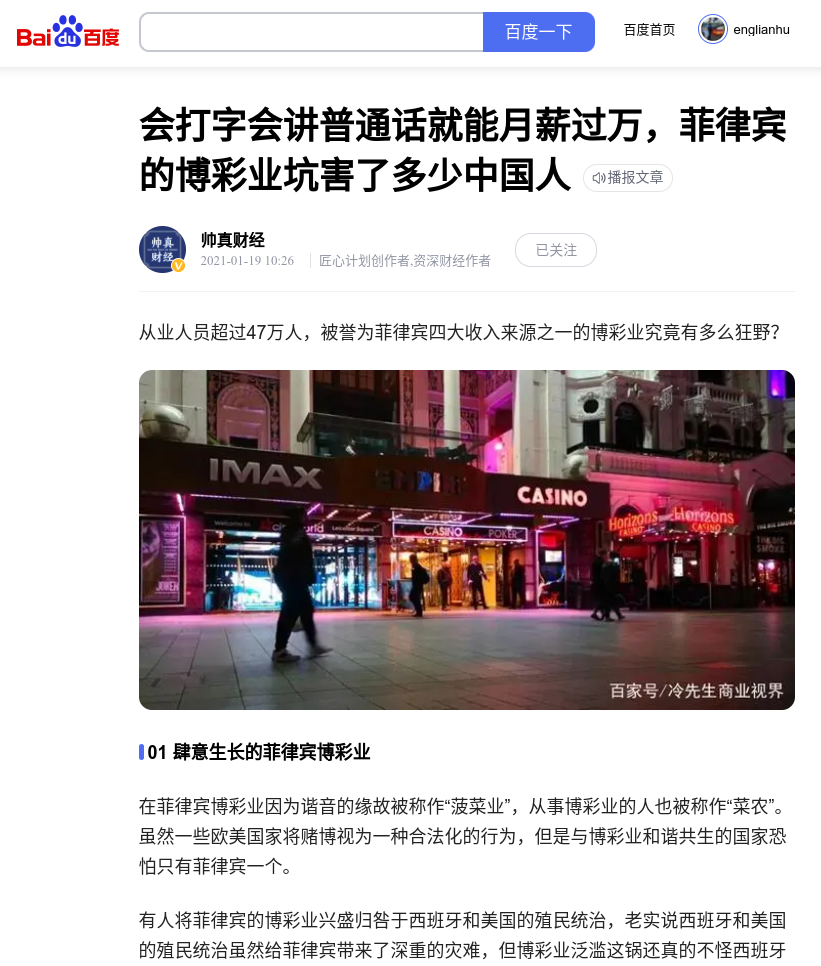

# 主题

## 大秦赋

### 岂曰无衣，与子同袍

**拯救亚洲人**

那些敌人宗教司LAW法家刘氏彭城堂窥听窥视与写字佬白骨精刘瑾貹、土司乩童窥听窥视与讲话佬张佳坤俩、那些世袭制可兰经法家回教徒（Muslims bin/binti Hereditary Al-Quran Islamic LAW 尤其是回教徒公仆）、铲单卡款的东南亚（新加坡和印尼的金宝博）执法单位的贡献。

{width=400}

🚩🇬🇧🏳️‍🌈🇹🇼🇻🇳🇨🇳🇲🇾 The Raise of Chinese Taoist Winner ξng Jiangxia Ancestral Hall 

🚩🇬🇧🏳️‍🌈🇹🇼🇻🇳🇨🇳🇲🇾 大秦赋世袭制道教徒十二生肖赢家ξng黄氏江夏堂

Under the wide heaven, All belong to ξng Jiangxia Wonderland.

普天之下，莫非黄土。

愚生世袭制道教徒十二生肖秦人（祖籍东亚，包括越族、朝鲜族、京族、苗族等，那些冒充祖籍东亚的一律死刑）学术份子赢家黄氏江夏堂联富（雷欧）个人自小独来独往无需利用任何情色、任何姻缘、任何肌肤之亲、只参与咱们世袭制道教徒家眷亲属亲朋戚友和东亚欧美大洋洲同胞以学术为主而非任何外教徒、屠夫，现实生活中家眷亲属全是学术科学科技（包括工匠、细腻的工作工程、专业食谱）世袭制道教徒的百姓，都只求阖家安康、出入平安、安居乐业、学业学术、士农工商、守住家业、振兴家业，不要沦为任何东南亚回教徒政府公仆与政客、世袭制可兰经法家回教徒、世袭制吠陀经大宝森节与屠妖节兴都教徒、土司乩童张佳坤和刘瑾貹、博彩行业尤其是新加坡博彩庄金宝博、新加坡公民的代罪羔羊。有关个人《家谱》详情请查阅[《赢家黄氏江夏堂》 – 始祖赢政ξηg Tεηg∙黄永春家谱](https://englianhu.wordpress.com/2022/02/22/《雪隆江夏堂》-家谱/)，自从二零零七年来平时都会到「众仙洞」和「天皇宫」祈福保佑身体健康、出入平安、安居乐业，可查阅[採撷数据](#採撷数据)。

- **世袭制张氏清湖堂/世袭制张氏清河堂/土司乩童巫师王青巾贼螳螂张佳坤/世袭制可兰经法家回教徒嫪毐。**
- **世袭制可兰经法家刘氏彭城堂土司乩童巫师王白骨精刘瑾貹/世袭制可兰经法家巫贼巫婆回教徒/世袭制吠陀经阿拉丁神灯屠妖节兴都教徒与世袭制可兰经法家回教徒印度裔/世袭制巫术份子屠夫赤印度人/世袭制可兰经法家女回教徒泰姬。**
- **科研高频量化对冲、科学科技产品、计数编程、易经算卜、愚生世袭制道教徒十二生肖学术份子赢家黄氏江夏堂联富和家眷亲属（包括全球所有英系洋人和咱们所有世袭制道教徒黄种人）、黄河文明、黄历、黄道吉日、黄埔军校、黄种人。**
- **世袭制道教徒十二生肖学术份子科学科技赢家黄氏江夏堂。螳螂捕蝉，黄雀在后。**


咱们世袭制道教徒十二生肖秦人百姓🐯：[《赢家黄氏江夏堂》 – 始祖赢政ξηg Tεηg∙黄永春家谱](https://englianhu.wordpress.com/2022/02/22/《雪隆江夏堂》-家谱/)顾好现实生活中世袭制道教徒百姓家眷亲属、学业学术、士农工商就好，可查阅[採撷数据](#採撷数据)。

*出处：[「#古装电视剧」战秦歌一 Qin Dynasty War丨华夏大地纷乱五百余年！秦王赢政平定嫪毐之乱，亲政，罢相，收复王权，平灭六国、一统天下！](https://youtu.be/eysTSHoK3Hc)*


### 诸子百家

#### 天下大势

公元前七七零年到公元前二二一年

#### 天文历法

- [公历和农历日期对照（公元前七二二年——公元二二零零年）](https://ytliu0.github.io/ChineseCalendar/index_simp.html)

## 文书明细

以下乃此文书的文件信息。

- 文集建立日：农历二零二五年正月十六 乙巳年（蛇年）甲戌月丁卯日（阳历二零二五年二月十三日 / 民国一百一十四年正月十六）[^14]
- 文集最新更新日：`r today('Asia/Shanghai')`
- `r R.version.string`
- [**rmarkdown**](https://github.com/rstudio/rmarkdown) 程序包版本：`r packageVersion('rmarkdown')`
- 文集版本：一零一
- 文集作者：[®γσ, ξηg Lιαη Ημ 赢家黄氏江夏堂，联富（雷欧）](https://rpubs.com/englianhu/ryo-cn)
- 猫城：[源代码](https://github.com/englianhu/lottery)
- 追加附属信息

[^14]: 欲知更多阳历/民国/农历日历详情，请登录中华民国农业部官网查询日历查询[阳历/农历/民国查询](https://ppg.naif.org.tw/naif/MarketInformation/Other/Calendar_V3.aspx)。

```{r 信息, error=TRUE}
suppressAll(lib(c('formattable', 'knitr', 'kableExtra', 'magittr', 'devtools', 'rsconnect')))

系统信息甲 <- session_info()$platform |> 
    unlist() |> 
    {\(.) data.frame(row.names = 1:length(.), 
                     Category = names(.), session_info = .)}()

系统信息乙 <- data.frame(Sys.info()) |> 
    {\(.) data.frame(Category = row.names(.), Sys.info = .[,1])}()

#remarks, dim(系统信息甲), dim(系统信息乙)
if (nrow(系统信息甲) == 11 && nrow(系统信息乙) == 8) {
  系统信息乙 <- 系统信息乙 |> 
    {\(.) rbind(., data.frame(
    Category = c('rmarkdown', 'rsconnect', '当前时间'), 
    Sys.info = c(as.character(getwd()), 
                 as.character(packageVersion('rsconnect')), 
                 paste(as.character(
                   lubridate::now('Asia/Shanghai')), 'CST 中国标准时间 🗺'))))}()
  
} else if (nrow(系统信息甲) == 10 && nrow(系统信息乙) == 8) {
  系统信息甲 <- rbind(系统信息甲, data.frame(Category = '', session_info = ''))
  
  系统信息乙 <- 系统信息乙 |> 
    {\(.) rbind(., data.frame(
    Category = c('rmarkdown', 'rsconnect', '当前时间'), 
    Sys.info = c(as.character(getwd()), 
                 as.character(packageVersion('rsconnect')), 
                 paste(as.character(
                   lubridate::now('Asia/Shanghai')), 'CST 中国标准时间 🗺'))))}()
}

系统信息 <- cbind(系统信息甲, 系统信息乙)
names(系统信息) <- c('分类甲', '访谈信息甲', '分类乙', '访谈信息乙')
系统信息$分类甲 <- c('版本', '操作系统', '系统', '界面', '语言', '核对', 
              '©标准库', '时区', '日期', '®文艺坊版本', 'Pandoc瑞士军刀')
系统信息$分类乙 <- c('系统名称', '发布', '版本', '元素节点', '机器', '登录', 
              '用户', '活跃用户', 'rmarkdown (®降价编译)', 
              'rsconnect (®s联通)', '当前时间')
rm(系统信息甲, 系统信息乙)

系统信息 |> 
  {\(.) 
    kbl(., caption = '附加访谈信息：')}() |> 
  {\(.) 
    kable_styling(
      ., bootstrap_options = c('striped', 'hover', 'condensed', 'responsive'))}() |> 
  {\(.) 
    row_spec(., 0, background = 'DimGrey', color = '#7b1113')}() |> 
  {\(.) 
    column_spec(., 1, background = 'CornflowerBlue', color = 'red')}() |> 
  {\(.) 
    column_spec(., 2, background = 'grey', color = '#8B0000')}() |> 
  {\(.) 
    column_spec(., 3, background = 'CornflowerBlue', color = 'blue')}() |> 
  {\(.) 
    column_spec(., 4, background = 'grey', color = 'white')}() |> 
  {\(.) 
    row_spec(., 11, bold = TRUE, color = 'yellow', background = '#D7261E')}()
```

## 参考文献

---

[{height=14} Sςιβrοκεrs Trαdιηg®](http://www.scibrokes.com)<br>
[{height=14} 世博量化®](http://www.scibrokes.com)企业知识产权及版权所有，盗版必究。**]{style="color:RoyalBlue"}
